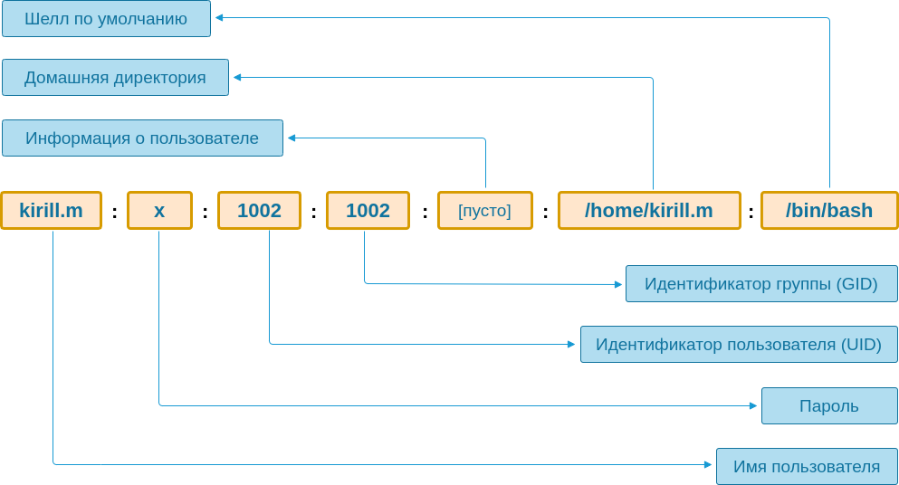
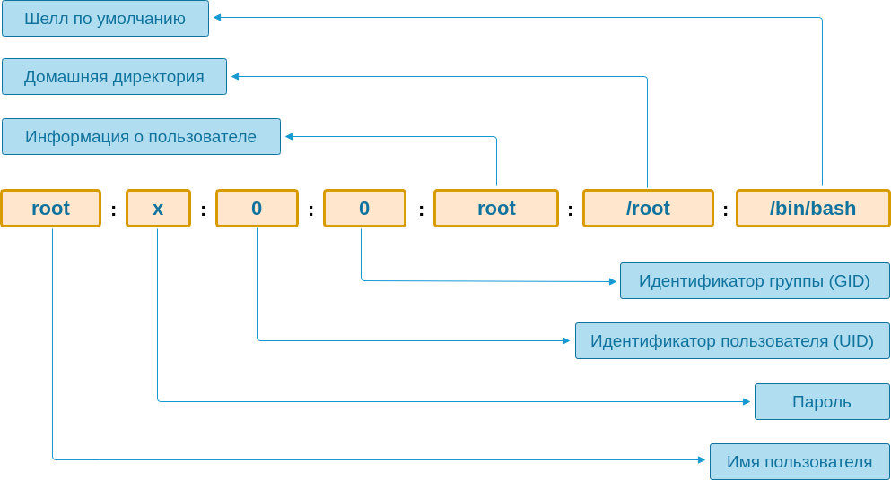

# Навигация

* `pwd` — путь текущей директории;
* `ls` — список файлов и директорий в текущей директории (или указанной);
  * `-a` — просмотр скрытых файлов;
  * `-l` — вывод дополнительной информации о файлах/директориях;
* `cd` — смена директории (если выполнить без аргументов, то будет переход в домашнюю директорию).

# Файловая структура

Файловая стуктура представляет собой **дерево**, в узлах которого находятся **директории**, а в лисьях **файлы**.

* `stat` — информация о файле/директории

В *nix системах, на нижнем уровне почти всё является файлов: директория, это файл со списком фалов внутри, любое подключенное устройство становиться файлом или дирректорией (если это накопитель). Таким образом, получается, что на этом кровне печать в файл и вывод на экран это одно и тоже — это просто "запись в файл". На пользовательском уровне директори отличются от файлов и с ними работают разные команды.

В *nix системах есть базовый набор каталогов, который стандартизирован (FHS). За каждым закреплена особаня роль:

* _/etc_ — содержит конфигурацию программ в текстовых файлах;
* _/home_ — директории пользователей (кроме пользователя `root` его файлы храняться в директории `/root`);

[Подробнее](https://ru.wikipedia.org/wiki/FHS).

Кроме обычных файлов, в *nix существует:

* Hard link — дополнительное имя для уже существующего файла;
* Symbolic link — символическая ссылка. Если удалить основной файл, то символическая ссылка начинает вести в никуда;
* Socket — специальный файл, через который происходит взаимодействие между разными процессами операционной системы.

# Чтение файлов

* `cat` — вывод содержимого файла, указанного в аргументе;
* `head` — показывает первые 10 строк с начала файла;
    * `-n` — указывает какое количество строк нужно вывести;
* `head` — показывает первые 10 строк с начала файла;
    * `-n` — указывает какое количество строк нужно вывести;
    * `-f` — отслеживание файла и вывод строк, которые в него записываются в дальнейшем;
* `less` – пейджер, предназначен для чтения файлов. Команды:
   * `q` — выход;
   * `f` — вперёд на страницу;
   * `b` — назад на страницу;
   * `/` — поиск:
     * `n` — переход к следующему совпадению;
     * `N` — переход к предыдущему совпадению;

# Grep

`grep` — консольная утилита для поиска по файлу или файлеам определённого текста.

В качестве аргемента передаётся регулярное выражение, по которому осуществляется поиск. Второй, необязательный аргумента (либо опция `-F`) – это имя файла в котором будет происводиться поиск.

Количество выводимых соседних строк регулируется опциями:

* `-B`, `--before-context` — количество строк до искомой;
* `-A`, `--after-context` — после искомой;
* `-C`, `--context` — до и исполе;

Для поиска по файлам нужно сделать следующее:
* `-r` — рекурсивный поиск, включая все поддиректории;
* Указать путь до директории

```bash
grep -r bashrc .
```
В рузультате выводиться список файлов, в котором была найдена строка. Если добавить опцию `n` то отобразиться номер строки.

# Потоки

При старте любой программы ОС связывает с ней три потока:

* STDIN (Standard Input) — отвечает за ввод;
* STDOUT (Standard Output) — отвечает за вывод на экран;
* STDERR (Standard Error) — отвечает за вывод ошибок;

## STDOUT

Каждый раз, когда в программе происходит печать а экран, на самом деле, функция печати записывает с помощью функции `write` данные в STDOUT, а ОС решает куда вывести результат.

ОС позволяет подменять эти потоки при старте системы. Например, вывод любой команды, запещеной в bash можно записать в файл, вместо вывода на экран:
```bash
ls -la > output
```

`>` — обозначает, что нужно взять вывод из команды слева и направить в команду указанную справа. `>` всегда **перезаписывает** файл.
`>>` — то же что и `>` но команда не перезаписывает, а **добавляет**.

* `echo` — вывод текста переданного в аргументе.

## STDIN

Через этот поток программа получает данные на вход. 

* `wc` — утилита считающеее количество слов (`-w`)/строк (`-l`)/символов (`-m`) в файле.

```bash
wc -l < result
```

`<` перенаправляет результат вывода команды справа на STDIN программы указанной слева.

## STDERR

Позволяет отделить нормальный вывод программы от возникающих ошибок, по умочанию, как и STDOUT выводит результат на экран.

`>` — перенаправляет только STDOUT, но не STDERR. Для перенаправления STDERR в STDOUT можно использовать:
```bash
ls lala > output 2>&1
```
Здесь сначала STDOUT перенаправляется в файл _output_, а затем STDERR перенаправляется в STDOUT, продолжая запись в файл.

В unix за каждым потоком закреплён номер, который является файловым дискриптером с потоками ввода и вывода:

* 0 — STDIN;
* 1 — STDOUT;
* 2 — STDERR.

По правилам синаксиса в командых оболочках произошедших от C shell, для указания потока, в который осуществляется перенаправление нужно добавлять символ `&` после символа перенаправления:
```bash
# Перенправление STDERR в STDOUT
2>&1
```

### Перенаправление конкретного потока в файл
```bash
# Перенправление STDERR в файл
cd lala 2> output
```
### Перенаправление обоих потоков в файл
```bash
# Перенправление STDERR и STDOUT в файл
cd lala &> output
```

# Пайплайн (Конвейер)

Возможно соеденять ввывод и вывод разных процессов, такой подход называется **pipeline** (конвейер). Благодаря ему можно соединять прогрммы протаскивать данные сквозь них, как через цепочку функций.

`|` — пайп, указывает шеллу взять STDOUT одного процесса, и соеденить его с STDIN другого процесса.

```bash
grep alias .bashrc | grep color
# или так
cat .bashrc | grep alias | grep color
```

* `uniq` — убирает дубли из входящего потока;
* `sort` — сортирует данные из вохдящего потока.

# Манипулирование файловой структурой

* `touch` — создать файл;
* `rm` — удаление файла;
  * `-r` — удаление директории;
  * `-f (--force)` — игнорировать несуществубщие файлы и не запрашивать подтверждение на удаление.
* `mv` — перемещение (переименование) файла;
* `cp` — копирование файла;
  * `-r` — копирование директории.
* `mkdir` — создание директории;
  * `-p (--parents)` — создание поддиректорий.
* `tee` — читает данные из стандартного ввода и записывает в файл (если файла нет, то он создаётся).

# Переменные окружения

Переменные окружения существуют в рамках запущенной сессии командного интерпретатора, подгружаются туда во время инициализации. Посмотреть установленные переменные можно командой `env`.

Основное предназначение переменных окружение — конфигурирование системы и програм.

Существует базовый набор переменных, устанавлвиваемый при старте интерпретатора. Однаи них — `HOME`.

Для присваивания используется `=`:
```bash
HOME=/tmp
```

Для использования переменной нужно указать `$` перед её именем:
```bash
echo $HOME
```

Перменные окружения можно задавать глобально и локально. При задавании переменной перед командой, она будет задана для текущего вызова программы, а в сеансе останеться прошлое значение. Для глобального задавания (в рамках текущей сессии) переменной используется `export`:
```bash
export HOME=/tmp
```

# История

Для вызова команды из истоии можно использовать стреклки вверх (предыдущая команда) и вниз (следующая команда).

История храниться в файле `.bash_history`, который находиться в домашней директории пользователя.

За то, сколько команд храниться в истории отвечает переменная окружения `HISTFILESIZE`, если она не установлена, то история не обрезается.

`history` — просмотр истории комманд. Команда выводит содержимое файла истории и добавляет номера строк, по которым можно запрашивать команды. Для этого нужно укзать ! и номер команды:
```bash
# вызовает команду с номером 2 из истории
!2
```

## Реверсивный поиск

Сочетание `Ctrl + r` запускает специальный режим поиска по истории, который ожидает ввод, при вводе символов он будет подставлять подоходящие записи из истории.

Для более продвинутого поиска по истории есть утилита [fzf](https://github.com/junegunn/fzf)

# Пользователи и группы

* `whoami` — позволяет выяснить имя текущего пользователя;
* `ps` — выводит отчёт о работающих процессах;
  * `aux` — выводит информацию о том, под каким пользователем запущены процессы.
* `id` — просмтори информации об идентификаторах пользователя.
  * в необязательном аргументе можно передать имя пользователя для которого нужно получить информацию;
  * `-u` — вывод только идентификатора пользователя.


Файл _/etc/passwd_ — является основным хранилищем пользователей в *nix-системах. Информация там хранится в следующем виде:

```
root:x:0:0:root:/root:/bin/bash
daemon:x:1:1:daemon:/usr/sbin:/usr/sbin/nologin
bin:x:2:2:bin:/bin:/usr/sbin/nologin
sys:x:3:3:sys:/dev:/usr/sbin/nologin
sync:x:4:65534:sync:/bin:/bin/sync
games:x:5:60:games:/usr/games:/usr/sbin/nologin
man:x:6:12:man:/var/cache/man:/usr/sbin/nologin
lp:x:7:7:lp:/var/spool/lpd:/usr/sbin/nologin
mail:x:8:8:mail:/var/mail:/usr/sbin/nologin
news:x:9:9:news:/var/spool/news:/usr/sbin/nologin
uucp:x:10:10:uucp:/var/spool/uucp:/usr/sbin/nologin
proxy:x:13:13:proxy:/bin:/usr/sbin/nologin
www-data:x:33:33:www-data:/var/www:/usr/sbin/nologin
kirill.m:x:1002:1002::/home/kirill.m:/bin/bash
```



Запись `/usr/sbin/nologin` говорит о том, что данный пользователь не может входить в систему. Такие пользователи нужны для запуска программ, имеющих ограниченные права, поэтому им не нужен вход в систему.

Кроме имени у пользователя есть связанная с ним группа. Группа нужна для общего доступа к общему ресурсу.Пользователь может входить в производное число групп.

В любой *nix-системе существует специальный пользователь **root** (суперпользователь). У root пользователя всегда иднтификатор со значением `0`, такой пользователь может выполнять абсолютно любые действия в системе. В файле _/etc/passwd_ для **root** будет такая запись:



Крайне не рекомендуется использовать **root** на регулярной основе. И тем более входить под ним в систему.

# Sudo

В некоторых случаях необходимо выполнение команд от имени пользователя **root**. 

* `su` — сменить пользователя, на данный момент считается устаревшей и не рекомендуется к использованию;
* `sudo` — выполнить от имени другого пользователя;
  *  Справа от `sudo` пишется команда, которую необходимо выполнить;
  * `-u` — указывает от какого пользователя выполняется команда (по умолчанию от **root**);
  * `-i`  — запускает новую сессию для нужного пользователя.
* `exit` — выход из сессии пользователя.

# Права доступа

Кроме имени пользователя и группы, с каждым файлом ассоциированы права доступа:

* **r** — чтение;
* **w** — запись;
* **x** — исполнение.

Эти права задаются для трех типов пользователей:

* Владельца (User);
* Пользователей, входящих в ту же группу (Group);
* И остальные (Other) — т.е. те кто не попал в первые два типа.

Пример:

```bash
# Пример строчки из вывода команды ls -la
-rw-r--r-- 1 kirill.m kirill.m 3771 Aug 31  2015 .bashrc
```

Здесь права представлены строкой `-rw-r--r--`, первый символ `-` говорит, о том, что это файл (для директорий используется `d`), за ним следует три группы по три символа, каждая группа описывает доступы для разных типов пользователей:

*  Первая для владельца файла, `rw-` — означает, что владел может читать (`r`) и писать в файл (`w`). Последний `-` обозначает, что файл нельзя исполнять. Исполнение обозначается символом `x`.
* Вторая для тех, кто входит в ту же группу, которой принадлежит файл (kirill.m), запись `r--` говорит о доступе только для чтения.
* Последняя группа для остальных пользователей и групп.

Права на удаления файла определяются не по самому файлу, а по месту где он находиться, т.е. по его директории.

Право на выполнение (`x`) в отношении директорий обозначает право на перемещение в директорию и обращение ко всем расположенным в ней файлам и каталогам. Обращаться можно при условии, что эти файлы доступны на чтение, или запись, или выполнение. Например, если положить доступный на чтение файл в директорию с правом `x`, то можно прочитать этот файл, а если убрать, то прав на доступа к файлу не будет.

Права на чтение (`r`) в отношении директорий обозначает право на прочтения списка файлов, однако если нужно получить дополнительную информацию о файле, помимо его имени, то без права на выполнение (`x`) у директории это сделать не получиться, т.е. требуется обращение к файлам для получения их методанных. В любом случае, без права `r` не получиться посмотреть его содержимое.

Для описания прав доступа используется так же числовое представление. Например: `755`, это три числа каждое из которых представляет группу `rwx`:

| Число | Права | Бинарное представление |
| ----- | ----- | ---------------------- |
| 7     | rwx   | 111                    |
| 6     | rw-   | 110                    |
| 5     | r-x   | 101                    |
| 4     | r--   | 100                    |
| 3     | -wx   | 011                    |
| 2     | -w-   | 010                    |
| 1     | --x   | 001                    |
| 0     | ---   | 000                    |

Пользователь **root** находиться вне этой системы, для него не имеет значение наличие прав — он может всё.

* `chown` — смена владельца и/или группы для файлов;
  * В первом аргументе передаётся пользователь и группа на которые нужно сменить владение для файла, передаётся в виде `user:group`, если какой-то из элементов менять не нужно, то этот элемент убирается, например для смены только группы нужно указать ':group', если нужно менять только пользователя то можно опустить и `:` и передать только `user`;
  * Вторым аргументом передаётся путь по которому нужно произвести изменения;
  * `-R` — рекурсивное изменение (для директорий).
* `chmod` — смена владельца и/или группы для файлов.
  * В первом аргументе передаётся числовое описание прав доступа; 
  * Вторым аргументом передаётся путь по которому нужно произвести изменения;
  * `-R` — рекурсивное изменение (для директорий).

# Выполнение программ

Программа, независимо от того, что она делает, является набором файлов или файлом. Один из этих файлов является исполняемым (права доступа `x`).

Механизм запуска программ в *nix-системах основан на соглашениях. Когда в командной строке вводится некая команда, шелл начинает поиск исполняемого файла с введённым именем в списке директорий указанных в переменной окружения `PATH`.

Пример значения `PATH`:

```
/home/hex/.local/bin:/home/hex/bin/:/home/hex/.local/bin:/usr/local/sbin:/usr/local/bin:/usr/sbin:/usr/bin:/sbin:/bin
```

В значении переменной `PATH` директории отделяются двоеточием. Директории перебираются слева направо и в них ищется исполняемый файл с введёным именем. Важен порядок, будет использоваться первый найденный файл (т.е. из директории расположенной левее).

`type` — выводит путь исполняемого файла программы, название программы передаётся в аргументе.

Чтобы запустить исполняемый файл из текущей директории нужно добавить `./` перед именем файла при вводе команды.

## Изменение переменной PATH

В общем случае, не рекомендуется делать это самостоятельно. Обычно при установке, большинство программ сами добавляют свои исполняемые файлы в нужные места.

Для ручного изменения `PATH` нужно поправить конфигурационные файлы шела, она лежат в домашней директории пользователя, для bash это файлы:

* .bashrc
* .bash_profile
* .profile

В нужный файл нужно добавить строчку:

```
export PATH=$PATH:/path/to/directory
```

После этих манипуляций нужно перезапустить сессию терминала.

## Процессы и сигналы

Единица работы в Linux — процесс. Процесс — представление запущенной программы внутри операционной системы.

Каждому процессу внутри ОС соответствует структура данных, внутри которой находиться вся информация по процессу. Главный параметр — PID (Process Identificator), кроме этого там хранится информация о том, какой файл был запущен, от какого пользователя, из какой рабочей директории и так далее.

Выводит информацию о процессах можно получить командой:

```bash
ps aux
```

Для завершения процесса существует сигнал `SIGTERM`, который говорит процессу, о том, что его нужно завершить:

```bash
# kill – несмотря на название не убивает, а посылает процессу сигналы
# -15 – кодовое обозначение сигнала SIGTERM
# 606827 – pid какого-то процесса
kill -15 606827
```

`SIGTERM` не отрабатывает сам по себе. Нужно прямо написать код, который его ловит и выполняет остановку. Пример на JS:

```js
// Где-нибудь во время инициализации
process.on('SIGTERM', () => {
  // например, останавливаем запущенный сервер
  server.close(() => {
    process.exit(0);
  });
});
```

`SIGTERM` не даёт гарантии завершения, к тому же процесс может его игнорировать или быть загруженным. Поэтому существует сигнал `SIGKILL`, этот сигнал невозможно перехватить и он не попадет внутрь процесса. ОС принудительно завершает процесс, которому был послан такой сигнал.

[Сигналы (Unix)](https://ru.wikipedia.org/wiki/%D0%A1%D0%B8%D0%B3%D0%BD%D0%B0%D0%BB_(Unix)).

### Супервизов

Запуском процессов занимается супервизор. Он стартурет в системе первым и затем запускает всё остальное по описание, которые ему дали, эти процессы запускают свои процессы и так далее.

Посмотреть итоговое дерево можно командой:

```bash
ps auxf
```

Существуют разные супервизоры. На текущий момент в большинстве дистрибутивов используется **systemd**.

Пример файла описания запуска nginx с помощью systemd:

```ini
# Пример описания для веб-сервера Nginx
# /lib/systemd/system/nginx.service
[Unit]
Description=The NGINX HTTP and reverse proxy server
After=syslog.target network-online.target remote-fs.target nss-lookup.target
Wants=network-online.target

[Service]
Type=forking
PIDFile=/run/nginx.pid
ExecStartPre=/usr/sbin/nginx -t
ExecStart=/usr/sbin/nginx
ExecReload=/usr/sbin/nginx -s reload
ExecStop=/bin/kill -s QUIT $MAINPID
PrivateTmp=true

[Install]
WantedBy=multi-user.target
```

[Systemd (ArchLinux Wiki)](https://wiki.archlinux.org/title/Systemd_(%D0%A0%D1%83%D1%81%D1%81%D0%BA%D0%B8%D0%B9))

## TCP/IP

Протокол TCP позволяет общаться между собой процессам расположенным как на одном компьютере, так и на разных. Подключение по TCP идёт из конкретного процесса в конкретный процесс. Для соединения нужно два параметра ip-адрес и порт. IP-адрес обычно устанавливается автоматически, а порт выбирется самим разработчиком.

TCP клиент-серверный протокол. Сервер во время старта указывает ip-адрес и порт, на которых нужно запуститься и которые он будет потом слушать.

## Интерфейс

Сетевое взаимодействие в Linux работает через понятие "стевой интерфейс". Сетевой интерфейс — это программный способ обращения к сетевой карте в том случае, когда он связан с физическим устройсвом. Сетевой интерфейс также может быть виртуальным.

Просмотреть сетевые интерфейсы можно командой `ifconfig`.

*eth0* – интерфейс, связанный с сетевой картой, работающей  через Ethernet (по кабелю). В выводе выше можно увидеть множество  полезной информации, например, ip-адрес, привязанный к этому интерфейсу. Если бы сетевых карт было несколько, то кроме *eth0*, мы бы увидели *eth1* и так далее.

*lo* (loopback device) – виртуальный интерфейс, присутствующий по умолчанию в любом Linux. Он используется для отладки сетевых программ и запуска  серверных приложений на локальной машине. С этим интерфейсом всегда  связан адрес *127.0.0.1*. У него есть dns-имя – *localhost*. Посмотреть привязку можно в файле */etc/hosts*.

### 0.0.0.0

`0.0.0.0` — является специальный псевдо-аресом, который говорит, что необходимо связать запуск сервиса со всеми доступными интерфейсам в системе, т.е. привязавшись к этому адресу сервис становится автоматически доступным через все сетевые интерфейсы системы.
