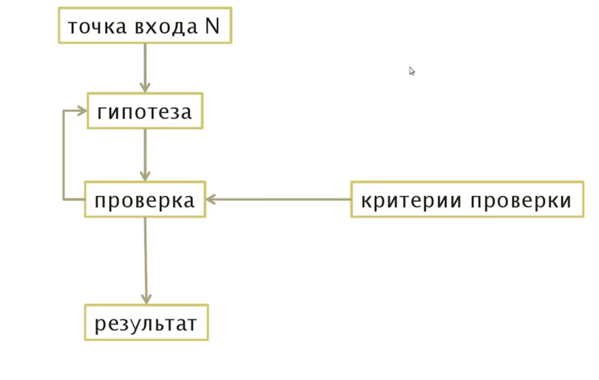

# Цикл анализа

## 3 типа ответа

Подход проверки безопасности системы направленый на получение от системы 3х вариантов ответа
Суть в том, чтобы иследовать реакцию системы на входные данные.
Например:

_http://target.com/?id=..._

||Значение id|результат|
|-|-|-|
|есть данные|1|username:admin|
|нет данных|1000|username|
|ошибка|aaa|DB Error|

