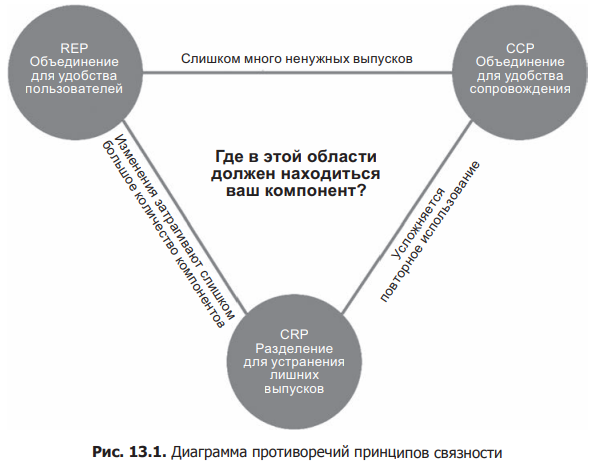

# Принципы организации компонентов

## Связаность компонентов

Принципы определяющие связаность компонентов:

### REP (Reuse/Release Equivalence Principle) — Принцип эквивалентности повторного использования и выпусков.

>Единица повторного использования есть единица выпуска.

С точки зрения архитектуры и дазайна этот принцип означает, что классы и модули, составляющие компонент, должны принадлежать связанной группе. Компонент не может просто включать случайную смесь классов и модулей, должна быть какая-то тема или цель, общая для всех модулей.

Помиомо этого, классы и модули, объединяемые в компоненты, должны _выпускаться_ вместе. Объединение их в один выпуск и включение в общую документацию с описанием этой версии должны иметь смысл для автора и пользователей.

### CCP (Common Closure Principle) — Принцип согласованного изменения

>В один компонент должны включаться классы, изменяющиеся по одним причинам и в одно время. В разные компоненты должны включаться классы, изменяющиеся в разное время и по разным причинам.

Это принцип единной ответственности (SRP), перефразированный для компонентов. Т.е. этот принцип требует, чтобы компонент имел только одну причину для изменения.

Прицип требует собирать вместе все классы, которые может потребоваться изменить по одной, общей причине. Если два класса тестно связаны, что всегда будут изменяться вместе, то они должны принадлежать одному компоненту.

### CRP (Common Reuse Principle) — Принцип совместного повторного импользования

>Не вынуждайте пользователей компонента зависеть от того, чего им не потребуется

Принцип указывает на то, что в компонент должны включаться классы используемые совместно.

А также, в большей степени, этот принцип говорит о том, что классы не имеющие тестной связи не должны включаться в компонент.

При возникновении зависимости от другого компонента, жалтельно, чтобы она распостранялась на все классы в этом компоненте т.е. классы в этом компоненте были неотделимы друг от друга, чтобы нельзя было зависеть от одних и не звисеть от других.

Этот принцип является обощённой версией принцип разделения интерфейсов (ISP), который советует на создавать зависимости от клссов, методы которых не используются. Принцип CRP советует не создавать зависмости от копонентов, классы которого не используются.

### Противоречия

Все три принципа вступают в противоречие друг с дргугом. REP и CPP стремяться сделать компонент как можно крупнее, а CRP наоборот компактнее. Задача архитектора в разрешении противоречия.

Архитектор должен найти золотую средину в этой диаграмме отвечающую **текущим** целям.

На ранних этапах разработки наибольшую важность играет правая сторона треугольника, когда единственной жертвой будет повторное использование. Но по мере развития и интеграции в другие проекты фокус будет смещаться влево.
