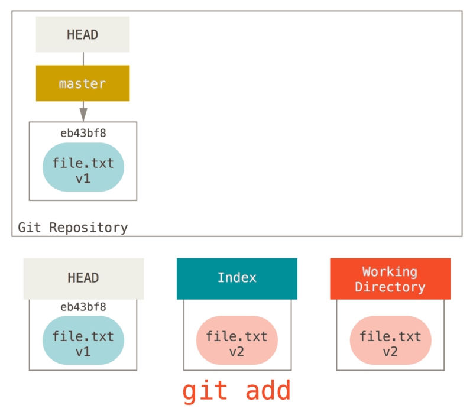

# Раскрытие тайн reset

В своих обычных операциях git оперирует тремя наборами файлов(деревьями):

|**Дерево**|**Назначение**|
|HEAD|Снимок последнего коммита, родитель следующего|
|Индекс|Снимок следующего намеченого коммита|
|Рабочий каталог|Песочница|

### HEAD

HEAD — указатель на текущую ветку, которая, в свою очередь, является указателем на последний коммит, сделанный в этом ветке, как правило HEAD — снимок последнего коммта.

### Индкс

Индекс — следующий намеченый коммит, git просматривает его при выполнении коммита `git commit`.

Git заполняет индекс списком изначального содержимого всех файлов, выгруженных в последний раз в рабочей каталог. Затем после измения некоторых файлов их новыми версиями и команда `git commit` преобразует измения в дерево для нового коммита.

### Рабочий каталог

Содержит текущую распакованную версию проекта.

## Технологический процесс 

1. Новый каталог с одним файлом, без git-репозитория.
2. При выполнении `git init` создаст git-репозиторий, у которого сслыка HEAD будет указывать на ещё несуществующую ветку (`master`).

3. Для добавления файла в индекс используем `git add`

4. Затем выполним `git commit`, он создаст объект коммита из содержимого индекса, и обновляет `master`, чтобы он указывал на этот коммит.

5. Теперь изеним файл:

Елсли выполнить `git status`, то файл будет помечен как измение не подготовленное к коммиту, т.к. представление файла в индексе и в рабочем каталоге различается.

6. `git add`

Елсли выполнить `git status`, то файл будет помечен как измение готовое к коммиту, т.к. представление файла в индексе и в HEAD различаются.

7. `git commit`

>Переключение веток и клонирование проходят через похожий процесс. Когда вы переключаетесь (checkout) на ветку, HEAD начинает также указывать на новую ветку, ваш Индекс замещается снимком коммита этой ветки, и затем содержимое Индекса копируется в ваш Рабочий Каталог.

## Команда reset

При выполнении reset происходит следующее:

1. Перемещение HEAD

reset перемещает то, на что указывает HEAD, при этом сам HEAD не изменяется, reset перемещает ветку на которую указывает HEAD. Таким образом, если HEAD указывает на ветку `master`, после выполнения `git reset 9e5e6a4`, сделает так, что `master` будет указывать на `9e5e6a4`.

если reset вызван с опцией `--soft`, но этом остановится выполнение команды.

>фактически была отменена последняя команда git commit. Когда вы выполняете git commit, Git создает новый коммит и перемещает на него ветку, на которую указывает HEAD. Если вы выполняете reset на HEAD~ (родителя HEAD), то вы перемещаете ветку туда, где она была раньше, не изменяя при этом ни Индекс, ни Рабочий Каталог. Вы можете обновить Индекс и снова выполнить git commit, таким образом добиваясь того же, что делает команда git commit --amend (смотрите Изменение последнего коммита).

2. Обновление индекса (--mixed)

Следующим будет обновление индекса того снимка, на который указывает HEAD.

Если указана опция `--mixed`, то reset остановится на этом шаге. Такое же поведение используется по дефолту, без указания опций. 

>отменен не только ваш последний commit, но также и добавление в индекс всех файлов. Вы откатились назад до момента выполнения команд git add и git commit.

3. Обновление рабочего каталога (--hard)

На этом шаге reset приведёт рабочий каталог к тому же виду, что и индекс. При использовании `--hard`, то выполнения команды продолжится до этого шага.

>Вы отменили ваш последний коммит, результаты выполнения команд git add и git commit, а также все изменения, которые вы сделали в рабочем каталоге.
>только указание этого флага (--hard) делает команду reset опасной, это один из немногих случаев, когда Git действительно удаляет данные. Все остальные вызовы reset легко отменить, но при указании опции --hard команда принудительно перезаписывает файлы в Рабочем Каталоге. В данном конкретном случае, версия v3 нашего файла всё еще остается в коммите внутри базы данных Git и мы можем вернуть ее, просматривая наш reflog, но если вы не коммитили эту версию, Git перезапишет файл и ее уже нельзя будет восстановить.

### reset с указанием пути

В случае если укзать пусть, то reset пропустит 1й шаг, а на остальных будет работать только с указным файлом или набором файлов. 

* `--patch` — частичный откат файла

## Сравнение с `checkout`

### Без указания пути

1. В отличие от `reset --hard`, команда `checkout` бережно относится к рабочему каталогу и проверяет, что она не затрагивает файлы, в которых есть измения. `checkout` пытается выполнить в рабочем каталоге простые слияния так, чтобы файлы, которые не изменяли, были обновлены. А `reset --hard` просто заменяет всё целиком, без проверок.
2. Отличаются способом обновления HEAD. 
    * reset — перемещает ветку, на которую укащывает HEAD.
    * checkout — перемещает сам HEAD.

### C указания пути

>Другой способ выполнить checkout состоит в том, чтобы указать путь до файла. В этом случае, как и для команды reset, HEAD не перемещается. Эта команда как и git reset [branch] file обновляет файл в индексе версией из коммита, но дополнительно она обновляет и файл в рабочем каталоге. То же самое сделала бы команда git reset --hard [branch] file (если бы reset можно было бы так запускать) – это небезопасно для рабочего каталога и не перемещает HEAD.
