# Методологические основы информационной безопасности

## Методологии тестирования

Тестирование на проникновение — эмуляция действий реальных злоумышленников, использование векторов атак, инструментов и последовательностей действий, которые могут использовать злоумышленники в реальных атаках в соответствии с заключённым договором.

Специализации:
* Пентестер — (этичные хакеры (WhiteHat)) это спциалисты, проодящие тестирование на проникновение в отношении организации на основе заключенного договора.
* Black hat — (хакеры) злоумышленники, компромитирующие инфраструктуру компаний с целью получения несанкционированного доступа, нарушения работы сервисов, кражи денежных средства и т.д.
* Хактивисты — black hats, действующие в целях продвижения полтитических идей, свободы слова, защиты прав человека, обеспечения свободы информации и др.

### Пантест vs Анализ на наличие уязвимостей**
||**Панстест**|**Анализ на наличие уязвимостей**|
|-|-|-|
|Цели|Поиск способов реализации найденных уязвимостей; Проверка эффективности мер защиты|Поиск и ранжирование уязвимостей на хостах; Рекомендации по их устранению|
|Методы|Использование различных инструментов (автоматизированные средства сканирования, социальная инженерия и др.)|Использование сканеров уязвимостей + ручной анализ отчетов|
|Длительность|Зависит от масштаба целевой инфраструктуры и задач. Несколько дней, недели месяцы|Относительно короткий промежуток времени. До нескольких минут на 1 хост|

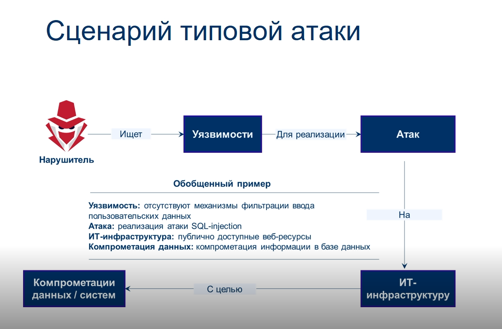

### Для чего проводить тестирование на проникновение?

1. **Повышение реальной защищенности.** Обнаружение "слабых мест", которые могут привести к серьёзным последствиям.
2. **Получение независимой оценки.** Оценка эффективности внедряемых средств защиты и процессов информационной безопасности.
3. **Требование резулятора.** PCI DSS, положение банка России.
4. **Предпосылки к развитию инфраструктуры.** Обоснование необходимости совершенствования систем защиты.

### Виды тестирования

#### Black-box

Black-box — пинтестер ничего не знает об инфраструктуре Заказчика. Только общественные источники.

Особенности:
  * служба ИБ подготовлена к проведению работ по тестированию
  * Пентестер не знает ничего об инфрструктуре заказчика
Цели:
  * Проверка эффективности мер защиты

#### White-box

White-box — Заказчик предоставляет полную информацию об используемых сервисах (иногда включая исходники).

Особенности:
  * служба ИБ подготовлена к проведению работ по тестированию
  * Пентестер обладает полной информацией о целевой инфраструктуре
Цели:
  * Получение более полных результатов проверки безопасности в более короткие сроки

#### Gray-box

Gray-box — часть информации об инфраструктуре предоставляет Заказчик (в том числе учетная запись или доступ в сеть).

Особенности:
  * служба ИБ подготовлена к проведению работ по тестированию
  * Пентестеру предоставляется ограниченная информация
Цели:
  * Совмещение преимуществ Black-box и White-box

#### Red teaming

Read team — Режим анализа защищенности корпоративной инфраструктуры с болеее широкими границами и сроками, чем Пентест

Особенности:
  * служба ИБ не знает о начале тестирования (знает только руководитель)
  * Пентестер не знает ничего об инфрструктуре заказчика
  * Приближенность к реальным сценариям атак
  * Комбинация всевозможных векторов атак (по согласованию)
Цели:
  * Проверка эффективности процессов реагирования на атаки реальных злоумышленников

Blue team — команда реагирования защиты

До начала работ нужно заключить договор с заказчиком, в котором оговорить границы тестирования. **В случае незакнного проникновения установлена уголовная отвественность** поэтому важно оговорить все моменты в договоре.

### Методология тестирования

Делится на этапы:
* Планирование:
  * Задачи и границы тестирования
  * вид тестирования
  * Заключение договора
  * соглосование работ
* Тестирование:
  * Сбор данных об инфраструктуре
  * Проведение сканирования
  * Получение доступа (компрометация сервисов)
  * Закрепление доступа
  * Уничтожение следов атаки
* Подготовка отчетов:
  * Консолидация информации со всех этапов
  * Разработка рекомендаций

#### Стандарты тесирования (гайды)

* NIST. SP 800-115 — стандарт тестирования.
* OWASP Web Security Testing Guide
* OWASP Mobile Security Testing Guide
* The Open Source Security Testing Methodology Manual
* PCI SSC Penetration Testing Guidance

### Виды тестирования

#### Внешнее тестирование

Тестирование защищенности доступных изве (публичных) инфраструктурных сервисов компании

Этапы:
* Сбор информации об ИТ-инфраструктуры из общедоступных источников
* Проведение активного внешнего тестирования на проникновение
  * Определение типиов и версий устройств, ОС, сетевых сервисов и приложений по реакции на внешнее воздействие
  * Иднтификация уязвимостей
  * Экспертный анализ защищенности (проникновение)

#### Тестирование web-ресурсов

Тестирование на проникновение web-приложений, web-сайтов, web-сервисов

Этапы:
* Анализ структуры web-ресурса
* Автоматизированный анализ функционирования компонентов web-сайта — выявление существующих уязвимостей
* "ручной" анализ функционаироваия компонентов web-сайта
* Эксплуатация выявленных уязвимостей

#### Внутреннее тестирование

Тестиование защищенности корпоративной сети, а также корпоративных сервисов, доступных изнутри

Этапы:
* Сбор сведений об ЛВС изнутри сети
* Моделирование атак на сетевом уровне
* Определение типиов и версий устройств, ОС, сетевых сервисов и приложений по реакции на внешнее воздействие
* Иднтификация уязвимостей компонентов информационных систем, сетевого оборудования и сетевых средств защиты
* Моделирование атак на уровне приложений, сетевых сервисов и ОС с использованием специализированных средств и сведений об известных уязвимостях в отношении выявленных систем

#### Тестирование WiFi-сетей

Анализ уязвимостей в реализации корпоративных WiFi-сетей

Этапы:
* Анализ беспроводного эфира помещений компании
* В зависимости от типов используемых механизмов защиты беспроводных сетей:
  * Активная атака на точку доступа или клиентское устройство
  * Пассивный перехват процесса подключения клиентского устройства к беспроводной сети с последующим криптографическим анализом перехваченных данных
  * Создание фиктивной точки доступа и пассивный сбор аутентификационных данных

#### Тестирование мобильных приложений

Проверка подверженности сетевым атакам мобильных приложений, а также поддерживающих их серверов

Этапы:
* Анализ структуры мобильного приложения
* Автоматизированный анализ функционирования компонентов (клиентских и серверных) мобильного приложения
* "Ручной" анализ функционирования компонентов (клиентских и серверных) мобльного приложения
* Эксплуатация выявленных уязвимостей

#### Социальная инженерия

Проверка возможности проникновения в корпоративную сеть или получение конфиденциальной информации, воздействия на работников компании

Этапы:
* Сбор и анализ сведений о сотрудниках, полученных из открытых источников
* Моделирование атак с использованием методов социальной инженерии. Атаки включают в себя:
  * Фишинговые атаки на сотрудников по Интернету и электронной почте
  * Атаки, направленные на эксплуатацию уязвимостей клиентского ПО посредством "шпионского" ПО

#### Нагрузачное тестирование. "Отказ в обслуживании"

Проверка устойчивости инфраструктуры компании к атаке типа "Отказ в обслуживании"

Этапы:
* Атаки методом отправки большого числа запросов (Flood) на сетевом уровне (TCP SYN, UDP, ICMP и т.п.)
* Атаки методом отправки большого числа запросов (Flood) на прикладном уровне (HTTP(S) и т.п.)

## Методологии оценки рисков

Риск — влияние неопределенности на цели.

Риск в информационной безопасности:
* Влияние неопределенности на цели информационной безопасности
* Потенциальная возможность того, что уязвимость будет использоваться для создания угрозы активу или группе активов в целях причинения ущерба организации

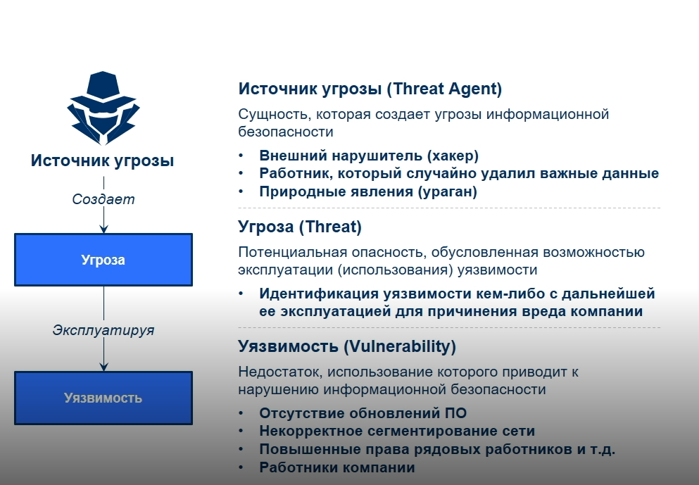

### Для чего управлять рисками?

1. Планирование деятельноси в области информационной безопасности
2. Обосование выделения бюджета на развитие системы обеспечени ИБ
3. Требование регуляторов
4. Контроль развития процессов ИБ

### Стандарт ISO 27005

ISO 27005: Information Secutiry Risk Managment — стандарт управления рисками ИБ.

Согласно стандарту процес управления рисками состоит из:

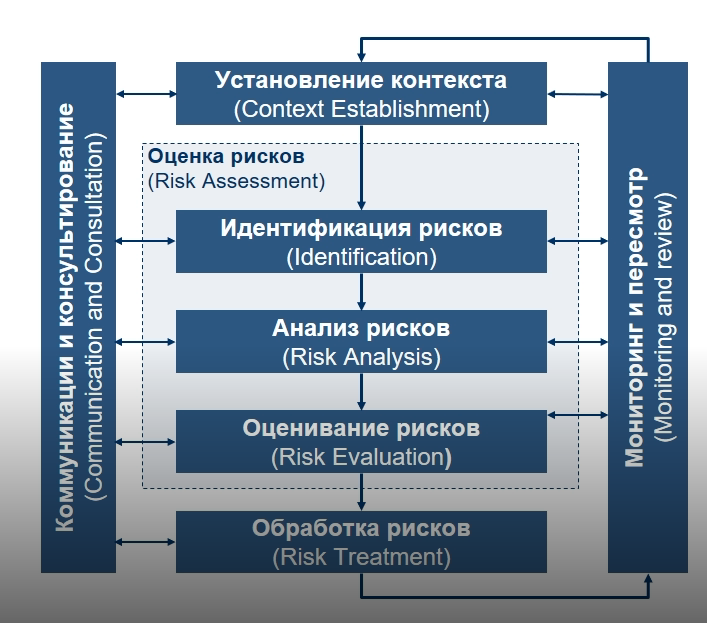

#### Определение контеста

Вход: информация об организации, имеющая отношене к рискам ИБ
Выход: цели, границы, ресурсы, подход к управлению рисками

Шаги:
* Определение целей процесса управления рисками:
  * цели процесса (соотвествия СУИБ, требования ругуляторов или партнеров, разработка требований для систем, продуктов, сервисов)
* Определение грацин — активы, риками которых планируем управлять:
  * Перечень активов, риски которых планируется оценивать
  * Подразделение, ораганизация
* Определение подхода к управлению рисками:
  * Критерии оценки рисков
  * Критерии оценки последствий реализации рисков
  * Критерии принятия рисков
  * План обработки рисков
* Организация процесса управления рисками:
  * Процесс управления рисками
  * Заинтересованные стороны (stakeholders)
  * Ответственные за реализацию процесса
  * Разработка необходимой документации

Контроли — Мероприятия, средства, системы, используемые для достижения определнных целей.

#### Идентификация

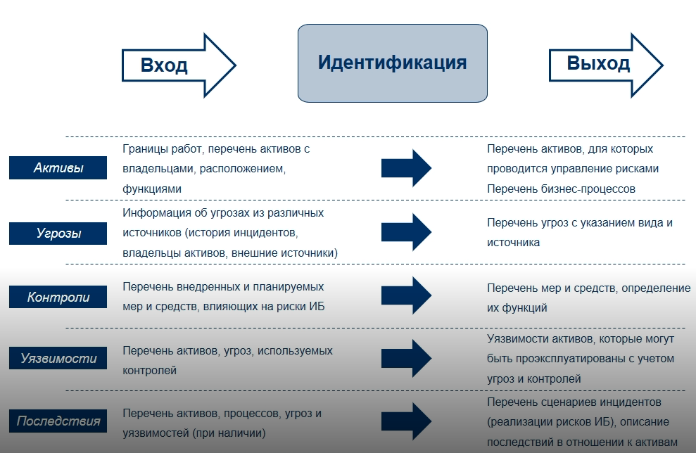

#### Анализ рисков

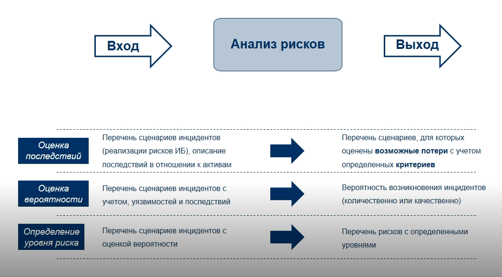

##### Формула расчета уровня риски

R = P * I

R — уровень риска 
P — значение вероятности реализации риска; сатические данные, экспертное мнение участников процесса
I — степень негативного влияния последствий реализации риска; статичеые данные, экспертное мнение участников процесса

#### Оценивание рисков

Вход: Перечень рисков с определныыми уровнями
Выход: Перечень рисков, приоретизированных с учетом принятых критериев

Критерий принятия риска — уровень риска, который компания модет допустить, т.е. принять

#### Обработка рисков

Вход: Перечень рисков, приоретизированных с учетом принятых критериев
Выход: План обработки рисков. Перечень рисков, которые можно принять

Способы обработки риска:
|Способ|Преимущества|Недостатки|
|-|-|-|
|Избежание риска|Мнимизация вероятности реализация риска|Издержки для бизнеса в виде отказа от сервиса/вида деятельности и т.д.|
|Снжение риска|Сохранение используемого функционала (бизенс выгода); Снижение вероятности реализации риска; Повышение кибербезопасности всей организации|Дополнительные ресурсы на меры по снижению риска; Длительные сроки реализации мер (в некоторых случаях)|
|Передача риска|Сокращение здержек в случае реализации иска; Оптимизация издержек на развистия безопасности|Сложность в реализации (например, правовые аспекты страхования); Не повышает безопасности|
|Принятие риска|Отсутствие дополнительных затрат|Возможность реализации риска и связанные с ним последствия|

#### Коммуникации и консультирование

Вход: Все данные из процесса управления рисками
Выход: Понимание этапов и результатов процесса

#### Мониторинг и пересмотр рисков

Вход: Все данные из процесса управления рисками
Выход: Поддержание процесса в актуальном состоянии, в соответствии с бизнес-целями

### Стандарт управления рисками

ISO 31000:2018 Risk managment — Guidlines

* описывает подход к управлению рисками
* мероприятия в рамках этапов процессов управления рисками
* Универсальный стандарт по управлению рисками в независимости от их природы

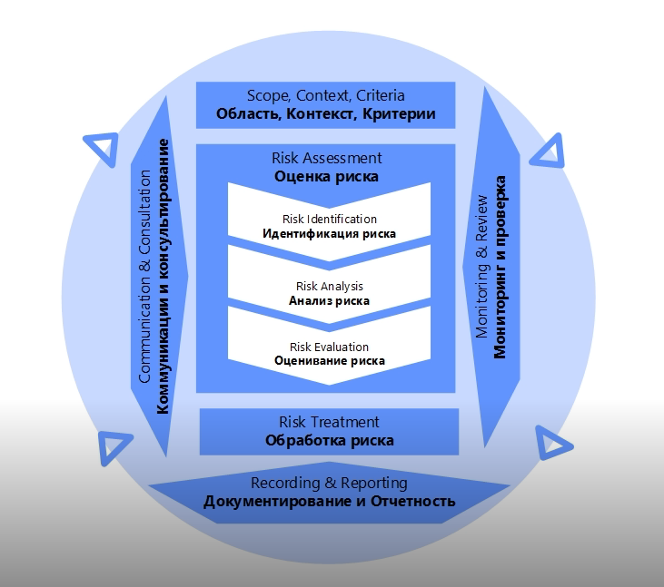

## Стандарты в области информационной безопасности

### Международные организации

* Internal Organization for Standartization (ISO) — Международная организация по стандартизации (1947).
  * Серия стандартов по ИБ: **ISO/IEC 27xxx**
* National Institute of Standarts and Technology (NIST) — Американский нститут стандартизации, аналог российского Госстандарта.
  * Серия рекомендаций по ИБ: **NIST SP 800-xx**
* SANS — SysAdmin, Audit, Network and Security — Организация по обучению и сертификации по ИБ.
* Information Systems Audit and Control Association (ISACA) — Международная ассоциация. 
  * Разработка стандртов по управлению ИТ: **COBIT**
  * Сертификация по ИБ: **CISM**, **CRISC**, **CISA** и др.
* CIS — Central for Internet Security — Организация по обучению и сертификации по ИБ. 
  * Разработали **CIS Controls** и **CIS Benchmark**
* European Network and Information Security Agency (ENISA) — Агенство, основанное в 2004 году в греции. Основная задача — повышение уровня сетевой и информационнной безопасности в Европейском союзе.
* Open Web Application Security Project (OWASP) — Открытый проект, посвящённый безопасносности веб-приложений.
  * Методология оценки уязвимостей веб-приложений — OWASP Top 10
* The Institute for Security and Open Methodologies (ISECOM) — некомерческая организация. Авторы стандартов:
  * OSSTMM — методология проведения тестирования защищенности
  * O-ISM3 — модели оценки уровня информационной безопасности
* Совет (Concil) PCI DSS — стандарт разработанный компаниями Visa, Mastercard, American Express, Discover, JCB (последняя версия 3.2.1 от 2018го года).

### Виды стандартов

#### Процессно-методологические

Стандарты этого вида отвечают на вопрос "Что делать?".

##### Особенности

* Проектирование процесссов ИБ
* Встраивание функций ИБ в общую структуру компании
* Оценка уровня ИБ в копании

##### Целевая аудитория

* Менеджеры ИБ, ИТ
* Консультанты ИБ
* Топ-менеджмент

##### Примеры

* ISO 27xxx
* NIST Cyber Secytiry Framework
* NIST SP 800-xx

#### Технико-ориентированные

Стандарты этого вида отвечают на вопрос "Как надо делать?".

##### Особенности

* Реализация мер защиты
* Детальные инструкции, руководства по реализации процессов ИБ

##### Целевая аудитория

* Администраторы
* Инженеры
* Аналитики

##### Примеры

* OWASP Top 10
* CIS Benchmarks
* CIS Controls

### Стандарты ИБ ISO 27xxx

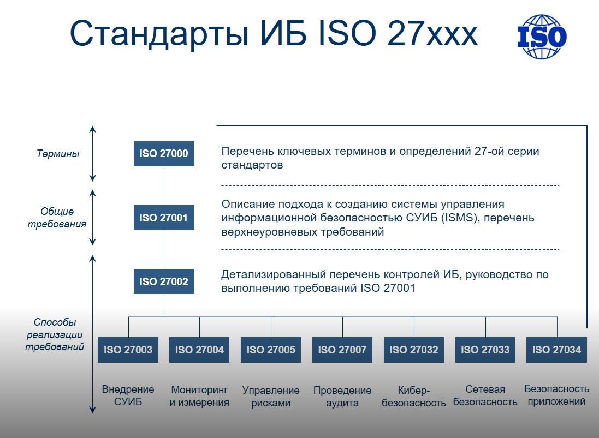

Система управления информационной безопасностью (СУИБ) — это подход к управлению организацией в терминах ИБ.

СУИБ состоит из:
* политик
* процедур
* методик
* ресурсов
* процессов

СУИБ — систематичный, основанный на риск-менедженте подход к установлению, внедрению, эксплуатации, мониторингу, подержанию и улучению инормационной безопасности организации. Это значит, что на каждом из этапов цикла проходят мероприятия по управлению рисками.

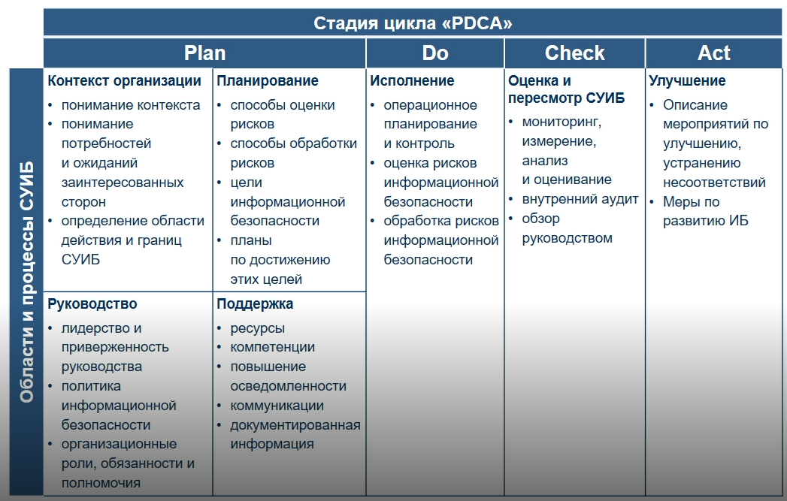

### Стандарт NIST Cyber Security Freamwork

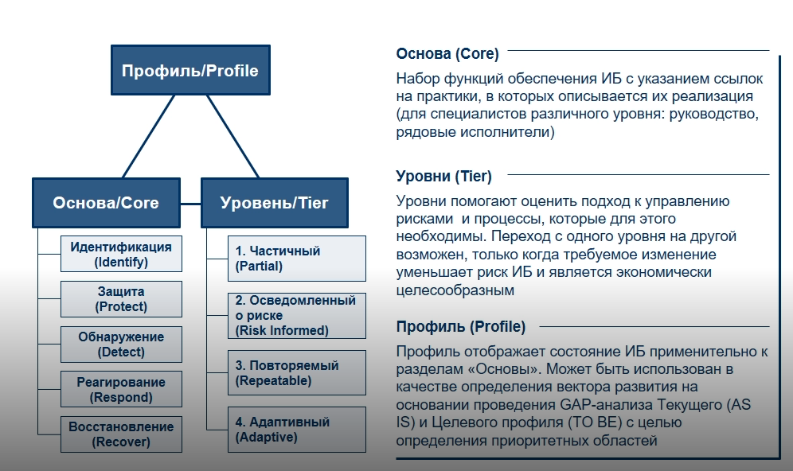

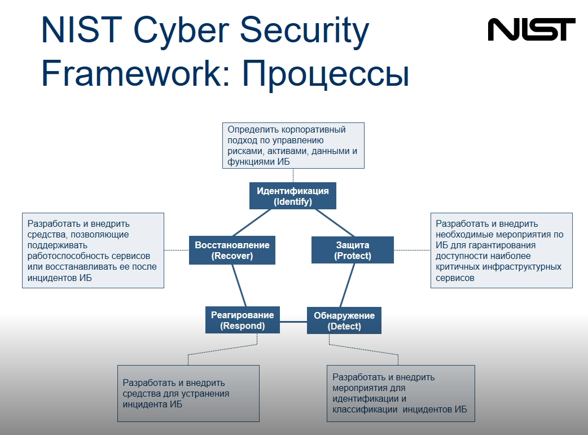

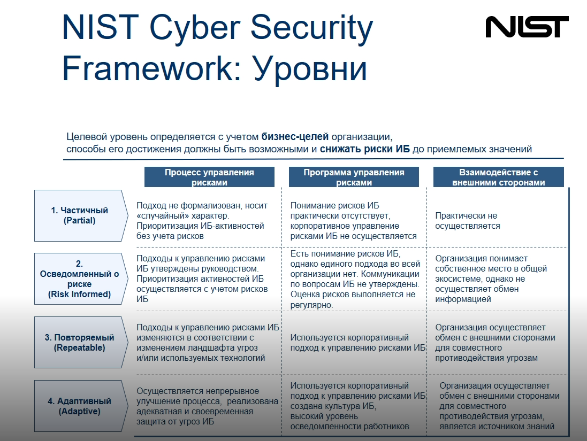

### O-ISM3: Модель оценки уровня ИБ

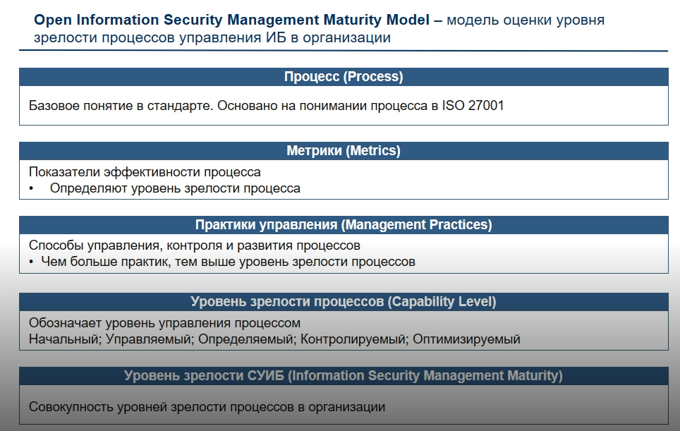

#### Описание процесса

Атрибуты процесса:
* Опсание — краткое описание выполняемых действий
* Ценность — Описание выгоды, которую организация получит в результатате процесса
* Документация — комплект документации, регламентрующий процесс. Документарованные итоги выполнения процессса.
* Вход — информация, поступающая на вход в процесс из внешних источников
* Выход — результаты выполнения процессса, передающиеся на вход в другие процессы
* Метрики — описание метрик, имеющих отношение к данному процессу
* Ответственные — роли, ответственные за выполнение процессса. Владелец процесса.
* Связанные процессы — процессы-источники данных для данного процесса
* Методологии — методологии, "лучшие практити", имеющие отношение к данному процессу

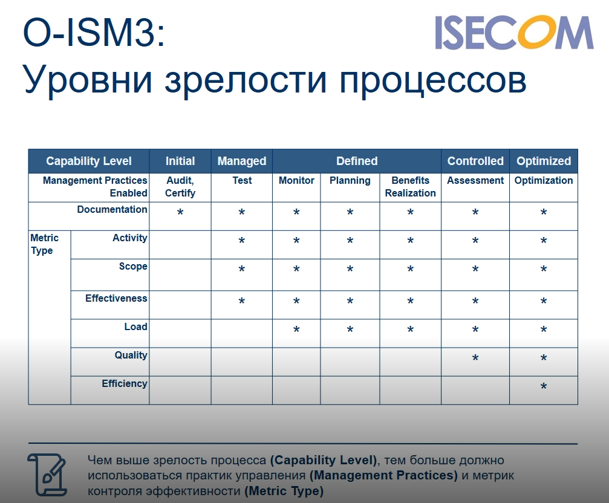

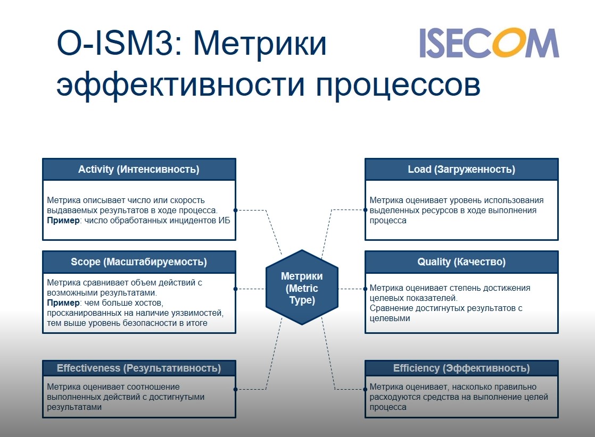

### CIS Controls & Benchmarks

* CIS Controls — детализированный список из 20 контролей ИБ, которые позволяют противодействовать широкому спектру угроз
* CIS Benchmarks — Детальные рекомендации по обеспечению ИБ операционных систем, ПО и сетевых устройств. Benchmarks поддерживаются в актуальном состоянии благодаря экспертному сообществу

### OWASP Top 10

Перечень наиболее значимых рисков веб-приложений по мнению экспертов-членов сообщества OWASP для каждого из 10 рисков описывается:
* Вектор атаки (Attack Vectors)
* Уязвимости, которые эксплуатируются в ходе атаки (Security Weakness)
* Последствия (Impacts)
* Чек-лист проверки наличия уязвимости (Is the Application Vulnerable)
* Способы защиты от угрозы (How to Pervent)
* Примеры сценариев атак (Example Attack Scenarios)

### PCI DSS

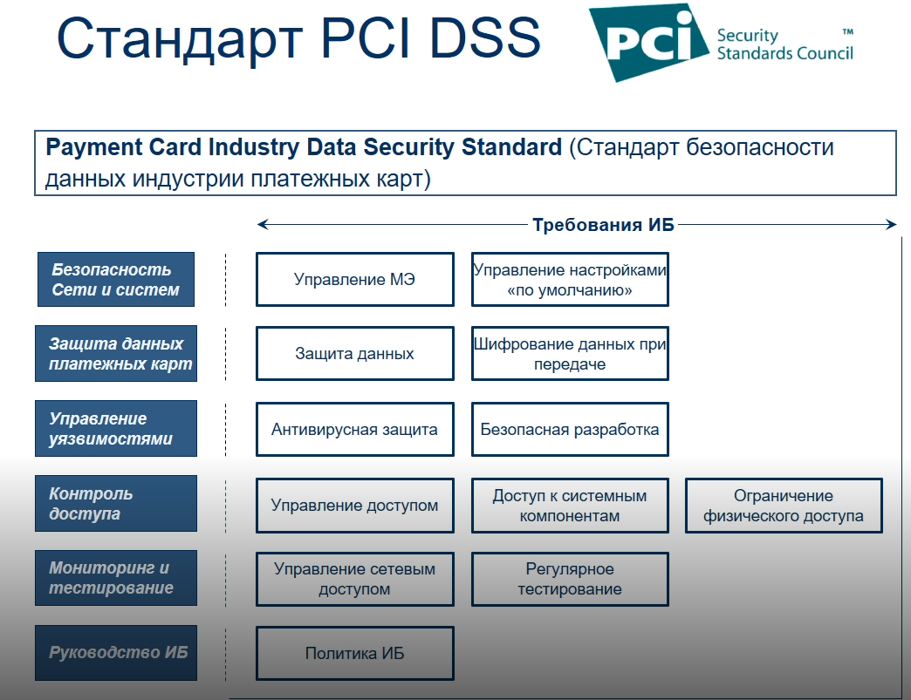

Существует 3 типа подтверждения стандарту PCI DSS:
* Внешний аудит: выполняется внешним аудитором, имеющим сертификат QSA
* Внутренний аудит: вополняется внутренним аудитором, имеющим сертификат ISA
* Самооценка (Self—Assessment Questionnaries): выполняется собственными силами компании

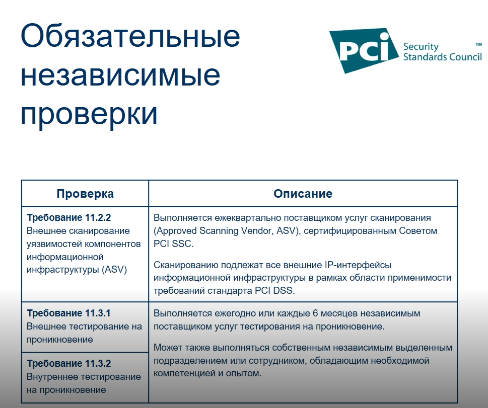

### Обязательность стандартов

Все рассмотренные стандарты, кроме PCI DSS не являются обязательными. PCI DSS обязателен для компаний, которые попадают в область его действия (финансовые, банковски организации).
