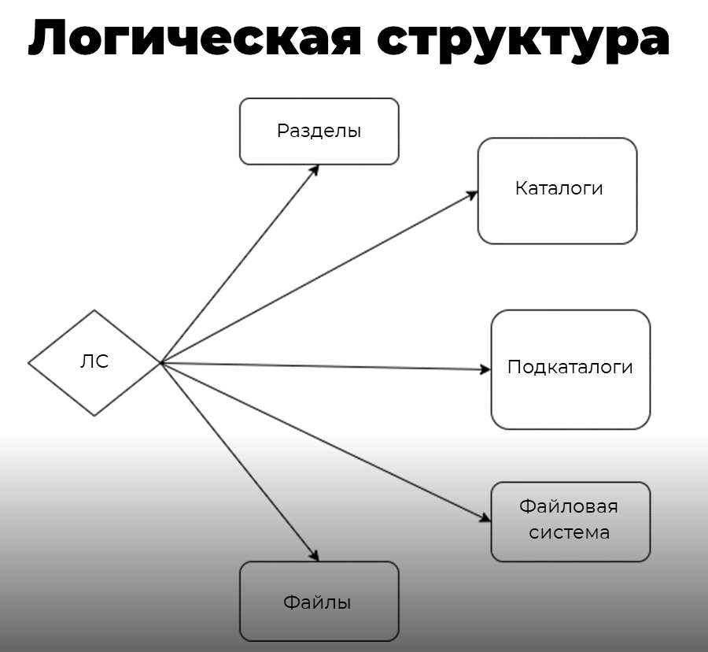
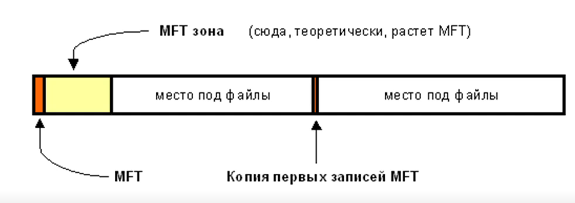
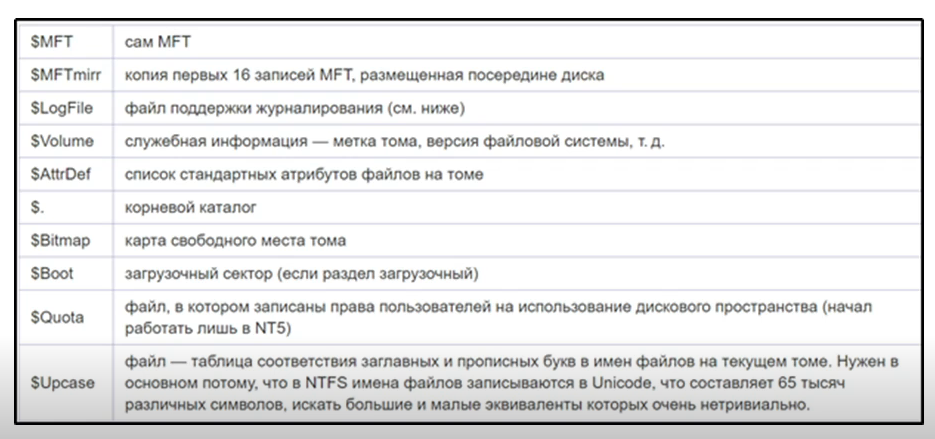
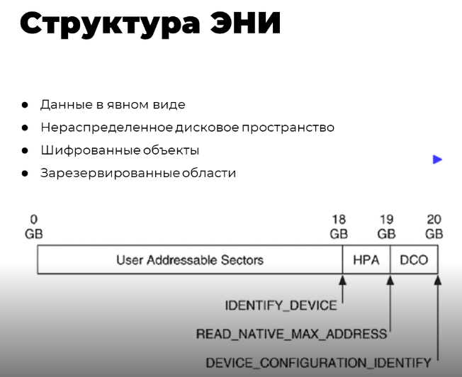

# Компьютерная криминалистика

## Основы теории компьютерной криминалистики

Компьютерная криминалистика (КК) — это наука, занимающася систематизацией, сбором и анализом фактических данных о возникновении, измнении и использовании информации на электронных носителях информации, которые требуются установить для получения доказательсвенной информации и установления фактических обстоятельств, необходимых в рамках соответствующего исследования, исоходя из поставленных вопросов.

## Объекты

* Информация, представленная в цифровом виде
* Электронные носители информации (НЖМД, фле-карты, SSD, FDD, встроенная память)
* Оборудование, в составе которого имеются электроннаые носители информации

## Задачи

* Обнаружение, диагностика и классификация информационных объектов или их фрагментов
* Анализ и оценка данных, подготовленных пользователем или порожденных программами компьютерной системы
* Интерпретация содержимого информационных объектов или их фрагментов
* Определение функционального назначения, структурных особенностей, характерстик (свойств), алгоритма и текущего состояния программного обеспечения

### Прнципы

* Закнность — не используются методы, которые нарушают закон, а также права и свободы других людей
* Обоснованность — каждый метод имеет своё научное и техническое подтверждение
* Достоваерность — все полученные данные должны быть достоверны
* Безопасность — методы, которые используются, не должны вредить объекту исследования
* Эффективность — выбираются лучшие инструменты и методы
* Экономичность — подбираются наиболее оптимальные методы, без лилшних затрат
* Этичность — уважительное отношение к чужим даннных
* Допустимость: 
  * Научная обоснованность, соответствие новейшим достижениям в области соваременных технологий
  * Прогназируемый характер воздействи на аппаратный, программный или информационный объект исследования
  * Приемлемое время получения результатов
  * Приоритетное использование неразрушающих методик исследования

### Инструменты

1. Узконапревленные:
  * анализ метаданных
  * расчет контрольных сумм
  * блокирование записи
  * работ с образами
2. Комплексные
  * Специализированное программное обеспечение
  * Криминалистические ОС
3. Иное
  * Системное и прикладное ПО не предназначенное для рашения задач КК

## Обеспечение регламента работы с носителями информации

### Регламент работы с ЭНИ (электронный носитель информации)

1. Фиксация состояния объекта (фото, идентификационные данные с копуса устройства)
2. Вскрытие корпуса и поиск ЭНИ
3. Внешний визуальный осмотр ЭНИ и фиксация идетификационных данных
4. Подключение электронных носителей информации к стенду с использованием блокиратора записи
5. Фиксация логической структуры ЭНИ с импользованием специализированного ПО и сохранение её в виде отчёта
6. Создание полной побитовой копии либо образа

## Логическая структура: Файлы и метаданные

### NTFS

Особенность NTFS — файловая таблица MFT, она представляет из себя единое хранилизе данных обо всех данных, файлах и их атрибутах на накопителе информации.

Для работы с MFT можно спользовать [Runtime DiskExplorer for NTFS](https://www.runtime.org/diskexplorer.htm)

#### Ананлиз потоков

##### Идентификатор зоны

Содержимое потока $80 (Zone.Identifier) указывает на источник получения файла:
* 0 — локальный компьютер
* 1 — интранет
* 2 — доваренный источник
* 3 — интернет
* 4 — недоверенный источник

##### Даты

Содержимое потока $10 (Staddart):

* Creation time
* Modification time
* Last MFT modification time
* Last access time

#### Метаданные

Текстовые:
* Пользователь который создал документ
* Дата и време создания и последнего изменения документа
* Пользователь, последний раз изменявший документ
* Общее время обаботки документа

Грфические:
* Устройство
* Дата и время создания последнего измения изображения
* Версия прошивки и программное обеспечение, с помощью которого осуществлялась обработка
* Место сохранения документа

## Операционная система: журналы событий, реестр, несанкционированный доступ

### Анализ журналов

В windows: C:\Windows\System32\winevt\Logs

1. Журнал System — хранит информацию о действиях, происходщих в ОС
2. Журнал Security — хранит информацию о действиях, связанных с безопасностью, в том числе и входе/выходе пользователя в ОС
3. Журнал Application — хранит информацию о событиях приложений
4. Журнал Hardware Events — хранит информацию и событиях оборудования (подключение, отключение)

Для анализа жруналов используется утилита [Event log explorer](https://eventlogxp.com/)

### Анализ реестра

Реестр — это по сути хранилище всех настроек, параметров, конфигураций ОС. Реестр состоит из кустов (веток).

Некоторые пути:
* Компьютер\HKEY_LOCAL_MACHINE\SYSTEM\CurrentControlSet\Enum\USB — информация об устройстве, подключавшихся к анализируемой ОС

ПО для работы с реестром: [Windows Registry Recovery](https://www.mitec.cz/wrr.html) или встроенной утилиты редактированния реестра — regedit.

### Переменная среды

AppData — скрытая директория, в которой хранятся временные файлы пользователя

* C:\Users\%username%\AppData:
  * журналы работы программ
  * временные файлы
  * кэш-браузеров
  * история браузеров
* C:\Users\%username%\AppData\Roaming\Microsoft\Word — временные файлы Microsoft Word
* C:\Users\%username%\AppData\Roaming\TeamViwer — журнал работы TeamViwer

## Поиск информации в большом объеме данных

Утилита для поиска файлов — Архивариус 3000

## Анализ файловых систем и структуры данных накопителей информации

## Анализ дампов памяти

Дамп оперативной памяти представляет собой снимок содержимого рабочей памяти процесса, ядра или всей системы.

Утилита для анализа: [Volatility Framework](https://github.com/volatilityfoundation/volatility)

## Комплексный анализ данных при компьютерных инцидентах

Криминалистические ОС:
* HELIX
* CAINE
* DEFT
* KALI Linux

Утилита для анализа данных: [Autopsy](https://www.autopsy.com/)
