# Управление транзакциями

## Транзации

Транзакция — группа последовательных операций, которая представляет собой логическую единицу работы с данными. Транзакция может быть выполнена либо целиком и успешно, соблюдая целостность данных и независимо от параллельно идущих других транзакций, либо не выполнена вообще, и тогда она не должна произвести никакого эффекта.

За счёт транзакций повышается целостность данных.

Распределённые транзакции подразумевают использование более чем одной транзакционной системы и требуют намного более сложной логики.

Распределённые транзакции могут быть:
* гомогенными — когда используется один движок БД или несколько реплик на таком же движке.
* гетерогенными — когда используеются разные движки БД или разные сервисы.

### Почему нужны транзакции

* БД или её сереверы могут упасть в любое время
* Приложения могут упасть в любое время
* Могут возникнуть неполадки в сети между приложением и базой или её репликами
* Несколько клиентов пишут в базу одновременно, переписывая значения друг друга
* Приложения читает чистично записанные данные, которые не несут смысла в таком виде
* Клиенты могут оказаться в условиях "гонки", что может привести к непредсказуемым последствиям

Транзкации нужны нужна т.к. это:
* Приемлемое решение указанных проблем
* Упрощение модели разработки:
  * работа с ошибками делегируется работе БД
  * приложение не заботиться о целостности данных

Идеальным решением будет не использовать транзакции вообще (если это возможно) или свети их к минимуму.

### ACID

Характеристики были определены в 1983 году Тео Йёрдером (Theo Härder) и Андреасом Рейтером (Andreas Reuter) для обозначения систем, устойчивым к сбоям.
* Atomicity (Атомарность)
* Consistency (Согласованность)
* Isolation (Изолированность)
* Durability (Прочность)
Но не каждая база одинаково трактует эти атрибуты качества.

#### Атамарность

* Атомарность — неразделимость чего-либо. Для баз данных это означает, что изменения применяются полностью или не применяется ничего.
* Однозначность результата изменений.
* Возможно, лучшим названием для этого свойства было бы «прерываемость».

#### Согласованность

Consistency может означать:
* одинаковость данных
* механизм вычисления кеша данных для партицирования
* линеаризуемость в CAP-теореме
* согласованность реляционных данных
* база в хорошем состоянии
В общем случае это означает, что некоторое утверждение, записанное в базе данных, будет верно независимо от того, как мы его вычисляем.

Однако не все базы данных могут это поддерживать и гарантировать по умолчанию.

В строгом смысле это ответственность приложения.

#### Изолированность

Операции разных пользователей ни влияют друг на друга.

Не проблема, если субъекты разные, но если один и тот же?

Большинство БД подразумевают под этим сериализуемость данных, то есть только одна транзакция действует в один момент времени.

Проблема:

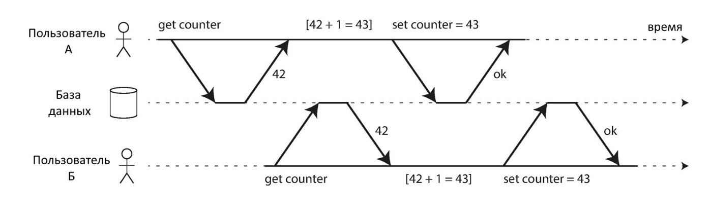

Есть два пользователя читающие данные из БД, наприер число 42 чтобы прибавить потом 1, каждый клиент читает данные и записывает в свою очередь, получая результат 43. Однако, с течением времни результат должен изменится потому что одна операция может идти дольше, либо пользователь запустит её позже и результат должен быть другой таким образом в процесе записи происходит коллизия. Для избежания этой проблемы можно использовать строгую сериализацию, это очень стогий тип изолированности, который, однако, не используется на практике, потому что имеет большой штраф к производительности.

Многие БД даже не поддерживают сериализуемость.

#### Прочность

Прочность — гарантия от БД, что записанные данные не потеряются в результате какого-либо сбоя.

Не стоит забывать, что БД может гарантировать одно, а жёсткие диски и прочие компоненты сервера могут иметь сбои, независимо от желания БД.

Для реплицированных БД это означает, что изменения были записаны на достаточное количество реплик.

#### Особенности

Для единичный субъектов все БД предоставляют свойства **атомарности** и **излированности**, остальное не гарантируется.

### CAP теорема

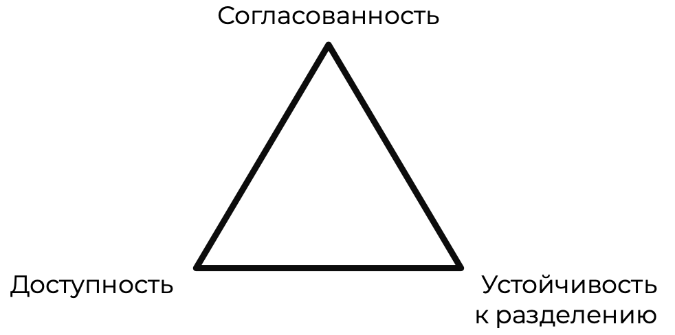

Автор — Эрик Брюер (Eric Brewer).

Джефф Ходжес (Jeff Hodges) упомянул о связи распределённых систем и CAP-теоремы в статье «Заметки о распределённых системах для новичков».

* Согласованность (Consistency) в САР — линеаризуемость, является принципом согласованности (и очень сильным).
Не имеет ничего общего с «С» из ACID, даже если эта «С» также означает «согласованность».
* Доступность (Availability) — в САР определена как «каждый запрос, полученный работающим узлом [базой данных], в системе должен приводить к ответу [не содержащему ошибок]». Недостаточно, чтобы некоторые узлы могли обработать запрос — любой работающий узел должен быть способен обработать запрос.
* Устойчивость к разделению (Partition tolerance) — ужасное название, в общих словах означает, что для связи вы используете асинхронную сеть, которая может терять
или задерживать сообщения. Интернет и все дата-центры обладают этим свойством, так что в реальности у вас нет выбора в этом контексте.

#### В распределённых системах

В распределённых системах теорме не приенима, т.к.: устойчивость к разделению в распределённых системах — это базовая характеристика, обеспечивающееся за счёт протоколов TCP/IP. Таким образом можно говорить только о согласованности и доступности, однако на практие между этими характеристиками есть целый спектр состояний, которые можно достичь благодаря разным практикам.

### BASE

Определение было дано Эриком Брюером (Eric Brewer), автором теоремы CAP.
* Basically Available
* Soft state
* Eventual consistency
Ещё более расплывчатое определение, нежели ACID, обычно используется для NoSQL БД.

#### Свойства

* Basic Availability — Большинство реплик БД доступно для работы.
* Soft state — БД не обязана быть согласованной относительно операций записи. Реплики не обязаны быть согласованными относительно друг друга в плане имеющихся данных.
* Eventual consistency — Данные не согласованы и могут приходить в согласованное (одинаковое) состояние «когда-нибудь».

В основном используется в хранилищах типа «ключ — значение» (Redis) или документоориентированных (Mongo).

#### Особенности

* Более высокая скорость операций
* Высокая доступность реплик
* Контроль целостности данных полностью в ответственности приложения

### ACID vs BASE

**ACID** ориентирована на согласованность и целостность данных:
* В основном для финансовых учереждений и там, где целостность данных критична
* Контроль целостных данных — забота базы
* Стабильная модель данных

**BASE** ориентирована на доступность данных:
* Маркетинг, работа с клиентами — когда нужна согласованность в рамках одного агрегата, который будет записан, скорее всего, как один объект
* Контроль целостности — забота клиента
* Модель данных автивно эволиционирует

### 2 Phase commit (2PC)

для избежания коллизий в распределённых системах можно использовать 2х фазовый коммит. Для него нужен коодинатор распределённых транзакций.

1. Базы/реплики делают запись как обычно, без подтверждения, но с блокировкой данных
2. Координатор просит подтвердить, что участники готовы к подтверждению
3. Подтверждение операции

В высоко нагруженных приложения приводит к большим штарфам по производительности.

Ограничения 2х фазового коммита:
* Если координатор транзакций работает в единственном экземпляре, тогда это чувствительная точка отказа. Редко, когда такие координаторы реплицируются.
* Если координатор реализован в логике сервера приложений, тогда возникают сложности с репликацией и поддержкой лога координатора в согласованном состоянии.
* Невозможно в общем случае определить замыкания (deadlock) в базах для освобождения блокировок, а также обработать специализированные ошибки от разных БД.
* Для внутренних распределённых транзакций остаётся проблема скорости работы для 2PC, ответ должен прийти от всех реплик.

#### Распределённые транзакции на практике

Плюсы:
* гарантии безопасности выполнения транзакций (сложно реализовать)

Минусы:
* операционные проблемы (ошибки координатора)
* снижение производительности (иногда в 10 раз)

### Выводы

* Транзакции — логическая структура, помогающая у управлении согласованностью данных.
* Распределённые транзакции имеют сильные штрафы и риски; использовать стоит, когда нет другого выхода и согласованность данных превыше скорости.
* CAP-теорема не применима к репределённым хранилищам.

## Шаблон "Сага"

### Проблема

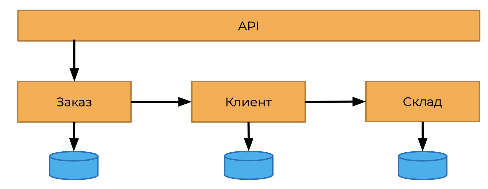

Есть некоторая система которая состоит из нескольких сервисов, каждый сервис отвечает за какой-нибудь свой функционал, для выполнения транзакции нужно подтверждение от каждого сервиса о подтверждении транзакции.

2 Phase Commit нельзя применить из-за особенностей реализации.
* Время для согласования: зависимые сервисы могут требовать дополнительные данные
* Возможное отсутствие хранилищ для сервисов

Один из вариантов решения:

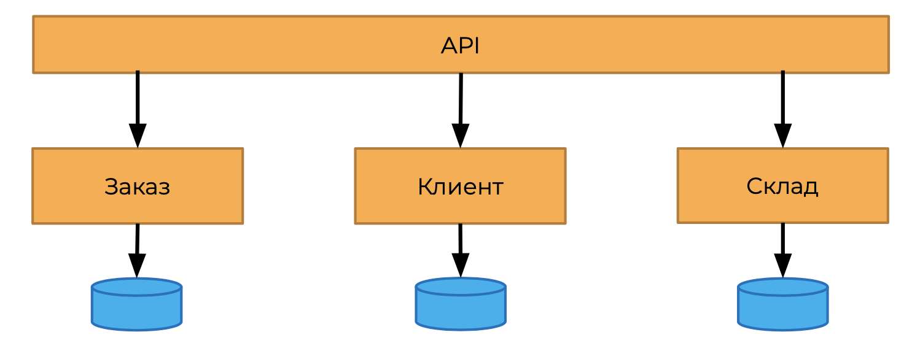

Нужно перенести логику по обработке такой распределённой транзакции на уровень API. Но тогда в слой API помещается слишком много ответственности.

Второй вариант — это использовать брокер:

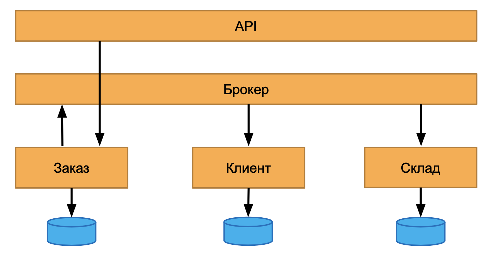

Но брокер будет сохдавать много рисков.

#### Сага

Последовательность локальных транзакций с компенсационным механизмом. Каждый следующий шаг может продолжаться только после успешности предыдущего.

Первое упоминание — в 1987 году в публикации «Долгоживущие транзакции» Гектора Гарсия-Молины (Hector Garcia-Molina) и Кеннета Салема (Kenneth Salem).

По своей сути «Сага» — это конечный автомат.

##### Применимость

Обычно используется, когда на каждом шаге требуется принятие решения человеком, т.е. наиболее очевидное применение — документооборот с визированием решений.

Основная особенность: процесс "засыпает" после каждого шага, пока не появится какое-либо решение.

##### Проблема

Сагу можно приименить к решению нашей проблемы:

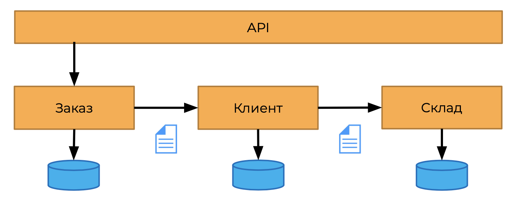

Специальное сообщение (команда) с данными для транзакций. Последний участник обработки подтверждает успешность инициатору «Саги».

Пример: пусть пользователь создаёт заказ, тогда информация о желании пользователя передаётся в сервис заказов, где он формируется, при этом заказ считается валидным сразу. Далее сообщение с этим заказов передаётся в другие сервисы. Специально сформированная команда передаётся в сервис клиента, в сервис оплаты, на склад и эти сервисы у себя производят какую-то работу согласно информации из команды, при этом стоит передать как можно больше информации для принятия решения успешен текущий шаг или нет. Все шаги обрабатываются один за одним и когда очередь доходит до последнего шага данные передаются инициатору с подтверждением, что всё прошло хорошо, при этом стоит учитывать, что инициатор потом не подтверждает дополнительно каждому сервису, что всё прошло хорошо. Таким образом, мы не знаем успешно ли записаны данные в рамках целого процесса. Решением может быть запись меток о том что запись временная до подтверждения общей транзакции, однако концептуально это решение противореит самой идее саги, потому что если есть временные тодга инициатор должен повторно пройтись по всем сервисам и передать, что транзакция успешна.

Варианты реализации:
* Хореография — сервисы сами знают, куда дальше послать запрос.
* Оркестрация — существует брокер сообщений, который организует коммуникацию между сервисами.

##### Хореография

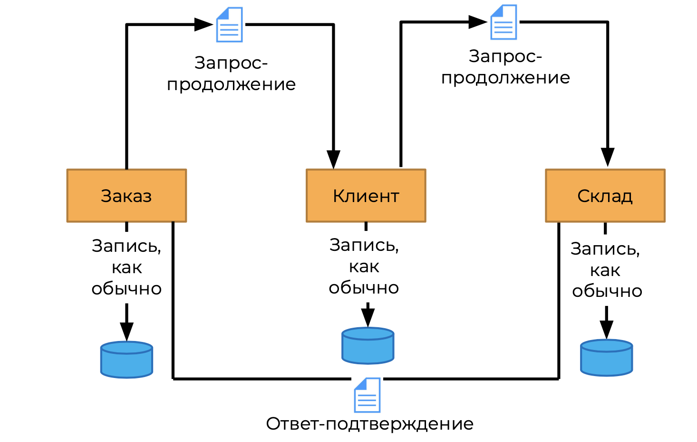

В хореографии сервисы сами знают кому какое сообщение нужно передать в каждом случае, т.е. когда приходит заказа сервис заказа передаёт команду сервису клиента, он обрабатывает сообщение, сохраняет у себя с каким-то статусом и передаёт на склад, при этом все сообщения должны иметь один кореляционный ИД, чтобы можно было обнаружить конкретную сагу и узнать какие шаги были сделаны, что предстоит дальше и когда конечный сервис склада потдврждает операцию, исходя из этой информации, передаёт новое сообщени на сервис заказов с подтвреждением об успешности. Тогда считается, что сага выполнена и все данные находятся на своих местах.

Как сервису будут знать куда послеать сообщения:
* информация может хранится в самом запросе, т.е. инициатор заранее закладывает эту информацию в служдебные поля
* информация об обработке сообщений заранее прописана в сервисы, т.е. сервис знает какой тип сообщени куда послать.

При отмене операции сервис должен послать информацию на все предыдущие шаги об ошибке операции для этого:
* Должен существовать механизм оповещения всех об ошибке
* сервисы должны знать предыдущие шаги

Как и с отправкой успешных сообщений, есть два варианта где должна быть информация о прошлом сервисе:
* Писать в само сообщение
* Сервис сам знает откуда пришло это сообщение

На практике возникает очень много нюансов:
* Как послать отмену, при этом все ранее сделанные действия должны отменится
* Сага — это распределённый во времени процесс и распределённая во времени транзакция, и когда посылается команда отмены, возможно другие сервисы уже приняли свои решения на основе записанной информации, т.е. опять возникает проблема: нужно как-то помечать данные неподтвредёнными

##### Оркестрация

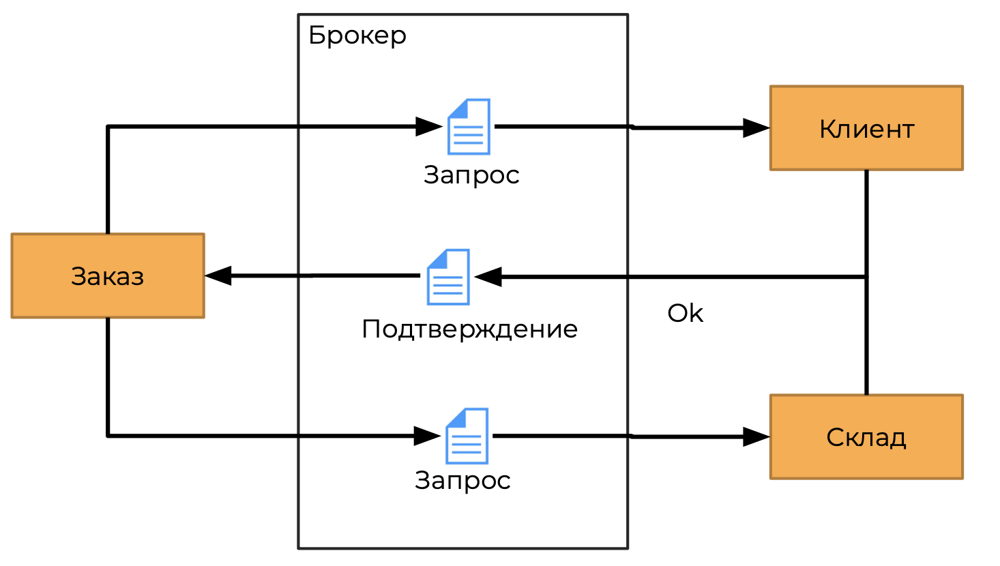

Здесь используется брокер. Брокер знает о каждой саге, по сути он является хранилищем всех возможноных операций. При этом сервисы не знают какой сервис будет выполнять следующий шаг операции, что облегчает логику каждого сервиса, с другой стороны брокер является центральной точкой отказа, которая сильно влияет на то как всё будет обрабатываться.

Пример: севисы посылают сообщение брокеру, брокер отправляет сообщения дальше, после получения подтверждения от сервиса.

В случае ошибки:
1. Допустим сервис заказа высылает запрос брокеру
2. Брокер отправляет дальше
3. При возникновении ошибки брокер обязан уведомить все остальные сервисы об ошибке
4. Брокер должен отправить сообщение об ошибке сервису инициатору

Таким образом для реализации отмены нужно:
* брокер должен знать, что отменить
* инициатор посылает команду отмены

###### Советы

* Избегайте циклических зависимостей между сервисами.
* Не позволяйте зависимым сервисам в транзакции вызывать брокера напрямую.
* Всегда создавайте уникальный ID транзакции для облегчения отслеживания статуса и зависимостей.
* Используйте асинхронные операции.
* Сохраняйте запрос для повторных попыток.
* Запрос должен содержать как можно больше данных для успешного выполнения.

##### Требования

1. Каждая операция должна иметь вариант для отмены изменений.
2. Каждая транзакция должна иметь глобальный идентификатор.
3. С самого начала дизайн-система и модель данных должны поддерживать компенсационные команды (отмены).
4. Сервис должен атомарно применять изменения и уведомлять об изменениях.
5. Команды со всеми параметрами должны сохраняться
для возможности повторного выполнения и реализации отмены.

##### Сложности

* Сложность координации долгоживущих транзакций, если они состоят более чем из 3-4 шагов.
* Сложность отслеживания зависимостей, как у любой системы, построенной на событиях.
* Возможность циклических зависимостей между сервисами и событиями.
* Сложность тестирования.
* При любом подходе надо гарантировать доставку сообщений об успешности либо отмене операции.
* Нужны дополнительные усилия для решения проблемы чтения «грязных» данных.

##### Альтернатива

* Принять более слабые модели согласованности данных.
* Использовать новые компенсационные команды, а не отменять старые — например, как это сделано в подходе Event-Sourcing.

##### Самое важдное

Избегайте распределённых транзакций. Использовать, только когда все остальные варианты не подходят.

«Сага» проста и привлекательна только как концепт, на практике всё выходит очень сложно и неочевидно.

### Выводы

* Распределённые транзакции сложны в реализации и использовании.
* Шаблон «Сага» не решает проблем распределённых транзакций.

## Модели согласованности данных

**Модели согласованности** — набор исторических событий. Используются, чтобы можно было определить, является такой набор «хорошим» или «легальным» для конкретной системы.

**Набор исторических операций** — список операции и то, когда каждая операция началась и закончилась.

**Строгая модель согласованности** накладывает больше ограничений на то, как исторические события должны быть записаны относительно друг друга.

### Зачем?

Зачем нужно задумываться о том какая модель согласованности используется в БД: Чтобы понять какие аномалии могут быть и какие гарантии передоставляет БД.

Независимо от того, какой архитектурный стиль выбран, вам надо решить, какая модель согласованности у вас будет.

### Реализация атрибутов качества

Не все модели согласованности можно подвергнуть прямому сравнению.

#### Пример

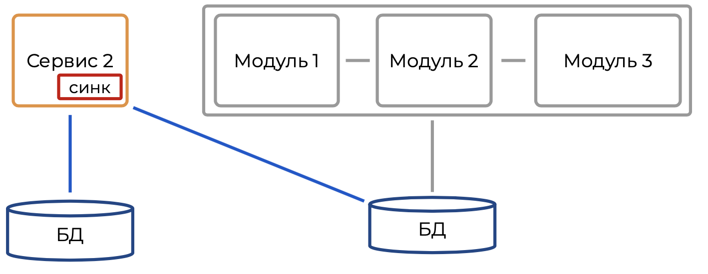

Пусть мы разделяем монолит: у нас появился "сервис 2", который должен синхронизироваться со своей БД и одновременно передавать данные в старую БД монолита, с которым работает оставшиеся в монолите часть приложения.

Какой подход использовать для синхронизации данных между двумя базами данных?

Это зависит от факторов:

##### Вариант 1

Если новый и старый сервис используются некоторым новым/старым модулем, например UI, то данные необходимы одновременно.

В этом случае нужна одна из моделей строгой согласованности плюс:
* распределённые транзакции (2PL, Saga)
* пессимистичные блокировки

##### Вариант 2

Если для нового сервиса есть отдельный интерфейс, отдельный модуль или он используется каким-то независимым сервисом, а для старой системы есть отдельный сервис.

В таком случае выбор шире и зависит от того, насколько быстро вам надо отвечать на изменения и какие гарантии доступности есть у баз данных.

### Модели согласованности

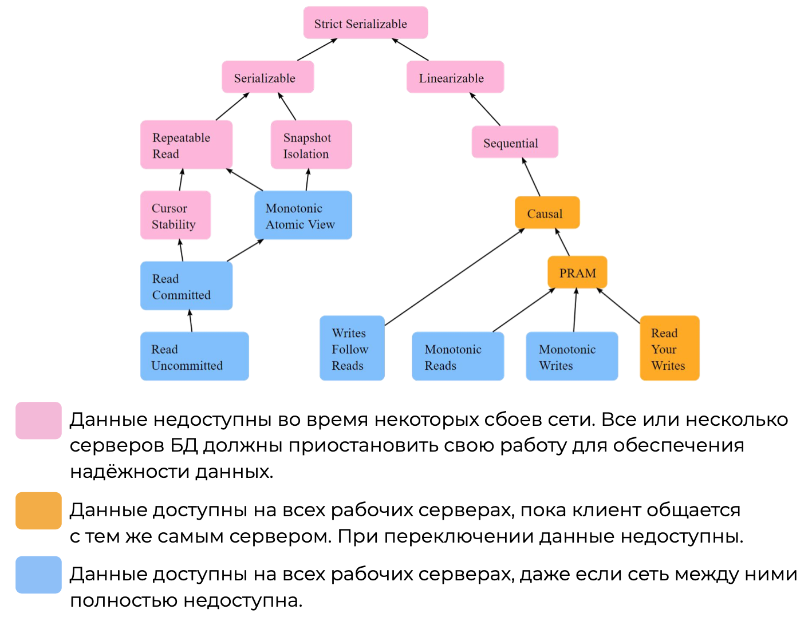

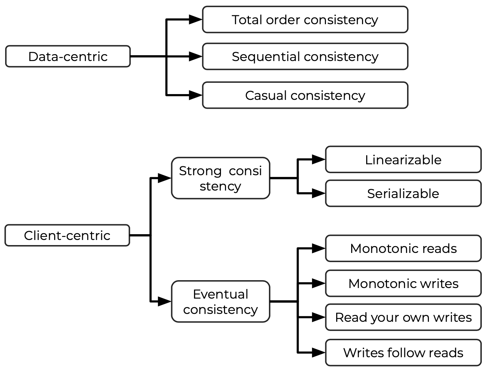

### Linearizability

Гарантия того, что чтение и запись для одного объекта будут упорядочены.

Это свойство важно для систем полагающихся на репликацию данных с помощью одного лидера, то есть для внешних систем создаётся видимость с одной базой.

Для достижения этого уровня согласованности все реплики должны поддерживать централизованную систему блокировки записи.

При работе с таким способом репликации у всех клиентов возникает ощущение, что они работают не с несколькими репликами, а с одной БД.

### Serializability

Строгая согласованность и свойство I (изоляции) из ACID.

Все транзакции выполняются так, как если бы не было конкурентного доступа. При этом порядок выполнения может не соответствовать тому, как клиенты делали запросы.

### Особенности

Все строгие модели согласованности опираются на двухфазную блокировку.

Вывод: это серьёзный штраф к скорости выполнения, высокие гарантии согласованности данных.

### Eventual Consistency
 
Aka Pipelined Random Access Memory (PRAM)
* Monotonic reads — При чтении данных всегда возвращается последний замеченный ответ.
* Monotonic writes — Для наблюдателя чтение событий всегда идёт в той последовательности, в которой они произошли. Нет логических нарушений последовательности сообщений.
* Read your own writes — Клиент всегда может прочитать данные, которые он записал.

### Производительность

Строгие модели согласованности данных требуют времени на распространение данных для реплик, а значит общая скорость падает.

### Выводы

* Модель согласованности данных должна быть определена исходя из бизнес-требований и ограничений.
* Каждая база данных имеет поддержку определённого набора моделей согласованности.
* Строгие модели согласованности упрощают работу, но делают медленнее.
* Модели данных для строгих и слабых моделей согласованности различаются.

## Изоляция данных и аномалии

### Согласованность

BASE-системы не гарантируют строгой согласованности. 

ACID — старается, но не всегда получается.

Однако в рамках одной реплики оба подхода полагаются на изоляцию транзакций в процессе внесения изменений.

#### Изоляция

Основные уровни изоляции для баз данных:
* Анархия — отсутвие уровней изоляции
* Read Uncommitted
* Read Committed
* Repeatable Read 
* Snapshot Isolation
* Serializable

Вместе с уровнями изоляции определяются типы аномалий чтения данных.

#### Аномалии

Красным обозначены те аномалии, которые могут произойти.
Зеленым те, которые учпешно можно избежать.
Оранжевым аномалия фантомного чтения для snapshot.

#### Read Uncommitted

Самый слабый уровень изоляции.

Гарантии: транзакции не перезаписывают данные друг друга в процессе исполнения (no dirty writes).

Иногда используется как «совет» запросу БД не использовать блокировку на чтение для ускорения работы. Но в итоге может быть весь спектр аномалий.

##### Dirty Writes

Частичная перезапись данных, сделанных другой транзакцией.

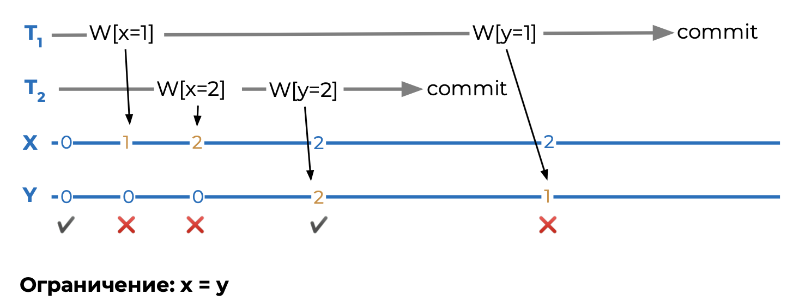

Т1 и Т2 производят запись в таблице X и Y. При этом есть внутрнеее ограничесение между этими таблицами, что X = Y. T1 начинает запись в таблицу X, одновремено с T2. После этого T2 заканчивает запись в таблицу Y, при этом T1 продолжнается и записывает данные в таблицу X и Y, в результате получаются несогласованные данные.

#### Read Committed

Используется по умолчанию для большинства баз данных.

Гарантии:
* транзакции не перезаписывают данные друг друга в процессе исполнения (no dirty writes)
* транзакции не могут прочитать данные, которые записывает другая транзакция (no dirty reads)

##### Dirty Reads

Часть исполненной транзакции видна для других пользователей.

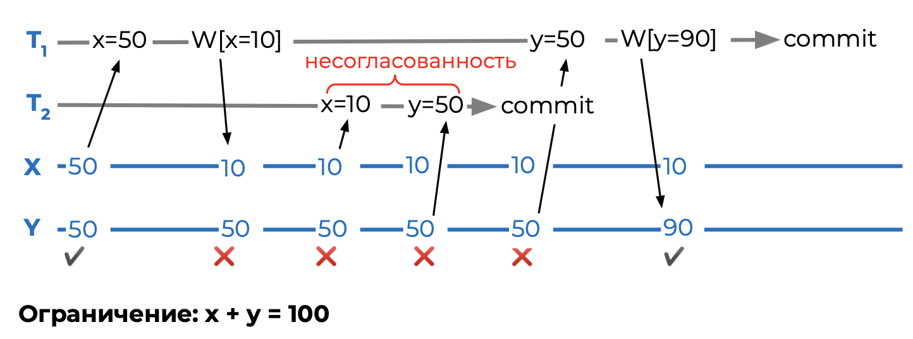

Другие транзакции могут основываться на отменённых данных. Нарушается причинно-следственная связь.

### Repeatable Read

Гарантии:
* транзакции не перезаписывают данные друг друга в процессе исполнения (no dirty writes)
* транзакции не могут прочитать данные, которые записывает другая транзакция (no dirty reads)
* нет потерянных обновлений (no lost updates)
* стабильность чтения данных (no fuzzy reads)
* нет смещений чтения/записи данных (no read/write skew)

#### Fuzzy Read

Результат чтения в рамках одной транзакции может меняться, и правила согласованности нарушаются для одной из транзакций.

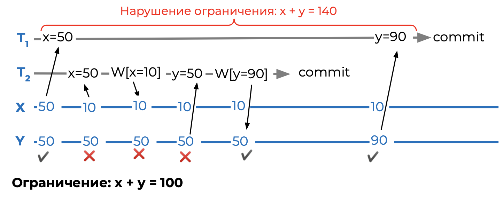

#### Lost updates

Транзакции одновременно обновляют одну и ту же запись.

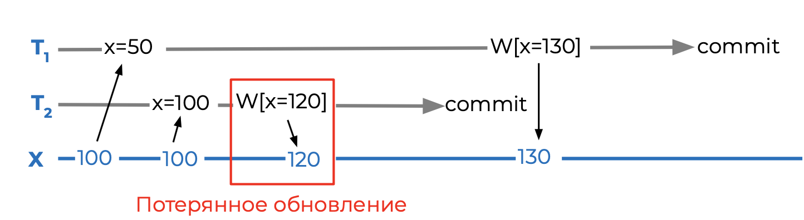

Для решения проблемы БД ставит блокировку на все данные, которые вернулись в результате запроса.

#### Road Skew

Возникает, когда нарушается внутреннее ограничение на согласованность данных.

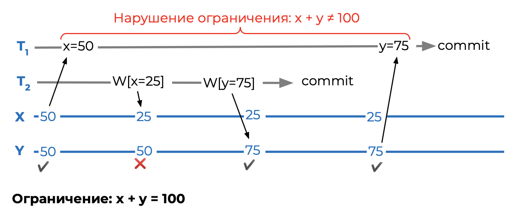

#### Write Skew

Для каждой из одновременно идущих транзакций ограничение не нарушается, но итоговый результат нарушает ограничения БД.

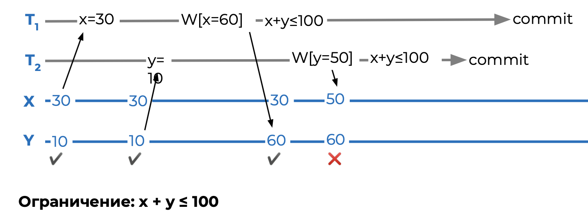

Обновляются разные записи, поэтому это не Dirty Write и не Lost Updates.

### Snapshot Isolation

Гарантии:
* транзакции не перезаписывают данные друг друга в процессе исполнения (no dirty writes)
* транзакции не могут прочитать данные, которые записывает другая транзакция (no dirty reads)
* нет потерянных обновлений (no lost updates)
* есть стабильность чтения данных (no fuzzy reads)
* нет смещений чтения/записи данных (no read skew)
* нет фантомных данных во время записи (phantoms)

#### Phantoms

Фантомные записи возникают во время использования предиката
для чтения, когда такой же предикат используется другой транзакцией для записи во время действия первой транзакции.

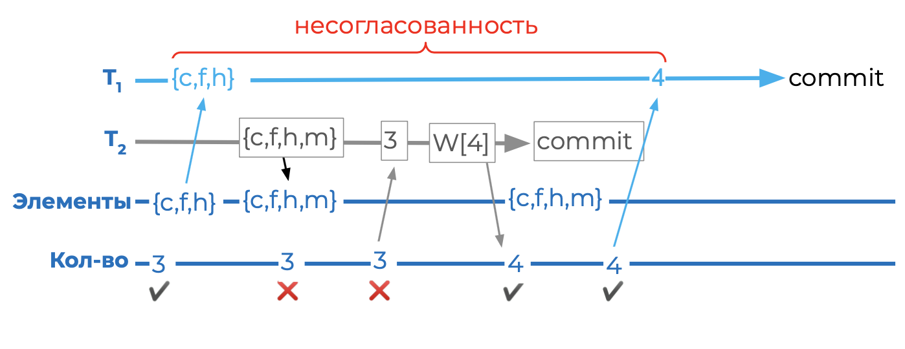

### Serializable

Гарантии:
* транзакции не перезаписывают данные друг друга в процессе исполнения (no dirty writes)
* транзакции не могут прочитать данные, которые записывает другая транзакция (no dirty reads)
* нет потерянных обновлений (no lost updates)
* есть стабильность чтения данных (no fuzzy reads)
* нет смещений чтения/записи данных (no read/write skew)
* нет фантомных данных во время записи (phantoms)

### Главное

Чем выше уровень изоляции данных, тем медленнее общая пропускная способность базы данных

### Альтернатива

Аномалии возникают при измении данных, чтобы избежать их можно вообще не менять данные а только дописывать.

#### Append-only
 
Вопросы для решения:
* сохранение причинно-следственных связей
* конфликты версий
Возможные решения:
* двухфазное подтверждение
* lamport timestamps
* paxos
* raft

### Выводы

* Уровень изоляции влияет на производительность и возможные аномалии данных — необходимо работать с компромиссами.
* Необходимо изучать и знать принципиальные возможности движков баз данных, чтобы принимать решения, отвечающие ФТ и НФТ.
