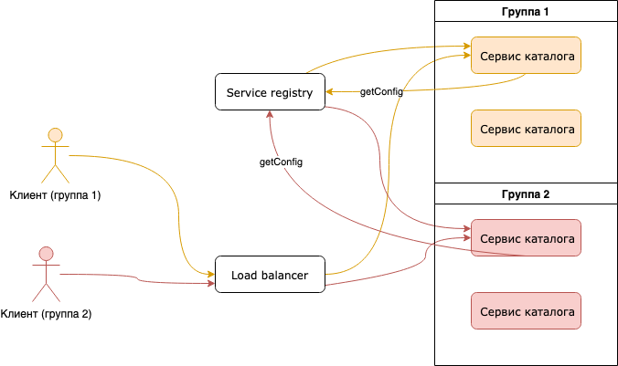

## 1.

>Предложить стратегию такого решения. Описать возможные варианты того, как это может быть реализовано технически, обосновать выбор.

Можно реализовать AB-тестирование, которое позволит поделить пользователей на нужные группы, дать каждой группе свою версию системы, собрать данные и выбрать наиболее подходящее решение.

Для реализации AB-тестирования нам понадобится реализовать систему конфигураций для сервисов, в которой будут прописаны нужные фича-флаги для каждой группы тестирования. Для работы и конфигурацией будет использоваться service registry, в нём будет хранится большая часть конфигов для сервисов, а в самих сервисах только базовая часть с информацией о себе и о том как добраться до service registry.

Для каждой группы тестирования можно сделать свой набор экземпляров сервиса и при обращении в service registry для получения конфига, service registry будет знать какой группе принадлежит этот экземпляр и какой набор конфигов ему возвращать. Или можно сделать чтобы при запросе к сервису ему можно было передавать в параметрах нужные конфиги и тогда перед запросов в сервис получать конфиг для группы и отправлять вместе с ним запрос в сервис. Но мне кажется, что первый вариант предпочтительней, т.к. он более простой и не требует доработки API сервисов (ведь к каждому запросу пришлось бы добавлять новый элемент с параметрами).

Для роутинга запросов будет использоваться load balancer к которому будем уходить запросы клиента, клиенту будет присваиваться какая-то группа. load balancer будет направлять к экземпляру сервиса этой группы, сервис будет запрашивать конфиги из service registry и тоже будет попадать на load balancer, который будет знать какая группа у этого сервиса и будет направлять в service registry соотвествующий запрос для получение конфигов этой группы и отправлять их назад в сервис.

На диаграмме показа схема взаимодействия компонентов:

## 2.

>Указать, какие сервисы будут затронуты в результате такого подхода и почему.

Думаю что во время реализации в основном будет затронет сервисы каталога и, возможно, заказа, т.к. это два основных сервиса отвечающих за процесс выбора и покупки покупателя. 

Сервис цен отвечает только за цены, да и по сути является просто хранилищем цен, вряд ли там что-то нужно менять. 

Сервис клиентов тоже останется без изменений в процессе выбора и покупки он мало участвует.

## 3.

>Описать, изменится ли формат данных для анализа новых данных. И если да, то как.

В данных ничего менять не требуется. Вообще, сложно сказать, потому что нет детального ТЗ от аналитиков и непонятно какие данные для них критично отслеживать, думаю что имеющихся хватит, разве что нужно как-то идентифицировать группы AB-теста, но для этого не обязательно добавлять новые поля к имеющимся структурам данных, можно отслеживать это в куке и отправлять идентификатор из куки вместе с данными в аналитику.

## 4.

>Укажите, управление какими сервисами можно автоматизировать, а какие оставить как есть, с ручной поддержкой. В каком порядке вы предложите реализовывать такой переход, и почему? Какие риски вы видите в автоматизации процессов?

Думаю, что в первую очередь нужно автоматизировать управление сервисами с которыми мы будем проводить AB-тест (каталог и заказы), поскольку для разделения у нас предполагается создание новых экземпляров сервиса для каждой группы, этот процесс нужно автоматизировать. Сначала нужно начать с сервиса каталога, он наименее безопасный в плане автоматизации, в основном каталог используется только для получения информации о товарах. Затем можно автоматизировать сервис заказов, но тут стоит подходить к его управлению осторожно, т.к. этот сервис предполагает множество операций записи, транзакций из-за чего возникает риск, что при нагрузке автоматический деплой может наплодить сервисов которые будут друг друга dead-лочить, что приведёт как минимум к сильному замедлению работы с заказами/корзиной а может и вообще привести к падению всей системы, поэтому с этим сервисом стоит быть осторожнее.

Сервис клиентов у нас в тестировании сейчас не участвует, но в будущем такая возможность может быть, к тому же, по мере роста функционала, автоматизация может понадобится и в этом сервисе, так что тут неплохо бы тоже предусмотреть такую возможность.

Для сервис цен автоматизация не нужна, у нас предполагается, что он работает один, для избежания проблем с различием данных в репликах и автоматически управлять им не нужно, он должен оставаться в полностью ручном управлении.

> Стратегию вы выбрали обоснованно, клиенты усажены за тестирование :)  Однако на мой взгляд, дороговато иметь целых два стенда, копирующих  работу нашего приложения. Предлагаю подумать, как это можно реализовать с меньшими затратами.

Можно добавить некий идентификатор группы, который мы будем передавать в сервис, а сервис будет передавать его в service registry при запросе конфигов. Идентификатор группы можно передавать через специальный кастомный заголовок, чтобы не пришлось переделывать все имеющиеся методы API.

> Также прошу вас описать критерии, по которым мы будем оценивать результаты тестирования.

Поскольку задача делается по указанию маркетологов, то скорее всего это будут маркетологические показатели такие как конверсия в покупки, т.е. сколько стало ли больше покупателей класть товар в корзину и доходить до этапа завершения оформления заказа.
