# Service Discovery & Configuration 

## Обнаружение и регистрация сервисов

### Постановка проблемы

У нас есть SOA-приложение с большим количеством связанных сервисов. Рассмотрим один из сервисов (сервис А): как он будет общаться с другими сервисами, как остальные сервисы узнают, что он существует, как к нему присоединится? Один их способов — это прописать все это явно. Т.е. в конфигурации прописывается, что сервису А нужны такие-то сервисы, таким образом конфигурация сервиса заранее содержит все известные адреса. Это создаёт несколько проблем, т.к. это статическая адресация. Если появится новая реплика приложения, то как сообщить об этом сервису А?

Можно использовать Load balancer'а или некого роутеxра между этими сервисами, перед репликами целевого сервиса (к которому мы подключается из сервиса А). Эта прослойка будет управлять запросами к сервису и распределять их между репликами.

У этого подхода есть минусы:

* растёт сложность сети
* дополнительные задержки в обработке запроса, что приводит к потере производительности

Другой вариант, это использование DNS серверов, для них требуется:

* знание адреса
* существование DNS

Минусы:

* растёт физическая сложность сети
* дополнительные задержки в обработке запроса
* ручная конфигурация в DNS
* время репликации данных между DNS-серверами занимает достаточно длительное время

Таким образом основные проблемы статической адресации:

* Общая изменчивость конфигурации сети:
  * динамические адреса сервисов
  * динамическое количество сервисов
* Сложно оценить общую сложность коммуникации
* Трудно находить потребителей

Решение: использование регистров сервисов:

* Client-side Discovery Pattern
* Server-side discovery Pattern

### Client-side Discovery Pattern

Регистрация со стороны клиента.

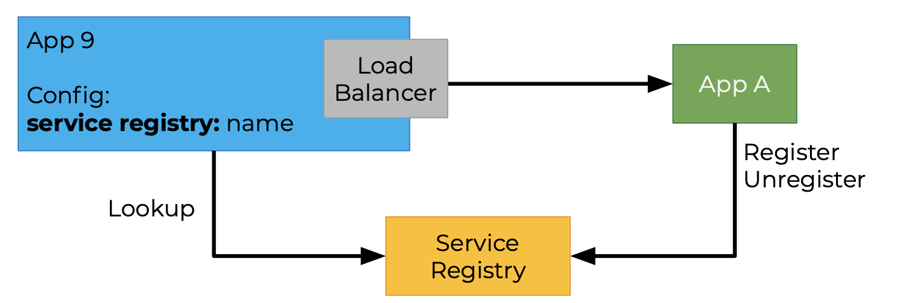

В этом случае сервис А знает адрес регистратора сервисов и по именам находит те сервисы, к которым ему нужно обратиться.

Кажды новый сервис, появляющийся в сети, должен зарегистрироваться в регистраторе. При выходе из сети или уменьшении количества реплик происходит отписка в регистраторе.

Обычно в приложении существует внутренний балансировщик нагрузки который, по информации из service registry решает, кому из приложений отправить запрос.

Плюсы:

* Простота решения

Минусы:

* Клиент жёстко связывается с service registry

### Server-side Discovery Pattern

В этом случае всё обнаружение и распределение нагрузки осуществляется на стороне сервера. Клиент ничего не знает о service registry

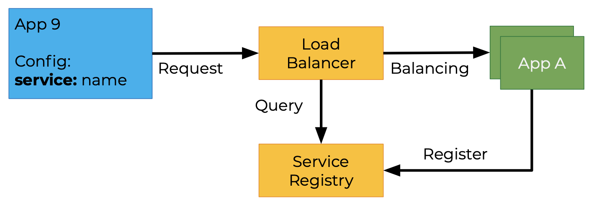

В конфигурации сервиса указывается имя нужного сервиса.

При появлении нового приложения в сети, оно регистрируется в service registry и когда клиент нуждается в этом сервисе, он посылает запрос к load balancer, который запрашивает service registry получая информацию о целевом сервисе, производит балансировку и отправляет запрос в сервис. Таким образом логику для поиска приложений переходит к балансировщику нагрузки, на серверную сторону.

Плюсы:

* клиент не связан с service registry

Минусы:

* балансировщик нагрузки становится узким место
* необходимо обеспечение высокой надёжности для балансировщика

Server-side discovery pattern поддерживается многими продуктами по умолчанию, например:

* AWS Elastic Load Balancer
* NGINX
* Kubernetes
* Traefik

### Регистрация сервисов

#### Самостоятельная регистрация

Приложение знает заранее, что в окружении существует Service Registry и в момент запуска первым делом, после внутренней инициализации, посылает запрос (со своим именем и адресом) с требованием зарегистрировать себя.

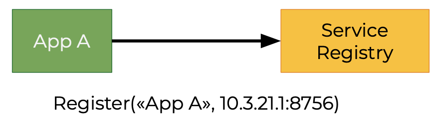

Плюсы:

* Простота реализации

Минусы:

* Жёсткая привязка к Service Registry

#### Отдельный компонент для регистрации

В данном случае появляется Register, он самостоятельно сканирует внутреннюю сеть в определённом диапазоне, либо получает сигналы от контролёра сервисов, который запускает новые сервисы или реплики, при получении сигнала Register обращается к приложению и проверяет может ли сервис начинать свою работу.

Плюсы:

* Клиент не привязан к service registry

Минусы:

* Дополнительный компонент для поддержки

### Использование service discovery

Какие требования предъявляются к сервисам, чтобы можно было использовать Service registry?

Сервис должен уметь сообщать с своей работоспособности и готовности к работе.

#### handshake/readiness

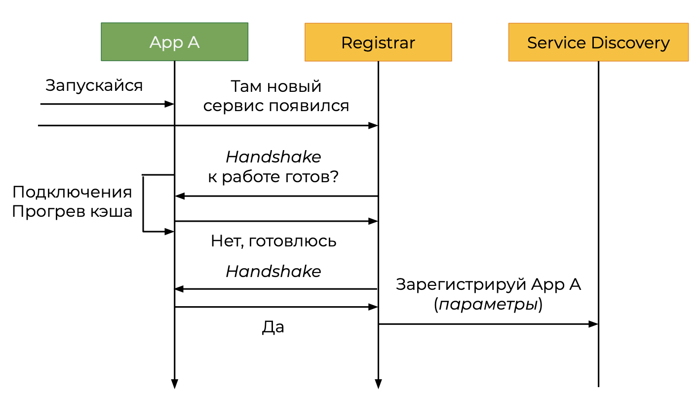

* Позволяет ограничить бизнес-запросы к сервису, пока он стартует

Представим ситуацию: некий внешний контроллер сервисов запускает сервис А и говорит ему "запускайся", при этом он сообщает регистру, что появился новый сервис. Сервису А требуется некоторое время, чтобы проверить свои подключения, сделать прогрев кеша. Регистр обращается к сервису с командой handshake, сервис может ему ответить что он только готовится и ещё не готов, через некоторое время регистр обращается к нему, пока сервис не ответит, что готов к работе. После этого регистр регистрирует сервис.

#### Healthcheck/Liveness

Следующее требование, которое предъявляется к сервисам это то что он жив, не только технически, когда показатели памяти, CPU, диска, показатели сети и т.п. находятся на приемлемом уровне но и запросы могут выполняться в приемлемое время. 

Регистр может спрашивать жив ли сервис, если сервис отвечает "да", то регистратор сообщает service discovery, что сервис в норме. Запрашиваемый сервис может ответить, что он жив но в данный момент сильно загружен, тогда регист сообщит service discovery, чтобы запросы не отправлялись на сервис. Если сервис не ответил на запрос регистра, что он жив, то регистр посылает запрос в service regisrty, чтобы он удил сервис.

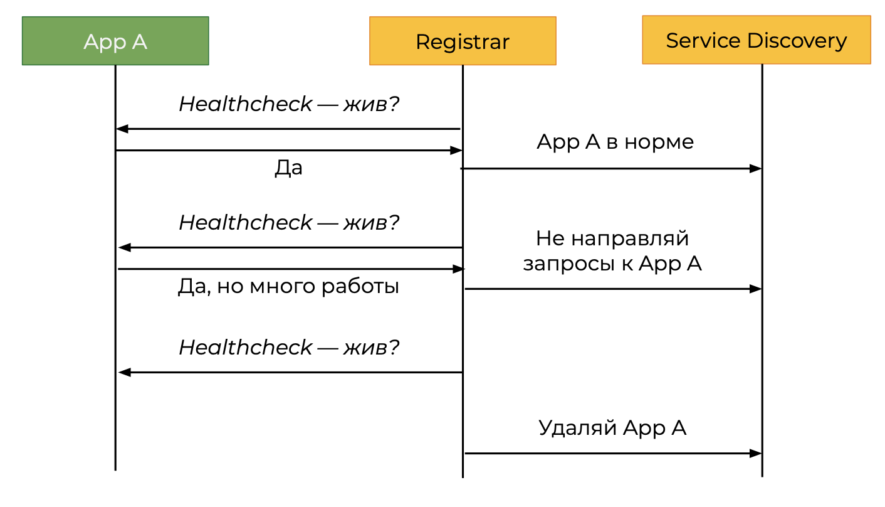

* Маркер, что сервис может отвечать на запросы
* Дополнительная информация об общем состоянии

#### Проблема инициализации

Также тут решается проблема инициализации.

Сервис может уйти в постоянную перегрузку, если время инициализации продолжительное (если не использовать handshake или healtchek):

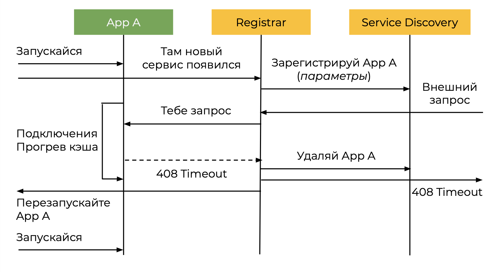

#### Выводы

* Использование Service Discovery позволяет динамично добавлять и удалять сервисы из сети автоматически
* Сервисы необходимо подготовить к использованию Service Discovery
* Существует несколько подходов к организации Service Discovery, решение необходимо принимать на основе требований к проекту
* Сервисы должны как минимум отвечать на Healtheck-запросы. Желательно поддерживать свой вариант handshake.

## Управление репликами

### Использование сервисов

Пусть будет 3 реплики и их отслеживает контроллер, реплики работают нормально.

На одном из сервисов (сервис 3) происходит сбой, для поддержания производительности происходит ребалансировка нагрузки, загрузка на сервис 3 уменьшается и увеличивается на сервис 1 и сервис 2. Сервис 3 может зависнуть, увеличивается нагрузка на сервис 1 и сервис 2, от этого они могут начать не справляться с нагрузкой, тогда контролер может решить создать новые экземпляры сервисов. Старые сервисы могут ещё подавать признаки жизни, но контролер переадресует всю нагрузку на новые сервисы. В итоге может получится ситуация когда будет множество нерабочих сервисов, но при этом они продолжать потреблять ресурсы, а контроллер продолжить плодить новые экземпляры.

### Шаблон Gevernor

Шаблон позволяет ограничивать количество и скорость потенциально опасных операций для ПО.

Реализация шаблона поддерживает состояние и время операций.

Различать "безопасные" и "опасные" операции:

* создание чего-либо — безопасно (до определённого придела)
* *удаление реплики — опасно
* удаление данных — опасно
* блокирование IP-адреса — опасно

Стоит помнить о:

* Если используются абсолютные значения min/max для реплик сервисов — указывать небольшой разброс
* Использовать cooldown-/delay-возможности сервисов, управдяющих автоматическим масштабированием
* При анализе метрик и уведомлений об увеличении реплик нужно учитывать человеческий фактор

### Выключение реплик

Включение реплик — часто более сложный процесс, чем создание:

* определение, какую именно реплику выключить
* отключение входящих запросов
* перенос состояния клиентов на работающие реплики
* обновление service catalog

### Выводы

* Предусматривайте замедление потенциально опасных операций, чтобы человек мог принять решение
* Опасные операции должно быть сложно производить
* Обратная петля связи: рост количества опасных операций должен вызывать всё большее замедление процесса

## Управление конфигурацией

### Проблема

Пусть есть сервис и у него присутствует конфигурация. Флоу работы с конфигурацией:

* Изменение файла конфигурации системы
* Перезапуске, чтобы изменение вступили в силу

Можно сделать так, чтобы сервис следил за изменением конфигурации, тогда перезапуск не потребуется.

Но возникает другая проблема: что делать, когда таких сервисов много? Здесь сразу несколько проблем:

* Ручное обновление не вариант, т.к. сервисов много
* Конфиги распределены между сервисами
* Обновление = перезапуск = downtime

Для решения можно использовать обновление конфигурации без перезапуска сервиса, т.е. мы будет следить либо за файлом конфигурации. Но в таком случае возникают новые проблемы:

* Согласованность конфигураций
* актуальность
* сложные иерархические конфигурации
* конфигурации в зависимости от окружения

### Управление конфигурацией

Service registry может помочь с возникшими проблемами, он может хранить конфигурации сервисов и высылать их, как только они обновятся (Long polling).

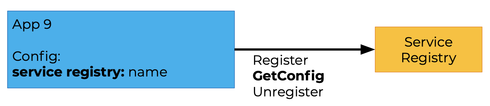

У сервиса, в таком случае, базовая конфигурация включает только информацию о себе и как добраться до service registry.

### Анатомия Service Discovery

В большинстве случаев service discovery — это распределённое хранилище, типа ключ-значение.

Современные реализации Service Discovery — это целый комплекс продуктов:

* Service Discovery & Registry
* Проверка работоспособности
* Безопасность
* Управление токенами доступа
* Динамическая балансировка
* Динамическая конфигурация

Представители:

* Zookeeper
* Consul
* etcd
* Kebernetes
* Lstio

### Версии и роутинг

Файл конфигурации по своей сути — это не только информация о том, как и куда подсоединиться чтобы забрать и отдать данные. В нём также можно указывать с какими данными возможно работать, указать версию продукта. 

С помощью конфигурации можно обрабатывать следующие сценарии: допустим есть клиент, который работает с контрактом версии 1 и есть несколько сервисов, которые могут обслужить этот контракт и тогда service registry и load balancer может перенаправлять на один из сервисов для обработки. Если обновить один из сервисов до версии 2, то клиент один уже не может быть перенаправлен на него, т.е. в конфигурации можно это указать и service registry и load balancer будут знать об этом.

* Управление версиями сервисов
* Правильный роутинг

### A/B-тестирование

A/B-тестирование позволяет оценить гипотезу, разделяя пользователей по двум версиям, и сравнить результаты на реальном окружении:

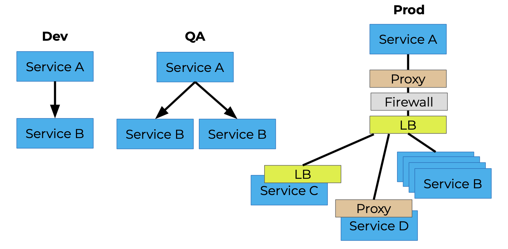

* Используется для маркетинговых целей
* Является практическим использованием Feature Toggling — когда разные клиенты идут к одним сервисам, но получают разные фичи.

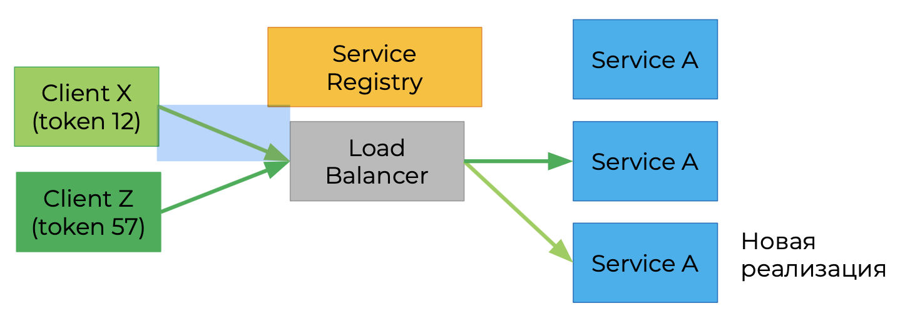

В таком случае конфиг должен содержать не только информацию о подключении но и что в приложении должно работать

#### Feature toggling

Или Feature flags

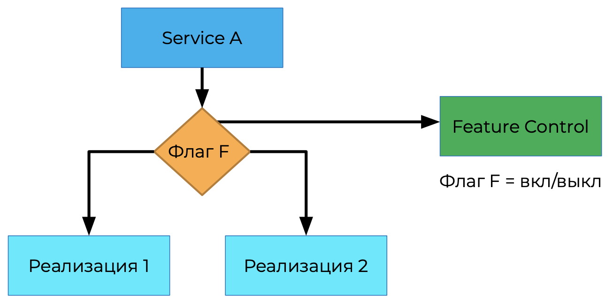

Используются для A/B-тестирования и "канареечных" релизов.

Feature toggling можно управлять в зависимости от окружения.

Можно выбирать стратегию перенаправления пользователей на те или иные фичи:

* Процент от общего числа пользователей
* Прямое указание пользователей
* Списки исключений

Представители:

* Большинство CI-/CD-инструментов
* Специализированные продукты

Примеры представителей:

* GitLab
* GitHub
* Togglz
* Optimizely

### Выводы

* Ручное управление и контроль конфигураций чреваты ошибками и требуют много времени
* Проектируйте сервисы, которые могут читать и применять конфиг без перезагрузки
* Специализированные инструменты заметно сокращают усилия по поддержанию согласованной конфигурации сервисов
* Конфигурация — это не только строки соединений, с их помощью можно управлять поведением приложений

## Шаблон chassis

### Проблема

Типичная реализация методов сервиса содержит много служебного кода.

С сервисами происходит такая же проблема.

При добавлении сервиса необходимо:

* Добавить зависимость
* Правильно настроить
* Прописать использование

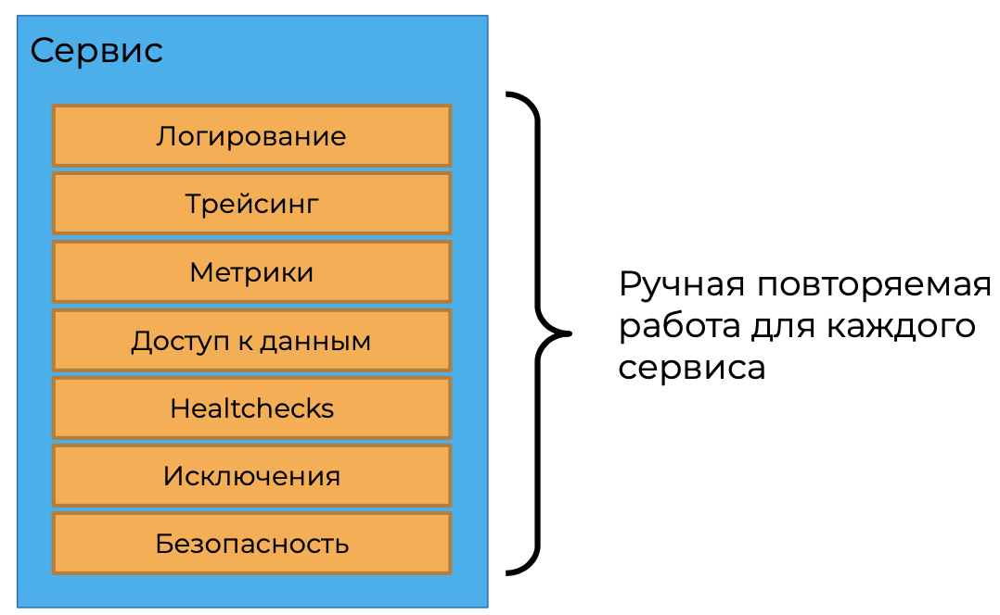

### Шаблон chassis

Позволяет сэкономить время и силы, используя стандартный набор уже настроенных инфраструктурных оснасток для сервиса.

Мотивация:

* Создание нового сервиса должно быть быстрым и простым
* Подключение сквозных (cross-cutting) модулей должно быть лёгким:
  * логирование
  * работа с исключениями
  * перехватчики
  * безопасность
  * общие сервисы для текущего окружения

Решением является использование (или создание и использование) легковесного фреймворка для конфигурации служебного сквозного кода.

Можно ограничиться общим загрузочным модулем.

По сути шаблон chassis представляет из себя слабосвязанный конструктор модулей, не связанный с бизнес-логикой:

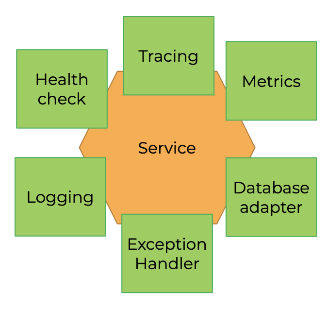

Он упрощает начальную конфигурацию сервисов.

#### Что выделять?

Инфраструктурные составляющие вашего кода, которые повторяются в большинстве сервисов, чаще всего это настройка.

Чего опасаться:

* делать методы "Подключи всё (конфиг)"
* делать реализацию слишком умной, включая туда автоматические методы
* делать конфиг-файлы слишком гибкими, так что составление такого файла уже можно назвать программированием

#### Плюсы

* Скорость и удобство создания сервисов с нуля
* Не надо снова и снова писать одни и те же тесты
* интеграции для базовых вещей

#### Минусы

* Модули для шаблонов надо писать/выбрать
* Модули надо поддерживать
* Модули ориентированы на типовые сценарии использования

### Шаблон sidecar

У приложения есть "внешний" помощник, которому делегируется задача, не связанная с основной бизнес-логикой.

Примеры применения:

* утилиты логирования
* агенты мониторинга 
* сервисы синхронизации
* "смотрители"

#### Сhassis vs Sidecar

| Chassis                                                      | Sidecar                                                      |
| ------------------------------------------------------------ | ------------------------------------------------------------ |
| Открытость к настройке и изменениям в самом приложении       | Закрытость реализации, можно пользоваться только открытым API |
| Функции дополнений вызываются приложением и контролируются им же | Относительная независимость функционирования                 |

### Шаблон Adapter

Шаблон Adapter в данном контексте нормализует с стандартизует телеметрию приложения в зависимости от потребителя.

Не требуется менять внутренний код приложения или сложность его настройки при смене потребителя.

### Шаблон Ambassador

Шаблон Ambassador является посредником между приложенияем и внешними сервисами.

Приложения всегда работает с localhost, что упрощает разработку. Окружение деплоя будет подкладывать нужного представителя во время создания сервиса.

### Выводы

* Шаблон Chassis может сэкономить время и силы для создания новых сервисов при соблюдении высокой гранулярности компонентов шаблона
* Не пишите фреймворк/bootstrap заранее, сделайте его на основе 4–5 уже созданных сервисов
* Для микросервисной архитектуры существует шаблон Sidecar, а для решения похожих проблем используются его вариации

## Выводы

* Процесс ввода и вывода сервисов из работы становится нетривиальной задачей, если счёт сервисов пошёл на десятки. Service Discovery позволяет решить эту задачу
* Контроль конфигураций сервисов можно осуществлять централизованно
* Контроль конфигураций — это не только строки подключений, но и возможность гибко управлять предоставляемым функционалом
* Активная разработка новых сервисов может быть облегчена и стандартизирована с помощью шаблона Chassis
