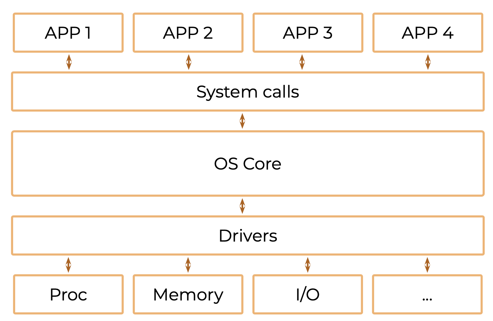
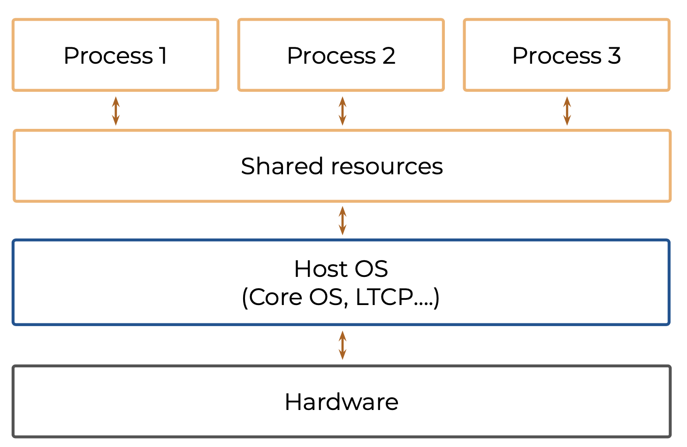
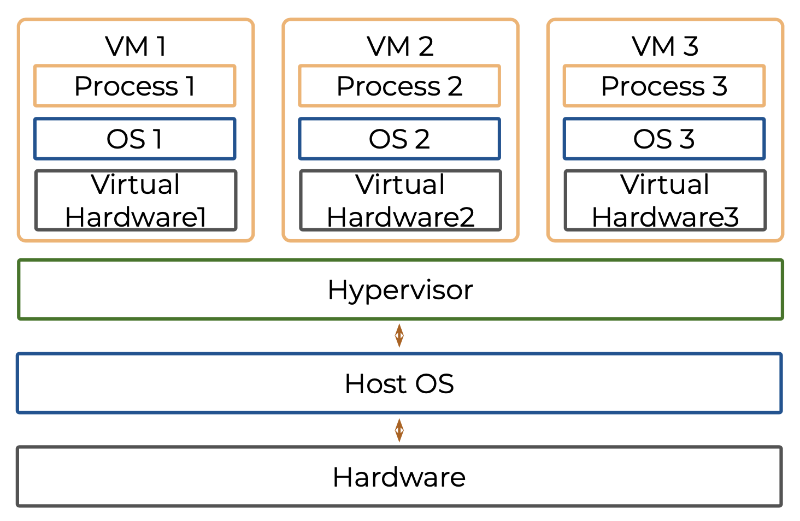
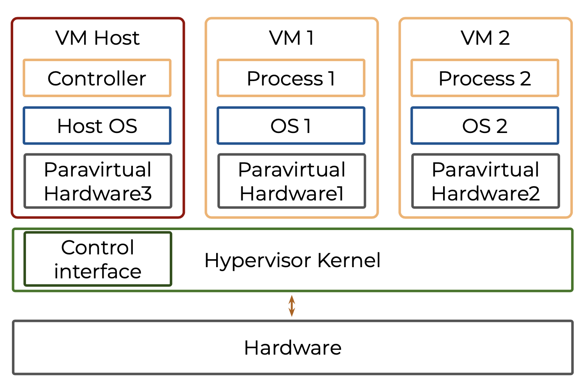
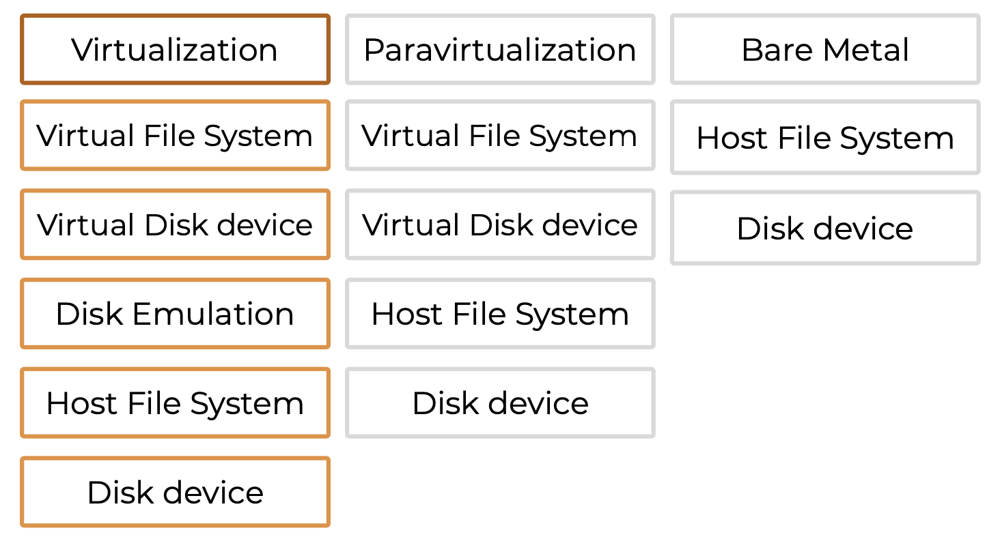
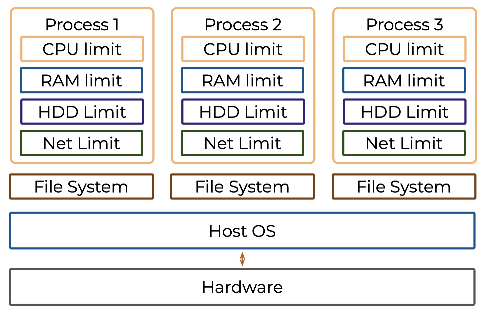
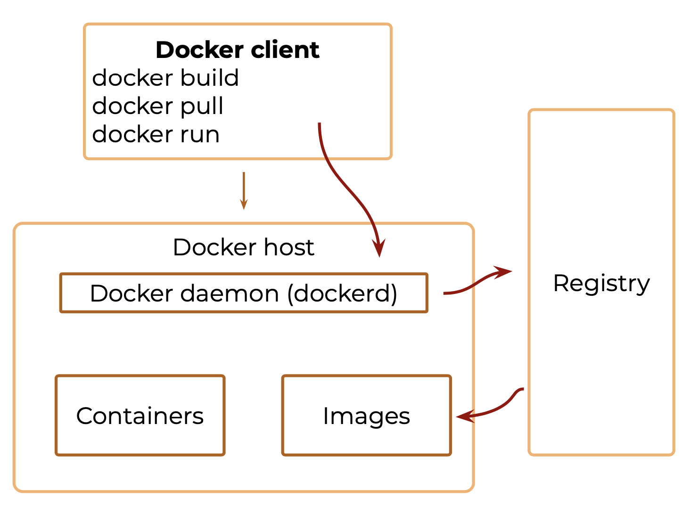
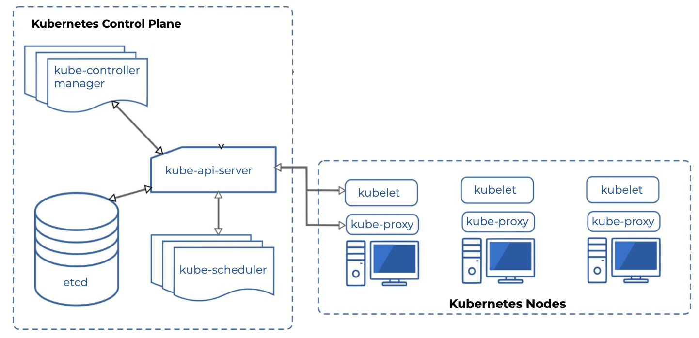
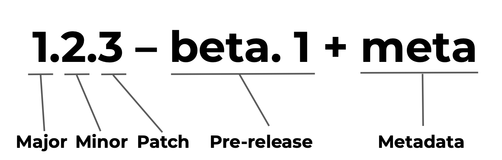

# Инфраструктура и среда исполнения

## Обзор

### Работа операционной системы

**Kernel space** — адресное пространство ядра ОС, в котором процессы имеют привилегированный доступ к ресурсам компьютера и другим процессам.

Задачи которые выполняются в kernel space наиболее приоритетные, они выполняются в первую очередь, а затем выполняются пользовательские задачи.

**User space** — адресное пространство, отведённое для пользовательских процессов (приложений), то есть не имеющих привилегированный доступ к ресурсам.

В user space находятся приложения, которые запрашивают ресурсы на своё выполнение у операционной системы.

Например, есть некое приложение занимающиеся обработкой заказа, у него есть какое-то количество оперативной памяти, какой-то процент CPU и дискового пространства. Приложение работает хорошо, т.к. ресурсов ему хватает. Запускаем ещё одно приложение, занимающее отчётами, ему тоже нужны эти ресурсы и операционная система выделяет их. Пока ресурсов хватает приложения работают хорошо, но когда ресурсы кончаются приложения начинают конфликтовать, отсюда возникают зависания. ОС при этом постоянно переключается между процессами для их выполнения.

### Bare Metal

Bare metal — приложение, которое установлено непосредственно на ОС, которая развёрнута на железных серверах. Это тот случай, когда отсутствует какой-либо слой виртуализации.

В современном мире часто бывает когда какие-либо оркестраторы (kubernetes, openShift) ставят Bare metal, это значит, что они полностью сами управляют ресурсами тех серверов которые им предоставлены.

### Виртуализация

Виртуализация — деление ресурсов сервера на виртуальные машины, для того чтобы каждое приложение работало изолированно в этой виртуальной машине и не могло воздействовать на другое приложение, которое работает в соседней виртуальной машине.

Для обеспечения работы виртуальных машин необходимо сэмулировать работу виртуальных машин к которым они обращаются, для этого есть слой гипервизора, который по сути получает запрос от виртуальной машины, имитирует работу каких-то драйверов и в это время отправляется за этим же запросом к ОС, которая использует настоящие драйвера, после этого ОС отдаёт запрос в гипервизор, а он возвращает в виртуальную машину.

Проблема в том, что дополнительные запросы гипервизора занимают ресурсы, поэтому вся виртуализация достаточно трудоёмка и накладывает дополнительные затраты.

### Паравиртуализация

В паравиртуализации виртуальная машина ставит bare metal и хостовая ОС как таковая отсутствует, при этом сами виртуальные машины обращаются к гипервизору а роль, которую раньше выполняла хостовая ОС, берёт на себе одна из виртуалок которая управляет гипервизором и она управляет гипервизором, который управляет ресурсами. 

В этом случае ресурсы расходуемые на гипервизор значительно меньше.

### Запись на жесткий диск

#### Bare metal

1. Вызов хостовой ОС
2. Запись на диск

## Паравиртуализация

1. Вызов записи виртуального файла
2. Вызов виртуального диск сервиса, который имитирует виртуалка
3. Вызов ОС, которая стоит рядом с виртуалками
4. Вызов гипервизора
5. Запись на диск

#### Виртуализация

1. Вызов записи виртуального файла
2. Вызов виртуального диска
3. Гипервизор перехватывает запись на виртуальный диск и эмулирует запись на настоящий
4. Запрос в хостовую ОС
5. Запись на диск

Таким образом видно, что bare metal самый оптимальный способ, виртуализация самый накладный, а паравиртуализация находится посередине.

### Unix systems

* **Control group (cgroup)** — группа процессов, для которой механизмами ядра наложена изоляция и установлены ограничения на вычислительные ресурсы (процессорные, сетевые, ресурсы памяти, ресурсы ввода-вывода)
* **Namespaces** — это функция ядра Linux, позволяющая изолировать и виртуализировать глобальные системные ресурсы множества процессов (ID процессов, имена хостов, ID пользователей, доступ к сетям, межпроцессное взаимодействие и файловые системы)

#### Resource sharing

Есть некая ОС, которая стоит непосредственно на железе (хост ОС), при этом есть процессы, запущенные на этой ОС и их можно лимитировать по ресурсам, это позволяет запускать множество разных процессов, которые будут изолированные друг от друга по потребляемым ресурсам и в случае, когда они будут потреблять больше заявленного лимита они не будут пересекаться с другими процессами и воздействовать на них. Это необходимо для построения контейнеров.

##### Работа файловой системы

Для работы файловой системы используется overlay filesystem.

В ней есть несколько слоёв с которыми нужно работать, в нашем случае есть 3 слоя, самый нижний — это слой предоставляемый ОС, следующий — слой который может хранить какие-то изменения.

Если нужно перезаписать файл a из ОС, то на среднем уровне создаётся ещё один файл, который хранит информацию файла a которую нужно записать, оригинальный файл остаётся на нижнем уровне. После того, как файл нужно прочитать у нас хранится метка с какого слоя нужно прочитать файл (в нашем случае средний). Верхний слой агрегирует те изменения, которые произошли с файлами.

Если нужно удалить файл то, в верхнем слое ставится метка, что файл удалён, и при попытке чтения файла этот слой его не отдаст. При этом сам файл остаётся на нижнем уровне.

##### Контейнеры

Существуют такие контейнеры как:

* LXC
* Rocket
* **Docker** — наиболее популярная
* OpenVZ
* Yandex.Porto

Плюсы:

* Изоляция и управление процессами, хостами, доступ к сети и т.д.
* Лимит для сети, CPU, RAM, диска

Минусы:

* Отсутвие управление модулями ядра
* Сложности с виртуализацией VPN и видеокарты
* Сильная связь с Host OS

### Docker

Есть некий клиент, который позволяет пользоваться докером и есть докер хост, на котором запущен докер демон, который управляет всеми процессами, которые происходят в докере.

Если пишется какой-то докерфайл, а затем делается билд, то всё это берётся демоном, собирается, кладётся в registry и происходит запуск.

Работает это так: после того как собран докерфайл, необходимо собрать image. Докер демон или собирает этот image с нуля, если это происходит в первый раз, и положить его в Registry или готовый image скачивается из интернета и кладётся в registry. Когда image лежит в registry демону необходимо накрутить на него лимиты и запустить — этот процесс и создёт контейнер, который затем можно использовать.

### Выбор

* Важно выбирать тип использования ваших ресурсов исходя из:
  - требований по доступности
  - требований по времени восстановления
  - требований по времени масштабирования

## Установка приложений CI/CD

### Этапы жизни приложения

* Проектирование
* Разработка
* Функциональное тестирование
* Сборка поставки
* Smoke testing
* Полное тестирование (regression testing)
* Установка на production
* Эксплуатация

### CI/CD

- **CI (Continuous Integration)** — обеспечивает последовательный и автоматизированный способ сборки, упаковки и тестирования приложений
- **CD (Continuous Delivery)** — начинается там, где заканчивается непрерывная интеграция. Она автоматизирует развёртывание приложений в различные окружения

#### CI

CI начинается в момент когда разработчик отправляет свой код на сервер версионного контроля, после этого может происходить следующее:

* Запускается статичные анализ
* Запускаются юнит тесты
* Запускаются модульные тесты

После проверки создаётся артефакт, это может быть архив приложения которое нужно установить куда-нибудь на сервер, контейнер или виртуальная машина.

После сборки необходимо проверить артефакт в связке с другими сервисами — это интеграционное тестирование. Суть в том чтобы проверить, что приложение не ломается при взаимодействии с другими сервисами и приложение не ломает эти сервисы. После этого отправляется уведомление разработчику, что тестирование пройдено и можно переходить к следующему этапу.

Все эти операции нужно производить часто и быстро, поэтому они автоматизированны.

#### CD

После CI начинается CD. После создания артефакта и его проверки необходимо установить его на какую-то среду, это может быть PreProd на котором проводится регресионное тестирование, чтобы убедится что приложение работает хорошо. После этого этот же артефакт отправляют на Prod.

#### Установка на Production

* Установка приложения
* Установка контейнера с приложением
* Установка виртуальной машины с приложением

##### Установка приложения

По сути есть артефакт, который необходимо поставить на сервер, для этого нужно заменить существующее приложение уже работающее на сервере.

При установке приложение необходимо помнить, что на сервере уже имеются какие-то:

* ENV-переменные
* Библиотеки
* Настройки OS
* Драйверы и т.д.

Также нужно помнить, что т.к. в этом случае есть один сервер, то на нём работает множество приложений, которые конкурирует за одни и те же ресурсы, если одно из них запросит больше ресурсов, то, возможно, другим не хватит.

##### Установка виртуальной машины с приложением

Когда артефакт является целой виртуальной машиной с приложением.

В этом случае сами виртуалка приносит:

* ENV-переменные
* Библиотеки
* Настройки OS
* Настройки сети
* Драйверы

##### Установка контейнера с приложением

Контейнер приносит с собой:

* ENV-переменные
* Библиотеки
* Настройки OS
* Настройки сети

Необходимо помнить. что в данном случае невозможно использование драйверов и каких-то модулей ядра.

#### Что выбрать?

**Установка приложения на сервер**

- Простота установки
- Отсутствие гибкости
- Нет защиты от проблем с сервером

**Установка приложения на сервер**

- Вам важно, чтобы ваше приложение имело высокую степень доступности
- Для этого нужно больше серверов
- Необходима отдельная команда поддержки инфраструктуры

**Использование Docker-контейнеров**

- Разворачиваете своё облако
- Восстанавливаетесь из резерва

## Оркестрация

## Сбой в работе сервера

При сбое в работе сервера в котором запущено несколько виртуалок с приложениями.

Disaster recovery plan — план восстановление сервера.

#### Восстановление v.1 DRP

В случае когда используется bare metal, когда нет большого сервера и есть только одно приложение, которое крутится на сервере необходимо:

* Запустить Host OS
* Произвести настройки Host os
* Установить приложение
* Произвести настройку приложения

#### Восстановление v.2 DRP

Если используется сервер на котором запущено множество виртуалок, то необходимо:

* запустить Host OS
* произвести настройки Host OS
* установить платформу виртуализации
* создать виртуалки/взять готовую (если есть)
* установить приложение
* произвести настройку приложения

Как это оптимизировать?

### Оркестрация

Обычно используется несколько серверов в разных Центрах Обработки Данных (ЦОД), которые предоставляют какой-то сервер, который можно использовать. На этом сервере установлено какое-то количество виртуалок для разворачиваяния приложений. Помимо того, что ЦОД разные сервера, необходимо ещё геораспределять их. Чтобы в случаи аварии в одном регионе (например, отключения электричества в дата-центре) другой регион остался и все приложения переехали в другой ЦОД и запустились там. Для облегчения всего этого процесса используются оркестраторы.

Работа с оркестрацией выглядит так: есть докер-контейнеры, развернутые в виртуалках в разных ЦОДах, оркестратор управляет именно ими.

Например, есть контейнер, который работает в одной из ЦОД, на нём запущено приложение, на него идёт клиентский трафик, который обрабатывается этим приложением и делается какая-то бизнес-логика. Что-то идёт не так и ЦОД с приложением отказывает, в этом случае оркестратор начинает постепенную миграцию приложения в соседний ЦОД, при этом сама доступность к отказавшему ЦОДу ему не нужна, т.к. сам контейнер хранился в определённом regestry, который сохраняет image контейнера. Можно настроить оркестратор так, чтобы разные экземпляры одного и того же приложения автоматически хранились в каждом ЦОД, тогда при сбое одного из ЦОД оркестратору не придётся запускать его в другом ЦОД, т.к. он уже там работает, нужно просто перебалансировать трафик.

Для оркестрации нужно:

* Отдельные люди, которые будут заниматься настройкой
* Выстроенный и зрелый процесс для CI/CD
* Изменения в культуре разработки
* Научиться отделять логикку инфраструктуры от бизнес-логики
* Дополнительные мощности ЦОДов

#### Оркестраторы на рынке

* **Docker Swarm**
  - Простота установки
  - Идёт из «коробки»
  - Хорошо подходит для небольших проектов
  - Большое комьюнити
  - При большом количестве контейнеров имеются проблемы с сетью

* **Kubernetes**
  * Гибкость настройки
  * Хорошая масштабируемость приложений и самого кластера
  * Высокая отказоустойчивость для больших проектов
  * Сложная настройка, которая требует много времени и знаний
  * Достаточно комфортная поддержка
  * Очень большое комьюнити
  * Облачные провайдеры предоставляют K8s как сервис
* **OpenShift**
  - Основан на Kubernetes
  - Строгая политика безопасности, которая не позволяет запускать контейнеры от root пользователя
  - Есть инструменты для упрощения интеграции с Active Directory
  - Встроенный конвейер CI/CD и т. д.
* **Apache Mesos**
  - Небольшое комьюнити
  - Нехватка специалистов
  - Сложность в поддержке
  - Постепенно выходит из эксплуатации

#### Работа Kubernetes

Можно разделить ноды kubernetes не две составляющие:

* Мастер ноды — отвечают за управление всем кластером kubernetes и включают в себя server API.
  * Server API (kube-api-server) — это REST API, через который осуществляется работа с etcd (хранилище всех конфигов kubernetes).
  * kube-scheduler — отвечает за управление процессом создания подов и отвечает за место их размещения
  * kube—controller-manager — контролирует узлы нод, реагирует на их сбои, отвечает за правильное количество сервисов в репликации, контролирует конечные точки сервером, связывает непосредственно поды и эндпоинты развёрнутых сервисов, отвечает за аутентификационные и авторизационные токены
* Дата ноды — ноды на который развёрнуты приложения
  * kubelet — есть на каждом серверов, отвечает за то чтобы контейнеры на сервере всегда были развёрнуты, и если бы они остановились их бы перезапустили
  * kube-proxy — отвечает за сетевые правила, которые прописываются чтобы ноды общались с подами и сервисами и всё это взаимосвязывалось в рамках kubernetes. Сам kube-proxy использует уровень фильтрации пакетов ОС, если ему это доступно, иначе пропускает запросы через себя.
* Под — сущность в которой развернуты контейнеры, которые отвечают за приложения. В одном поде может быть несколько контейнеров, но по хорошему не должно быть больше одного отвечающего за приложение или же тех приложений, которые необходимы для работы бизнес-логики приложения, возможно это будет контейнер самого приложения и контейнер рядом, занимающийся конфигами этого приложения, но так чтобы этого было не больше одной доменной модели, которую можно описать в рамках бизес-логики. При этом в самом поде присутствует ещё системный контейнер, отвечающий за дополнительную настройку сетевых файлов.

## Стратегия развёртывания

### Обновление сервисов

Есть два инстанса одного и того же сервиса первой версии, которые работаю с БД, при этом БД тоже находится в определённом состоянии первой версии. Необходимо обновить этот сервис.

Если обновить сам сервис до версии 2, то и БД произойдёт миграция до версии 2, но при этом старый сервис версии один продолжает работать с этой БД. При этом необходимо учитывать, чтобы те изменения которые была сделаны в БД новой версией сервиса подразумевали бы обратную совместимость, что сервис 1й версии продолжал бы работать с БД.

### Версионирование Semver

Присвоение новое версии сервису можно описать некоторыми правилами:

* Major — показывает, что новая версия обратно не совместима со старой
* Minor —изменения которые добавляют какой-то функционал в сервис, но не ломают обратной совместимости
* Patch —исправление багов, рефакторинг т.е. те изменения которые не приносит нового функционала в сервис
* Pre-release —(необязательно) обозначение стадии релиза, например alpha, beta
* Metadata — (необязательно) различная метаинформация о релизе

### Стратегии деплоя приложений

Нужны для:

* Поэтапный выкат приложений
* Переход к следующему этапу только при успешном завершении предыдущего
* В случае отрицательных эффектов необходимо задеть как можно меньшую аудиторию

Ниже рассмотренные стратегии деплоя

#### Rolling (постепенный)

Есть балансировщик и два инстанса сервиса первой версии, они работают и трафик идёт на них. Поднимаем новый инстанс со второй версией сервиса и постепенно перекидываем на него трафик. При этом у сервиса должно быть реализовано:

* health checking который показывает что сервис стартовал
* Readness endpoint — ендпоинт, который говорит, о том что сервис уже может принимать пользовательский трафик, т.е. сервис не только поднялся но и подключился к БД, каким-то сервисам, для считывания данных и все необходимые внешние зависимости уже доступны

После этого постепенно происходит переходи трафика со старой версии, затем выводится второй инстанс с новой версией и трафик окончательно переходит на новую версию.

#### Recreate (повторное создание)

В этом случае по сути создаются новые инстансы сервиса без постепенного перехода. Возможно, это тот случай, когда изменения в БД не могут быть обратно совместимы и/или эндпоинты сервиса.

#### Blue/Green (сине-зелённые развёртывания)

 Схоже с rolling, но есть различия.

Поднимаются новые версии сервиса, но них не отправляется пользовательский трафик, а они доступны только тестировщикам, которые могут к ним подключится и проверить. После проверки тестировщиками происходит переключение трафика на них и постепенная остановка старых версий.

#### Canary (канареечные развёртывания)

По сути rolling но с некоторыми улучшениями. В этом случае мы управляем процентами трафика для новой версии.

Эффективно когда нужно выкатить новые изменения, но нужно затронуть меньшее количество пользователей.

Например, при старте новое версии на неё пересылается 5% трафика, если всё идёт хорошо, то стартуем ещё один инстанс и постепенно повышаем количество процентов, пересылаемых на новые версии. Старые версии постепенно выводятся из использования.

#### Dark (скрытые), или A/B-развёртывания

Чаще используется для проверки каких-то гипотез, обычно для доработки интерфейса, который предоставляется пользователю.

В этом случае развёртываются инстансы с новыми версиями и разделяется трафик между старой и новой, здесь важно помечать пользователей которые ушли на новую и старую версию, чтобы потом можно было проанализировать этот трафик и выяснить какая из версий лучше. Если новая версия выиграла, то старая версия заменяется новой иначе отключается новая версия.