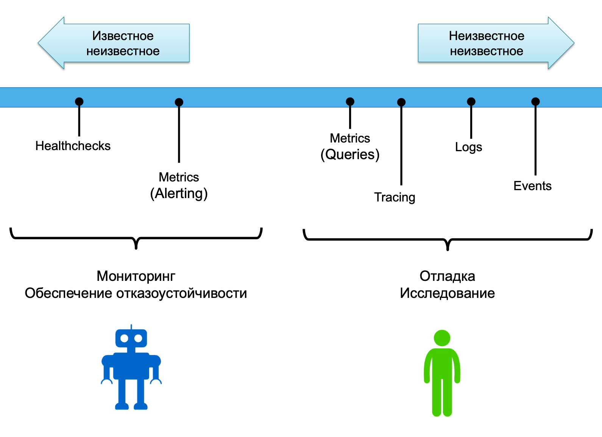
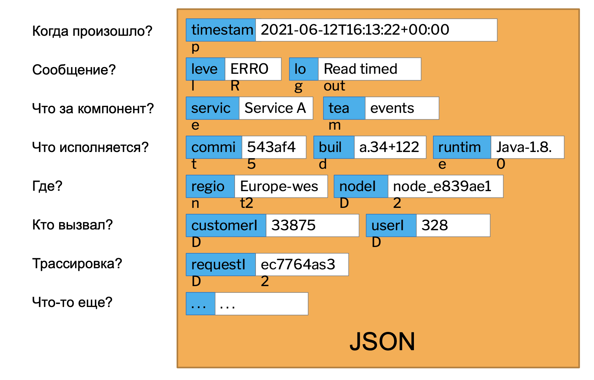
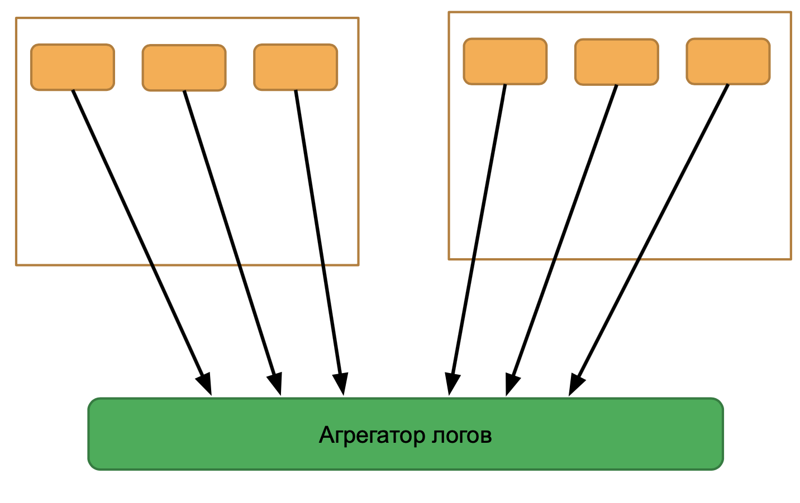
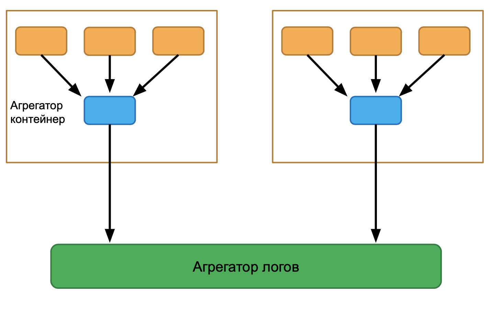
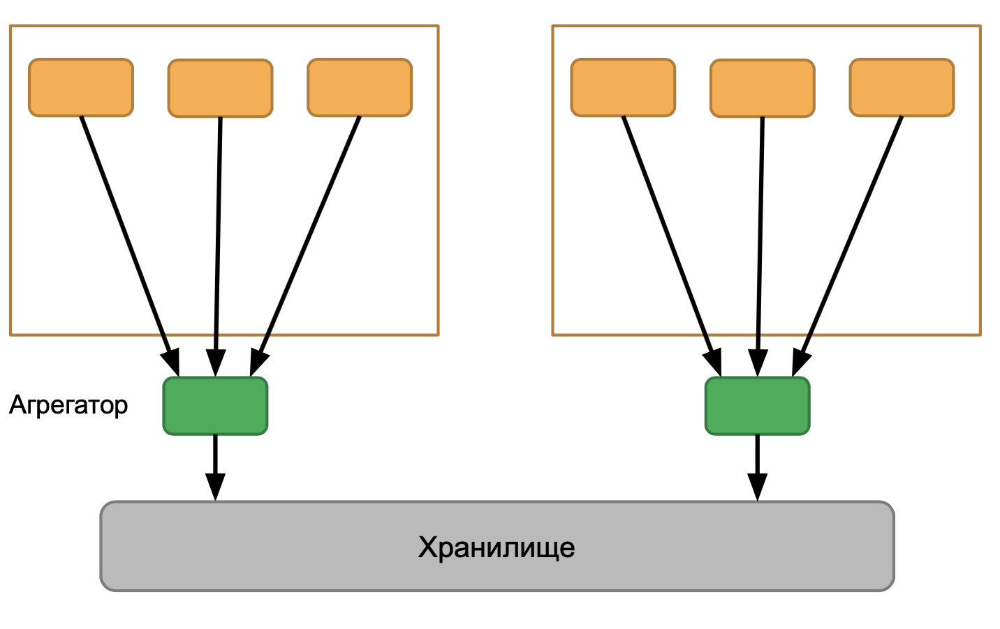
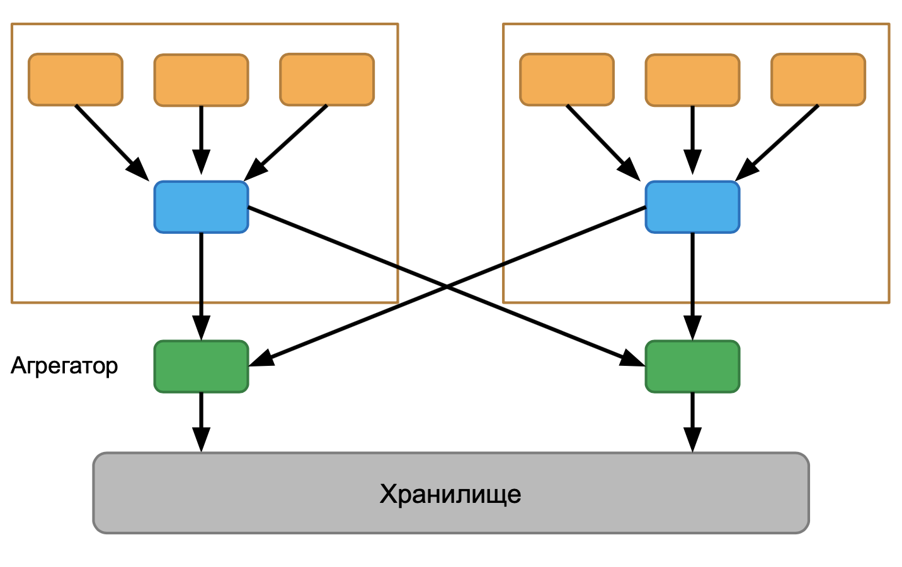
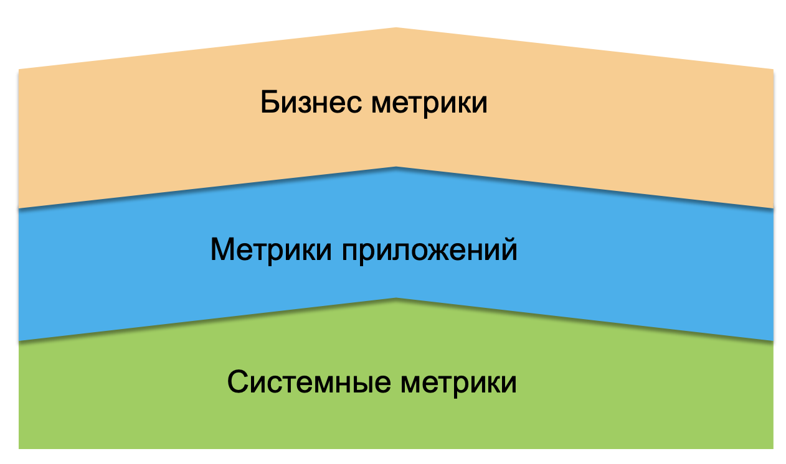
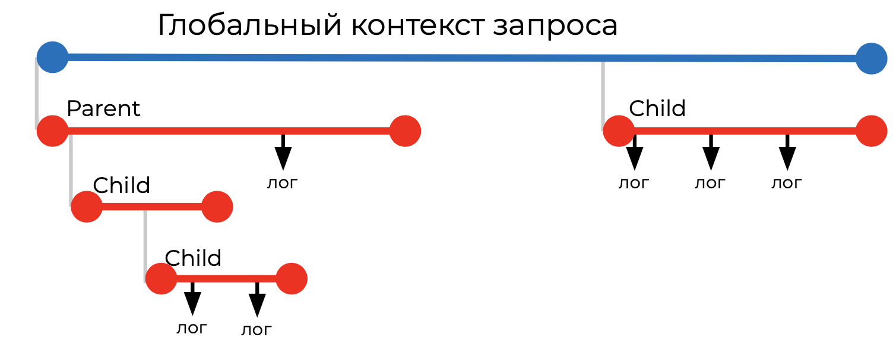
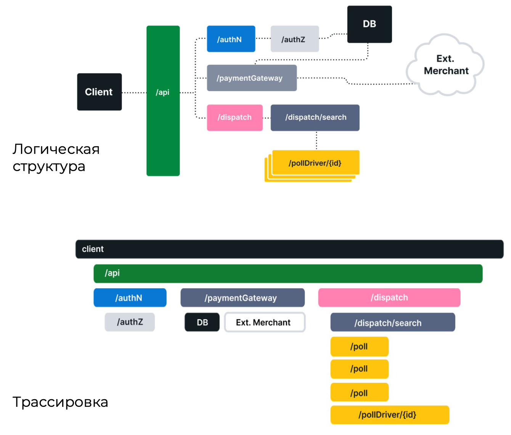
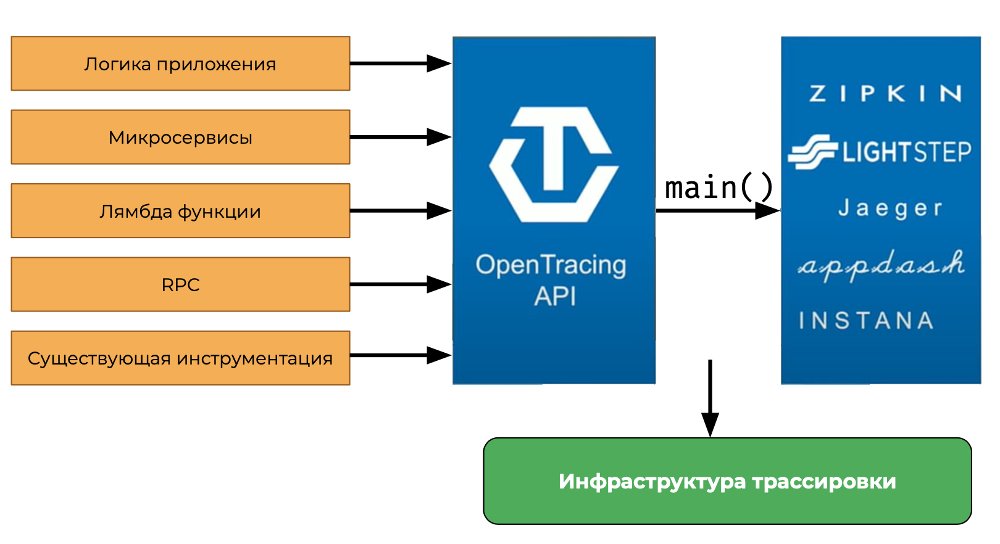

# Observability (наблюдаемость системы)

## Проблема

Релиз — это только начало пути. Нет систем без ошибок, всегда нужно быть готовым к восстановлению системы. Но как отследить проблемы с системой? Как это сделать для распределённых систем?

Мониторинг можно применить, только если мы заранее предполагаем причину падения приложения. Что делать для остальных случаев?

Наблюдаемость — измерение того, как хорошо можно вычислить внутреннее состояние системы зная только как система отвечает.

### Золотой сингал

Совокупность логов, трассировки и метрик, показывающих понять что пошло не так.

Есть различные трактовки этого золотого сигнала:

Google:

* Latency, Traffic, Errors, Saturation

Use Method

* Utilization, Saturation, Errors

**RED** method:

* Rate, Errors, and Duration

### Наблюдаемость

Наблюдаемость — свойство системы, а не инструмент. Она включает в себя совокупности инструментов:

* Логи, мониторинг, трассировка
* Метрики и время
* Охватывает все:
  * Приложения
  * Сервисы
  * Практики работы
* Healthchecks

Характеристика наблюдаемости необходима в первую очередь для людей (разработчиков, пользователей), с ней мы получаем:

* Обнаружение — набор графиков, уведомлений для важных вещей
* Визуализация — помощь операторам в исследовании и отслеживании трендов, понимание данных
* Инструменты — OSS, поставщики, внутренняя разработка

### Глобальные архитектурные вопросы логирования

* Каковы тенденции скорости поступления данных?
* Как долго необходимо хранить логи?
* Как регуляторы повлияют на аналитику логов?
* Какие источники и форматы данных используются?
* Какую роль будут играть меняющиеся реалии бизнеса?
* Каковы требования к постоянным запросам?
* Как решаются проблемы управления данными?
* Как происходит преобразование данных?
* Как защищать и обеспечивать высокую доступность логов?

### Выводы

* Наблюдаемость системы — это не тоже самое, что и мониторинг
* Наблюдаемость — это характеристика системы, включающая инструменты и практики разработки
* Наблюдаемость строится для людей, чтобы помочь понять поведение системы в непредвиденной ситуации

## Работа с логированием 

Анализ логов начинается со:

* Сбора
* Объединения
* Подготовки логов по всему предприятию

Индексирование, очистка и нормализация наборов данных играют свою роль, и все эти задачи должны выполняться с высокой скоростью и эффективностью

Весь этот жизненный цикл и системы, которые его выполняют, должны быть спроектированы таким образом, чтобы быть масштабируемыми, гибкими и безопасными в условиях требований которые будут продолжать развиваться в будущем.

### Единый источник

Если работа идёт с монолитом то проблемы с единым источником для логов не возникает, сам монолит высылает всё в согласованном виде.

В целом никаких проблем в монолите при работе с логами не возникает.

### Цель логирования

Глобально цель логирования состоит в:

* Анализе аномалий
* Отслеживание связей
* Отслеживание тенденций (трендов)
* Эффективная отчётность и визуализация результатов логирования

### Проблема

При работе с мнолитом источником данных является сам монолит и проблем с логированием не возникает. Однако, в случае распределённых систем, когда есть множество сервисов и каждый со своими логами, собрать все логи вместе достаточно трудно.

Помимо самих сервисов источниками может являться сеть, ОС, компоненты безопасности и т.д.

Как получить пользу от распределённого логирования?

* Централизованное логирование — нужно иметь место куда все сервисы и компоненты будут пересылать свои логи
* Возможно поиска — желательно иметь возможно поиска по всем логам, ещё лучше если его можно происходит по конкретным элементам
* Корреляция — необходима корреляция между логами, чтобы можно было найти взаимосвязь между сервисами, компонентами

Основные проблемы логирования распределённых систем:

* Произвольное составление форматов логов. Это можно исправить согласовав формат для логирования, однако это может быть сложно если уже имеется множество систем, поэтому этот момент стоит учитывать изначально при разработке или при крупном рефакторинге системы.
* Простой текстовый файл.
* Составление парсинга для разных форматов
* Изменение формата нарушает системы обработки логов
* Запись логирования в несколько строк — считается абсолютным злом в логировании, его стоит избегать. Обычно составляя парсеры для логирования предпологается что данные пишутся одной строкой. Если запись идёт в несколько строк для красоты, то нужно заранее убедится что этот лог нужен только для чтения людей без автоматизации.

### Структурные логи

Позволяют исследовать проблемы с более высокой точностью, выделяя наиболее важные моменты.

### Общий подход

Логи могут поступать в структурированных и не структурированных форматах, всё зависит от того какой сервис это посылает. Неструктурированные данные могут дополнительно обрабатывать и преобразоваться в структурированные. 

Агент узла коллектора, который находится в контейнере, может передавать структурированные данные в режиме реального времени или микропакетами на агрегатор. Задача агрегатор объединить несколько небольших потоков даных в один большой, который легче обрабатывать и вводить в хранилище, где он сохраняется для дальнейшего использования.

Т.е. общим подходом для сбора логов является использование агрегатора и дальнейшее пересылка в хранилище, где уже можно настроить политики работы с данными: сколько они будут храниться и как использоваться.

#### Шаблоны построения коммуникации

##### Прямая запись

Наиболее простое решение это запись напрямую в агрегатор логов. В этом случае сервисы напрямую обращаются к нему и записывают логики, однако в таком решении есть такие проблемы:

* Фиксированный адрес агрегатора логов — т.е. адрес фиксирован, при его изменении нужно заново настраивать каждый отдельный коллектор, каждый сервис
* Множество соединений с агрегатором логов — может вызывать большую нагрузку на сеть
* Высокая нагрузка на агрегатор

Можно вручную увеличивать количество агрегаторов и управлять адресами, на ранних стадиях жизни приложения

##### Агрегатор рядом с сервисами

При таком подходе агрегатор находится рядом с сервисами внутри узла с сервисами и может более эффективно это обрабатывать, а затем высылать данные главному агрегатору.

При таком подходе получается:

* Меньше соединений с агрегатором
* Уменьшение нагрузки на агрегатор
* Меньше настроек для сервисов
* Более гибкая конфигурация

Основной минусы:

* Большее потребление ресурсов
* Дополнительный компонент которым нужно управлять, следить, обновлять, устанавливать

В основном используется, когда логи передаются через общие сети интернет.

В не зависимости от того агрегируем ли мы на стороне источника, мы также можем выбрать отдельные агрегаторы на стороне назначения, т.е. вместо одного агрегатора использовать несколько по группам компонентов.

Плюсы:

* Отказ от агрегации на стороне назначения ограничивает количество узлов, что приводит к более простой конфигурации.

Минусы:

- Изменения на стороне назначения влияет на сторону источника, это такая же проблема как в прямой записи, т.е. если адрес агрегатора меняется, то его нужно поменять в связанных с ним компонентах.
- Меньшая производительность или высокого количества соединений и данных
- Невозможно масштабирование агрегаторов без дополнительных трюков

##### Агрегатор на двух сторонах

Наиболее оптимальная конфигурация в случае больших систем.

Минусы:

* Необходимо больше ресурсов для работы
* Сложность конфигурации

Плюсы:

* Возможность независимых изменений на обеих сторонах
* Улучшенная производительность и отказоустойчивость

### Инструменты

* Elastic stack
* Grafana stack
* Облачные решения APM - Azure, AWS

### Выводы

- Используйте структурные логи, если есть возможность
- Используйте сайдкары для парсинга простых логов перед высылкой
- Выбирайте шаблон доставки логов в зависимости от сложности вашей системы
- Планируйте структуру логов заранее, создайте свой шаблон. Используйте служебную информацию о сервисах и запросах.

## Метрики

Понимание текущего состояния инфраструктуры и систем позволяет управлять и планировать состоянием дел.

Метрики, мониторинг и оповещения — это взаимосвязанные понятия, которые вместе составляют основу системы мониторинга, они способны обеспечить видимость здоровья систем, помочь понять тенденции в использовании или поведении, а также понять влияние вносимых изменений. Если показатели выходят за приделы ожидаемых диапазонов, эти системы могут отправлять уведомления, чтобы оператор взглянул на ситуацию, а затем могут помочь получить информацию для выявление возможных причин.

Метрика — это необработанное измерение использования ресурса или поведения, которое наблюдается в системе.

Инструментария — сбор и отображение метрик.

### Логи vs Метрики

| Логи                                                         | Метрики                                             |
| ------------------------------------------------------------ | --------------------------------------------------- |
| Менее структурированные, могут быть в любой произвольной форме | Более структурированные, имеют только одно значение |
| Подробное описание                                           | Численные значения                                  |
| Генерируются событиями                                       | Собираются на регулярной основе                     |
| Используются для анализа проблем                             | Используются для анализа трендов                    |
| `{"app_name": "foo", "login_latency_ms": 5}`                 | `app.logic_latency_ms=5`                            |

### Оповещения

На основе метрик можно настроить оповещения, которые будут срабатывать на основе повышения:

* Константного значения
* Процента от исторических показателей

Основная задача оповещения привлечь внимание человека к текущему состоянию системы. Также оповещения могут использоваться для задействования автоматических средства реагирования, а не только для оповещения операторов.

### Что отслеживать?

* **Метрики железа\хоста**
  * ЦП
  * Оперативная память
  * Пространство на диске
  * Процессы
* **Метрики приложений\сервисов**
  * Частота ошибок
  * Количество перезапусков
  * Задержка обработки запросов
  * Использование ресурсов
* **Метрики соединений и сети**
  * Количество подключений
  * Частота ошибок и потери пакетов
  * Задержка сети
  * Использование канала
* **Метрики кластера серверов\сервисов**
  * Использование ресурсов кластера
  * Индикаторы масштабирования
  * Экземпляры с падением производительности
* **Метрики внешних сервисов**
  * Статус сервисов
  * Частота ошибок
  * Количество вызовов и стоимость
  * Потребление квоты

### Что влияет на мониторинг

* Ресурсы, доступные для отслеживания
* Сложность и назначение вашего приложения
* Среда развертывания
* Вероятность того, что метрика будет полезной
* Насколько важна стабильность

Факторы, влияющие на решения, будут зависеть от имеющихся ресурсов, зрелости проекта и уровня обслуживания, который требуется.

Стоит проводить ревизию использованных метрик, возможно какие-то метрики уже не актуальны и их можно убрать или нужно добавить какие-то новые.

### Хранилища

Метрики можно хранить разными способами:

* Как обычные логи в специальных базах
* Как серии чисел в Time Series Database

#### Time Series Database (TSBD)

TSDB ориентированы на работу со специальным форматом данных, и позволяет облегчить многие операции с метриками.

- Правильный расчет среднего времени
- Уменьшение гранулярности (down sampling)
- Специальные операторы для сравнения
- Компрессия данных
- Авто-удаление данных
- Оптимизация добавления данных

### Обратить внимание

Не каждая метрика нуждается в механизме уведомлений — *Начните с того, что влияет на опыт пользователя*

Ограничивайте гранулярность метрик — *Метрики - не инструмент детальной отладки*

Метрики предназначены для живого мониторинга — *Метрики не подходят для анализа трендов на большом отрезке времени*

### Выводы

* Метрики показывают общую картину по компоненту, с высокой грануляцией
* Используйте для метрик специально разработанные для этого хранилища
* Метрики используются не только для отслеживания состояния серверов, но и поведения пользователей
* Оповещения по метрикам должны приходить операторам как можно быстрее и заметнее
* Не забывайте пересматривать правила оповещений и лимиты срабатывания

## Трассировка

Распределенная трассировка – это методология и набор инструментов для мониторинга сложных взаимодействий, присущих микросервисной архитектуре.

Эта технология помогает найти тот самый отказавший узел

Трассировка позволяет упорядочить события в причинно-следственную связь

* Когда произошло событие? Сколько оно длилось?
* Как узнать о замедлении?
* Почему замедление произошло?
* Какой сервис был за это ответственен?

В однопоточных монолитных приложения трассировка обычно не нужна

### Распределенная трассировка запросов

Единственное что мы может отследить — распределённая трассировка запросов. Мы следим за выполнением запроса пользователя как он идёт в нашей системе и на интересует какие сервисы будут в это вовлечены и что будет залогированно в процессе.

Пример:

### Span

Span — минимальная единица в распределённой трассировке. Это может быть:

* HTTP запрос
* Запрос к базе данных
* Обработка сообщения
* Поиск в хранилище ключ-значение
* Что угодно, что можно выделить в отдельную операцию

Элементы span:

- span_id – уникальный номер охвата трассировки
- trace_id – трассировка
- parent_id – описывает иерархию трассировок
- labels – дополнительный контекст

### Трассировщики

* Добавляют каждому запросу уникальный trace_id
* Trace_id генерируется при первом запросе
* Span_id создается для каждого сервиса, куда приходит запрос

#### Open Tracing

Для унификации работы трассировщиков, чтобы не нужно было переписывать свою систему и была лёгкость миграции, существует Open Tracing который является набором API. Т.е. это открытая спецификация на то как работать с трассировщиками.

По большему счёту Open Tracing описывает:

* Как организовать Span
* Как организовать взаимосвязь между Span

Движки OSS:

* Jaeger
* Zipkin

### Масштабирование приложений

#### Open Census

* OSS движок для работы с OpenTracing
* Общий интерфейс для метрик и трассировки
* Использование нескольких экспортеров для сохранения данных

OpenTelemetry — объединение OpenTracing и Open Census.

### Выводы

* Используйте открытые протоколы и стандарты для трассировки
* Трассировка дает ощутимую пользу только вместе с логами
* Инструментирование может открыть новый взгляд на то, как работает система

## Анти-паттерны

### Одержимость инструментами

Постоянное внедрение и отмена инструментов для обеспечения наблюдаемости в системе.

* Идеального инструмента не существует. Характеристика наблюдаемости — это культура в компании
* Распознавайте карго-культ и маркетинг конференций. Когда инструменты постоянно меняются на новые в попытке решить все проблемы
* Иногда действительно надо сделать свой инструмент для мониторинга
* Нужно иметь единую отправную точку (не панель управления или инструмент). Это может быть документ, где расписано, где можно посмотреть мониторинг и т.п.

### Мониторинг по полной ставка

Когда есть человек, в обязанности которого входит только мониторинг. Оператор мониторинга — не профессия

* Все в какой-то мере должны быть вовлечены в процесс мониторинга
* Если нужен отдельный человек для постоянного мониторинга, то сервис не готов к реальному использованию, возможно, он не инструментирован

### Мониторинг для галочки

Когда мониторинг только для формальной отчетности регулирующим органам.

* Разберитесь, что в вашем случае означает "работающий сервис"
* Метрики ОС малополезны для уведомлений
* Сбор метрик должен быть частым, максимальный интервал 60 секунд

### Информационный костыль

Средства мониторинга добавляются для обнаружения ошибок, вместо их исправления.

* Надо исправлять причины ошибок, а не создавать уведомления вокруг них, для перезапуска сервиса

### Ручная конфигурация

Когда в системе появляется новый компонент мониторинг должен включится автоматически, т.е система должна самостоятельно подключится к системе мониторинга и начать репортить, т.к. монторинг должен быть на 100% автоматизирован, службы должны регистрироваться самостоятельно в системе мониторинга, а не кто-то должен их добавлять.

* Мониторинг облачных систем оперирует с целыми классами различных подсистем
* Новые сервисы и компоненты должны автоматически встраиваться в систему мониторинга

## Будущее мониторинга

* Трассировку можно сделать более интеллектуальным на основе исторических данных.
* Подготовка специальных представлений для более удобной проверки гипотез во время разборки инцидентов.
* Глубокая интеграция с CI/CD.
* Кросс-отслеживание технических и бизнес данных, для понимания характера изменений.

## Пример

Пример приложения с монторингом:

[Hipster Store](https://github.com/googlecloudplatform/microservices-demo)

11 сервисов на различных языках демонстрируют пример использования Kubernetes/GKE, Istio, Stackdriver, gRPC и OpenCensus.

### Выводы

* Мониторинг начинается на уровне пользователя, а не информационных сервисов и систем.
* Обеспечение характеристики Наблюдаемости – ответственность команды разработки.
* Продумывайте совместимость инструментов мониторинга.

