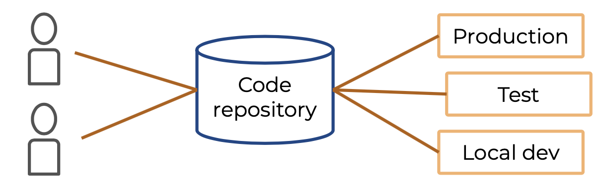

# Cloud native application

## Типы облачных платформ

### IaaS — Infrastructure as a Service

* Виртуальные сервера
* Сетевые настройки
* Управление доступом к серверам
* Облачные хранилища для файлов (HDD, SSD)

Всё это поддерживает непосредственно компания, которая предоставляет облачную инфраструктуры.

### PaaS — Platform as a Service

* Оркестраторы (Kubernetes, OpenShift и т.д.)
* Базы данных, хранилища
* Аналитика больших данных
* Провайдер сам отвечает за VM, OS, Servers

### SaaS — Software as a Service

* Электронная почта
* CRM-системы
* Готовые приложения
* Все инциденты возникающие с приложениями решает провайдер, мы используем систему как пользователь

### Сводная таблица

### Безопасность

При реализации инфраструктуры на своих серверах чаще всего это свой собственный контур безопасности, для защиты от внешнего мира ставятся фаерволы, которые блокируют атаки злоумышленников, при этом у злоумышленников нет возможности поставить какие-то свои приложения на наши сервера, для похищения данных.

При использовании облачной инфраструктуры, на серверах, которые используются нами для наших приложений, могут быть развёрнуты приложения других компаний тоже. Возникает вектор атаки: через процессоры, через оперативную память и прочие, которые нужно отслеживать и уметь отражать. Мало того, при использовании своих серверов можно ограничить круг лиц с доступом к серверу, в случае с облачной инфраструктурой доступ могут получать инженеры занимающиеся обслуживанием серверов, об этом нужно тоже подумать.

Поэтому важно, чтобы при переходе на облачные сервисы, работа с данными происходило в соотвествии с нужными регламентами безопасности и удовлетворяла следующему:

* Федеральный закон «О персональных данных» **152-ФЗ** (если в приложении используются персональные данные клиентов)
* Стандарт безопасности данных индустрии платёжных карт **PCI DSS** (если используется оплата картой на стороне приложения)

### Выбор

При решении идти в облачную инфраструктуру нужно ответить на следующие вопросы:

* Есть ли у вас персональные данные пользователей?
* Есть ли платёжные и карточные данные пользователей?
* Есть ли требования регулятора к облакам?
* Готовы ли ваши приложения к переезду в облако?
* Соответствует ли выбранное облако вашим требования по:
  * отказоустойчивости
  * доступности
  * уровню поддержки
* Есть ли у вас свой ЦОД?

## Cloud native

* По сути это — готовая PaaS инфраструктура, т.е приложение изначально предназначены для работы в облаке
* Настройки передаёт среда исполнения
* Готовые облачные сервисы — можно переиспользовать ресурсы которые даёт сама платформа

## Cloud agnostic

* Готовая PaaS инфраструктура
* Настройки передаёт среда исполнения
* Остальное реализуется самостоятельно, т.к. этот подход направлен на то, чтобы систему можно было развернуть в любом облачном провайдере, поэтому нельзя завязываться на сервисы и особенности какого-то одного провайдера

## The Twelve-Factor App 

Методология создания SaaS-приложений (от Heroku).

Принципы:

* Декларативный формат для описания процесса установки и настройки — для того чтобы новые люди на проекте максимально быстро в него погружались, т.е. должна быть документация где описано как и что развернуть
* Максимальная переносимость между средами выполнения
* Развёртывание на современных облачных платформах
* Минимум расхождений между средой разработки и средой выполнения
* Масштабирование должно происходить без существенных изменений в инструментах, архитектуре и практике разработки

### Кодовая база

* Одно приложение (сервис) — один репозиторий
* Если надо переиспользовать код, необходимо создать отдельную библиотеку и подключить её через менеджер зависимостей
* Один репозиторий — множество развёртываний

### Зависимости

* Все зависимости должны быть явно задекларированы
* Использование манифестов, где все зависимости отражены
* Декларируются и модули самой ОС, необходимые для работы приложения

### Конфигурация

* Подключения к ресурсам (базы данных, удостоверяющие центры и т. д.)
* Регистрационные данные для подключения к внешним сервисам (Google, Amazon S3 и т. д.)
* Значения зависимы от среды исполнения (имя хоста, картинка бренда и т. д.)

**Все конфигурации задаются через ENV-переменные. Среда исполнения определяет, как будет работать приложение.**

### Сторонние службы (Backing Services)

* Все сторонние службы, к которым надо обращаться по сети, рассматриваются как внешние ресурсы
* ENV-переменные для любого ресурса:
  * путь или расположение (URL и т. д.)
  *  учётные данные

### Сборка, релиз, выполнение

* Сборка — этап трансформации кода и внешних зависимостей в исполняемые файлы
* Релиз — объединение сборки и конфигурации конкретной среды исполнения
* Выполнение — запуск приложения в среде исполнения

### Процессы (Stateless)

* Запущенные процессы (приложения, сервисы) не должны хранить состояния
* Хранить состояние необходимо во внешних хранилищах (БД, кеш и т. д.)
* Это нужно для случаев масштабирования, когда не факт что следующий запрос придёт к сервису, к которому пришёл первый запрос, или сервис перезапустился

### Привязка портов (Port binding)

Экспортируйте сервисы через привязку портов приложения к контейнеру.

### Параллелизм

Приложение должно быть разработано так, чтобы при высокой нагрузке можно было запустить дополнительные экземпляры и запросы пользователей обрабатывались корректно.

### Утилизируемость (Disposability)

* Минимизация времени запуска приложения
* Корректная остановка приложения с остановкой прослушивания портов и завершением задач, которые были в работе (Graceful Shutdown)

### Паритет окружений (Dev/prod)

Окружения разработки, промежуточного развёртывания (staging) и рабочего развёртывания (production) должны быть максимально похожими.

Типы различий:

- различие во времени — чем меньше времени между разработкой и релизом в прод, тем лучше проходит сама установка
- различие персонала — люди разрабатывающие код и развёртывающие отличаются, это нужно сократить, участие разработчика в процессе деплоя
- различие инструментов — возможность использовать разные инструментов для тестирования

### Журналирование (Logs)

* Рассматривайте журнал логов как поток событий
* Все логи отправляются в stdout

### Задачи администрирования

* Код задач должен лежать в репозитории
* Зависимости должны быть объявлены в манифесте
* Конфигурация задачи должна находиться в переменных окружения

## Типы облачных платформ

* **Публичное облако:** ресурсы делятся между многими клиентами
* **Приватное облако**: ресурсы принадлежат только одному клиенту
* **Гибридное облако:** сочетает в себе публичное и приватное

### Публичное облако

* Готовая инфраструктура
* Необходимо настроить:
  * Сбор логов
  * Сбор метрик
  * Анализ и нотификации
* Поддержка для решения инцидентов
* Плата только за те ресурсы, которые используются
* **Регулятор**

### Приватное облако

- Готовая инфраструктура 
- Необходимо настроить:
  - сбор логов
  - сбор метрик
  - анализ и нотификации
- Поддержка для решения инцидентов
- **Плата за все ресурсы**
- **Регулятор**

### Гибридное облако

Когда часть логики находится на собственных серверах/приватном облаке, часть на публичном.

При организации такой структуры нужно ответить на вопросы:

* Как данные попадают в публичное облако?
* Не попадают ли в публичное облако приватные данные?

Для безопасности, передаваемые через интернет, данные от внутренней инфраструктуры к публичному облаку нужно шифровать (можно использовать VPN, ФПСУ IP и т.д.).

Для увеличения скорости и стабильности передачи стоит сделать выделеный канал для передачи данных.

Для предотвращения утечек приватных данных в публичное облако нужно реализовать проверку исходящего трафика (DLP), которые будут анализировать трафик и предотвращать утечки.

## ServerLess

* Ресурсы предоставляются только в момент выполнения задачи
* После выполнения сворачивается инфраструктура, созданная для задачи
* Лучше всего использовать при выполнении непостоянных задач
