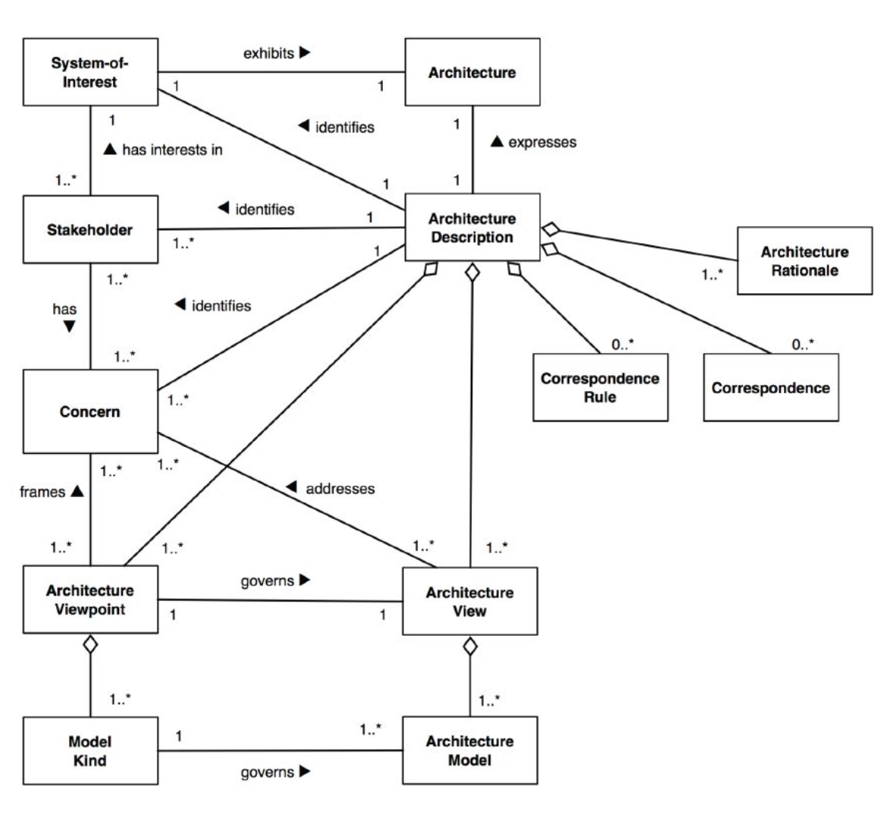

# Soft-skills и развитие карьеры

## Architecture Decision Records и коммуникация

Существует 3 основных силы формирующих требования к проекту:

* Бизнес
  * Цели
  * Требования
* Технологии
  * Инструменты
  * Практики
* Люди
  * Стейкхолдеры (каждый имеет свой интерес и влияние на проекте)

Задача архитектора — принимать решения

* О решениях надо помнить
* Решения надо документировать

### Architecture Decision Records

Самая сложная вещь в течении проекта — отслеживание причины изменений. Код скажет как, но не скажет почему.

Поэтому нужно качественно документировать что было сделано и почему.

В 2011 году Michael Nygard предложил описывать решения в коротком формате на странице А4, состоящем из следующих разделов:

* Название 
* Дата — когда документ был принят
* Контекст
* Решение
* Статус
* Последствия

Сюда заносятся все важные решения влияющие на архитектуру.

#### Формат

* Markdown
* Очень малый размер — А4

Основные плюсы:

* возможность хранить в репозитории кода
* поддержка отображения "из коробки"
* лёгкость редактирования
* история изменений

#### Название

* Порядковый номер (лучше задавать с ведущими нулями, иначе могут быть проблемы с сортировкой)
* Максимально конкретное название
* Никогда не удалять документы и кардинально не менять содержания.
* Меняться может статус

#### Контекст

Описание причин, подводящих к необходимости принятия решения. Описание ограничений и предложений для описываемой ситуации.

* узкий контекст — максимально конкретно и близко к данной задаче
* описать все предположения
* не склонять к решению
* опции решения описывать в этой секции

#### Решение

* Описать решение максимально кратко, в 2-3 предложениях
* Описание в настоящем времени.
* Может быть ссылка на выбранную опцию, описанную в секции "контекст"

#### Статус

Описание статуса решения:

* Отложено
* Принято
* Отвергнуто

Очень важно документировать отвергнутые решения, чтобы не возвращаться многократно к их обсуждению.

#### Последствия

Последствия принятого (или нет) решения с описанием:

* позитивных моментов решения
* негативных моментов решения
* возможных рисков, связанных с решением

### О чём важно помнить

* В ADR не нужно записывать ограничения системы
* Требования тоже не попадают в раздел ADR
* При документации ADR должна быть реальная альтернатива и выбор. Именно поэтому есть секция "последствия"
* При выборе подходов и инструментов важно описать анализ опций
* Запись отвергнутых опций может быть даже важнее принятых
* В описании делать акцент на причины принятия решения, а не детали реализации

### Коммуникация

Нужно стараться следовать общей концепции ADR:

* Тема
* [Проект] Описание проблемы
* Контекст
* Проблема
* Шаги для решения с упоминанием исполнителей
* Срок решения
* Ожидаемый результат и следующие шаги

Рекомендации:

* При пересылке письма новым участникам делайте краткое резюме предыдущей беседы, если сообщений было много
* Прописывайте, что вы ожидаете от нового участника: ○ информирование
  - предоставление информации
  - конкретные действия
* Перечитывайте написанное (не осталось ли в вашей голове контекста письма)
* Оформляйте ссылки на упомянутые артефакты
* Описывайте назначение приложенных артефактов

## Презентация архитектуры

Архитектурное описание выражает архитектуру. Архитектура описывает систему как общность интересов.

Систему невозможно описать на одной диаграмме, необходимы различные перспективы.

Архитектурное описание многомерно.

### Концептуальная схема

Показывает какие сценарии адресуются, на что направлена система, по ключевым элементам на схеме можно догадаться о домене и задаче, которую должна решить новая система/архитектура.

* Вневременное взаимодействие компонентов
* Отображает фактически все возможные сценарии приложения
* Оперирует только бизнес-компонентами

### Функциональное представление

Содержит основные функциональные компоненты системы, ответственность, интерфейсы и основные взаимодействия.

Основные ошибки:

* отображение "божественных объектов", когда есть один компонент в центре, который делает практически всё
* Слишком много зависимостей и компонентов
* "бедные" интерфейсы (не прописано что конкретно они делают)
* слабое описание ответственности
* присутствие технических компонентов

### User Journey

Отображает как пользователь реализует функции системы.

### Информационное представление

Различные представление компонентов системы или любой информации о системы, может быть представлено в различном виде.

## Работа с командой

Архитектор это не:

* Борец с пожарами (архитектор отвечает за архитектуры и не должен заниматься решением всех текущих проблем на проекте)
* Старший разработчик
* Менеджер проектов
* Исследователь

Архитектор объединяет и управляет интересы групп стейкхолдеров

Архитектор — это супер-проводник между уровнями организации

### Шаблоны взаимодействия между архитектором и командой

#### Благожелательный диктатор

Архитектор указывает разработчикам, что или как делать. Важный нюанс как проходит комуникация между архитектором и разработчиками (однонаправленна, двунаправленна)

* Если вы приглашаете нового архитектора, будьте осторожны, чтобы не получить хаос на проекте
* Архитектору может не хватать обратной связи с реализацией, такая схема чревата сценарием "мечта архитектора — кошмар разработчика", когда виденье архитектора не согласуется с тем, что разработчики могут или хотят делать
* Шансы хорошего результата повышаются, если архитектор использует "лифт" в организации, т.е. собирает информацию со всех уровней организации и доносит в нужной мере, что нужно изменить и для чего
* Такая схема может работать хорошо, когда разработчики не могут договорится с менеджерами, тогда архитектор или группа архитекторов может навести порядок

#### Первый среди равных

Архитектор(ы) встраиваются в команды и являются тем, кто фокусируется на структуре системы и компромиссах, возможно принимаю более долгосрочные решения, чем иные члены команды

* Команды получают большую автономию в принятии решений и могут быстрее корректировать курс
* Архитектурные компромиссы могут обсуждаться непосредственно с командой разработчиков без накладных расходов на руководящие комитеты и обзоры

**Однако:**

* Чтобы избежать излишнего дублирования, эти команды обычно активно синхронизируются по задачам
* команды должны вести записи архитектурных решений. Автономия не должна превращаться в непрозрачность

#### Архитектура без архитекторов

Команда без отдельного архтектора

* Каждый несёт ответственность за устойчивую архитектуру
* Когда необходимо принять важное решение вся становятся архитекторами на короткое время

**Однако:**

* нужна культура принятия решений и зрелые разработчики

#### "Психбольница"

Никто не задумывается об архитектуре

* Архитектура не возникает сама по себе
* Agile не оправдание, это никак не связано с архитектурой
* Команда переоценивает себя

## Куда расти и где взять время

### Роли архитекторов

* Системный архитектор — ответственен за одну систему
* Архитектор решений — ответственен за несколько систем, как они будут интегрироваться между собой и, частично, как это повлияет на всю организацию
* Энтерпрайз-архитектор — бизнес-ориентированная должность, решает вопросы информационной стратегии предприятия, глоабльное планирование развития систем.

**Специализация:**

* Архитектор данных
* Архитектор по безопасности
* Архитектор инфраструктуры

#### Архитектор данных

Разработка и поддержание общей модели данных на уровне предприятия. Контроль согласованности данных и источников правды.

Глубокое погружение в техгнологии и бизнес.

#### Архитектор по безопасности

* Оценивает информационные технологии и компьютерных систем организации, выявление сильных и слабых сторон безопасности
* Проведение тестов на проникновение, анализ рисков и этические взломы локальных, глобальных и виртуальных сетей
* Необходимо мыслить как хакер и доводить систему до предела возможностей
* Описывает, внедряет и контролирует выполнение правил безопасности в организации

#### Архитектор инфраструктуры

 Архитекторы инфраструктуры разрабатывают и внедряют информационные системы для поддержки инфраструктуры предприятия организации. Они обеспечивают работу всех систем на оптимальном уровне и поддерживают разработку новых технологий и системных требований.

* Разработка инфраструкторуной модели предприятия
* Анализ текущих и будущих требований к инфраструктуре
* Анализ трендов использования ресурсов инфраструктуры
* Монитоинг проблем железа и сервисов в масштабе предприятия

### Пути развития

### Как развиваться?

* Всех технологий не попробовать
* Многие идеи в одиночку не реализовать
* Нужно понимать принципы работы систем, компоненты, продуктов
* Задавайте больше вопросов о причинах изменений в проекте, старайтесь понять бизнес-причину
* Найдите себе наставника из архитекторов или ведущих разработчиков, чтобы узнавать больше о причинах выбора той или иной технологии
* Делайте реверс-инжинеринг системы и пробуйте ответить себе на вопрос: "Что сподвигло на такие решения?"
* Учите и понимайте шаблоны
* Возьмите шефстро над джунами/мидлами, их вопросы помогать по-другому взглянуть на "обычные" проблемы
* Читайте как можно больше
* "Почему" важнее чем "Как?"

## Ресурсы для развития

### Книги

#### Архитектура

Len Bass, Paul Clements, Rick Kazman — Software Architecture in Practice

Michael Keeling — Design it!

Neal Ford, Rebecca Rarsons, Patrick Kua — Building Evolutionary Architectures

Simon Brown — Software Architecture for Developers

Martin Kleppmann — Design Data-Intensive Applications

#### Коммуникация

Калистрат Жаков, Сергей Пивоварин — Логика, Искусство спора

#### Презентации

Neal Ford, Matthew Mccullough, Nathaniel Schutta — Presentation patterns
