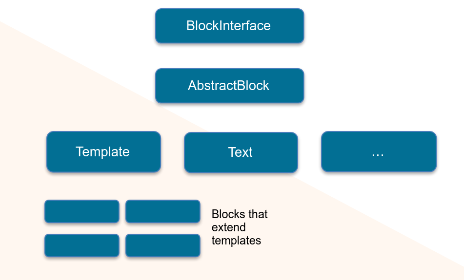
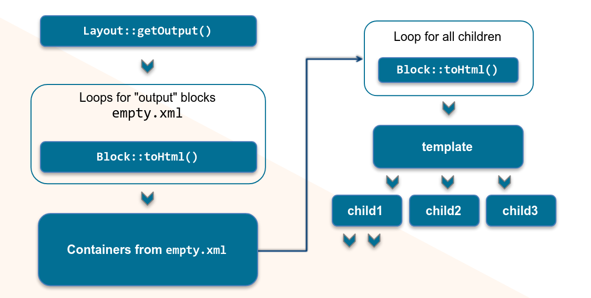

# Архтектура блоков и их жизненный цикл



Верхом иерархии архитектуры блоков являются:

* [`Magento\Framework\View\Element\BlockInterface`](https://github.com/magento/magento2/blob/2.3/lib/internal/Magento/Framework/View/Element/BlockInterface.php) — имеет только один метод `toHtml()`
* [`Magento\Framework\View\Element\AbstractBlock`](https://github.com/magento/magento2/blob/2.3/lib/internal/Magento/Framework/View/Element/AbstractBlock.php) — реализует `BlockInterface` имеет множество методов для рендеринга, основные из них:
    * [`_prepareLayout()`](https://github.com/magento/magento2/blob/2.3/lib/internal/Magento/Framework/View/Element/AbstractBlock.php#L297) — вызывается при создании блока, используется для каких-либо инициализирующих операций
    * [`addChild()`](https://github.com/magento/magento2/blob/2.3/lib/internal/Magento/Framework/View/Element/AbstractBlock.php#L398) — добавляет дочерний блок для блока
    * [`_toHtml()`](https://github.com/magento/magento2/blob/2.3/lib/internal/Magento/Framework/View/Element/AbstractBlock.php#L711) 
    * [`_beforeToHtml()`](https://github.com/magento/magento2/blob/2.3/lib/internal/Magento/Framework/View/Element/AbstractBlock.php#L652)
    * [`_afterToHtml()`](https://github.com/magento/magento2/blob/2.3/lib/internal/Magento/Framework/View/Element/AbstractBlock.php#L701)
    * [`toHtml()`](https://github.com/magento/magento2/blob/2.3/lib/internal/Magento/Framework/View/Element/AbstractBlock.php#L664)

## toHtml()

Метод возвращает вывод блока, так-же в нём вызываются методы `_beforeToHtml()`, `_toHtml()`, `_afterToHtml()`

[`toHtml()`](https://github.com/magento/magento2/blob/2.3/lib/internal/Magento/Framework/View/Element/AbstractBlock.php#L664)

```php
public function toHtml()
{
    $this->_eventManager->dispatch('view_block_abstract_to_html_before', ['block' => $this]);
    if ($this->_scopeConfig->getValue(
        'advanced/modules_disable_output/' . $this->getModuleName(),
        \Magento\Store\Model\ScopeInterface::SCOPE_STORE
    )) {
        return '';
    }

    $html = $this->_loadCache();
    $html = $this->_afterToHtml($html);
    
    /** @var \Magento\Framework\DataObject */
    $transportObject = new \Magento\Framework\DataObject(
        [
            'html' => $html,
        ]
    );
    $this->_eventManager->dispatch(
        'view_block_abstract_to_html_after',
        [
            'block' => $this,
            'transport' => $transportObject
        ]
    );
    $html = $transportObject->getHtml();
    
    return $html;
}
```

[`_loadCache()`](https://github.com/magento/magento2/blob/2.3/lib/internal/Magento/Framework/View/Element/AbstractBlock.php#L1092)

```php
/**
 * Load block html from cache storage
 *
 * @return string
 */
protected function _loadCache()
{
    $collectAction = function () {
        if ($this->hasData('translate_inline')) {
            $this->inlineTranslation->suspend($this->getData('translate_inline'));
        }

        $this->_beforeToHtml();
        return $this->_toHtml();
    };

    if ($this->getCacheLifetime() === null || !$this->_cacheState->isEnabled(self::CACHE_GROUP)) {
        $html = $collectAction();
        if ($this->hasData('translate_inline')) {
            $this->inlineTranslation->resume();
        }
        return $html;
    }
    $loadAction = function () {
        return $this->_cache->load($this->getCacheKey());
    };

    $saveAction = function ($data) {
        $this->_saveCache($data);
        if ($this->hasData('translate_inline')) {
            $this->inlineTranslation->resume();
        }
    };

    return (string)$this->lockQuery->lockedLoadData(
        $this->getCacheKey(),
        $loadAction,
        $collectAction,
        $saveAction
    );
}
```

## Флоу выполнения AbstractBlock

1. [`_prepareLayout()`](https://github.com/magento/magento2/blob/2.3/lib/internal/Magento/Framework/View/Element/AbstractBlock.php#L297)
2. [`toHtml()`](https://github.com/magento/magento2/blob/2.3/lib/internal/Magento/Framework/View/Element/AbstractBlock.php#L664)
3. [`_beforeToHtml()`](https://github.com/magento/magento2/blob/2.3/lib/internal/Magento/Framework/View/Element/AbstractBlock.php#L652)
4. [`_toHtml()`](https://github.com/magento/magento2/blob/2.3/lib/internal/Magento/Framework/View/Element/AbstractBlock.php#L711) 
5. [`_afterToHtml()`](https://github.com/magento/magento2/blob/2.3/lib/internal/Magento/Framework/View/Element/AbstractBlock.php#L701)

## Типы блоков

Основные:

* [`Magento\Framework\View\Element\Text`](https://github.com/magento/magento2/blob/2.3/lib/internal/Magento/Framework/View/Element/Text.php)
* [`Magento\Framework\View\Element\Text\ListText`](https://github.com/magento/magento2/blob/2.3/lib/internal/Magento/Framework/View/Element/Text/ListText.php)
* [`Magento\Framework\View\Element\Messages`](https://github.com/magento/magento2/blob/2.3/lib/internal/Magento/Framework/View/Element/Messages.php)
* [`Magento\Framework\View\Element\Redirect`](https://github.com/magento/magento2/blob/2.3/lib/internal/Magento/Framework/View/Element/Redirect.php)
* [`Magento\Framework\View\Element\Template`](https://github.com/magento/magento2/blob/2.3/lib/internal/Magento/Framework/View/Element/Template.php)

Всё это имплементации абстрактиного блока, во всех из них имплементируется метод `_toHtml()`. Таким обзразом выходит: разные классы наследуются от AbstractBlock, в котором реализован метод `toHtml()` в котором реализуется стандартное флоу рендеринга блока, а в наследниках реализуется метод `_toHtml()` в котором содержится специфичная для типа логика рендеринга.

### Text

[`Magento\Framework\View\Element\Text`](https://github.com/magento/magento2/blob/2.3/lib/internal/Magento/Framework/View/Element/Text.php)

Блок просто выводит текст, который можно установить у него методом `setText()`/`addText()`

```php
protected function _toHtml()
{
    if (!$this->_beforeToHtml()) {
        return '';
    }
    return $this->getText();
}
```

### ListText

[`Magento\Framework\View\Element\Text\ListText`](https://github.com/magento/magento2/blob/2.3/lib/internal/Magento/Framework/View/Element/Text/ListText.php)

Блок выводит вывод своих дочерних блоков, по функционалу схож с контейнерами. Является аналогом `Mage_Core_Block_Text_List` из M1.

```php
protected function _toHtml()
{
    $this->setText('');
    $layout = $this->getLayout();
    foreach ($this->getChildNames() as $child) {
        $this->addText($layout->renderElement($child, false));
    }
    return parent::_toHtml();
}
```

### Messages

[`Magento\Framework\View\Element\Messages`](https://github.com/magento/magento2/blob/2.3/lib/internal/Magento/Framework/View/Element/Messages.php)

* Предназначен для вывода сообщений, сообщения могут иметь разные типы.
* Может иметь темплейт
* Может выводить сообщения разных типов

### Redirect

[`Magento\Framework\View\Element\Redirect`](https://github.com/magento/magento2/blob/2.3/lib/internal/Magento/Framework/View/Element/Redirect.php)

* Может иметь темплейт
* Рендерит JS редирект

### Template

[`Magento\Framework\View\Element\Template`](https://github.com/magento/magento2/blob/2.3/lib/internal/Magento/Framework/View/Element/Template.php)

Имеет привязанный к блоку темлейт в виде .phtml файла, во время рендеринга включает этот файл и обрабатывает его посредством [Magento\Framework\View\TemplateEngine\Php::render()](https://github.com/magento/magento2/blob/2.3/lib/internal/Magento/Framework/View/TemplateEngine/Php.php#L52)

#### Привязка файла темплейта

Есть несколько способов:
* метод `setTemplate()` — вызывается неподсредствено у инстанса блока
* Аргемуент конструктора — передаётся в аргументе `$data` конструктора в поле `template`, затем, если был передан то в `_construct()` заменяет темплейт у блока методом `setTemplate()`

#### Флоу рендеринга темплейта

1. [`_toHtml()`](https://github.com/magento/magento2/blob/2.3/lib/internal/Magento/Framework/View/Element/Template.php#L296)
2. [`fetchView()`](https://github.com/magento/magento2/blob/2.3/lib/internal/Magento/Framework/View/Element/Template.php#L260)
3. [TemplateEngine\Php::render()](https://github.com/magento/magento2/blob/2.3/lib/internal/Magento/Framework/View/TemplateEngine/Php.php#L52)
4. [`include $fileName`](https://github.com/magento/magento2/blob/2.3/lib/internal/Magento/Framework/View/TemplateEngine/Php.php#L59)

После включения в темплейте доступны все публичные методы его блока через пременную `$block`.

## Создание и кастомизация блоков

* Можно создать блоки используя лаяут или метод [`Magento\Framework\View\Layout::createBlock()`](https://github.com/magento/magento2/blob/2.3/lib/internal/Magento/Framework/View/Layout.php#L764)
* Используя объектный менеджер
* Кастомизровать блоки, как и остальные классы, можно используя DI или плагины

## Рендеринг



1. [`Magento\Framework\View\Layout::getOutput()`](https://github.com/magento/magento2/blob/2.3/lib/internal/Magento/Framework/View/Layout.php#L958) — к этому моменты все лаяуты для страницы сгенерированны и созданы все классы блоков 
2. М2 реднерит контейнеры из `empty.xml`, каждый контейнер имеет блоки добавленные в других обновлениях лаяута.
3. Во время рендеринга контейнеров рендарятся блоки путём вызова их `toHtml()` методов
4. `toHtml()` включет файлы темплейтов, у темплейтов так-же могут рендерится дочерние блоки в `getChildHtml()` и т.д.
