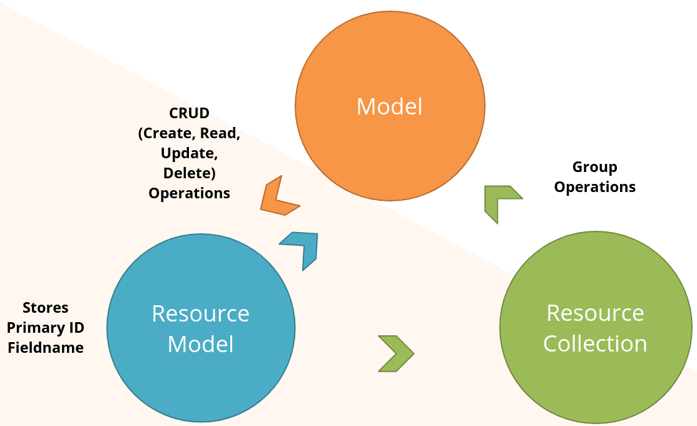

# Работа с базой данных

## ORM

Object-relational mapping (ORM) — это техника используемая для доступа к реляционной БД с использованием объектно ориентированного языка.

В Magento ORM построенно вокруг моделей, ресурсных моделей и ресурсных коллекций.

### Элементы

* Модели — данные + поведение, представляют сущости.
* Ресурсные модели — сопоставляет между собой данные из таблицы и данные объекта, отвечает за операции с БД
* Коллекции — наборы моделй и связанная функциональность, такая как фильтрация, сортировка и пагинация. Реализуют интрефейсы [`IteratorAggregate`](https://www.php.net/manual/ru/class.iteratoraggregate.php) и [`Countable`](https://www.php.net/manual/ru/class.countable.php). Коллекции широко используются для хранения наборов объектов одного типа.
* Ресурсы — такие как соединение с БД через адаптеры

ORM даёют возможность для создания, загрузки, обновления и удаления данных из БД.

### Взаимоотношения



Большинство таблиц в структуре Magento имеют представления в моделях.

* Модели инкапсулируют независимую от хранилища бизнес-логику
* Ресурсные модели инкапсулируют логику работы с хранилищем. Все действия уровня хранилища находятся в ресрсных моделях. Ресурсные модели используют БД адаптеры для доступа к хранилищу. Они заполняют модели данными из БД (во время опреации загрузки), или пишут данные моделей в БД (в случае операции сохранения).

Такой подход даёт такие преимущества:
* Разделение бизнес логики и уровня хранения данных
* Отделение схемы хранения данных от имплементации драйвера БД (паттерн проектирования ["Data mapper"](https://designpatternsphp.readthedocs.io/ru/latest/Structural/DataMapper/README.html))

* Коллекция представляет собой набор модлей одно типа, используется для работы с несколькими записями.

### CRUD

Модели содежат устаревшие методы CRUD, такие как `load()`, `save()`, `delete()` которые делегируются к ресурсной модели. Эти методы не следует использовать, вместо них следует использовать CRUD методы самой ресурсной модели.

Модели не имеет прямого доступа к БД, только к ресурсной модели. Т.е. при необходимости достать какие-то специфичные данные из БД: следует делать метод в ресурсной модели.

Русерная модель получает доступ к БД посредством адаптеров из [`Magento\Framework\DB\Adapter\Pdo`](https://github.com/magento/magento2/tree/2.3/lib/internal/Magento/Framework/DB/Adapter/Pdo) и `Zend_Db`.

### Создание

#### Модель

При создании моделей необходимо указать какую ресурсную модель для неё использовать, это указывается в методе `_construct()`, с помощью метода `_init()`.

```php
class Block extends \Magento\Framework\Model\AbstractModel implments BlockInterface
{
    protected function _construct()
    {
        $this->_init(\Magento\Cms\Model\ResourceModel\Block::class);
    }
}

abstract class AbstractModel extends \Magento\Framework\DataObject
{
    protected function _init($resourceModel)
    {
        $this->_setResourceModel($resourceModel);
        $this->_idFieldName = $this->_getResource()->getIdFieldName();
    }
}
```
это небоходимо для реализации методов `getResource()` и `getCollection()` в создаваемой модели. 

Модель должна наследовать класс [`\Magento\Framework\Model\AbstractModel`](https://github.com/magento/magento2/blob/2.3/lib/internal/Magento/Framework/Model/AbstractModel.php). Наследование от `AbstractModel` предоставляет специальные ивенты для моделей.

#### Ресурсная модель

Ресурная модель должна наследовать [`Magento\Framework\Model\ResourceModel\Db\AbstractDb`](https://github.com/magento/magento2/blob/2.3/lib/internal/Magento/Framework/Model/ResourceModel/Db/AbstractDb.php)

В `_init()` нужно указать основную таблицу из БД для данной ресурсной модели и первичный ключ таблицы. `_init()` вызывается в `_constructor()`:
```php
class Block extends Magento\Cms\Model\ResourceModel\AbstractDb
{
    protected function _construct()
    {
        $this->_init('cms_block', 'block_id');
    }
}

abstract class AbstractDb extends Magento\Framework\Model\ResourceModel\Db\AbstractResource
{
    protected function _init($mainTable, $idFieldName)
    {
        $this->_setMainTable($mainTable, $idFieldName);
    }

    protected function _setMainTable($mainTable, $idFieldName = null)
    {
        $this->_mainTable = $mainTable;
        if (null === $idFieldName) {
            $idFieldName = $mainTable . '_id';
        }

        $this->_idFieldName = $idFieldName;
        return $this;
    }
}
```

#### Коллекция

Колекция должна наследоать [`Magento\Framework\Model\ResourceModel\Db\Collection\AbstractCollection`](https://github.com/magento/magento2/blob/2.3/lib/internal/Magento/Framework/Model/ResourceModel/Db/Collection/AbstractCollection.php)

При создании небоходимо указать модель и ресурсную модель, к которым относится коллекция.

```php
class Collection extends Magento\Framework\Model\ResourceModel\Db\Collection\AbstractCollection
{
    protected function _construct()
    {
        $this->_init(\Magento\Cms\Model\Block::class, \Magento\Cms\Model\ResourceModel\Block::class);
        $this->_map['fields']['store'] = 'store_table.store_id';
        $this->_map['fields']['block_id'] = 'main_table.block_id';
    }
}

class AbstractCollection extends \Magento\Framework\Data\Collection\AbstractDb
    implements Magento\Framework\App\ResourceConnection\SourceProviderInterface
{
    protected function _init($model, $resourceModel)
    {
        $this->setModel($model);
        $this->setResourceModel($resourceModel);
        return $this;
    }
}
```

### Интерфейс модели

В M2 для модели рекомендуется создавать модельный интерфейс в котром определяется набор гетегорв и сетеров для API. Наример [`Magento\Cms\Api\Data\BlockInterface`](https://github.com/magento/magento2/blob/2.3/app/code/Magento/Cms/Api/Data/BlockInterface.php) интерфейс модели CMS-блока.

### Адаптеры

Для связи с БД ресурсные модели использют адаптеры.

* Все операции чтения/записи извлекают созединение по имени ресурса с фелбеком на дефолтное соединение
* `getConnection()` — предоставляет доступ к адаптеру, обычно это MySQL адаптер.
* Модель `ResourceConnection` из Enterprice Edition предоставляет возможности для использования распределённых БД, для повышения уровня масштабируемости.

### Загрузка коллекций


Коллекции грузятся лениво, при первом обращении к объектам коллекции она будет загружена и не будет грузится заново, даже если напрямую вызвать метод `load()`. 

Коллекции решают такие вопросы:

* Предоставляют контейнер для хранения коллекции объектов
* Предотвращают лишнюю загрузку данных
* Хранят вся объекты во вемя сессии
* Предоставляют интерфейс для фильтрации и сортировки сущностей
