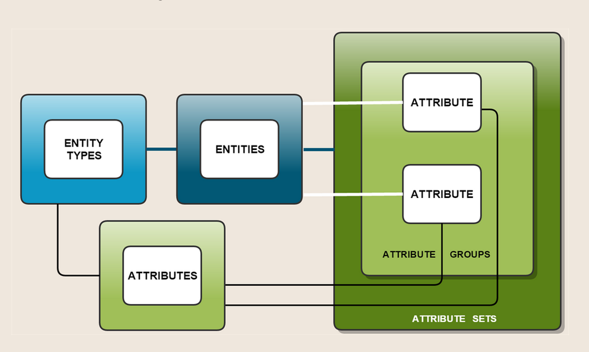
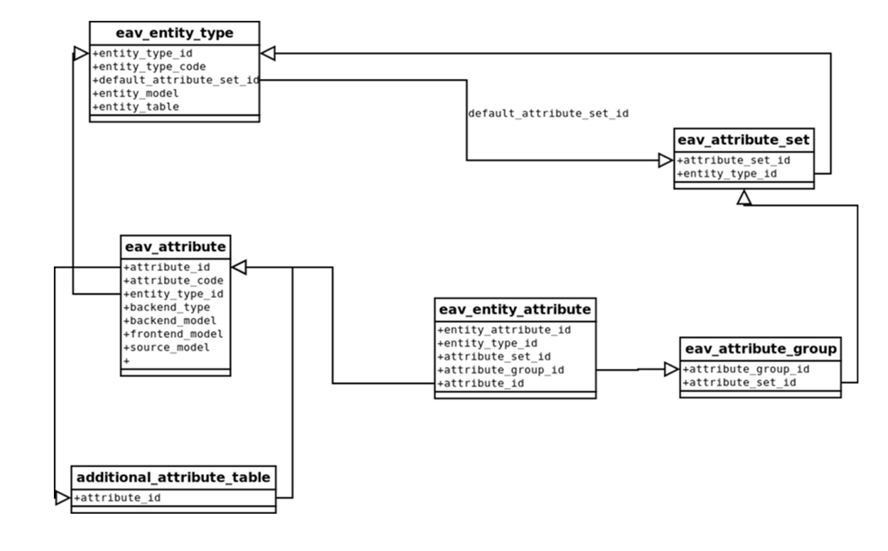

# EAV

Entity Attribute Value — концепт организации данных, когда сущность, её атрибуты и их значения разделяются и хранятся в разных таблицах.

EAV позволяет решить такие проблемы как:

* Разделение контента по нескольким скопам, в Magento данные могут быть представлены глобально, для веб-сайта или стора, EAV позволяет легко храить эти значения.
* Простое добавление/уаление атрибутов, в EAV для добавление новых полей к сущности не нужно модфицировать таблицу сущности, достаточно добавить новыую запись в таблицу атрибутов сущности
* Ищменения типа значения, в EAV значения разных типов хранятся в разных табилцах и при измения типа атрибута не нужно модифицировать таблицу со значениями, атрибуту достаточно начать брать значения из другой таблицы с нужным типом значеня

Преимущества EAV:

* Разделение значений между атрибутами и сущностями
* Инкапсуляция атрибутной бизнес логики
* Разленение контента между сторами
* Простое добавление и удаления новых атрибутов

## Аспекты

EAV делится на два аспекта:

* Мета информация
  * тип сущности
  * атрибуты для типа сущности
  * наборы и группы атрибутов
* Контент
  * Записи сущнностей
  * Значения атрибутов

## Классический EAV

Ниже приведены устройство классической EAV

### Тип

|*enity_type_id*|*entity_type_code*|
|-|-|
|1|product|
|2|customer|

* enity_type_id — идентификатор
* entity_type_code — уникальный код типа сущности

### Атрибуты

|*attribute_id*|*attribute_type_id*|*attribute_code*|
|-|-|-|
|1|1|name|
|2|2|firstname|

* attribute_id — идентификатор
* attribute_type_id — ИД типа сущности к которой относится атрибут
* attribute_code  — уникальный код атрибута

### Сущности

|*enity_id*|*entity_type_id*|
|-|-|
|1|1|
|2|2|

* enity_id — идентификатор
* entity_type_id — ИД типа сущности к которой относится сущность

### Значения

|*value_id*|*entity_id*|*attribute_id*|*value*|
|-|-|-|-|
|1|1|1|Ottoman|
|2|2|2|John|

* value_id — идентификатор
* entity_id — ИД сущности к которой относится значение
* attribute_id — ИД атрибута к которому относится значение
* value — значение

### Проблемы

Классическая схема имеет ряд проблем:

* Таблицы быстро разрастаются
* Информация о разных сущностях слвается в одну таблицу значений
* MySQL не может создать эфективный индекс для поля value, поэтому запросы значений атрибутов могут быть медленными
* Таиблица сложна для чтения

## Magento EAV

Для решения проблем классической EAV в Magento несколько доработали структуру хранения EAV

### Тип

Так-же как в классичекой EAV.

### Атрибуты

Содержит отличия, основное из них это тип значения атрбута:

|*attribute_id*|*attribute_type_id*|*attribute_code*|*backend_type*|
|-|-|-|-|
|1|1|price|decimal|
|2|2|firstname|varchar|

* attribute_id — идентификатор
* attribute_type_id — ИД типа сущности к которой относится атрибут
* attribute_code  — уникальный код атрибута
* backend_type — тип значения атрибута

### Сущности

Для хранения сущностей используется несколько таблиц по одной для каждого типа сущности, вместо одной для всех в классической EAV. Например, продукты хранятся в `product_entity`, а клиенты в `customer_entity`. 

Структура таблицы схожа с классической, только ещё в таблице могут хранится какие-то значения атрибутов, которые необходимы каждой сущности данного типа, например у продукта sku хранится в таблице сущноти, при этом в таблице атрибутов у sku указан тип `static`, это значит, что данные хранятся в таблице с сущностью.

### Значения

Значения в Magento EAV лежат в разных таблицах разделённых по сущности и типу значения, например `product_entity_varchar`, `product_entity_decimal` и т.д. Структура таблицы сходна с классической EAV, только тип value меняется в зависимости от таблицы.

## Наборы и группы атрибутов

В Magento для атрибутов есть наборы, которые объеденяют в себе несколько атрибутов относящихся к типу товара, при этом внтури набора атрибуты деляется на группы, напрмер "цена".

Управлять наборами и группами для продуктов можно через админку.

Каждая EAV-сущность в Magento имеет по крайней мере один набор атрибутов (Default). Каждый набор имеет как минимум одну группу (General).

## Иерархия

## Поля типов сущности

Все поля типов сущностей хранятся в таблице `eav_entity_type`, основые:

* `entity_type_id` — уникальный идентификатор используется во многих местах системы
* `entity_type_code` — человеко-читаемый уникальный код типа
* `entity_table` — таблица сущности
* `default_attribute_set_id` — ИД дефолтного набора атрибутов, используется когда набор атрибута не указан для новой модели
* `increment_model` — PHP класс для управления инкрементацией

## Поля атрибутов

Поля атрибутов хранятся в таблице `eav_attribute`, также в дополнение к этим полям для некоторых типов сущности есть дополнительные таблицы, например `catalog_eav_attribute`. Основные поля:

* `attribute_code` — человеко-читаемый, уникальный в приделах типа сущности код атрибута
* `backend_type` — тип атрибута, дефолтные (можно добавить свои):
    * static
    * varchar
    * datetime
    * int
    * text
    * decimal
* `backend_model` — модель используемая для процессинга значений атрибута перед и после CRUD операций
* `source_model` — модель используемая для предоставления набора значений атрибутов с типом вывода `select` и `multiselect`
* `frontend_model` — модель используемая для отображения значения атрибута
