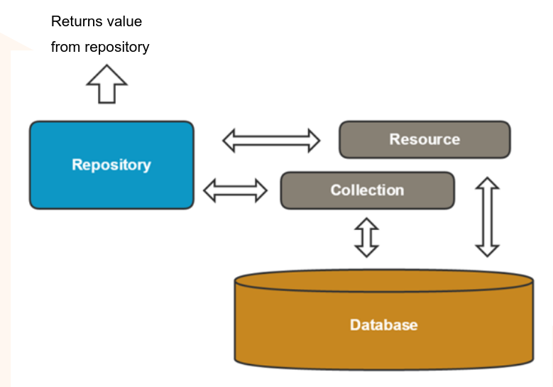

# Репозитории

Репозитории предоставляет доступ к данным через API.

Преимущество использования такого подхода в том, что приложения может функцонировать независимо от количества источников данных, способа их продключения. Это позволяет упростить обновления и, т.к. репозиторий работает с объктами данных, а не моделями, то страктура совместима с любой ORM.



## Репозитории vs коллекции

|**Репозитории**|**Коллекции**|
|-|-|
|Как сервисы, остаются неизменными в новых релизах|Могут быть изменены или полностью переделаны в новых релизах|
|Работают с объектами данных|Работают со списком Magento моделей|
|Предоставляют высокоуровневый доступ к данным|Предоставляют низкоуровневый доступ к БД|
|Поддерживают механизм `SearchCriteria` для фильтрации и сортировки|Предоставляют свой интерфейс для большинства операций, очень кастомизируемый|
|Не предоставляет низкоуровневого доступа к БД|Предоставляют достук к объекту `select`, который позволяет создавать кастоные запросы в БД|

Пример интерфейса репозитория [`Magento\Customer\Api\CustomerRepositoryInterface`](https://github.com/magento/magento2/blob/2.3/app/code/Magento/Customer/Api/CustomerRepositoryInterface.php) и его реализация [`Magento\Customer\Model\ResourceModel\CustomerRepository`](https://github.com/magento/magento2/blob/2.3/app/code/Magento/Customer/Model/ResourceModel/CustomerRepository.php)

следует обратить внимание на метод [`getById()`](https://github.com/magento/magento2/blob/2.3/app/code/Magento/Customer/Model/ResourceModel/CustomerRepository.php#L338):
```php
public function getById($customerId)
{
    $customerModel = $this->customerRegistry->retrieve($customerId);
    return $customerModel->getDataModel();
}
```

В нём используется [`Magento\Customer\Model\CustomerRegistry`](https://github.com/magento/magento2/blob/2.3/app/code/Magento/Customer/Model/CustomerRegistry.php) и вызывается метод [`retrieve()`](https://github.com/magento/magento2/blob/2.3/app/code/Magento/Customer/Model/CustomerRegistry.php#L75):
```php
public function retrieve($customerId)
{
    if (isset($this->customerRegistryById[$customerId])) {
        return $this->customerRegistryById[$customerId];
    }
    /** @var Customer $customer */
    $customer = $this->customerFactory->create()->load($customerId);
    if (!$customer->getId()) {
        // customer does not exist
        throw NoSuchEntityException::singleField('customerId', $customerId);
    } else {
        $emailKey = $this->getEmailKey($customer->getEmail(), $customer->getWebsiteId());
        $this->customerRegistryById[$customerId] = $customer;
        $this->customerRegistryByEmail[$emailKey] = $customer;
        return $customer;
    }
}
```

В этом методе если модель была уже загружена она сохраняется в поле регистра и достаётся оттуда при последующих запосах. Если модель ещё не загружалась, то созадётся фабрика которая загружает модель.

Метод [`getList()`](https://github.com/magento/magento2/blob/2.3/app/code/Magento/Customer/Model/ResourceModel/CustomerRepository.php#L355) использует `SearchCriteriaInterface` и возвращет [`Magento\Customer\Api\Data\CustomerSearchResultsInterface`](https://github.com/magento/magento2/blob/2.3/app/code/Magento/Customer/Api/Data/CustomerSearchResultsInterface.php):
```php
    public function getList(SearchCriteriaInterface $searchCriteria)
    {
        $searchResults = $this->searchResultsFactory->create();
        $searchResults->setSearchCriteria($searchCriteria);
        /** @var \Magento\Customer\Model\ResourceModel\Customer\Collection $collection */
        $collection = $this->customerFactory->create()->getCollection();
        $this->extensionAttributesJoinProcessor->process(
            $collection,
            CustomerInterface::class
        );
        // This is needed to make sure all the attributes are properly loaded
        foreach ($this->customerMetadata->getAllAttributesMetadata() as $metadata) {
            $collection->addAttributeToSelect($metadata->getAttributeCode());
        }
        // Needed to enable filtering on name as a whole
        $collection->addNameToSelect();
        // Needed to enable filtering based on billing address attributes
        $collection->joinAttribute('billing_postcode', 'customer_address/postcode', 'default_billing', null, 'left')
            ->joinAttribute('billing_city', 'customer_address/city', 'default_billing', null, 'left')
            ->joinAttribute('billing_telephone', 'customer_address/telephone', 'default_billing', null, 'left')
            ->joinAttribute('billing_region', 'customer_address/region', 'default_billing', null, 'left')
            ->joinAttribute('billing_country_id', 'customer_address/country_id', 'default_billing', null, 'left')
            ->joinAttribute('billing_company', 'customer_address/company', 'default_billing', null, 'left');

        $this->collectionProcessor->process($searchCriteria, $collection);

        $searchResults->setTotalCount($collection->getSize());

        $customers = [];
        /** @var \Magento\Customer\Model\Customer $customerModel */
        foreach ($collection as $customerModel) {
            $customers[] = $customerModel->getDataModel();
        }
        $searchResults->setItems($customers);
        return $searchResults;
    }
```

## Сохранение

Сохранение происходит в методе [`save()`](https://github.com/magento/magento2/blob/2.3/app/code/Magento/Customer/Model/ResourceModel/CustomerRepository.php#L186), по такому флоу:

1. Выполняются моделе-специфичные операции перед сохранением
2. Вызывается `save()` ресурсной модели
3. Сохранённый объект добавляется в реестр

# Search Criteria

`SearchCriteria` используется как параметр методов `getList()` в репозиториях, она нужна чтобы инкапсулировать в себя фильтрацию и сортировку для списка.

[Пример использования `SearchCriteria`](https://github.com/magento/magento2/blob/2.3/app/code/Magento/Customer/Model/GroupManagement.php#L174):
```php
$notLoggedInFilter[] = $this->filterBuilder
    ->setField(GroupInterface::ID)
    ->setConditionType('neq')
    ->setValue(self::NOT_LOGGED_IN_ID)
    ->create();
$groupAll[] = $this->filterBuilder
    ->setField(GroupInterface::ID)
    ->setConditionType('neq')
    ->setValue(self::CUST_GROUP_ALL)
    ->create();
$groupNameSortOrder = $this->sortOrderBuilder
    ->setField('customer_group_code')
    ->setAscendingDirection()
    ->create();
$searchCriteria = $this->searchCriteriaBuilder
    ->addFilters($notLoggedInFilter)
    ->addFilters($groupAll)
    ->addSortOrder($groupNameSortOrder)
    ->create();
return $this->groupRepository->getList($searchCriteria)->getItems();
```

Для создания фильтров используется [`Magento\Framework\Api\FilterBuilder`](https://github.com/magento/magento2/blob/2.3/lib/internal/Magento/Framework/Api/FilterBuilder.php), для сортировки — [`Magento\Framework\Api\SortOrderBuilder`](https://github.com/magento/magento2/blob/2.3/lib/internal/Magento/Framework/Api/SortOrderBuilder.php), затем всё это используется для построения `SearchCriteria` через [`Magento\Framework\Api\SearchCriteriaBuilder`](https://github.com/magento/magento2/blob/2.3/lib/internal/Magento/Framework/Api/SearchCriteriaBuilder.php).

`SearchCriteria` реализовывает [`SearchCriteriaInterface`](https://github.com/magento/magento2/blob/2.3/lib/internal/Magento/Framework/Api/SearchCriteriaInterface.php).

Следует обрать внимание, что дальнейшая манипуляции с фильтрацией/сортировкой обычно не используются, по хорошему всё должно быть установлено в `SearchCriteriaBuilder`, а в `SearchCriteria` должны использоватся только гетеры.

Объект `FilterBuilder` наследует [`Magento\Framework\Api\AbstractSimpleObject`](https://github.com/magento/magento2/blob/2.3/lib/internal/Magento/Framework/Api/AbstractSimpleObject.php), по сути он не делаяет ничего сложного просто вонсит перданные значения в поля своего поля `data`.

Фильтры могут объеденятся в [`Magento\Framework\Api\Search\FilterGroup`](https://github.com/magento/magento2/blob/2.3/lib/internal/Magento/Framework/Api/Search/FilterGroup.php) полученные при помощи [`Magento\Framework\Api\Search\FilterGroupBuilder`](https://github.com/magento/magento2/blob/2.3/lib/internal/Magento/Framework/Api/Search/FilterGroupBuilder.php)

Объекты для сортировки [`Magento\Framework\Api\SortOrder`](https://github.com/magento/magento2/blob/2.3/lib/internal/Magento/Framework/Api/SortOrder.php) получаются с помощью [`Magento\Framework\Api\SortOrderBuilder`](https://github.com/magento/magento2/blob/2.3/lib/internal/Magento/Framework/Api/SortOrderBuilder.php).

## SearchResult

[`Magento\Framework\Api\SearchResults`](https://github.com/magento/magento2/blob/2.3/lib/internal/Magento/Framework/Api/SearchResults.php) имплементирует [`Magento\Framework\Api\SearchResultsInterface`](https://github.com/magento/magento2/blob/2.3/lib/internal/Magento/Framework/Api/SearchResultsInterface.php) и наследует [`Magento\Framework\Api\AbstractSimpleObject`](https://github.com/magento/magento2/blob/2.3/lib/internal/Magento/Framework/Api/AbstractSimpleObject.php). `SearchResults` позволяет получить полученные в результате фильтрации и сортировок через `SearchCriteria` объекты (`getItems()`) и их колличество (`getTotalCount()`).

# Business logic API

* Имплементирует бизнес логику
* Не использует никаких универсальных элементов фреймворка

Например, операции модели распделяются между API таким образом:

* `doSomthing()`, `sendEmail()` — Business logic API
* `save()`, `load()` — репозитории
* `getSmth()`, `setSmth()` — Data API

