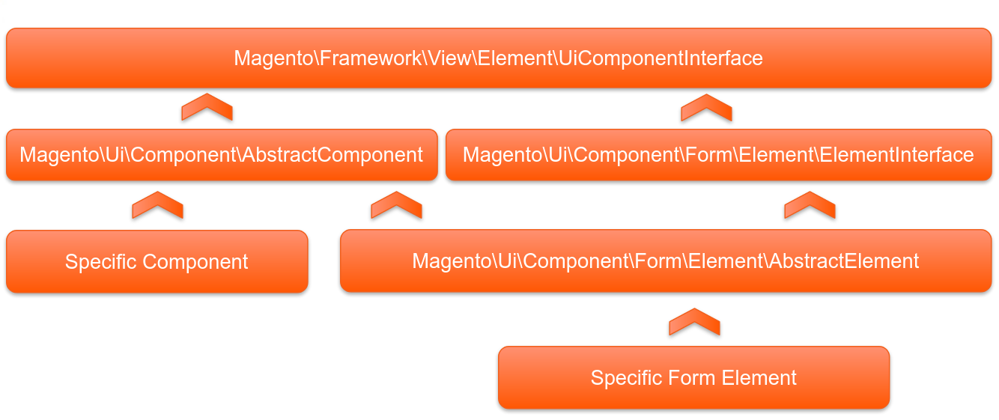

# UI компоненты

Особености:

* Используют PHP для получения, генерации данных
* Используют JS для рендеринга и функционаирования
* Не имеют эквивалента в M1
* Являются переиспользуемыми элементами
* Реализовывают концепт "рендеринг на фронте"

Примеры UI компонентов:
* Grids
* Forms
* Mini cart

## Сравнение с блоками

||**UI компонент**|**Block**|
|-|-|-|
|Корневой класс|[`Magento\Ui\Component\AbstractComponent`](https://github.com/magento/magento2/blob/2.3/app/code/Magento/Ui/Component/AbstractComponent.php)|[`Magento\Framework\View\Element\AbstractBlock`](https://github.com/magento/magento2/blob/2.3/lib/internal/Magento/Framework/View/Element/AbstractBlock.php)|
|Интерфейс|[`Magento\Framework\View\Element\UiComponentInterface`](https://github.com/magento/magento2/blob/2.3/lib/internal/Magento/Framework/View/Element/UiComponentInterface.php) наследует `BlockInterface`|[`Magento\Framework\View\Element\BlockInterface`](https://github.com/magento/magento2/blob/2.3/lib/internal/Magento/Framework/View/Element/BlockInterface.php)|
|Темлейты|HTML, XHTML, ko templates|phtml|
|Даные|Использует собственный структуру для получения данных, позволяет обмениваться данными между компонентами|Получает небоходимые для себя данные, обмен между блоками не доступен|
|Конфигурация|Через собственный XML файл конфигурации|Через лаяуты|
|Рендеринг|Через JS на фронте|Через PHP на беке|

## Иерархия классов



Как видно из диаграммы все UI компоненты наследуют [`Magento\Framework\View\Element\UiComponentInterface`](https://github.com/magento/magento2/blob/2.3/lib/internal/Magento/Framework/View/Element/UiComponentInterface.php), и бывают двух типов:

* элементы формы
* другие специфичные компоненты

### AbstractUiComponent

[`Magento\Ui\Component\AbstractComponent`](https://github.com/magento/magento2/blob/2.3/app/code/Magento/Ui/Component/AbstractComponent.php), выполняет следующие функции:

* Реализует рендеринг
* Управляет JS конфигурацией
* Управляет дочерними компонентами

### Рендеринг

Каждый компонент обычно содержит объект контекста. Этот объект инкапсулирует другие объекты и данные, которые могут понадобиться компоненту. Как правило компонент имеет иерархию, с корневым компонентом и дочерними, например: грид и фильтры, колонки и т.д.; форма и её элементы. Обычно корневой компонент начинается с xhtml шаблона, который компилирует PHP в методе `toHtml()`. Дальшнейший процесс рендеринга продолжается на стороне JS. Данные компонентов предосталяются из двух специальных классов: `DataSource` и `DataProvider`. 

### Конфигурация

На верхнем уровне находится файл опредления ([Magento/Ui/view/base/ui_component/etc/definition.xml](https://github.com/magento/magento2/blob/2.3/app/code/Magento/Ui/view/base/ui_component/etc/definition.xml)) и файлы специфичные для каждого UI компонента (Например: [Magento/Catalog/view/adminhtml/ui_component/product_form.xml](https://github.com/magento/magento2/blob/2.3/app/code/Magento/Catalog/view/adminhtml/ui_component/product_form.xml)).

Файлы определния (definition) содержат базовую информацию обо всех копонентах существующих в системе.

Специфичные файлы компонентов расширяют определения, путём добавления информации о компоненте, таккую как: источники данных, дочерние компоненты и т.д. и т.п.

Файлы используемые для конфигурации:

* [`definition.xml`]((https://github.com/magento/magento2/blob/2.3/app/code/Magento/Ui/view/base/ui_component/etc/definition.xml)) — базовый файл рапологаемый в модуле Magento_Ui, в модулях можно создать свои `definition.xml` которые будут расширять базовый.
* [`definition.map.xml`](https://github.com/magento/magento2/blob/2.3/app/code/Magento/Ui/view/base/ui_component/etc/definition.map.xml) — технический файл, который нужен для сопоставления нового синтаксиса введёного в M2.2 со старым
* XML файл конфигурации инстанса компонента — определяет настройки для конкретного инстанса копонента, копоненты определянные через `definition.xml` могут иметь множество инстансов на разных страницах. Каждый инстанс может иметь специфичнную конфигурацию, определённю в XML файле.
* XML лаяут — часть системы лаяутов M2. Когда копонент определён в `definition.xml` и его инстанс настроен через XML файл инстанса, можно добавить копонент на странице через XML лаяут.

#### definition.xml

Определение компонента:
```xml
<components xmlns:xsi="http://www.w3.org/2001/XMLSchema-instance" xsi:noNamespaceSchemaLocation="urn:magento:module:Magento_Ui:etc/ui_definition.xsd">
    <componen_name class="Componen\Class" component="Component_JS" displayArea="bottom">
        <argument name="data" xsi:type="array">
            <item name="param" xsi:type="string">values</item>
        </argument>
        <settings>
            <param>value</param>
        </settings>
    </componen_name>
</components>
```

Каждый компонент имеет связанный с ним PHP-класс и JS-компонент.

#### XML файл инстанса

Каждый UI копонент может иметь различные экземпляры. Например, разные списки могут быть представлены компонентом grid. При этом у каждого будут свои поля, фильтры, данные и т.д.

Каждый экземпляр будет иметь свой собственный файл для конфигурации. Обычно эти файлы назваются как `"имя сущности"_"имя копонента"`, напрмер для грида продуктов есть инстанс: [`product_listing.xml`](https://github.com/magento/magento2/blob/2.3/app/code/Magento/Catalog/view/adminhtml/ui_component/product_listing.xml). Это правило не строгое, при необходимости экземпляр может называться как угодно.

Файлы распологаются в _`<module_dir>`/view/`<area>`/ui\_comenent_.

Файлы копонентов мерждатся из разных модулей по имени.

#### Лаяут

Для добавление UI копонента на странице имеется специальная директива: `<uiComponent name="instance_name"/>`.

### dataSource

Каждый UI компонент имеет подкомпонент (`dataSource`), который занимается доставкой данных. В теории этот копонент независим от исходного копонента и может быть использован другим копонентом, однако на практике обычно каждый компонент имеет свой dataSource-копонент предоставляющий данные только ему.

`dataSource` копонент использует класс [`Magento\Ui\Component\DataSource`](https://github.com/magento/magento2/blob/2.3/app/code/Magento/Ui/Component/DataSource.php), который наследует [`Magento\Ui\Component\AbstractComponent`](https://github.com/magento/magento2/blob/2.3/app/code/Magento/Ui/Component/AbstractComponent.php) и реализует [`Magento\Framework\View\Element\UiComponent\DataSourceInterface`](https://github.com/magento/magento2/blob/2.3/lib/internal/Magento/Framework/View/Element/UiComponent/DataSourceInterface.php)

### dataProvider

`dataSource` не содержит данные, он извлекает их из `dataProvider`, который предоставляет данные.

`dataProvider` реализует интерфейс [`Magento\Framework\View\Element\UiComponent\DataProvider\DataProviderInterface`](https://github.com/magento/magento2/blob/2.3/lib/internal/Magento/Framework/View/Element/UiComponent/DataProvider/DataProviderInterface.php).

Примеры:

* [`Magento\Framework\View\Element\UiComponent\DataProvider\DataProvider`](https://github.com/magento/magento2/blob/2.3/lib/internal/Magento/Framework/View/Element/UiComponent/DataProvider/DataProvider.php)
* [`Magento\Catalog\Ui\DataProvider\Product\ProductDataProvider`](https://github.com/magento/magento2/blob/2.3/app/code/Magento/Catalog/Ui/DataProvider/Product/ProductDataProvider.php)

### Дочерние компоненты

Каждый копонент может иметь дочерние копоненты.

Корневой копонент рендерится через PHP в XHTML темплейт, остальные рендерятся через JS, посредсвом Knockout tamplates и HTML темплейтов.

## Темплейты и рендеринг

### Темплейты

* XHTML — определяет корневой темплейт, рендерится через PHP.
* HTML — темплейты копонентов, управляемые через движок knockout tempalte, рендерятся через JS.

По умолчанию PHP класс UI копонентов добавляет ".xhtml" к имени темплейта (определённого в конфигурации), в методе `render()` обрабатывается XHTML файл и генерируются JS инструкции, которые запускают рендеринг компонентов с использованием HTML темплейтов.

#### Определение XHTML темлейта

Определение из `definition.xml`:
```xml
<listing sorting="true" class="Magento\Ui\Component\Listing" component="uiComponent">
    <argument name="data" xsi:type="array">
        <item name="template" xsi:type="string">templates/listing/default</item>
        <item name="save_parameters_in_session" xsi:type="string">1</item>
        <item name="client_root" xsi:type="string">mui/index/render</item>
    </argument>
</listing>
```

темлейт определяется в `<item name="template">`.

Пример XHTML компонента: [Magento/Ui/view/base/ui_component/templates/form/default.xhtml](https://github.com/magento/magento2/blob/2.3/app/code/Magento/Ui/view/base/ui_component/templates/form/default.xhtml):
```html
<div xmlns:xsi="http://www.w3.org/2001/XMLSchema-instance" xsi:noNamespaceSchemaLocation="urn:magento:module:Magento_Ui:etc/ui_template.xsd">
    <div data-role="spinner" data-component="{{getName()}}.areas" class="admin__data-grid-loading-mask">
        <div class="spinner">
            <span/><span/><span/><span/><span/><span/><span/><span/>
        </div>
    </div>
    <div data-bind="scope: '{{getName()}}.areas'" class="entry-edit form-inline">
        <!-- ko template: getTemplate() --><!-- /ko -->
    </div>
</div>
```

Здесь элементы в `{{...}}`, это элементы которые будут обрабатывать маджента. Есть два типа элементов, которые включаетются в `{{}}`:
* Метод копонента
* Переменная

В дополнении к обработке содержимого `{{}}`, JS элемент с конфигурацией, данными и модулями будет сгенерирован и вставлен в низ файла.

Элемент `<!-- ko template: getTemplate() --><!-- /ko -->` будет обработан knockout tempalte.

#### Опредление HTML темплейта

Определение в `definition.xml`:
```xml
<filterSelect class="Magento\Ui\Component\Filters\Type\Select" template="ui/grid/filters/field"/>
```

Определённый файл [`Magento/Ui/view/base/web/templates/grid/filters/field.html`](https://github.com/magento/magento2/blob/2.3/app/code/Magento/Ui/view/base/web/templates/grid/filters/field.html):
```html
<label class="admin__form-field-label" attr="for: uid">
    <span translate="label"/>
</label>
<div class="admin__form-field-control" render="elementTmpl"/>
```
Этот темплейт будет обрабтаываться через knockout tempalte.

#### Компиляция XHTML

```html
<div xmlns:xsi="http://www.w3.org/2001/XMLSchema-instance" xsi:noNamespaceSchemaLocation="urn:magento:module:Magento_Ui:etc/ui_template.xsd">
    <div data-role="spinner" data-component="{{getName()}}.areas" class="admin__data-grid-loading-mask">
        <div class="spinner">
            <span/><span/><span/><span/><span/><span/><span/><span/>
        </div>
    </div>
    <div data-bind="scope: '{{getName()}}.areas'" class="entry-edit form-inline">
        <!-- ko template: getTemplate() --><!-- /ko -->
    </div>
</div>
```

* `{{getName()}}` — компилятор PHP анализирует все операторы, содержащиеся в двойных фигурных скобках и либо выполняет методы в них, или предоставляет запрашиваемые переменные.
* Движок knockout tempalte получает темплейт копонента (HTML-файл) на основе текущего скопа.

## Роль JS в UI компонентах

Ui копонент — это особый тип JS-модуля, который имеет своб собственную структуру и использует свой собственный JS фреймворк.

Некоторые UI компоненты написаны только на JS и не имеют серверной и конфигурационной части.

Обычно Ui компноненты выполняются путем передачи объекта конфигурации в JS-модуль `Magento_UI/js/core/app/module`.

Прмер вызова компонента `Magento_Customer/js/view/customer`:
```html
<script type="text/x-magento-init">
{
    "*": {
        "Magento_Ui/js/core/app": {
            "components": {
                "customer": {
                    "component": "Magento_Customer/js/view/customer"
                }
            }
        }
    }
}
</script>
```

Пример JS части UI копонента [Magento/Ui/view/base/web/js/grid/listing.js](https://github.com/magento/magento2/blob/2.3/app/code/Magento/Ui/view/base/web/js/grid/listing.js)
