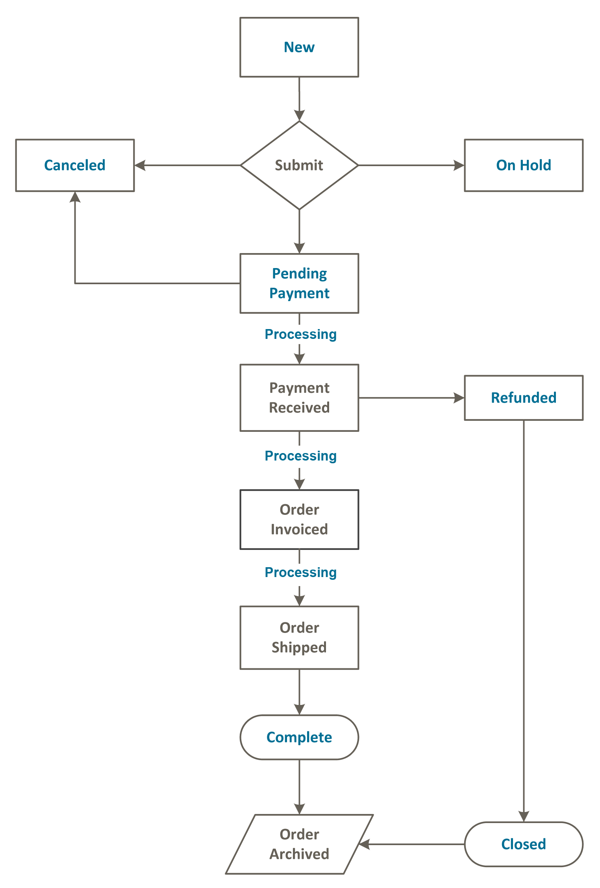

# Demonstrate ability to customize sales operations

>Describe how to modify order processing and integrate it with a third-party ERP system.

>Describe how to modify order processing flow. How would you add new states and statuses for an order? How do you change the behavior of existing states and statuses?

>Described how to customize invoices. How would you customize invoice generation, capturing, and management?

>Describe refund functionality in Magento. Which refund types are available, and how are they used?

[Magento 2 Certification: Customize Sales Operations](https://belvg.com/blog/magento-2-certification-customize-sales-operations.html)

## Describe how to modify order processing and integrate it with a third-party ERP system.

Для кастомизации можно использовать плагины и ивенты.

Плагины можно сделать для класса [`Magento\Quote\Model\QuoteManagement`](https://github.com/magento/magento2/blob/2.4/app/code/Magento/Quote/Model/QuoteManagement.php):
* [`Magento\Quote\Model\QuoteManagement::placeOrder()`](https://github.com/magento/magento2/blob/2.4/app/code/Magento/Quote/Model/QuoteManagement.php#L366) — готовит квоту и отправляет её в метод `submit()` который возвращает заказ.
* [`Magento\Quote\Model\QuoteManagement::submitQuote()`](https://github.com/magento/magento2/blob/2.4/app/code/Magento/Quote/Model/QuoteManagement.php#L495) — создаёт заказ из квоты

Ивенты:
* [`sales_model_service_quote_submit_before`](https://github.com/magento/magento2/blob/2.4/app/code/Magento/Quote/Model/QuoteManagement.php#L556) — перед размещением заказа
* [`sales_model_service_quote_submit_success`](https://github.com/magento/magento2/blob/2.4/app/code/Magento/Quote/Model/QuoteManagement.php#L566) — после удачного размещения заказа
* [`sales_model_service_quote_submit_failure`](https://github.com/magento/magento2/blob/2.4/app/code/Magento/Quote/Model/QuoteManagement.php#L690) — после неудачного размещения заказа
* [`checkout_submit_before`](https://github.com/magento/magento2/blob/2.4/app/code/Magento/Quote/Model/QuoteManagement.php#L409) — перед началом создания заказа
* [`checkout_submit_all_after`](https://github.com/magento/magento2/blob/2.4/app/code/Magento/Quote/Model/QuoteManagement.php#L425) — после создания заказа (последний ивент)

## Describe how to modify order processing flow.

В Magento 2 есть система состояний (state) и статусов (status) заказа. Состояние заказа отображает актуальную позицию во флоу заказа и отображет какие действия доступны заказу. Состояние может иметь несколько статусов заказов, которые отображают позицию заказа на данном участке флоу. Отношения состояний и статусов хранится в таблице `sales_order_status_state`.

Для изменения статуса и состояния используются методы модели заказа ([`Magento\Sales\Model\Order`](https://github.com/magento/magento2/blob/2.4/app/code/Magento/Sales/Model/Order.php)) [`setStatus()`](https://github.com/magento/magento2/blob/2.4/app/code/Magento/Sales/Model/Order.php#L3512) и [`setState()`](https://github.com/magento/magento2/blob/2.4/app/code/Magento/Sales/Model/Order.php#L1070). Для добавление записи в истории заказа есть метод [`addStatusToHistory()`](https://github.com/magento/magento2/blob/2.4/app/code/Magento/Sales/Model/Order.php#L1105).

Общее описание флоу:
1. Создаётся заказ ему ставится статус указанный в конфигураци _New Order Status_ у выбранного метода оплаты, обычно это `pending`.
2. Создаётся инвойс (вручную при оплате картой или автоматически при оплате онлайн). Заказу ставится статус `processing`. Или заказ холдруется (статус `hold`).
3. Потом происходит доставка (например, можно в админке нажать кнопку "Ship").
4. После создания доставки заказу ставится статус `complete`.

## Described how to customize invoices

Модель инвойса: [`Magento\Sales\Model\Order\Invoice`](https://github.com/magento/magento2/blob/2.4/app/code/Magento/Sales/Model/Order/Invoice.php), реализует [`Magento\Sales\Api\Data\InvoiceInterface`](https://github.com/magento/magento2/blob/2.4/app/code/Magento/Sales/Api/Data/InvoiceInterface.php) и [`Magento\Sales\Model\EntityInterface`](https://github.com/magento/magento2/blob/2.4/app/code/Magento/Sales/Model/EntityInterface.php).

Для созадние инвойса используется метод [`Magento\Sales\Model\Service\InvoiceService::prepareInvoice()`](https://github.com/magento/magento2/blob/2.4/app/code/Magento/Sales/Model/Service/InvoiceService.php#L148)

Ивенты:
* [`sales_order_invoice_pay`](https://github.com/magento/magento2/blob/2.4/app/code/Magento/Sales/Model/Order/Invoice.php#L379)
* [`sales_order_invoice_cancel`](https://github.com/magento/magento2/blob/2.4/app/code/Magento/Sales/Model/Order/Invoice.php#L358)
* [`sales_order_invoice_register`](https://github.com/magento/magento2/blob/2.4/app/code/Magento/Sales/Model/Order/Invoice.php#L668)

Есть два типа инвойсов:
* online — вызывают метод `capture()` для оплаты, который отправляет данные для оплаты в сервис оплаты. 
* offline — меняют платёжную информацию только в Magento, без отправки во внешние сервисы.

## Describe refund functionality in Magento

Для возврата средств в Magento исользуется кредит мемо. Модель кредит мемо: [`Magento\Sales\Model\Order\Creditmemo`](https://github.com/magento/magento2/blob/2.4/app/code/Magento/Sales/Model/Order/Creditmemo.php), реализует [`Magento\Sales\Api\Data\CreditmemoInterface`](https://github.com/magento/magento2/blob/2.4/app/code/Magento/Sales/Api/Data/CreditmemoInterface.php) и [`Magento\Sales\Model\EntityInterface`](https://github.com/magento/magento2/blob/2.4/app/code/Magento/Sales/Model/EntityInterface.php).

Для созадние кредит мемо используется метод [`Magento\Sales\Model\Service\CreditmemoService::refund()`](https://github.com/magento/magento2/blob/2.4/app/code/Magento/Sales/Model/Service/CreditmemoService.php#L145). Кредит мемо незлья создать без налчия инвойса.

Возврат можно делать как для всего заказа так и для его части: конкретных айтемов, доставки, налога.

Есть два типа кредит мемо:
* online — отправляет данные для оплаты в сервис оплаты. Использует метод `refund()` метода оплаты.
* offline — меняет информацию только в Magento, без отправки во внешние сервисы.
