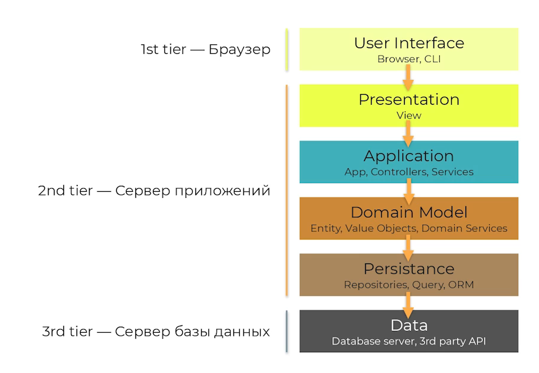
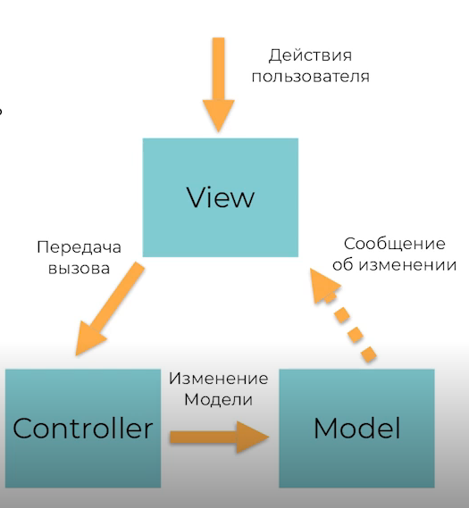
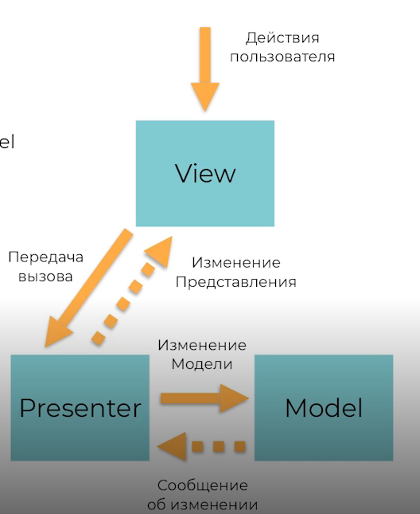
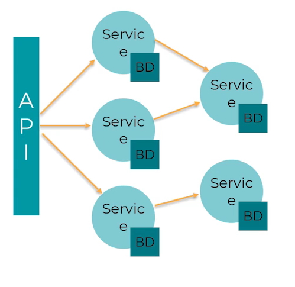
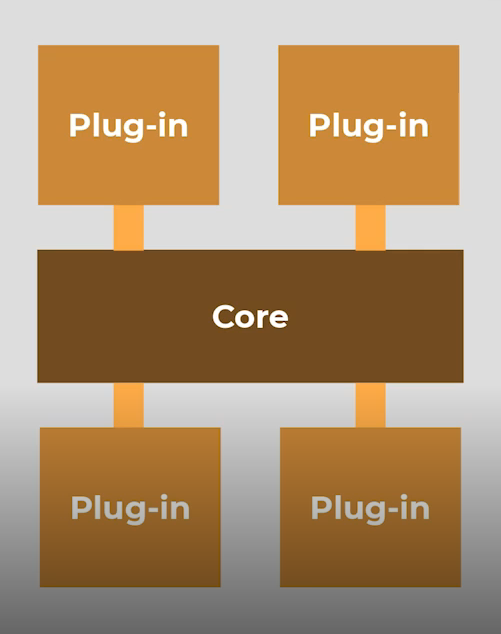
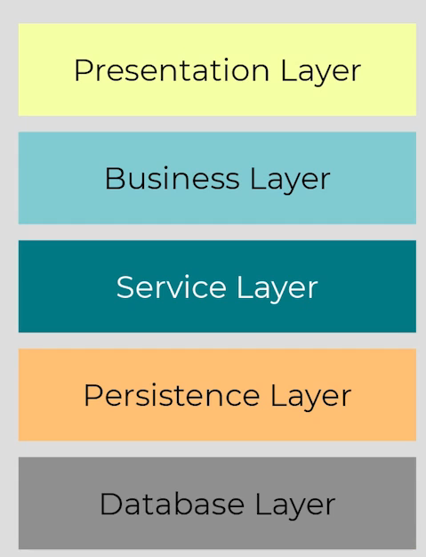

# Архитектурные стили

## Фундаментальные архитектурные стили

### Одноуовневая архитектура

1950e

* Отсутвует GUI (используется CLI)
* Очень простые приложения
* Не масштабируемые приложения

### Двухуровневая архитектура (client-server)

1980е

* ООП
* C++, Erlang, Perl
* Разделение ответственности
* Проще обновлять

### Многозвенная архитектура (N-tier architecrure)

1990е-2000е

* Ещё проще обновлять (большая часть логики на сервере)

#### Model-view-controller (MVC)

* Структурирует код
* Разделяет ответственность

От него пошли связанные Патерны:

* Model-View-Presenter
* Model-View-ViewModel
* Model-View-Presenter-ViewModel

### SOA (Service oriented architecture)

* SOA — набор принципов
* Ключивая концепция сервисы
* Примеры:
  * Web-services
  * ESB
  * Микросервисы

### EDA (Event-Driven-Architecture)

* Ключевая сущность — события
* Более слабая связанность между сервисами и асинхронная интегация
* Включает подходы:
  * Event notification
  * Event-Sourcing
  * CQRS

### Микросервисы

* Каждый сервис должен делать что-то одно и делать это хорошо
* Набор паттеронов
* Большой акцент на организационную структуру и инженерные практики

### Cloud

* Предоставление ресурсов по подписке (как сервис)
* Облака это про:
  * IaaS
  * PaaS
  * SaaS
* Стало драйвером для новых направлений архитектуры
* Community и стандарты

### Serverless

* Драйверы:
  * Разумная утилизация ресурсов
  * Разделение ответственности
* Ваша задача — это код. Вы вообще не думаете о среде исполнения
* Поволяет достичь максимальной эластичности
* Из минусов:
  * время старта приложений
  * vendor lock
  * затрудняет отладку

## Монолит

* **Устанавливается** и исполняется как один **процесс** на одном **узле**

### Стили

Основные:

### Microkernel

Ключевые компоненты

* Ядро
* Плагин
* Реестр

В центре находиться ядро с минимальным функционалом системы, к нему подключаются плагины, имплементирующие клиентскую логику. В идеале плагины не зависимы между собой. Регистр используется для управления плагинов, в просто варианте это мапинг нужных плагинов.

Примеры:
* IntelliJ IDEA
* Jenkins
* Google Chrome

Когда использовать:
* Вы являетесь вендором, а приложение — конечный продукт
* Приложение развёртывается в разных условиях
* Кажется, что нужны разные дистрибутивы, но ядро общее

### Layered (N-tier)

* Стандарт де-факто для большинства приложений
* Прост в разработке
* Хорошо ложится на организационную структуру большинства организаций

Каждый слой может быть либо "закрытым", либо "открытым". 

Закрытый слой обозначает, что запрос должен пройти этот слой перед тем как спуститься на следующий, открытые слои запрос может пропускать.

Стоит избегать антипаттерна Sinkhole, когда запрос проксируется без обработки.

Когда использовать:
* Если не знаете, какую архитектуры выбрать, эта наиболее универсальна
* Маленькие web-приложения
* Нет четких требований к системе

### Modular

* Разделения кода по доменным облостям бизнеса
* ядро системы — бизнес-домены

Когда использовать:
* Вы проектируете большое приложение с множеством команд
* В планах есть миграция на микросервисы

## Мнолит — хорошо или плохо

Зависит от размера монолита:

Пока он маленький, его просто
* Разрабатывать
* Тестировать
* Развертывать
* Масштабировать

Когда он подрос, его сложно:
* Разрабатывать
* Делать изменения
* Тестировать
* Масштабировать

# Монолит vs. Распределенная архитектура

## Заблужденя

* Сеть надежна
* В сети нет задержек
* Пропускная способность бесконечна
* Сеть безопасна
* Топология никогда не меняется
* Администратор всегда один
* Цена передачи данных нулевая
* Сеть однородна

### Сеть надёжна

* Все распределённые приложения общаются по сети
* Сеть может отказать
* Нужно проектировать систему на отказ сети:
  * Circuit Breaker
  * Health-check
  * Timeouts

### В сети нет задержек

* Вызовы внутри одного приложения всегда быстрее удалённых вызовов
* Latency — одна из вжнейших метрик в распределённой архитектуре

### Пропускная способность бесконечна

* У сети есть ограничение по пропускной способности
* Излишняя утилизация пропускной способности приводит к:
  * ошибкам
  * увеличению Latency

### Сеть безопасна

* Сетевой трафик может быть перехвачен
* Без должной защиты к сервисам имеет доступ кто угодно
* Всегда есть компромисс между безопасностью и производительностью/удобством

### Топология никогда не меняется

* Между сервисом A и сервисом B находится множество сетевых устройств
* Топология сети постоянно меняется
* Архитектору нужно поддерживать связь с инфраструктурными отделами, в частности с сетевым администратором

### Администратор всегда один

* В больших компаниях много администраторов и отделов
* Когда проблема на стыке отделов, решить её сложно
* Сложность распределённых систем включает большое количество коммуникаций

### Цена передачи данных нулевая

* Коммуникация по сети всегда дороже локальной коммуникации
* "Дороже" — это про деньги
* Требуются дополнительные расходы на:
  * железо
  * сервера
  * шлюзы
  * балансировщики
  * и т.д. 
* Cloud (IaaS) и Serverless помогают сэкономить

### Сеть однородна

* В сети работают разные устройства
* У этих устройств могут быть рзаные операционные системы
