# Нефункциональные требования

## Выявление нефункциональных требований

Нефункциональные требования (НФТ) — это определяющие свойства, которые система должна демонстировать, или ограничения, которые она должна соблюдать, не относящиеся к поведению системы. Например, производительность, удобство сопровождения, расширяемость, надёжность, факторы эксплуатации.

Нефункциональные требования (НФТ) — это такие аспекты системы, которые напрямую не определяют бизнес-функциональность, но имеют значительное влияние на эффективность и полноту реализации системы для конечных пользователей, а также для тех, кто поддерживает систему.

По сути, требования можно определить так:
* Зачем? — Бизнес-требования
* Что? — Функциональные требования
* Как? — Нефункциональные требования

### НФТ позволяют

Оценить на ранней стадии:
* Стоимость и трудоёмкость решений
* Принципиальную возможность реализации системы
* Необходимые архитектурные решения
* Список характеристик и их важность для подсистем, которые были выделены в процессе переработки функциональных требований

### Шаги выявления НФТ

* Подготовка для работы с требованиями:
  * Обозначить план и границы исследования
  * Подготовить ресурсы
  * Подготовить вопросы и базовые модели
* Сессия выделения требований
* Документирование результатов
  * Обработать заметки и выслать участникам
  * Записать нерешённые вопросы

### Техники выявления НФТ

#### Интервью

* Опрос стейкхолдеров системы, чего они хотят?
* Наиболее популярный метод

При проведении интервью важно:
* Должное представление для обеспечения важности раговора
* Сфокусированность на задаче
* Подготовка вопросов и общее знание домена
* Проработк альтернативных идей
* Активное слушание

Плюсы:
* лёгкость доступа
Минусы:
* Время на подготовку
* Время на обработку ответов

#### Мастер-классы

* Если есть сильные рзногласия в видение
* надо обозначить НФТ быстро

Стоит обратить внимание:
* Продумать план и правила
* Модерация дискусий
* Отложенные дискусии
* Временные рамки
* Выбор участников
* Групповая динамика

Плюсы:
* легче разрешать конфликты
* быстрее формируется общее видение
Минусы:
* Нужен опыт модерирования
* Строгая подготовка к мастер-классу
* Боссы на собрании

#### Фокус-группы

* Если нет прямого доступа к пользователям
* Группа слишком обширна, чтобы выбрать представителей (одного-трёх)

Стоит обратить внимание:
* Что за опыт должен быть или не быть у участников?
* Трансляция своего мнения
* Для каждой группы стоит готовить свой набор артефактов
* Стоит следить за тем, не навязываете ли вы своё собственное мнение

Плюсы:
* легче разрешать конфликты
* быстрее формируется общее видение
Минусы:
* Нужен опыт модерирования
* Строгая подготовка к мастер-классу
* Определение ключевых различий

#### Наблюдение

* Как реально пользователи работают?
* Неуказанные шаги и требования

Стоит обратить внимание:
* Попробовать самому по описанию
* Постоять за плечом
Плюсы:
* Прямое погружение в проблематику
Минусы:
* Нельзя попробовать из-за сложности процесса
* Нельзя воспроизвести из-за неизвестности профилей пользователей

#### Формы опросов

* Необходимо охватить большую группу людей
* Есть продолжительное время на ожидание ответов

Стоит обратить внимание:
* Опросы могут не отражать то, что вы хотите узнать на самом деле
Плюсы:
* Дёшево
* Охват
Минусы:
* Низкий процент ответов
* Проблемы формулировки
* Время для работы со значимой выборкой

#### Анализ связанных систем

##### Анализ программных интерфейсов

* Аналих API связанных систем

##### Анализ пользовательских данных

* Бизнес-поток — что в каком порядке идёт
* Типичные операции

* Не стоит воспринимать всё должное при анализе старой системы, не стоит дословно повторять ошибки

##### Анализ доступности документации

* Требования к предыдущей системе
* Отчёты по задачам доменов
* Разборы ошибок
* Руководство пользовтелей

Минусы:
* Устаревание
* Сложность выделения сути

#### Выводы

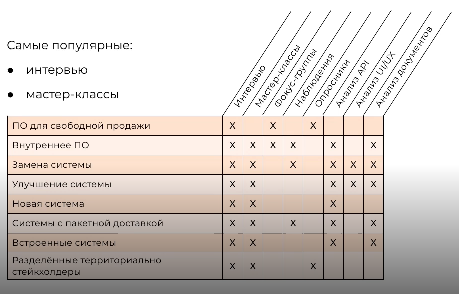

### Проверяемость НФТ

Пример: Клиент должен оплатить часть заказа перед тем, как его отправят.
* В какой срок оплатить?
* Кукую часть?
* Каким способом?
* Зависит ли размер предоплаты от способа и времени доставки?

### Группы НФТ

* Требования конечных пользователей
* Бизнес-правила
* Атрибуты качества
* Аспекты поведения
* Требования к API и коммуникации
* Ограничения
* Требования к данным
* Идеи решений

### Итеративность

Одной сессии с выявлением НФТ обычно не достаточно, скорее всего понадобиться несколько.

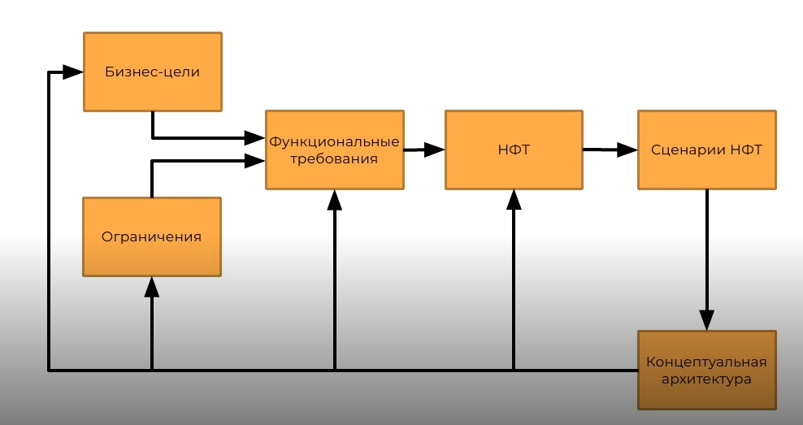

### Когда заканчивается фаза анализа?

* Участники сами ранжируют НФТ
* Сценарии, не ведущие к новым НФТ (альтернатива уже имеющимся)
* Самоповторы
* Предложения выходят за границу проекта
* Новые НФТ сразу смело можно отнести к категории "было бы хорошо"
* Новые НФТ относятся к далёкому будущему развития проекта
* Представители разработчиков и тестировщиков перестают заваливать вопросами учатникам, предложившего новый сценарий

### Ментальные ловушки

* Слепое следование рамкам: новые требования могут обосновано менять сложившееся описание, а порой и бизнес-цели
* "Дизайн — не требование"
* "Само собой разумеющееся"
* "Если" без вариантов

### Вывод

Не стоит пытаться найти и проработать все требования. Любое решение лучше неопределённости.

## Детализация нефункциональных требований

### Нужна опытная команда

В группу по выявлению НФТ важано превлечь:
* Бизнес-аналитиков
* Архитекторов
* Вудущих разработчиков
* Ведущих тестировщиков

* Пользователи
* Администраторы
* Представители соседних систем
* Специалисты по безопасности
* Юристы и т.д.

### Характеристики НФТ

* Полнота
* Однозначность — избегать общих формелировок
* Корректность и согласованность
* Необходимость
* Осуществимость
* Проверяемость — нужны однозначные критерии проверки для НФТ

### Категории НФТ

* Требования конечных пользователей
* Бизнес-правила
* Атрибуты качества
* Аспекты поведения
* Тебования к API и коммуникации
* Ограничения
* Требования к данным
* Идеи решений

Сценрий атрибутов качества — композиция НФТ, описывабщих выжные бизнес-сценарии с учетом характеристик системы.

Атрибуты качества — характеристики системы.

### Сценарии атрибутов качества

* Бизнес как обычно — поведение системы в обычном режиме работы
* Сценарии роста — поведение системы при расширении
* Сценарии исследования — незапланированные, стресовые ситуации для системы

Сценарии атрибутов качества должны отражать наиболее важные сценарии, без которых вся остальная система не имеет смысла.

Сценарии атрибутов качества направлены на:
* Обнаружение рисков
* Выявление предположений

#### Анатомия сценариев

Сценарий состоит из:
* Источник (Source)
* Стимул (Stimulus)
* Артефакт (Artifact)
* Ответ (Responce)

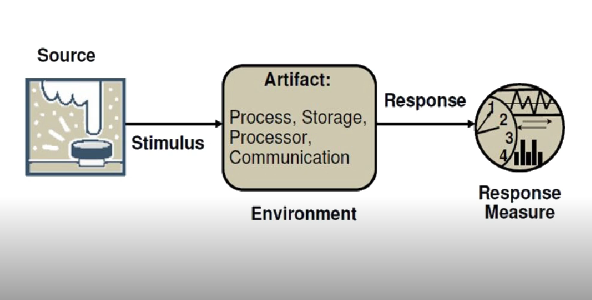

#### Примеры

* Обычное повдение — пользователь сайта запрашвает отчёт X через веб-приложение в течение часа пик и получае его в течени 5 секунд.
* Расширение — добавление нового сервера данных уменьшит задержку в сценарии от 1 до 2.5 секунд и на это потребуется 1 человеко-неделя.
* Исследование — половина серверов отказывает в течение обычных часов работы системы без наступления ухудшения общей доступности системы.

### Выводы

* НФТ определяет, **как** система будет себя вести
* Помните о НФТ, описывающих расширение системы и рекцию на непредвиденные ситуации
* НФТ пишутся группой специалистов
* НФТ должны быть проверяемыми

## Атрибуты качества

Существует множество атрибутов качества, фактически это любая характеристика системы, которую можно вызарзить числено.

### Модели качеста

Модели качества работают с наборами атрибутов и распеделяют их по логическим группам и уровням.

* ISO 20010
* ГОСТ 34
* МакКолл (McCall's Quality Model)
* Боэм (Boehm's Quality Model)
* Дроми (Dromey's Quality Model)

### Группы атрибутов качества

Все атрибуты качества с точки зрения архитектуры системы можно разделить на:

* Runtime — атрибуты, относящиеся ко времени работы ПО
  * Доступность
  * Надёжность
  * Масштабируемость
  * Время хранения данных
  * Удобство использования
  * Безопасность
  * Конфигурируемость
  * Производительность
* Design — атрибуты, определяющие аспекты проектирования ПО
  * Повторное использование
  * Расширяемость
  * Переносимость
  * Взаимодействие с другими системами
  * Поддерживаемость
  * Модульность
  * Тестируемость
  * Локализация

### Наиболее популярные атрибуты

#### Доступность (Availability)

Доступность — это период времени, в течении которого система функционирует нормально и без сбоев.

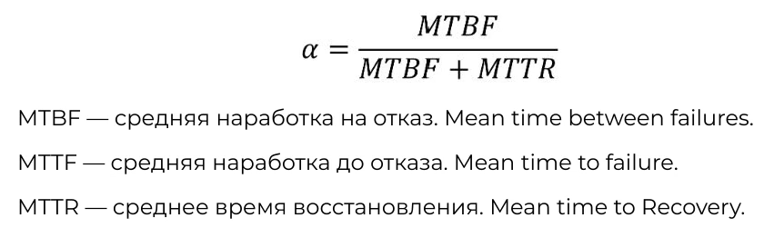

На доступность влияют сбои, исключения, проблемы инфраструктуры, вредоносные атаки, обслуживание и обновление.

Для обычных бизнес-систем рекомендуется сосредоточиться на сокращении времени восстановелния. Т.к. падения в любом случае не избежны.

Доступность выражается в процентах, для большинства бизнес-приложений — **95-99%**, при этом в это значение не входит запланированное время на обслуживание.

В высокодоступных системах, доступность характерезуется 99.999% и выше.

В зависимости от бизнес-задач, для обеспечения доступности можно использовать такие тактики:
* Быстрое определение отказов. Используется когда данные на сервисе не важны или их можно легко восстановить. Реализуется с помощью:
  * Ping/Echo
  * Heartbeat
  * Exception
* Восстановление — сокращение времени простоев. Используется для сервисов ответственных за сохранение данных, при этом потеря данных может быть болезнена, но не катострофична. Может быть разделена на две группы
  * Подготовка и починка
    * Voting
    * Active redundancy
    * Passive redundancy
    * Spare
  * Повторный запуск
    * Voting
    * Active redundancy
    * Passive redundancy
    * Spare  
* Предотвращение отказов. Используется для жизненно важных сервисов, когда потеря данных или отказ в обслуживании может привести к серьёзным последствиям
  * Removal from service
  * Transactions
  * Process monitoring

Уточняющие характеристики:
* Локализация операций
* Требование работы без доступности сети
* Восстанавливаемость
* Устройчивость

#### Изменяемость (Modifiability)

Изменяемость — стоимость изменения и лёгкость, с которой проектируемая система может аккамулировать изменения.

Качествено изменемость зависит от таких параметров:
* Средняя стоимость изменения внутри одной области ответственности
* Связанность компонентов — coupling
* Сплоченность компонентов — cohesion
* Время внесения изменений в жизни приложения

Тактики:
* Локазация изменений
  * Semantic coherence
  * Anticipated expected changes
  * Generalize module
  * Limit possible options
  * Abstract common services
* Предотвращение неконтролируемых изменений
  * Hide information
  * Maintain existing interface
  * Restricy communication paths
  * Use an intermediary
* Разделение времени сборки
  * Runtime registration
  * Configuration files
  * Polymorphism
  * Component replacment
  * Adherence to defined protocols

В рамках характеристики стоит задться вопросами:
* Насколько легко будет ввести новые типы данных?
* Как будут вводится или потребляться новые интеграции
* Отслеживаемость операций в распределённом окружении

#### Скорость (Perfomance)

Производительность определяется как отзывчивость приложения на выполнение конкретных задач в заданный промежуток времени.

* Пропуская способость — это количество событий в заданом промежутке времени
* Задержка — это время, необходимое для реакции на событие

Такстики:
* Спрос на ресурсы. Характерезуется двумя основными параметрами: время между запросами и сколько ресурсов потребляет каждый запрос.
  * increase computation efficiency
  * Reduce computation efficiency
  * Manage event rate
  * Control frequency of sampling
* Управление ресурсами
  * Introduce concurrency
  * Maintain multiple copies
  * Increase available resources
* Разрешение конфликтов
  * Scheduling policy
  * Synchronization policy

Здесь ресурсы — это вся железная начинка инфраструктуры для системы, а также сервисы и программное обеспечение.

Критерии для планирования:
  * Оптимальное использование ресурсов
  * Минимизация количества используемых ресурсов
  * Минимизация задержек
  * Максимизация пропускной способности
  * Минимизация простоя для обеспеченя равной загрузки

Производительность непосредственно влияет на масштабируемость ПО, повышение производительности часто увеличивает масштабируемость за счёт сокращения общих ресурсов, а это влечёт за собой штраф на согласованность данных. Также повышение проиводительности уменьшает изменяемость и наоборот. 

#### Безопасность (Security)

Безопасность — это возможность избежать вредоносные событий и прицендентов при проектировании использования системы, а также предотвратить потерю информации.

Реализация этого атрибута влияет на целостность и конфиденциальность информации.

Тактики:
* Опредение атаки
  * Verify message integrity
  * Verify storage integrity
  * Maintain audit trail
  * Identify intrusion
* Остановка и смягчение атаки
  * Authenticate subjects
  * Autorize subjects
  * Detect origin of messages
  * Establish security channel
  * Manage security channel
  * Manage security data
  * Hide data
* Реакция на атаки
  * Alert subjects
  * Apply institutions policies
* Восстановление после атаки
  * Audit actions
  * Apply institutions policies

##### Zero tolerance

В последнее время популяризируется модель Zero tolerance или "никому не доверяй". Она основана на предположении, что сеть в пределах корпоративного брендмаузера небезопасна, а все запросы расматриваются так, как есл бы они поступали из открытой сети.

Каждый запрос проходит все проверки и авторизации.

Безопасность затрагивает производительность, усиление безопасности приводит к её снижению. Также безопасность может влиять на эластичность и масщтабируемость системы.

При проектировании безопасности стоит обрать внимание на OWASP-10.

#### Тестируемость (Testability)

Система тестируема, если она легко "отдаёт" свои ошибки.

Облегчают тестируемость следующие аспекты:
* Контроль над вводом данных
* Низкая связанность
* Низкая согласованность данных (Eventual consistncy)

На проде систему возможно тестировать с помощью [Simian army](https://github.com/Netflix/SimianArmy) от netflix

Тактики:
* Контроль и наблюдение за состоянием системы
  * Specialized interfaces
  * Record/Playback
  * Localize state storage
  * Abstract data sources
  * Sandbox
  * Executable assertions
* Ограничение сложности
  * Limit structural coplexity
  * Limit nondeterminism 

#### Удобство использования (Usability)
 
Юзабилити заботится о том, насколько легко пользователю выполнить желаемую задачу, а также о том, какую пользовательскую поддержка обеспечивает система.

* изучение возможностей ПО
* эффективное использование системы
* минимизация влияния ошибок
* адаптация системы под нужды пользователя
* повышение уверенности и удовлетворенности

Тактики:
* Поддержка инициативы пользователя
  * Cancel — отмена операций
  * Undo
  * Pause/Resume
  * Aggregate
* Поддержка иницифиативы системы
  * Maintain Task model
  * Maintain User model
  * Maintain System model

Юзабилити часто идёт без укзания численных характеристик, например:
>Система должна автоматически запоминать введённые данные и показывать их, когда пользователь вернётся к форме или шагу процесса

### Самое важное

Конфигурация атрибутов качества уникальая для каждой системы.

### Выводы

* НФТ направлены на удовлетворение одного или нескольких атрибутов качества
* Атрибуты качества должны описываться с измерениями
* Выделенные атрибуты качества подсказывают, какие шаблоны и подходы использовались
* Усиление одного атрибута ведёт к ослаблению других

## Использование атрибутов качества для создания архитектуры

### Quality attribute workshop

1. Подготовить ~20 консолидированных сценариев, отражающих наболее важные функции системы
  * Если это сложно, то выбрать один из центральных модулей и сконцентрироваться на требованиях из него
2. Убедится, что все понимают смысл сценариев
3. Закрытое голосование за сценарии с распределением половины очкков
4. Оглашение результатов и обсуждение
5. Закрытое голосование с распределием оставшихся очков
6. Оглашение результатов и обсуждение
7. Подведение итогов

#### Голосование

* Каждый участник получает количество голосов, раное 1/3 общего количества консолидированных сценариев
* Участник может распределить голоса в любой форме. Можно все отдать за один сценарий, или за каждый понравившийся по одному

Пример:
* 15 сценариев
* 5 голосов на каждого участника

Варианты голосования:
* Вариант 1:
  * Сценарий 1 — 5
  * ...
  * Сценарий 15
* Вариант 2:
  * Сценарий 1 — 1
  * Сценарий 2 — 1
  * ...
  * Сценарий 15 - 1
* Вариант 3:
  * Сценарий 1 — 2
  * ...
  * Сценарий 15 - 3

#### Подведение итогов

* После первого раунда голосование очень быстро приходит понимание важности историй, за которые хочешь проголосовать
* По итогам всего голосования получается быстрое ранжирование историй по важности по мению присутвующих
* Если время позволяет, то можно разобрать тор-3 на детальные аспекты:
  * риски
  * предположения
  * обозначить и обсудить связанные НФТ

#### Шаблон для детального разбора

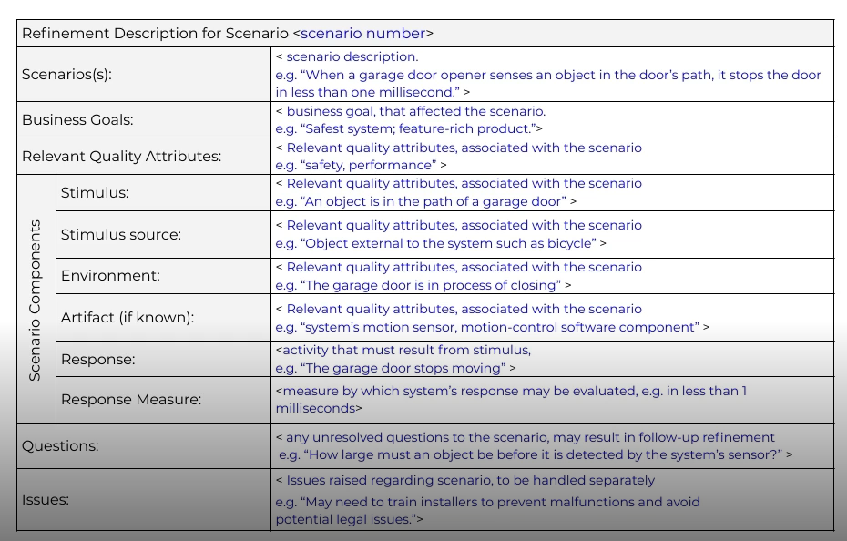

#### Как использовать результаты?

В результата получается список сценариев ранжированный по голосам. Полученый список нужно проанализировать и выделить атрибуты качества каждого.

|Сценарий|Голоса|Атрибуты качества|
|-|-|-|
|Сценарий 1|32|Изменяемость, поддерживаемость|
|Сценарий 2|30|Безопасность, удобство|
|Сценарий 3|25|Изменяемость|
|Сценарий 4|12|Скорость|
|Сценарий 5|12|Удобство, скорость|
|Сценарий 6|11|Тестируемость|
||||
|Сценарий 15|0|Изменяемость, безопасность|

Таким образом мы получаем инормацию о наиболее значимых атрибутах качества для системы в целом, вверху списка будут те качества, которые необходимо обеспечить в архитектуре в первую очередь.

Далее нужно взять схему разделения на домены и тактики для атрибутов и решать какие тактики наиболее подходят для требований и ограничений.

#### Пример

* Сайт для домоуправляющей кампании
* Пользователи — жители домов

Общий подход: трёхзвенная реализация.

Пользовательский интерфейс <-> Бизнес-правила и модули <-> Севисы данных

##### Атрибуты качества

Т.к. система новая и полный функционал неизвестен на первое место выйдет возможность быстрого добавления новых функций.

* Первый раунд дизайна:
  * Изменяемость 
* Второй раунд дизайна:
  * Безопасность
* Третий раунд дизайна:
  * Быстродействие
  * Расширяемость
  * Доступность

##### Выбор тактик (Раунд 1)

На самом высоком уровне изменяемость реализуется с помощью многозвенного подхода.
Функционал, реальные нагрузки на до конца ясны, требуется гибкость в реализации и поддержке.

Тактики:
* Abstract common Services
* Semantic coherence
* Use an intermediary
* Maintain existing interfaces

Как достичь?
* Разделение системы на звенья
* Модульность

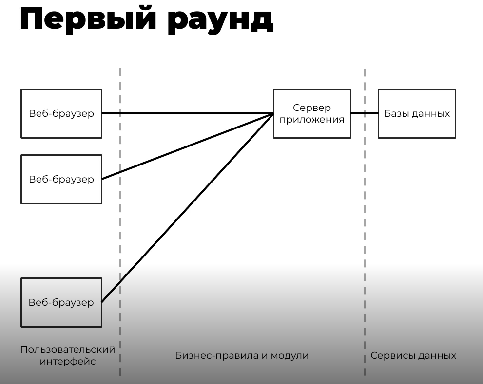

##### Выбор тактик (Раунд 2)

Тактики:
* Limit access
* Maintain integrity
* Limit exposure
* Maintain data confidentiality

Как достичь?
* Использование роутеров, firewalls, reverse-proxy
* Шифрование для публичных сетей, используя SSL (HTTPS) протокол
* Аутентификация по имени/паролю на серверах приложений

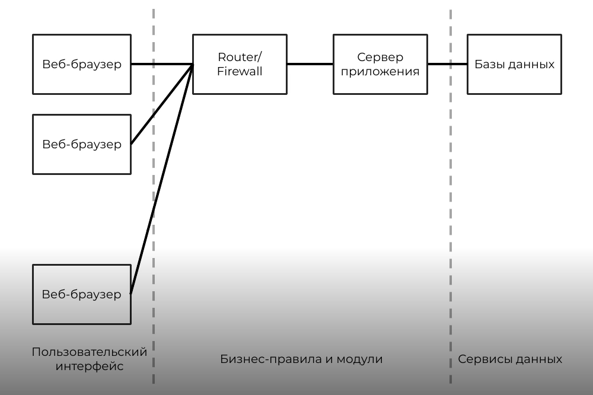

Применение идёт с учётом приоритета для предыдущих решений, т.е. если какое-то предыдущее решние не позволяет максимально удовлетворить требование безпасноти, то так тому и быть, нужно задокуметировать риски для дальнейшего согласования.

##### Выбор тактик (Раунд 3)

Тактики:
* Introduce concurrency
* Maintain multiple copies
* Increase available resources
* Scheduling policy

Как достичь?
* Репликация серверов
* Балансировка нагрузки

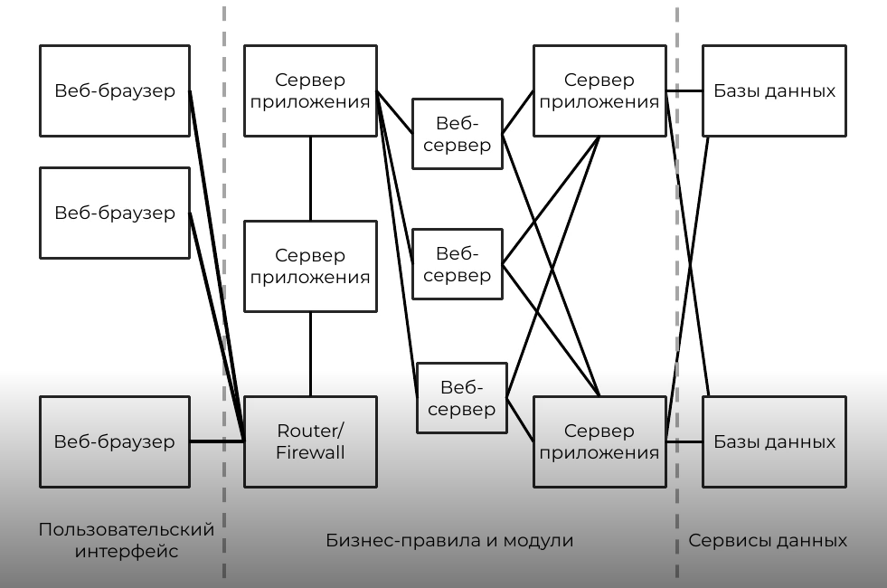

Таким образом итеративно строится дизайн архитектуры, последовательно решая наиболее важные требования.

### Самопроверка

Плюсом упорядочивания является то, что можно заметить пробелы в характеристках системы.

Если какие-то аспекты упущены, то можно повторить анализ узнав действительно ли эти аспекты системы не важны.

### Документация решений

Нужно документировать:
* Принятые решения
* Предложенные решения
* Отвергнутые решения

Для записи предлагается использовать [Architectural Decision Records](https://adr.github.io/)

### Самое важное

Построение архитектуры — это не стихийный процесс, а планомерное, заранее известное выполнение шагов.

### Выводы

* Упорядоченный и консолидированный по критериям бизнес-сценариев список НФТ позволяет определить важнейшие атрибуты качества системы
* Тактики реализации атрибутов качества позволяют пошагово определить концептуальный вид архитектуры

## Фитнес-функции архитектуры

Фитнес-функции обеспечивают объективную оценку соблюдения архитектурных характеристик, которые могут включать в себя существующие критерии проверки, такие как: тестирование модулей, метрики, мониторы и т.д.

### Инструментарий

* Тесты — юнит, интеграционные, производительности
* Метрики и их тренды
* Мониторинг железа
* Мониторинг бизнес-процессов

Фитнес-функции строятся для наиболее важных атрибутов качества.

### Metric-Driven Development

Нужно избегать ловушку Metric-Driven Development, когда за метриками теряется смысл процессов и конечная цель.

Важно знать что стоит за этими метриками, для чего они собираются, какую бизнес-задачу отражают.

**Архитектура — это не про технологии, это про то, как эффективно решить проблемы бизнеса**

### Технические аспекты

* Версия в тестировании не должна отклоняться от других библиотек в продакшене более чем на две минорных версии.
* Запрещается использовать пароли открытым текстом в коде
* Всегда должна быть стадия тестирования безопасности
* У каждого сервиса должна быть настроена своя учётная запись безопасности
* Каждое изменение кода должно иметь как минимум двух проверяющих и на прод уходит образ с тестирования, а не из мастера.

### Качество кода

* Изменяемость
* Управляемость
* Конфигурируемость

Если эти качества в топе списка, то можно обратить внимание на покрытие тестами, и количество тестов, но важно не задирать планку покрытия иначе можно получить сквозное покрытие не помогающее в обнаружении проблем.

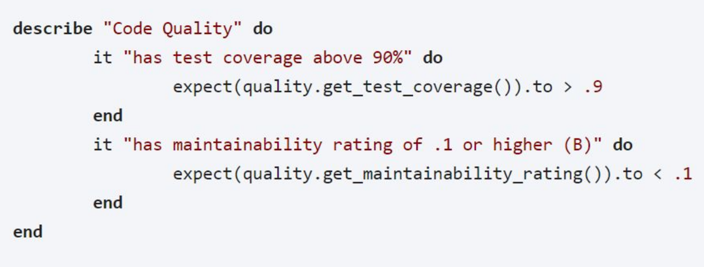

### Устойчивость решения

* Отказоустойчивость
* Доступность

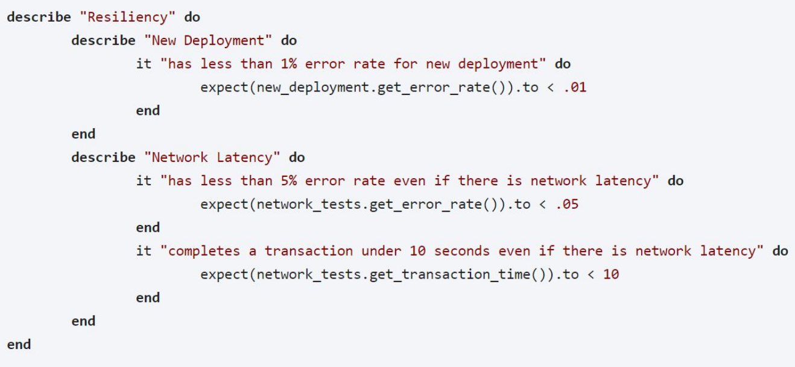

### Возможности наблюдения

* Отладка
* Аудит
* Мониторинг

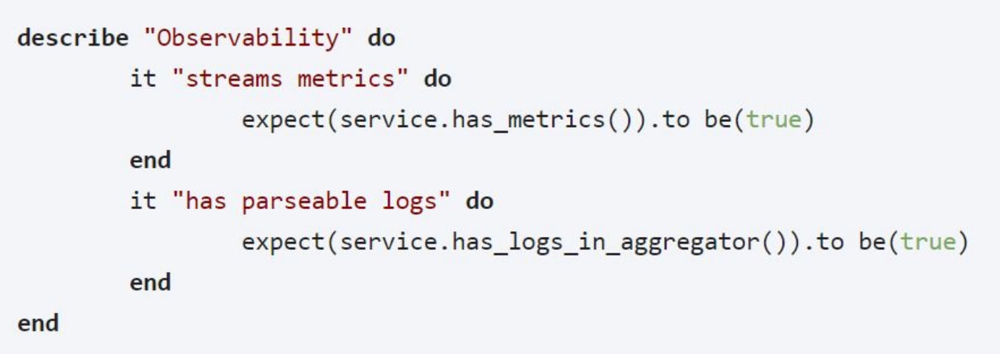

### Произволительность

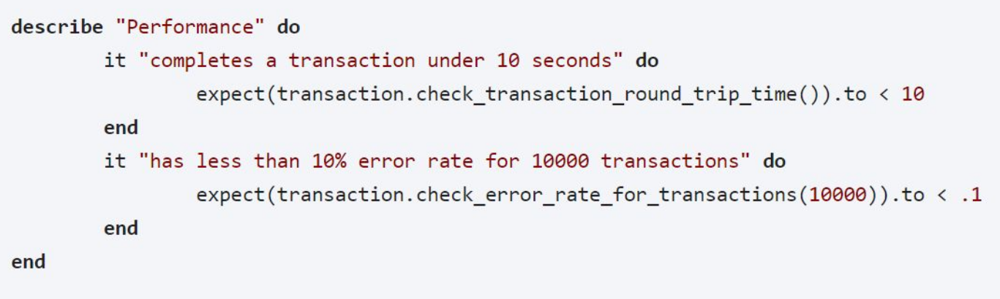

### Аудит и законы

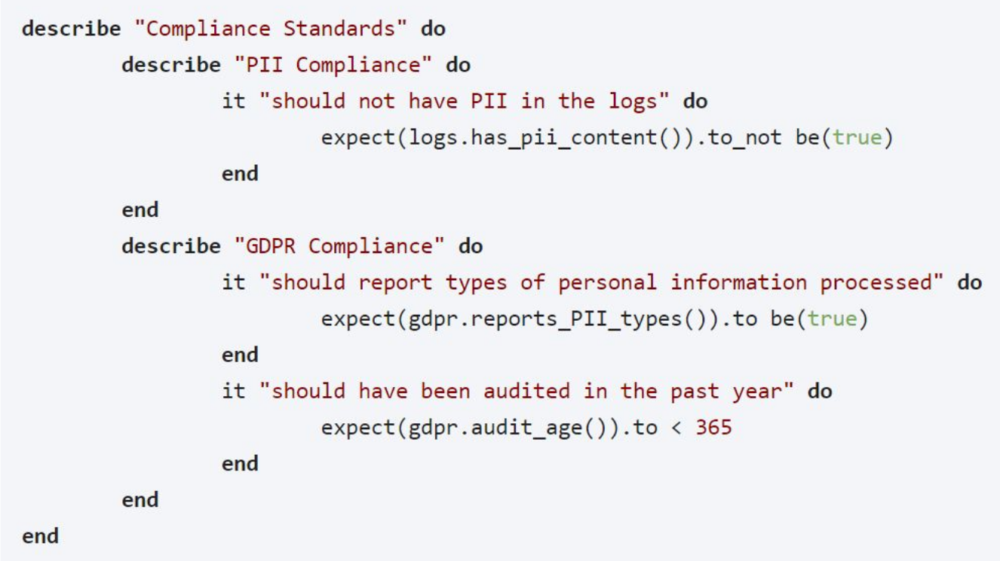

### Безопасность

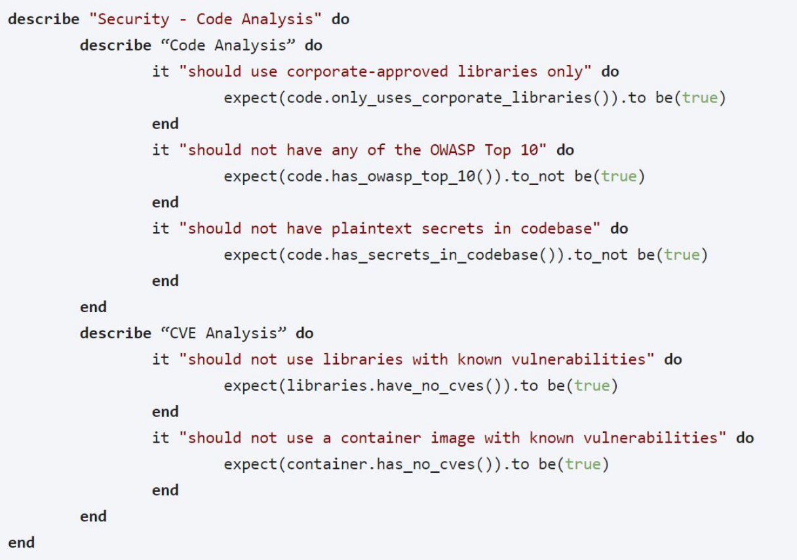

### Работоспособность

* Конфигурируемость
* Работоспособность
* Восстановление

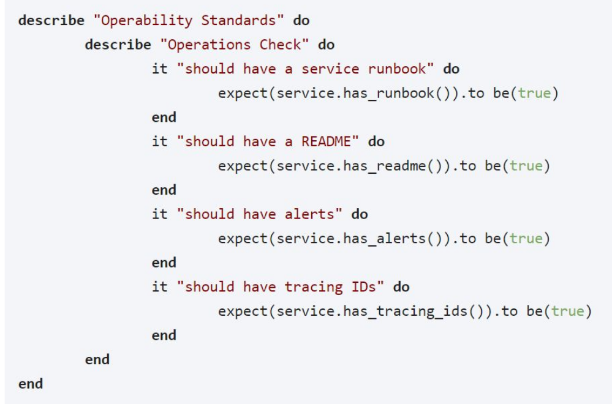

### Самое важное

Атрибуты качества могут и должны отслеживаться в процессе реализации системы.

### Вывод

Фитнес-функции позволяют следить, что реализация системы соответствует первоначальному архитектурному плану.
