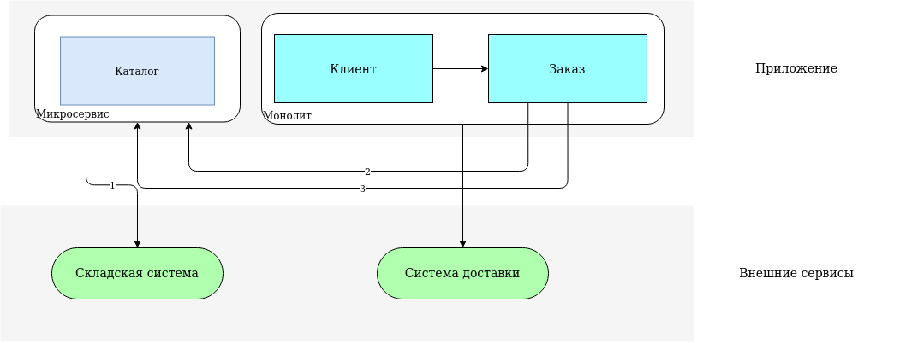

Микросервис каталога будет отвечать за хранение, передачу и получение информации о продуктах.

## Интеграции

1. Между Микросервисом и Складом: для получения информации об остатках продуктов. Бизнес-процесс: предоставление информации об остатках продукции.

Функциональные требования:
1.1 Нужно получать информацию об остатках товаров из складской системы
1.2 Полученные данные об остатках нужно хранить в БД

Не функциональные требования:
1.10 Необходимо каждый час актуализировать количество оставшихся продуктов, путём импорта файла с остатками из складской системы (ФТ 1.1, 1.2)
1.11 Файл с остатками должен обрабатываться не более 10 минут (ФТ 1.1)
1.12 Процесс получения остатков необходимо логировать (ФТ 1.1)

2. Между Монолитом и Микросервисом (модуль заказа): для добавление товара в корзину и в заказ. В корзину пишется внешний уникальный ключ продукта, название, текущая цена и дополнительные параметры, которые важно сохранить в заказе для отображения в истории и которые могут влиять на бизнес-логику заказов. Бизнес процесс: оформление заказа

Функциональные требования:
2.1 Нужно реализовать метод API предоставляющий информацию о товаре по его идентификатору
2.2 Нужно реализовать метод API предоставляющий информацию о товарах по массиву идентификаторов
2.3 Нужно реализовать метод API проверяющий наличие товара

Не функциональные требования:
2.10 Нужно получать информацию о товаре меньше чем за 1 секунду (ФТ 2.1, 2.2)
2.11 Информация о товаре должна быть на русском языке или английском языке (названия) (ФТ 2.1, 2.2)
2.12 Заказ должен создаваться в течении 1-2 секунд (ФТ 2.3)

3. Между Монолитом и Микросервисом (модуль заказа): для получение информации о товарах в истории заказов, здесь запрашиваются данные, которые не хранятся в самих заказах, например картинка товара и ссылка на товар в каталоге. Бизнес-процесс: предоставление информации в истории заказов

Функциональные требования:
3.1 Нужно реализовать метод API предоставляющий информацию о товаре по его идентификатору
3.2 Нужно реализовать метод API предоставляющий информацию о товарах по массиву идентификаторов

Не функциональные требования:
3.10 Нужно получать информацию о товаре меньше чем за 1 секунду (ФТ 2.1, 2.2)
3.11 Информация о товаре должна быть на русском или английском языке (названия) (ФТ 2.1, 2.2)

## Требования к микросервису

Функциональные требования:
1. Нужно получать информацию об остатках товаров из складской системы
2. Нужно реализовать метод API предоставляющий информацию о товаре по его идентификатору
3. Нужно реализовать метод API предоставляющий информацию о товарах по массиву идентификаторов
4. Нужно реализовать метод API проверяющий наличие товара
5. Возможность создания товара в системе

Не функциональные требования:
1. Нужно получать информацию о товаре меньше чем за 1 секунду (ФТ 2, 3)
2. Информация о товаре должна быть на русском или английском языке (названия) (ФТ 2, 3, 5)
3. Заказ должен создаваться в течении 1-2 секунд (ФТ 4)
4. Необходимо каждый час актуализировать количество оставшихся продуктов, путём импорта файла с остатками из складской системы (ФТ 1)
5. Файл с остатками должен обрабатываться не более 10 минут (ФТ 1)
6. Процесс получения остатков необходимо логировать (ФТ 1)
7. В качестве валюты должны использоваться рубли (ФТ 2, 3, 5)