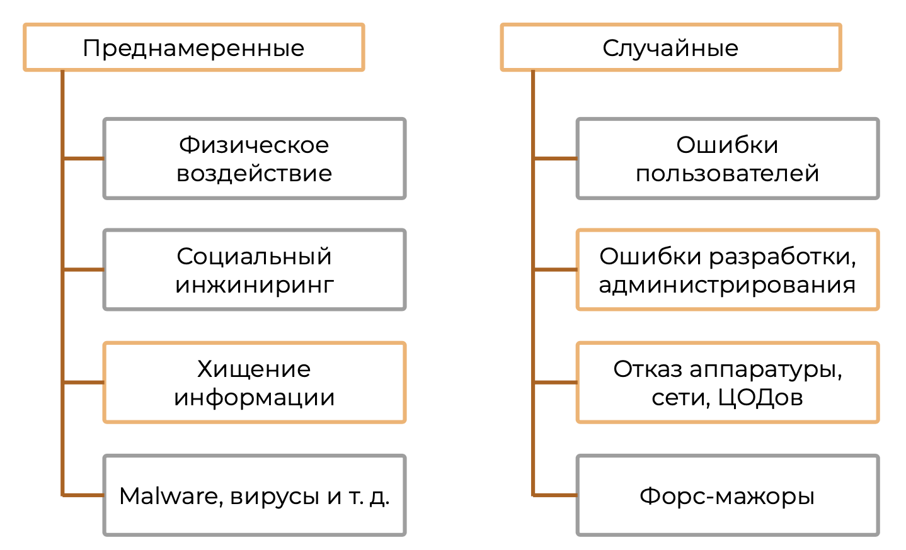
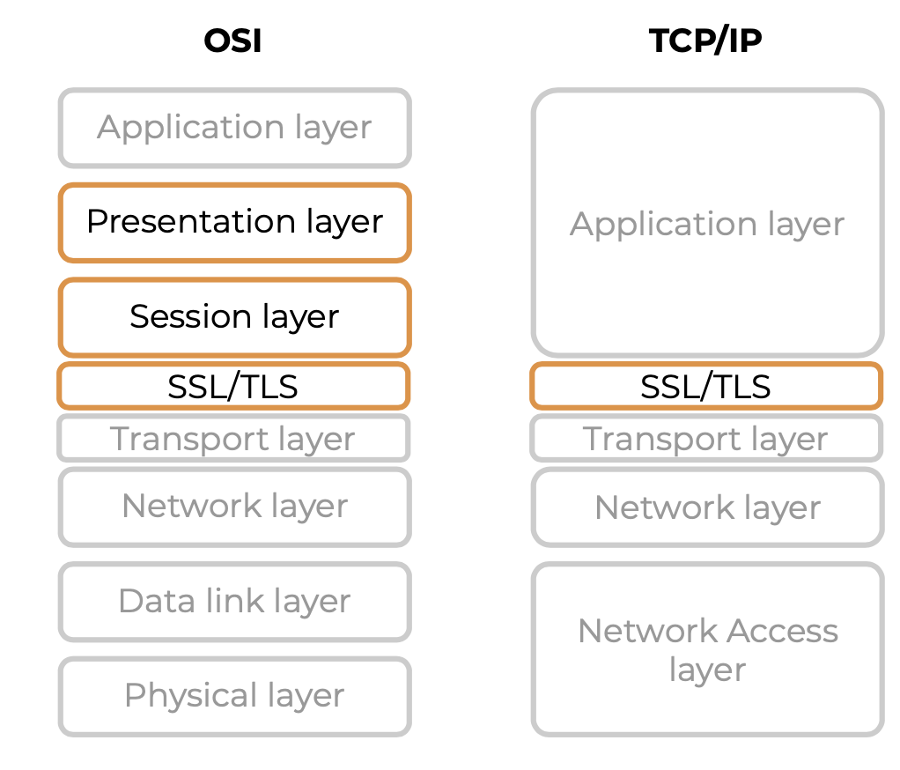
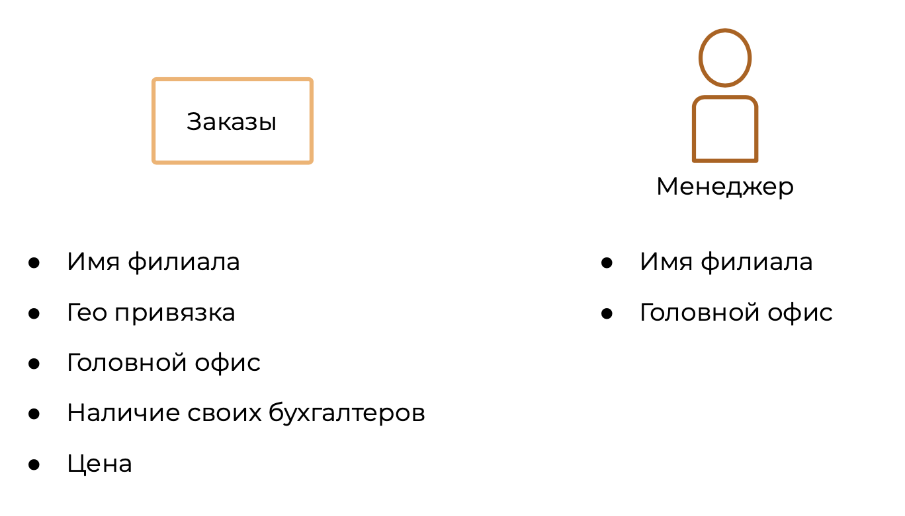
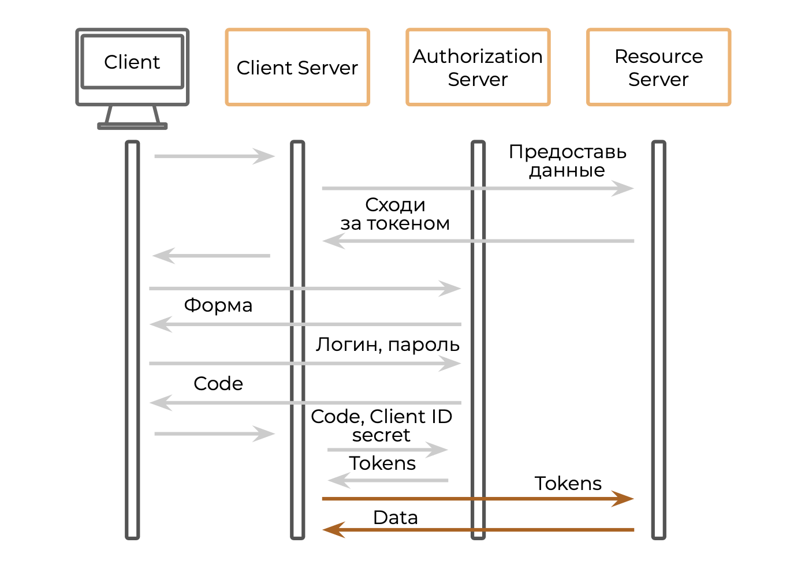
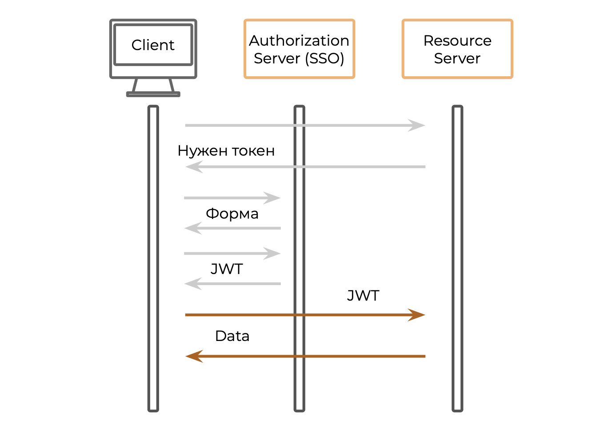

# Security

## Виды информационных угроз OWASP TOP 10

### Виды информационных угроз



### OWASP TOP 10

- OWASP — Open Web Application Security Project
- Обновление раз в 3–4 года

OWASP — открытый проект занимающийся сбором, анализом и сортировкой (по частоте возспроивведения, критичности) уязвимостей.

### OWASP TOP 10 2021

* Инъекции (Injections)
* Недостатки аутентификации (Broken Authentication)
* Межсайтовый скриптинг (XSS) (Cross-Site Scripting)
* Незащищённость конфиденциальных данных (Sensitive Data Exposure)
* Небезопасная десериализация, внешние сущности XML (XML External Entities (XXE), Insecure Deserialization)
* Нарушение контроля доступа (Broken Access Control)
* Неэффективный мониторинг (Insufficient Logging and Monitoring)
* Подделка запросов со стороны сервера (SSRF) (Server-Side Request Forgery SSRF)
* Использование компонентов с известными уязвимостями (Using Components with known vulnerabilities)
* Некорректная настройка параметров безопасности

#### Инъекции

Инъекция — это попытка пользователя получить какие-то дополнительные данные подстроив под это переменные передаваемые приложению

- https://example.com/?param=123 **AND 1=2--**
- https://example.com/?param=123 **AND 1'/\***
- https://example.com/?param=123' **AND '1'='1**

Для того, чтобы избежать проблем нужно подготавливать данные передаваемые пользователем: парсить их, проверять, добавить к запросы и только потом выполнить.

#### Недостатки аутентификации

**Аутентификация** — процедура проверки подлинности, например, проверка подлинности пользователя с помощью логина и пароля

**Авторизация** — предоставление определённому лицу или группе лиц прав на выполнение определённых действий

Пример: допустим есть сервис 1 и сервис 2, с сервисом 1 общается веб-браузер, а сервис 1 непосредственно общается с сервисом 2. Между браузером и сервисом 1 есть авторизация, аутентификация, а между сервисом 1 и сервисом 2 их нет.

Тут может быть следующее: если сервиса 2 как-то открыт API наружу, то из браузера можно попытаться получить доступ к сервису 2 и получить через него те данные, которые закрывали на сервисе 1.

#### Cross-Site Scripting (XSS)

XSS — это хищение данных от лица клиента.

Работает так: сначала злоумышленник получает доступ к серверу и меняет там код, который отдаётся клиенту. Изменённый код попадает к клиенту, таким образом пользователь может пройти аутентификацию и злоумышленник будет выполнять запросы от его лица, собирать данные пользователя.

#### Незащищённость конфиденциальных данных

По сути злоумышленник может встроиться в канал и данные, передаваемые между клиентом и сервисом утекают к злоумышленнику. В момент установления соединения между клиентом и сервером будет отправлен логик и пароль, который тоже может украсть злоумышленник.

Для защиты передаваемые конфиденциальные данные следует шифровать, чтобы злоумышленник не мог их расшифровать.

#### Небезопасная десериализация, внешние сущности XML

По сути атака основана на том, чтобы отправить запрос сервису, который при десиреализации будет выполнен и интерпретирован системой как команды операционной системе, которые можно выполнить, для получения каких-то данных в ответе или зловредно повлиять на сервис или сервер.

Выглядеть это может примерно так:

```xml
<!ENTITY xxe SYSTEM "file:///etc/passwd" >]>
<foo>&xxe;</foo>
<!ENTITY xxe SYSTEM "https://192.168.1.1/private" >]> <foo>&xxe;</foo>
```

Для защиты нужно:

* Включать только необходимую функциональность библиотек для парсинга и десериализации
* Использовать простые объекты JSON, там всегда предаются только строки, числа и нет возможность получить доступ к файлам и функция ОС сервера
* Выделить DMZ (англ. «Demilitarized Zone» — демилитаризованная зона, ДМЗ) с которыми общаются клиенты, чтобы в случае взлома эти серверов у злоумышленника не было возможности получить доступ к данным пользователей и прочей критичной информации

#### Нарушение контроля доступа

По сути это нарушение контроля прав доступа.

В рамках этой уязвимости злоумышленники обычно получают доступ к серверам, сервисам, FTP и т.п. которые отдаются пользователю. В случае когда уже произошла аутентификация пользователей, понятно что пользователь тот за кого себя выдаёт, происходит чтение файлов на которые не организована аутентификацию, это могут быть какие-то общие вещи у которых есть доступ у всех, кто авторизован в системе.

Для защиты нужно реализовать авторизацию, чтобы файлы в системе были доступны только тем пользователям, которым они необходимы.

#### Неэффективный мониторинг

Допустим есть API выставленный наружу и закрытый базовой аутентификацией. В этом случае злоумышленник может пытаться получить доступ к API путём перебора.

Для таких случаев не помещает мониторинг, чтобы можно было определить пользователя, который пытается взломать систему таким образом (много раз логинится с неверными данными).

Ещё у мониторинга может отсутствовать фиксация действий пользователя, когда какой-то пользователь пытается получить доступ к файлам, которые ему не доступны. Возможно, это тот случай когда в систему уже кто-то встроился и пытается скачать конфиденциальные данные.

#### Подделка запросов со стороны сервера (SSRF)

В этом случае взламывается какой-то сервис доступный злоумышленнику и используется им как некий прокси для получения доступа к другим сервисам системы.

Для защиты необходимо настраивать аутентификацию, авторизацию между сервисами.

#### Использование компонентов с известными уязвимостями

- Применение неиспользуемых зависимостей
- Устаревшие версии библиотек
- Устаревшие версии патчей
- Библиотеки со встроенным зловредным ПО

Для защиты важно следить за уязвимостями в используемых библиотеках, фреймворках, ПО и т.д. и вовремя их обновлять.

#### Некорректная настройка параметров безопасности

- Неисправленные недостатки
- Конфигурации по умолчанию
- Наличие неиспользуемых страниц
- Незащищённые файлы и каталоги
- Ненужные службы

Для защиты нужно: если используются какие-то параметры по дефолту, то понимать зачем это нужно, точно ли они безопасны.

## TLS/SSL. Симметричное и асимметричное шифрование
### Протоколы безопасной передачи данных

- **SSL** — Secure Sockets Layer (уровень защищённых сокетов)
- **TLS** — Transport Layer Security (протокол защиты транспортного уровня)

Использование **TLS/SSL**: HTTP**S**, SMTP**S**, POP3**S**



На данный момент актуальными остаются: TLS 1.2 и TLS 1.3

 ### Что гарантирует TLS/SSL?

* Приватность
* Целостность
* Аутентификацию

#### Приватность

Между клиентом и сервисом всегда устанавливается некоторый канал для передачи данных, злоумышленник может подключиться к этому каналы и считать сообщения.

В TLS/SSL используется шифрование для защиты.

#### Целостность

Целостность это гарантия того, что к каналу не сможет подключится злоумышленник и не будет подменять сообщения, идущие от клиента серверу.

В TLS/SSL используются хеш-функции для защиты.

#### Аутентификацию

Аутентификацию позволяет исключить те случаи, когда между клиентом и сервером встроился злоумышленник (man-on-the-middle), и начал бы для клиента представляется сервером, а для сервера клиентом.

В TLS/SSL используются цифровая подпись для защиты.

### Шифрование

Бывает двух типов:

* Симметричное
* Асимметричное

В случае когда зашифрованные данные попадут к злоумышленнику, они будут в зашифрованном виде и для их расшифровки будет требоваться ключ.

#### Симметричное шифрование

Примеры протоков:

* AES
* 3DES6
* RC6

В симметричном шифровании постоянно существует приватный ключ, с помощью которого осуществляется шифрование данных, которые будут переданы по сети. В случае, если пользователь или злоумышленник считает эти данные, то они будут в зашифрованном виде, для расшифровки сообщения понадобится приватный ключ. В случае если ключ утечёт то злоумышленник сможет прочитать все сообщения переданные между сервером и клиентом.

#### Асимметричное шифрование

Примеры протоков:

* RSS, DSA, DSS
* Diffie-Hellman

В данном случае у сервера есть два ключа: приватный и публичный. В момент соединения клиента и сервера публичный ключ передаётся клиенту и сохраняется у него. Клиент, если ему нужно предать данные, шифрует их этим ключём. После получаения сообщения от клиента его можно будет расшифровать приватным ключём. Причём сообщения расшифровывается только для расшифровки и расшифровать сообщения можно только им.

#### Шифрование

Симметричное:

- быстро работает
- хранение и передача ключей

Асимметричное:

- работает медленнее
- открытый ключ может передаваться по сети

● Гибридное шифрование TLS/SSL:

- для передачи синхронных ключей — асинхронное шифрование
- для передачи данных — синхронное шифрование

## Аутентификация и авторизация

### Знакомство с пользователем

**Идентификация** — отождествление анонимного клиента с конкретным именем

**Аутентификация** — процедура проверки подлинности, например, проверка подлинности пользователя с помощью логина и пароля

**Авторизация** — предоставление определённому лицу или группе лиц прав на выполнение конкретных действий

### Способы аутентификации

* Ввод логина и пароля
* Отправка СМС или почты
* Использование цифровой подписи
* Использование сертификатов
* Биометрическая аутентификация
* Аутентификация с помощью токенов (физических, виртуальных)
* Использование одноразовых паролей
* Многофакторная аутентификация и др.

### Классификация аутентификации

* Базовая аутентификация
* Дайджест-аутентификация
* С помощью сертификатов: SSL, Kerberos и т. д.
* Децентрализованная аутентификация Single Sign-on (SSO)

#### Базовая аутентификация

* В этом случае при каждом запросе передаётся логин и пароль
* Простая реализация
* Лёгкий перехват данных
* Необходимость шифрования канала

#### Дайджест-аутентификация

* В этом случае при каждом запросе передаются логин и пароль в хешированном состоянии
* Функция хеширования должна быть сложной
* Обратная хэш функция для расшифровки сообщения должны быть только на сервере

#### Аутентификация с помощью сертификатов
- Аутентификация сервера
- Аутентификация клиента

Работает следующим образом: имеются приватный и публичный ключ, приватный ключ остаётся на сервере. При старте взаимодействия сервер отдаёт публичный ключ и все ответы, которые генерит сервер он подписывает приватным ключом. Если мы смогли расшифровать те сообщения, которые передал сервер, с помощью публичного ключа, то значит, это тот самый сервис с которым мы общались и обменивались ключами.

Смысл шифрования сообщений здесь в том, что мы точно уверены, что мы общаемся с тем сервером с которым начинали взаимодействие. При этом никто не мешает оказаться этому серверу злоумышленником с самого начала и тогда реализуется атака man-on-the-middle. Бороться с такой проблемой можно с помощью электронной подписи.

##### Электронная попись

Электронная подпись позволяет подписывать все сообщения отправляемые от клиента. По сути работает это так: у нас есть тела сообщения, от него считается хэш (обычно SHA), для того чтобы хэш от сообщения был всегда одинаковой длины, и на основании изменения этой длины нельзя было предугадать какая хэш-функция использована. После того как был посчитан хэш от сообщения, мы ещё раз считаем хэш от этого хэша (это называется подписью) с помощью приватного ключа с сервера и добавляем её в конец сообщения, в итоге предаётся само тело сообщения и подпись, хэш от тела сообщения не передаётся. После подписи сообщения оно передается по сети. После того как сообщения пришло клиенту, он используя хэш-функцию, о которой договорились в начале общения (SHA), килент также получает хэш на основании тела сообщения, при этом он считывает также подпись сообщения от сервера и, используя публичный ключ, полученный в начале, получает хэш. Соответственно, если хэш который был получен расшифрованнием подписи и хэш, который был получен с помощью хэш функции, одинаковы, то значит сервер это именно тот сервер, за который он себя выдаёт.

Как понять, что это тот самый сервер и кому принадлежит открытый ключ? Для исключения необходимо построить инфраструктуру открытых ключей. По сути это некий удостоверяющий центр, которому мы доверяем и открытый ключ которого у нас есть. Если сервер подписывает сообщения своим закрытым ключём, и в этом сообщения имеется подпись удостоверяющего центра, то значит и сервер верный.

### Авторизация

**Субъект доступа** — это человек, служба, группа пользователей, которые пытаются получить доступ

**Объект доступа** — это тот объект, к которому субъект пытается получить доступ

**Авторизатор** — это компонент, который разрешает либо запрещает доступ субъекта к объекту

#### RBAC vs ABAC

**Role-based access control** — авторизация, основанная на бизнес-ролях

**Attribute-based access control** — авторизация, основанная на атрибутах, которыми надо будет управлять

##### RBAC

В этой авторизации у нас есть роли и ресурсы которые между распределяются между ролями.

##### ABAC

Основан на атрибутах, которые есть у субъекта и у объекта.



Для построения роли, где менеджер может управлять заказами своего филиала не дороже 100000, необходимо написать следующее правило:

* Субъект.должность = «Менеджер»
* Объект.Филиал = Субъект.Филиал
* Объект.цена <= 100 000 руб.
* Объект.тип = «Заказ»

#####  RBAC vs ABAC

- Role-based access control:
  - быстрый старт
  - сложности при масштабировании
- Attribute-based access control:
  - долгий старт
  - лёгкое масштабирование

## OAuth 2.0 OpenID connect JWT SSO 

### OAuth 2.0

- RFC 6749 2012
- Позволяет легко и безопасно предоставлять данные другим системам



Схема работы:

1. Клиент заходит на сайт, сайт запрашивает у него разрешение авторизоваться с помощью стороннего сервиса, клиент даёт разрешение
2. Клиентский сервис делает запрос данных к серверам сервиса в котором будет производится авторизация
3. Сервера авторизации отвечают отказам (если клиент там не авторизован) и об этом сообщает клиентский сайт, после чего обычно открывается форма логина в сервис авторизации (именно с серверов авторизации, чтобы исключить перехват данных)
4. После авторизации возвращается некий код, который направляется к клиентскому серверу и он идёт к серверу авторизации с данным кодом, в замен он получает access и refresh токены
5. После получения токенов, клиентский сервис делает запрос к серверам авторизации (с токеном), для получения данных пользователя, эти данные используются для авторизации на клиентском сервере.

Сервис авторизации возвращает два токена:

* Access token
* Refresh token

Access token используется для получения доступа к данным пользователя, а refresh token нужен для обновления access токена, потому что токены имеют малый срок жизни, чтобы исключить возможность их похищения. Таким образом, если access токен истёк. то используется refresh токен для получения нового access токена.

### OpenID Connect

- Надстройка над OAuth 2.0
- Добавляет возможность идентификации
- Single Sign-on
- Сервис авторизации возвращает:
  - Identity token
  - Access token
  - Refresh token



Работает так:

1. Необходимо получить доступ к ресурс-серверу, где хранятся какие-то данные. Когда нет токена, ресурс сервис откажет в доступе и укажет путь для сервера, в котором нужно авторизоваться
2. После этого происходит аутентификация, авторизация. Это может быть форма или сервис может достать логин из окружения, с этими данным сервис сходит к авторизационному сервису и получит JWT токен, который будет содержать информацию о access токене, refresh токене и токене для идентификации.
3. С JWT токеном мы направляемся к ресурсному серверу, по которому он предоставляет данные.
4. По истечению access токена, он обновляется с помощью refresh токена.

### JWT token

**JSON Web Token (JWT)** — это открытый стандарт (RFC 7519) для создания токенов доступа, основанный на формате JSON.

Состоит из:

* Header — для хранения информации о токене и о том как его прочитать. Json в Base64-URL, например:

  ```json
  {
     "alg":"HS256",
     "typ":"JWT"
  }
  ```

* Payload — полезная информация. Json в Base64-URL, информация необходимая для аутентификации, можно добавлять любые поля, пример:

  ```json
  {
     "sub":"1234567890",
     "name":"John Doe",
     "admin":true
  }
  ```

* Signature — цифровая подпись, подпись в Base64-URL. Пример:

  ```
  HMACSHA256(base64UrlEncode(header) + "." + base64UrlEncode(payload))
  ```
