# API gateway

## Предпосылки и основные функции

Основная проблема использования множества сервисов: как организовать взаимодействие между сервисами? Как ими управлять? Как предоставить доступ к функционалу?

В прошлом для решение этой проблемы использовался Enterprise Service Bus, для организации взаимодействия. Однако возникает проблема: как к этому всему предоставить доступ извне? Исторически сложилась так, что органия этого доступа для внешних клиентов занимала много времени. Таким образом основная проблема ESB в том, что непонятно где находятся сервисы, какие сервисы можно использовать для решения задачи? Как созбрать функционал из всех сервисов?

В итоге получается следующее:

- Данные и сервисы заточены в изолированных корпоративных приложениях
- Каждое приложение может работать со своим форматом передачи данных
- Каждая внешняя интеграция уникальна

### Использование сервисов

Как понять кто потребитель/производитель данных?

Как эти данные влияют друг на друга?

 ### Проблемы бизнеса

* Как уменьшить стоимость и/или риски владения
* Как эффективно использовать внутренние ресурсы

### Подход STAR

* Stabilize
* Transform
* Add
* Repeat

Подход к рефакторингу системы.

#### Фасад

Дизайн-шаблон «Фасад» используется для определения упрощённого интерфейса к более сложной подсистеме.

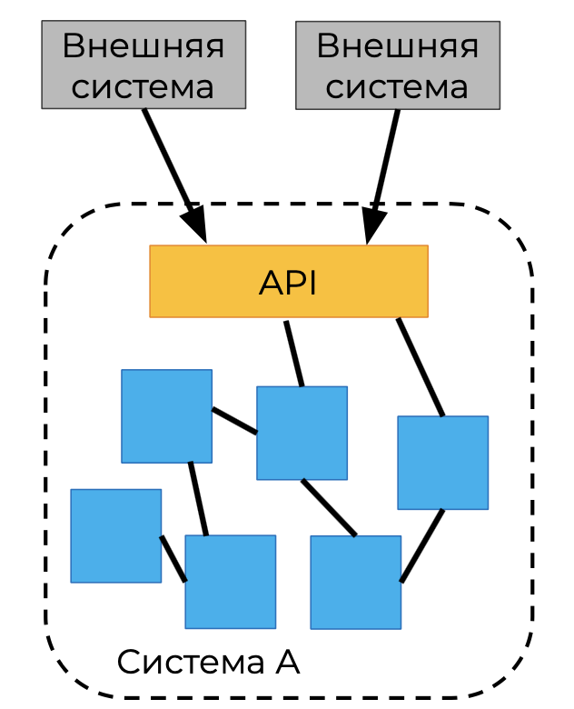

На схеме API является фасадом ко всех система A.

Реализует принципы:

* Stabilize
* Transform

#### Подавление

Использование шаблона «Подавление» для старого приложения — безопасный способ перехода к новой лучшей реализации.

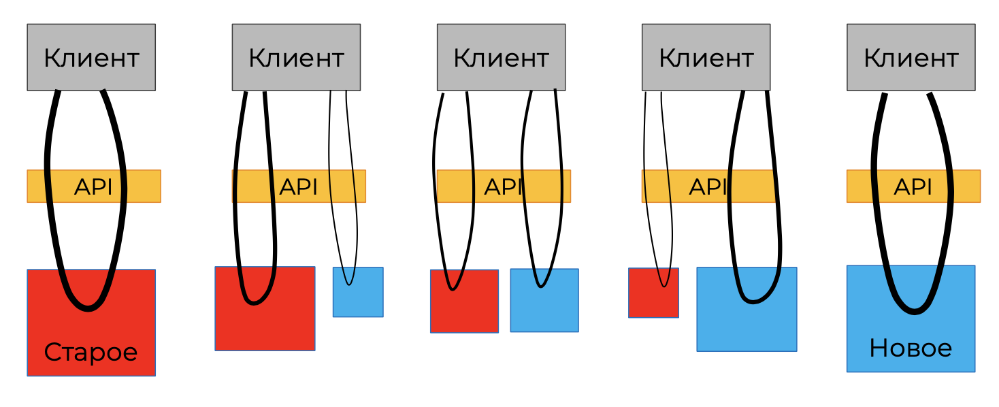

Здесь суть в том, что новая реализация постепенно заменяет старую, а API позволяет реализовать доступ к функционалу обоих систем.

При этом клиент не замечает подмену реализации.

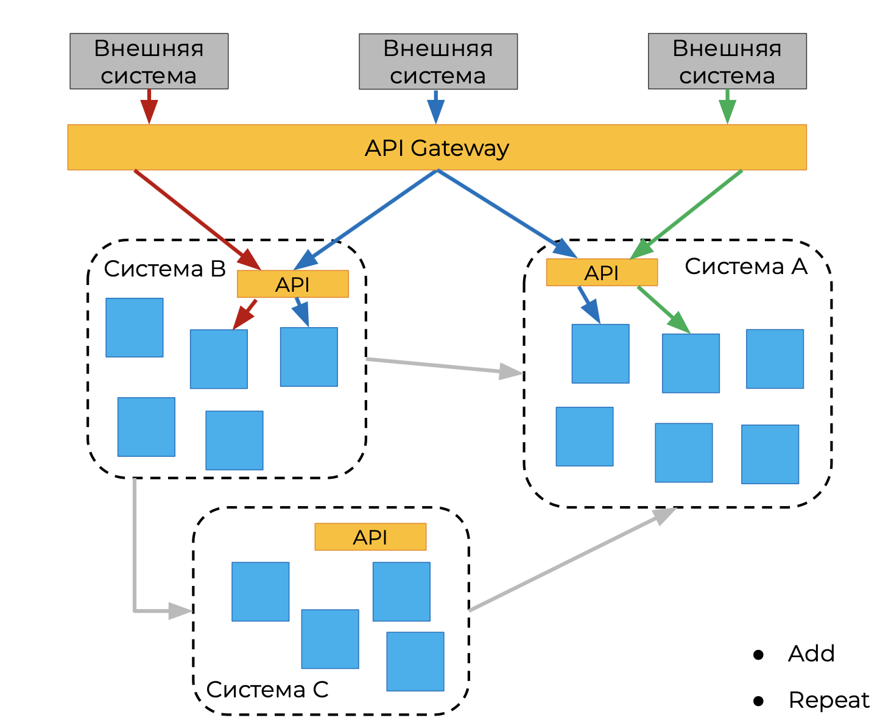

Вторым аспектом STAR является add и repeat, т.е. при расширении этого подхода дальше у каждого сервиса появляется свой API, который ответственен за коммуникацию с внутренними сервисами и упрощает доступ к ним. В итоге выделяют общий API Gateway, а все внешние системы общаются с внутренней через API Gateway.

#### API Gateway

**Основные плюсы использования:**

- устранение зависимостей
- сокращение количества служебных запросов
- безопасность
- реализация «сквозного» функционала

**Дополнительные плюсы использования:**

- возможность самообслуживания для клиентов
- выставление счетов
- портал для разработчиков

Ключевой особенностью API gateway является стремление к слабой связанности, а не плотной интеграции.

### Малые изменения

Все изменения стоит делать малыми шагами, итеративно, когда каждое малое изменение может быть доставлено конечному пользователю и можно, с помощью метрик/мониторов, посмотреть на сколько изменение хорошо работает, зашло ли оно пользователю.

### Выводы

**API Gateway:**

- логически объединяет и предоставляет ресурсы фирмы для потребителей
- позволяет использовать семантическое взаимодействие без жёсткой связки участников
- даёт клиентам стабильный контракт для бизнес-процессов и не даёт волноваться о деталях коммуникации между сервисами в подсистемах

## Шаблон API Gateway. Представители на рынке

### Проблема

Как клиенты приложения, основанного на микросервисах, получают доступ к отдельным сервисам?

### Предпосылки

* Высока гранулярность сервиса, необходимость на стороне клиента собирать ответ во что-то значимое
* Разные клиенты требуют разный объём данных: мобильные, десктопные (Backend for Frontend, BFF), это может влиять на скорость и стабильность работы интернета.
* Производительность сети различна для разных типов клиентов
* Количество экземпляров служб и их местоположение (хост + порт) динамически изменяется
* Сервисы могут использовать различные протоколы, некоторые из которых могут быть неприемлемы для работы в Интернете

### API Gateway

* Единая точка входа
* Трансформация протоколов
* Специальное API для клиентов

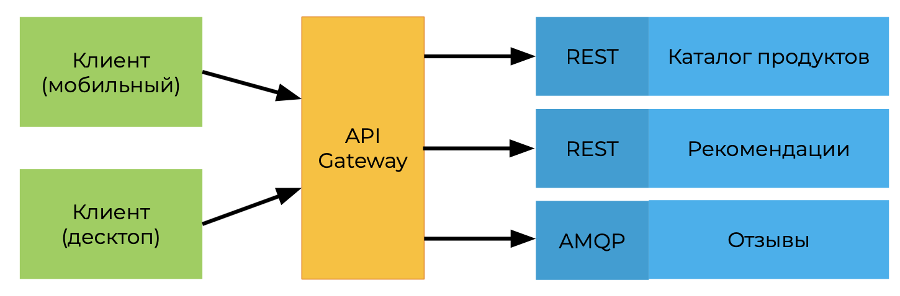

#### Кризис самоопределения

Не очень понятно что назвать API Gateway, ведь это может быть:

* Централизованный общий ресурс, который проверяет и предоставляет доступ к API сервисов, а также собирает их под одной крышей?
* Внимательные охранитель входящего и исходящего клиентского трафика для кластера сервисов?
* Точка объединения сервисов для более краткого выражения API в зависимости от типа клиентов?
* Можно ли добиться того же результата используя только Service Mesh?

Если отталкиваться от бизнес ориентированного подхода, то можно сказать что:

API Gateway — явно и целенаправленно определённый интерфейс, предназначенный для вызова по сети, который позволяет разработчикам программного обеспечения получить **программный доступ к данным и функциональности в организации контролируемым и удобным способом.**

#### Как мы представляем API Gateway

В большинстве случаев это — комплексное решение, состоящие из:

* API Management, где можно получить информацию о том какие API есть, какие у них методы, управление клиентами API
* Cluster Ingress — фильтрование и потребление внешнего трафика
* API Gateway — фасад к внутреним сервисам
* Service Mesh — управление сеткой сервисов системы и получение информации кто где находится

##### API Managment

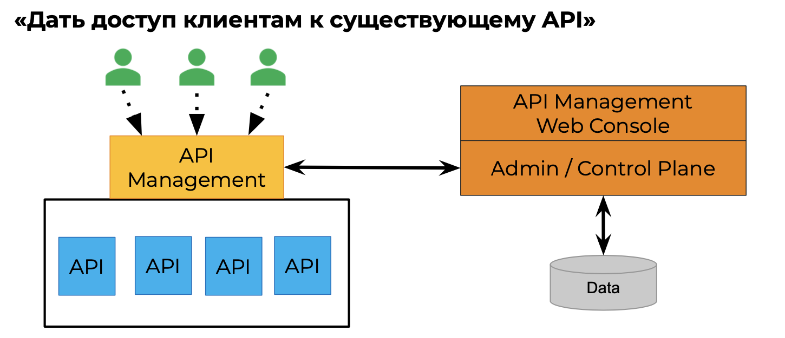

* Отслеживание использования API
* Внедрение правил использования
* Обеспечение безопасности
* Каталог сервисов, эффективность управления

Обычно реализуется в виде жестко контролируемой общей инфраструктуры, принадлежащей либо «команде платформы»,
 либо «команде интеграции», либо другим командам инфраструктуры API. Это делается для обеспечения управления, контроля изменений и правил.

Не должен содержать бизнес-логики. Представители:

- Google Cloud Apigee
- Red Hat 3Scale
- Mulesoft
- Kong

##### Cluster Ingress

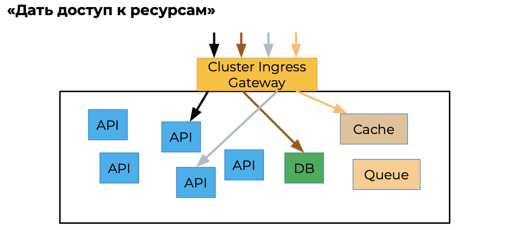

* Слежение за входящим/исходящим трафиком
* Правила соединений

Трафик может идти к самым разным элементам кластера: монолит, gRPC сервис, кэш, очередь сообщений, база данных и так далее.

Надо правильно настраивать хосты, порты, роутинг, окружение. Представители:

- Envoy Proxy (Datawire Ambassador, Solo.io, Gloo)
- HAproxy
- NGINX
- Traefik
- Kong

##### API Gateway

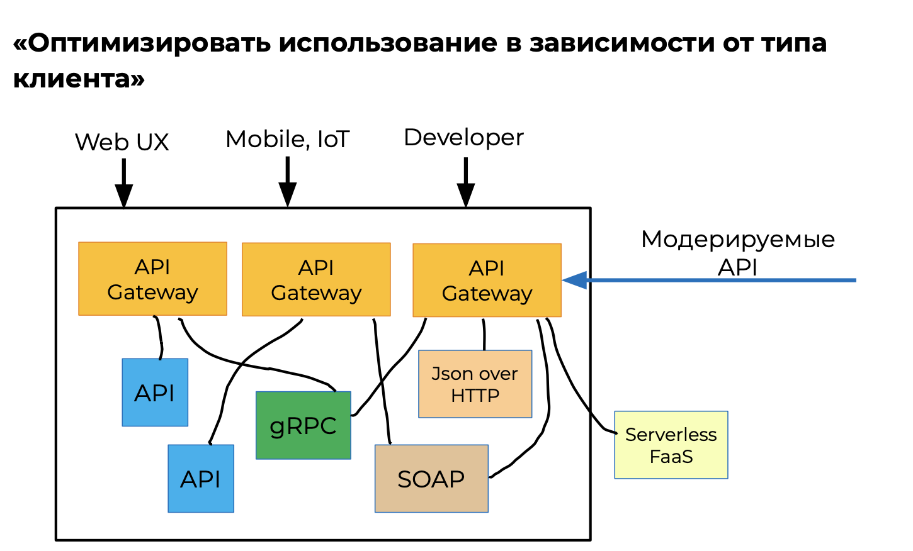

● Backend For Frontends (BFF)

Ближе всего к разработчикам, служит местом агрегации/обработки запросов по самым разным протоколам. Разработчики помогают определить этот уровень API.

Нужно не забывать про поддержку самообслуживания, атрибутов изменчивости. Безопасность, надёжность, управление конфигурациями на базовом уровне должны присутствовать.

Представители:

- Spring Cloud Gateway
- Solo.io Gloo
- Netflix Zuul
- IBM-Strongloop Loopback/Microgateway

##### Service Mesh

**«Наблюдаемость системы»**

Пытается решить проблемы:

- стабильного соединения сервисов (горизонтальный трафик)
- безопасности (authX, TLS, RBAC/ABAC для сервисов)
- мониторинг сервиса как чёрного ящика (запросы/сек., задержка запросов, сети, circuit- breaking, tracing и т. д.)
- контроль взаимного использования сервисов (квоты, ограничение скорости / количества запросов)

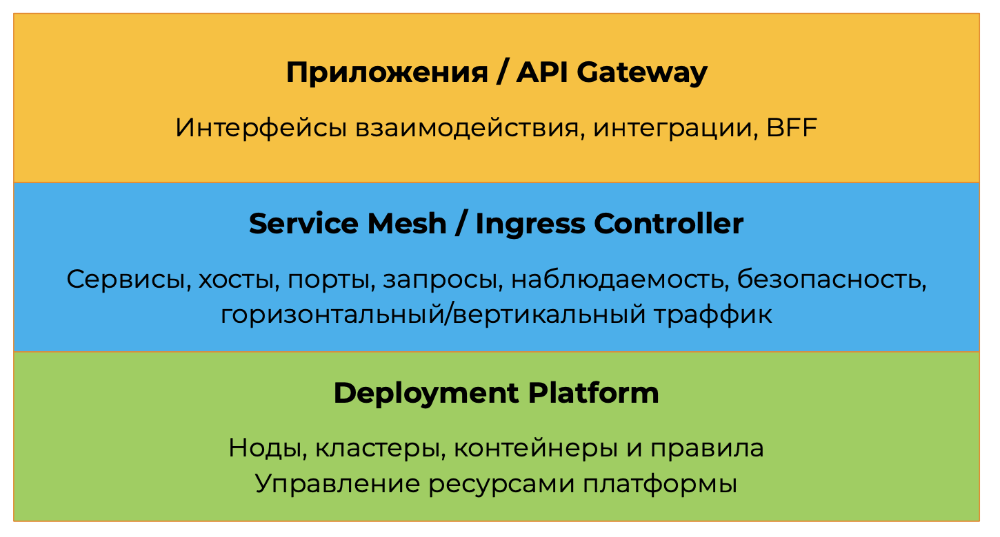

### Выводы

* API Gateway — уникальное для каждой системы сочетание API Management, Cluster Ingress, API Gateway, Service Mesh
* Среди ваших пользователей скоро будет больше машин, чем людей. Обращайте больше внимания на возможности самообслуживания и уведомления об изменениях через служебные каналы API Gateway
* Вендоры предлагают ультра-комбайны под видом API Gateway / Management. Проведите свой собственный анализ потребностей

### Специфика API Gateway

Схема расположения API Gateway:

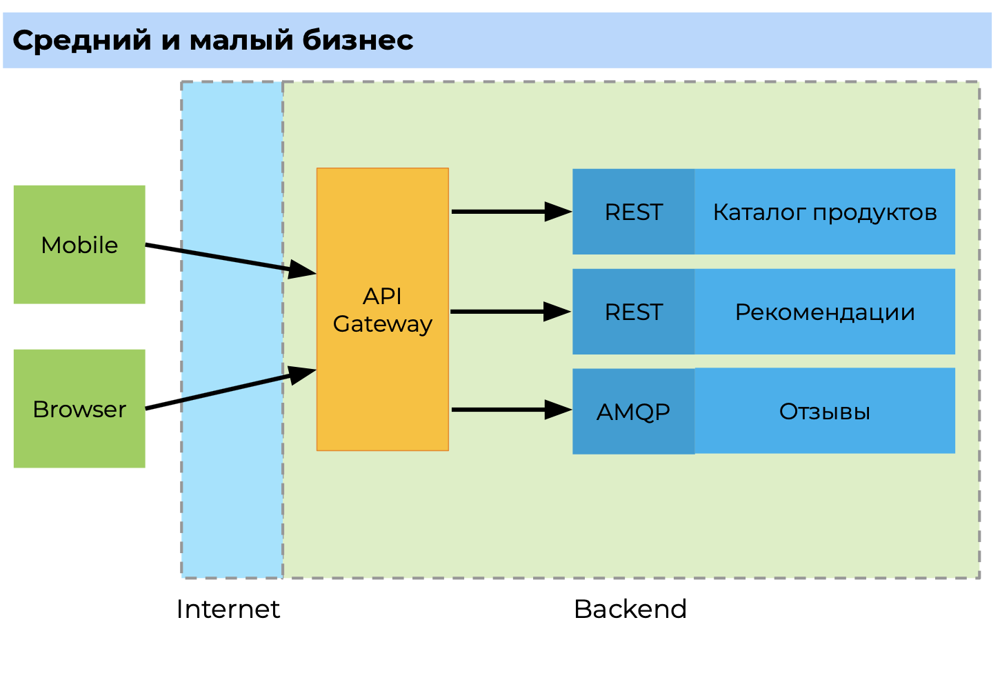

Малый и средний бизнес обычно используют API Gateway на стороне бэкенда, эта конструкция предоставляет доступ к внутренним сервисам, объединяет протоколы, транслирует их в различные форматы, отвечает за безопасность, логирование и т.п.

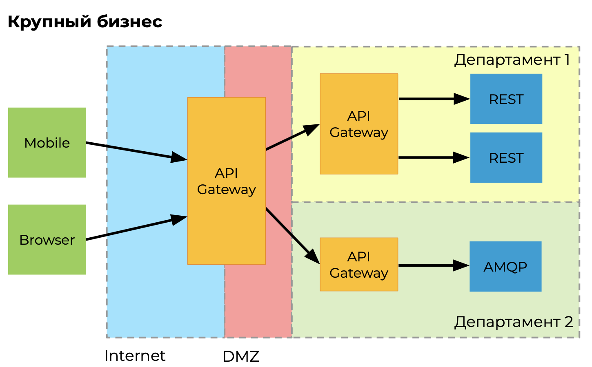

В крупном бизнесе всё сложнее, как правило присутствует общий API Gateway в демилитаризованной зоне, который общается с более специфичными системами, которые предоставляют свои API шлюзы.

Место API шлюза в этой иерархии выглядит так:

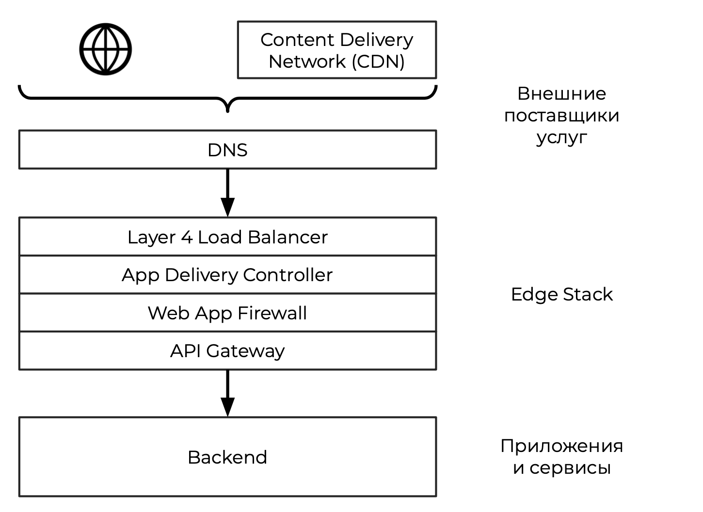

#### Функциональность

Основная функциональность, которую предоставляет API Gateway:

- **Слабая связанность:** адаптер / фасад между фронтендом и бэкендом
- **Простота:** агрегирование / трансляция сообщений сервисов бэкэнда
- **Защита API:** обнаружение и устранение угроз
- **Утилизация API:** наблюдаемость
- **Управление API:** управление жизненным циклом
- **Монетизация API:** управление счетами, выставление счетов и оплата

### Векторы атак

Основные классы опасности в зоне ответственности API Gateway:

- **Spoofing** — представление другим пользователем
- **Tampering** — изменение данных, сообщений или настроек, к которым нет доступа
- **Repudiation** — отрицание действия
- **Information disclosure** — раскрытие приватной информации
- **Denial of service** — предотвращение доступа к данным и сервисам другим пользователям
- **Elevation of privilege** — получение доступа к функциональности, к которой нет доступа

STRIDE — общее название типовых векторов атак. 

Также нужно не забывать про OWASP топ-10.

#### Защита API

- Шифрование
- Авторизация
- Контроль доступа
- Аудит
- Ограничение пропускной способности

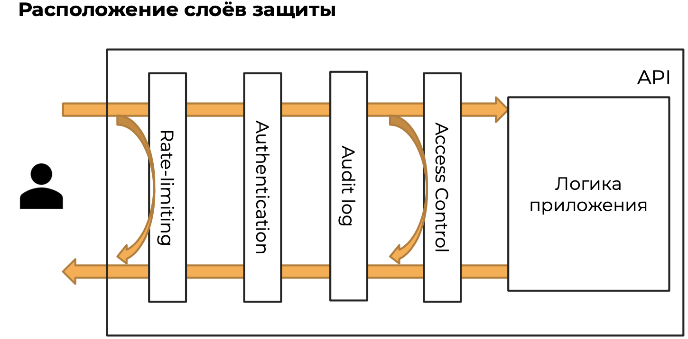

##### Rate limiting

* Защита от DoS-атак
* Честное использование услуг
* Способ монетизации

Ключевой фактор — работа компонента должна в теории потреблять меньше ресурсов, чем тратит пользователь.

Квоты устанавливаются для каждого типа ресурсов или услуг.

Throttling реализуется с помощью очереди или кодов ответа, чтобы клиент притормозил, а иначе отказ принятия запросов.

##### Авторизация

Аутентификация и авторизация — способы сохранить приватность и целостность информационных активов.

Архитектура системы может физически не позволить читать сообщения других пользователей.

Role-based access control (RBAC) — доступ на основе роли. 

Attribute-based access control (ABAC) — доступ на основе атрибутов.

##### Аутентификация

Каждый фактор аутентификации может быть скомпрометирован:

- слабые пароли
- социальный инжиниринг
- ненадёжность биометрии

Для хорошей защиты требуется 2 и более факторов аутентификации:

- пароль
- секретный меняющийся код
- подтверждение, если новое устройство или новая локация пользователя

Если для аутентификации второго фактора используется информация, заранее известная пользователю, то это не является вторым фактором, например 2 пароля к одному аккаунту — это всё ещё один фактор.

##### Аудит

Audit Logging — детальное логирование действий пользователя для дальнейшего анализа и принятия решений. Важно не путать с системным логированием, аудит логирует действия пользователя и в идеале отвечает на вопросы:

- кто выполнил действие и какой клиент был использован?
- когда был получен запрос?
- какого рода был запрос, например, операция чтения или изменения?
- к какому ресурсу осуществлялся доступ?
- был ли запрос успешным? Если нет, то почему?
- какие ещё запросы были сделаны примерно в то же время?

Такой аудит может помочь определить проникновение в систему и какие-то нетипичные действия пользователей.

####  Агрегация данных

Ещё одна важная функция API Gateway — это агрегация данных. Gateway получает данные из нескольких источников, объединяет и отправляет нужные данные клиенту.

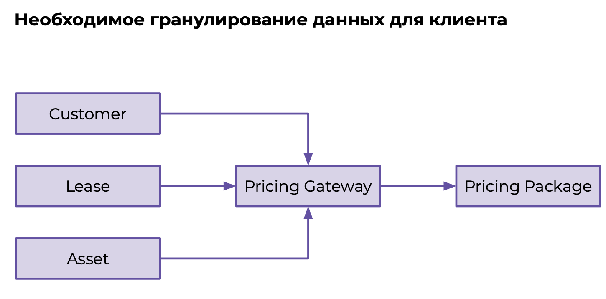

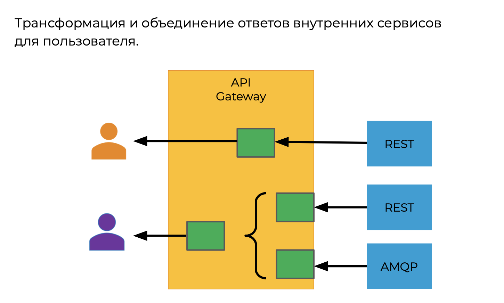

Также могут быть ситуации, когда одни и теже данные отдаются множеству клиентов, причём каждый клиент нуждается в каких-то своих уникальных данных. В общем случае рассылать все данные всем клиентам дорого во всех смыслах, и с точки зрения ресурсов, денег, поддержки, управления клиентами.

Например, есть система которая получает данные со 100 датчиков, и каждый клиент, при подписке получает информацию со всех датчиков. Возникает ситуация, когда мы переносим ответственность на клиента, например если изменилось значение только 2-го датчика, то мы всё равно отправляем клиенту все значения и он сам должен разбираться, что изменилось. В этом случае API Gateway может выступать в роли прокси, который, в зависимости от нужд клиента, будет присылать ему только нужные данные:

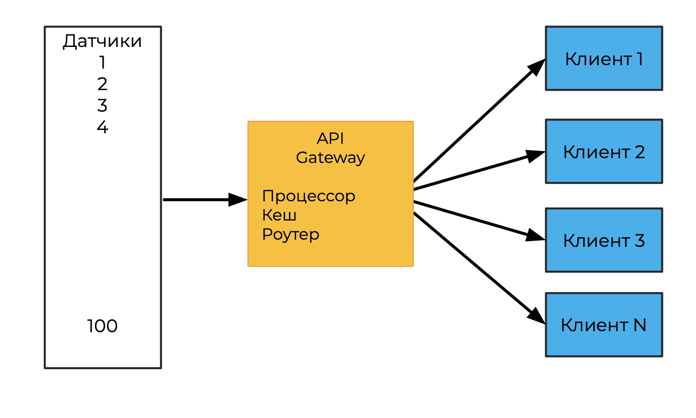

#### Управление и утилизация API

Другой важной функцией API Gateway является управление жизненным циклом API.

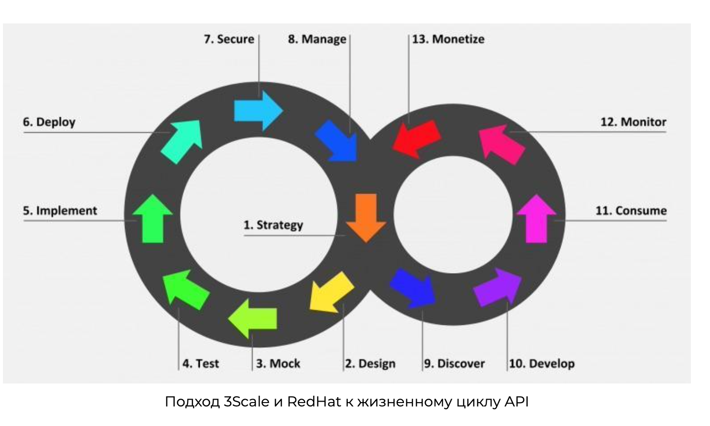

Управление API подразумевает под собой разработку стратегии и управление жизненным циклом API, т.е. изначально, при хорошем подходе, нужно сначала спроектировать API для доступа к сервисам и потом его реализовывать, смотреть как сервисы могут удовлетворить этот общий подход, и когда будут выполнены все работы по разработке, внедрению, обеспечению безопасности и возможности мониторинга подключается монетизация и смотрим насколько хорошо была спроектирована система. И затем смотреть как можно улучшать и дорабатывать API.

Под управление API подзраумевается наличие:

**Портал разработчика**

- Доступ
- Лимиты
- Документация
- Тестирование

 **Понимание использования API**

- Бизнес-цели и KPI
- SLI — Service Level Indicators
- Технические метрики

Следует внимательно отнестись к процессу сбора метрик, анализу и интерпретации результатов. Только комплексный анализ даст правильную картину.

#### Выводы

* API Gateway — сложный симбиоз технических решений для целого спектра задач от бизнес-ориентированных до технических. Необходимо заранее продумывать как будет использоваться API Gateway.
* Необходима работа разных команд/специалистов для построения полновесного API Gateway
* Всё сразу реализовывать не стоит

### Типы API Gateway, как выбрать, анти-паттерн

#### Таксономия API Gateway

В отрасли применяют различные требования к API Gateway, поэтому выделяют несколько общих типов применения:

- традиционные шлюзы уровня предприятия
- мини- и микросервисные шлюзы
- Шлюзы Service Mesh

##### Традиционные шлюзы

* Ориентированы на управление бизнес-ориентированного API
* Строгая модель управления жизненным циклом API: релиз, поддержка, монетизация на большом масштабе сервисов
* Большая часть решений коммерческая
* Зависимость от собственного хранилища данных
* Требуют высокой доступности платформы для работы

##### Микросервисные шлюзы

* Основная ответственность — управление входящим трафиком к бэкенду
* Слабая поддержка управления жизненным циклом API
* Обычно бесплатные решения
* Устанавливаются как отдельный компонент и используют инфраструктуру для управления

##### Шлюз Service Mesh

*   Обычно ответственны только за перенаправление трафика к Service Mesh
* Тесно связан с сетью сервисов и использует её возможности для управления перенаправлением

##### Сравнение типов таксономий

* Основное предназначение:
  * **Традиционный API Gateway** — Предоставление доступа, композиция и управление внутренним бизнесом API
  * **Микросервисный API Gateway** — Предоставление доступа и слежение за внутренними сервисами
  * **Service Mesh Gateway** — Предоставление доступа к внутренним сервисам сети
* **Публикация API**
  * **Традиционный API Gateway** — Команда управления API использует специальное административное приложение для регистрации и обновления доступных сервисов и их API
  * **Микросервисный API Gateway** — Команда поддержки API использует декларативное описание API (swagger или openAPI), и оно является частью процесса разворачивания новых сервисов или их обновления
  * **Service Mesh Gateway** — Команда обслуживания обновляет сеть сервисов с помощью декларативного описания во время процесса разворачивания, обычно находится в контейнерах.
* **Мониторинг API**
  * **Традиционный API Gateway** — Ориентирован на администраторов и следит за высокоуровневыми метриками для бизнеса (количество вызовов API по клиентам, отчёты по ошибкам API и т.д.)
  * **Микросервисный API Gateway** — Ориентирован на разработчиков, т.е. в фокусе latency, ошибки трафика, затухание сервисов
  * **Service Mesh Gateway** — Основной акцент на метриках платформы: утилизация ресурсов, затухание компонентов, ошибки
* **Отладка системы**
  * **Традиционный API Gateway** — Запуск шлюза с дополнительным логированием, апробация решения на staging окружении. При этом существует проблема того, что staging окружения не всегда удаётся сделать идентичным production окружению, отсюда вытекают некоторые ограничения тестирования
  * **Микросервисный API Gateway** — Используется более детальный мониторинг, подключается "теневой трафик" и/или "канареечные" релизы для проверки проблем
  * **Service Mesh Gateway** — Используется более детальный мониторинг, отладка производится с помощью специализированных инструментов (Squash, Teleresence). При использовании нецелесообразно разворачивать локально систему из сервисов потому что нельзя получить такое же распределение ресурсов, такие же адреса, поэтому всё тестируется в проде.
* **Тестирование**
  * **Традиционный API Gateway** — Набор окружений: QA, Staging, Prod. Автоматические интеграционные тесты, многоступенчатый процесс ободрений при деплое API. Используется клиентоориентированное версионирование для стабильности и совместимости (SemVer)
  * **Микросервисный API Gateway** — "Канареечные" релизы для динамического тестирования. Версионирование ориентировано на разработчиков для управления обновлениями
  * **Service Mesh Gateway** — "Канарееченые" релизы для динамического тестирования
* **Возможности локальной разработчки**
  * **Традиционный API Gateway** — Локальное разворачивание (Vagrant, Docker) для имитации "боевого окружения", используются фреймворки для мокирования шлюзов
  * **Микросервисный API Gateway** — Локальное разворачивание на основе платформы оркестрации (Kubernetes).
  * **Service Mesh Gateway** — Локальное разворачивание на основе платформы оркестрации (Kubernetes).

#### Антипаттерны

Смешивание средств для управления трафиком.

API Gateway имеет тенденцию слишком тесно интегрироваться с бэкенд-сервисами.

* API Gateway Loopback: "Service Mesh Lite"
* API Gateway в роли ESB
* Бесконечные API Gateways

##### API Gateway Loopback: "Service Mesh Lite"

###### **Контекст**

Малое количество сервисов и один API Gateway отвечает за обнаружение сервисов и обработки входящего и исходящего трафика.

###### **Проблемы**

- С ростом количества сервисов трафик между сервисами будет создавать излишнюю нагрузку на API Gateway (безопасность, скорость, сам трафик стоит денег)
- «Бутылочное горлышко» и единая точка отказа, ставящая под угрозу работу всей системы разом

Схематично это выглядит так:

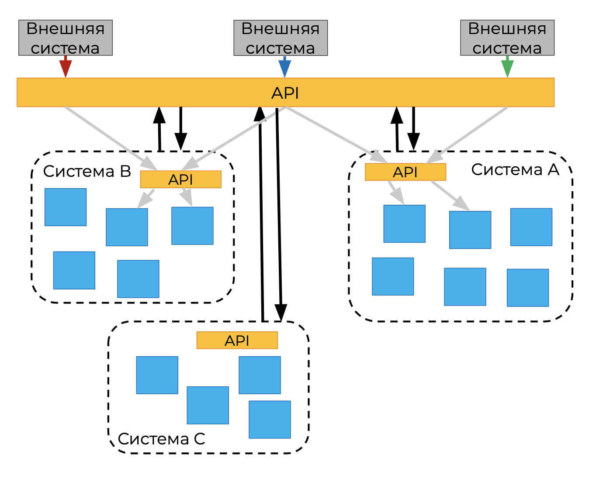

Для исправления ситуации лучше использовать внутренние API систем для коммуникации между ними:

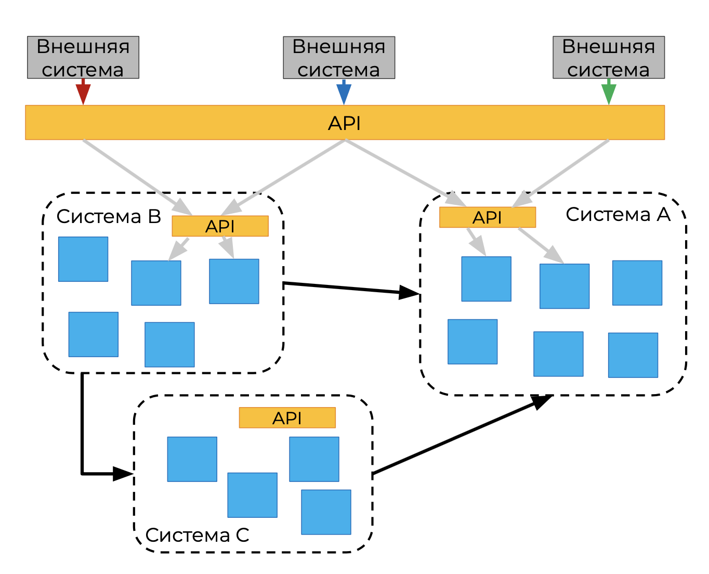

##### API Gateway в роли ESB

###### **Контекст**

Почти все современные API Gateway поддерживают расширение функционала с помощью плагинов.

###### **Проблемы**

- Велик соблазн дописать свои плагины с внедрением бизнес-логики для работы с трафиком/сообщениями. Это ведёт к "хрупкости" решения и может создать эффект "кругов на воде" при изменении конфигурации, когда одно небольшое обновление влечёт обновление множества систем
- Сложность с обновлениями, потому что надо учитывать множество факторов

##### Бесконечные API Gateways

###### **Контекст**

API Gateways создаются для каждой системы, департамента, типа трафика и взаимодействия. Например, шлюз безопасности трафика, авторизации, логирования, департамента А, департамента Б.

###### **Проблемы**

- Усилия для изменения шлюзов и координации несоразмерны пользе от каждого такого шлюза
- Сложность распределения ответственности
- Проблема производительности

### Как выбрать API Gateway?

Осознать собственные требования к API Gateway.

#### Требования к API Gateway

Ниже перечислен список основных требований к API Gateway, не всегда необходим каждый пункт, нужно смотреть по потребностям.

* Уменьшение связи между фронтендом и бэкендом
* Упрощение использования API клиентами за счёт объединения и/или трансляции протоколов сервисов на бэкенде
* Защита API от чрезмерного использования и злоупотреблений с помощью обнаружения и устранения угроз
* Понимание того, как потребляются API и как работают базовые системы
* Управление API как продуктами, т. е. требования к управлению жизненным циклом API
* Монетизация API, включая потребности в управлении учётными записями, выставлении счетов и оплате

#### Знать свои ограничения

* Команда
  * Знания команды, организация, динамика
  * Закон Конвея — любая система отражает способ общения в организации. Например, если решения принимаются неким главным департаментом, то и вся система будет организованна точно также, когда будет единый компонент, который принимает решения за всех.
* Технологии
  * Что используется сейчас?
  * Какие есть возможности миграции на новые технологии?
  * Каков план поддержки выбранной технологии?
* План развития
  * Некоторые технологии и сервисы могут быть запрещены по разным соображениям.

#### Купить иди сделать?

При принятии этого решения важно учитывать:

- Цена владения
- Возможность реализации необходимого функционала на хорошем уровне
- Знание рынка поставщиков

 #### Что обсудить

- Знаем ли мы все наши требования, связанные с выбором API-шлюза, и расставили ли мы приоритеты?
- Знаем ли мы текущие технологические решения, которые были развёрнуты в этой области в организации?
- Знаем ли мы все наши командные и организационные ограничения?
- Изучили ли мы наш план развития организации в связи с этим решением?
- Честно ли мы подсчитали затраты «строить или покупать»?
- Изучили ли мы текущий технологический ландшафт и знаем ли мы обо всех доступных решениях?
- Проконсультировались ли мы со всеми заинтересованными сторонами и проинформировали ли их об анализе и принятии решения?

### Выводы

- API-шлюзы бывают разных типов. Нет одного подходящего всем
- При внедрении API-шлюза есть ловушки и надо о них помнить
- Выбирать надо на основе реальных потребностей, а не обещаний маркетологов