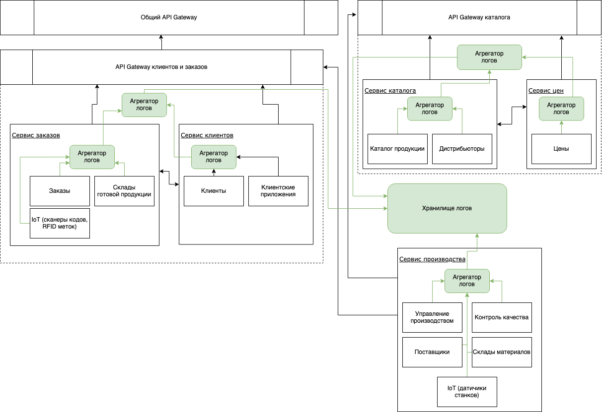

1.

Основные метрики:

* Использование ресурсов железа сервера сервисами, по сути это не одна метрика а совокупность нескольких более конкретных, например: загрузка ЦП, использование оперативной памяти и т.д.. Метрика важна т.к. отображает общую работоспособность системы в целом, сигнализирует о случаях высокой нагруженности, которые могут приводить к потере производительности системы вплоть до полного отказа/падения.
* Статус серверов — отображает текущее состояние серверов системы, сигнализирует в случае выхода какого-то из серверов из строя
* Статусы внешних сервисов — по текущей архитектуре созданные заказы отправляются во внешнюю систему и это является одним из шагов во флоу заказа, поэтому нам важно отслеживать случаи если внешняя система перестала отвечать, чтобы оперативно разобраться в ситуации и отправить и прояснить ситуацию с внешней системой, если проблема действительно на их стороне
* Частота ошибок при работе с внешними системами, аналогично прошлому пункту, про внешнюю систему для заказов, только связанные не с доступностью системы а с ответами получаемыми из неё, например если стало возвращаться множество ошибок валидации или 500х и тому подобного, чтобы мы оперативно могли начать разбираться в ситуации

2.

На схеме все компоненты и связи связанные с логированием обозначены зелёным цветом. Саму схему обновил по замечаниям из модуля 13.

Для построения коммуникации используется шаблон "агрегатор рядом с сервисами", когда в каждом сервисе есть агрегатор собирающий логики сервиса, затем агрегатор сервиса отправляет эти логики агрегатору узла, который отправляет логи в общее хранилище логов. Шаблон выбран потому что в нашем случае он больше всего подходит под наше разделение сервсиов на узлы и наиболее гибкий для нашего случая.

3.

Стратегия хранения логов

| Название       | Состав                                                       | Описание                                                     | Срок хранения | Примерный объём |
| -------------- | ------------------------------------------------------------ | ------------------------------------------------------------ | ------------- | --------------- |
| Заказы         | Логи создания заказов, обмена с внешней системой заказа, работа с заказами (продвижение их по флоу, какие-то изменения) | Наиболее важные логи, т.к. корректная работа заказов является одной из основных бизнес целей, поэтому их нужно хранить как можно дольше чтобы было больше информации для расследования инцидентов | 1 месяц.      | 8 гб            |
| Склады         | Логи получения стоков по товарам, обмен со складской системой | Стоки обновляются несколько раз в день, поэтому нет смысла долго хранить информацию, к тому же она будет знаимать много места, поэтому будет хранить 3 дня, чтобы было достаточно для того чтобы расследовать какой-то инцидент и логи не успели занять много места | 3 дня         | 4 гб            |
| Клиенты        | Логи клиентского сервиса                                     | Может содержать важные логи связанные с модулями клиентов, и не предполагается слишком много поэтому можно хранить долго для расследований | 1 месяц       | 1 гб            |
| Каталог и цены | Логи работы с товарами, категориями, ценами, дистрибьютерами | Каталог тоже является важной часть системы, однако не такой критичной как заказы, поэтому 2х. недель должно быть достаточно для их хранения | 2 недели      | 5 гб            |
| Производство   | Логи обмена с различными системами производства              | Тут не предполагается каких-то критичным логов, поэтому долго их хранить не требуется | 1 неделя      | 1 гб            |

4.

Дальнейшее развитие и рекомендации:

* Внедрение трейсинга
* Слежение и анализ стратегии работы с логами: правильно ли оценены сроки хранения? Достаточно ли их и не излишни ли они, при необходимости пересмотр стратегии.
* Нужно проводить периодический аудит метрик системы: нужны ли новые метрики? Актуальны ли используемые?