# Распределённая архитектура

## «Первое правило» распределенной архитектуры и DDD

Вольное определение распределённой архитектуры: Набор независимых компьютеров, которые для пользователя выглядят, как один.

Характеристики: 
* Компьютеры работают одновременно
* Сбой компьютеров происходит независимо
* Компьютеры не имеют общей синхронизации*

Плюсы:
* Независимость разработки
* Производительность сервисов
* Независимость поставки
* Лёгкость интеграции
Минусы (сложности):
* Контроль состояния
* Сетевые проблемы
* Балансировка
* Согласованность обновлений

Важно помнить:
* Распределенные системы **всега** сложнее
* Компоненты **возможно** реализовывать проще

**Превое правило: не распределяйте сущноти системы, пока это можно избежать**

Распределять сущности можно когда будут известны домены, поддомены и их зоны ответственности.

### Шаблоны для организаци бизнес-логики программных модулей

* Transactional Script
* Table based
* Domain-Driven Design (DDD)

Каждый подход имеет свои достоинства и недостатки, для простых приложений больше подойдёт транзакционный и табличный подход, а для больших приложенй лучше исользовать доменный. Также можно кобинировать несколько подходов в рамках одного сервиса.

#### Transactional Script

Вся логика педставлена последовательным вызовом метода внутри одной функции сервиса, которая обрабатывает запрос пользователя.

#### Table based

Несколько ключевых таблиц над котрорыми производится CRUD (Create Read Update Delete) + набора метода для поиска

#### Domain-Driven Design (DDD)

В случае когда логика принтия решений зависит от множества факторов и требует вовлечения разных сущностей используется доменный подход.

Доменный подход используется для предоставления сложной бизнес логики.

### Выводы

* Не распределяйте сущности, которые учавствуют в одном бизнес-процессе
* Это нормально иметь **разные представления** одной сущности в зависимости от задач сервиса
* Для реализации бизнес-логики в сервисах существуют и другие подходы, кроме DDD

## Service-Oriented Architecture (SOA)

SOA — это модульный подход в разработке приложений, основанный на использовании:
* распределённых
* слабосвязанных
* заменяемых
компонентов, доступных по сети и предоставляющих чётко определённый формат общения.

[Манифест SOA](http://www.soa-manifesto.org/default_russian.html)

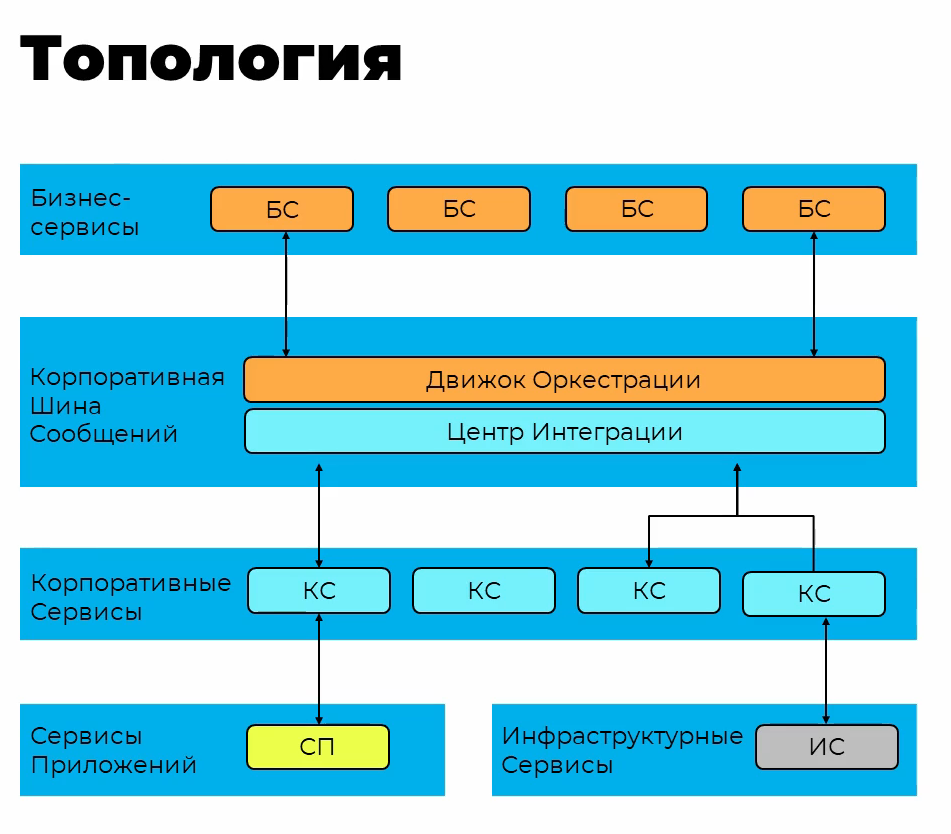

Плюсы:
* отличный потенциал для общения разнородных систем
* категоризация и таксономия бизнес-сервсов
* эластичность общей системы в теории

Минусы:
* очень сложное разворачивание новых версий и тестируемость
* скорость работы
* сложность интеграции
* цена покупки и владения

## Service-Based Architecture

Архитектура призвана упростить уровень сложность уровня оркестрации из SOA.

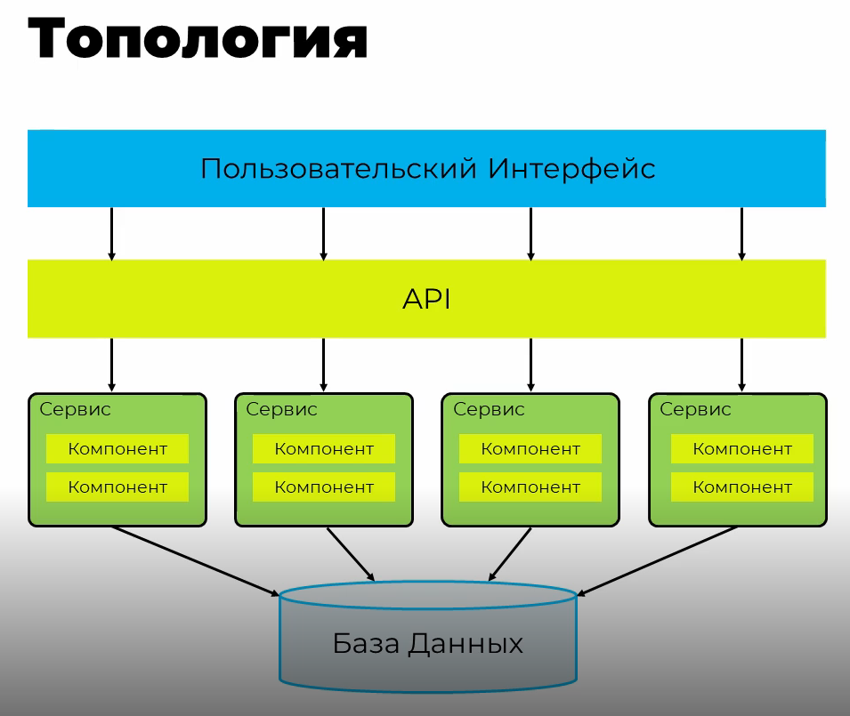

Слой API консалидирует в одном мете технические задачи, такие как:
* Логирование
* Трейсинг
* Авторизация Аутентификация
* Метрики
* Ограничения запросов
* Скрытие ресурсов

Такая архитектура наиболее проста при преходе с монолитного приложения.

### Компоновка

Помимо общей топологии, реализации архитектуры могут отличаться по компоновке:
* Каждый сервис может использоваться в некольких экземплярах (обычно используется один)
* Пользовательские интерфесы к разным группам сервисов могут быть разделены (например, админка и пользовательская часть)
* БД может общей для всех сервисов или у сервисов могут быть свои БД (общная для группы или у каждого своя)

### Работа с хранилищем данных

* Общая схена — используется одна схема для всех сервисов, схоже со спосбом хранения данных в монолите, и имеет такие же минсы: блокировки, раздение ответственности
* Отедльные схемы — для каждого сервиса используются отдельные схемы, для сервисов можно создать отдельного пользователя, сделать представление для схем
* Зеркалирование — создание специальных копий только для чтения для сервисов

### Балансировщик

Используется для организации работы с несколькими экземплярами одного сервиса

### Выводы

Плюсы:
* Возможность расширения логики
* Разворачивание и тестирование
* Стоимость разработки и владения
* Высокий уровень целостности данных
* Подходит для DDD
* Прагматичность

Стоит помнить:

* Плюсы системы не реализуются сами по себе
* Подходит для среднего размера систем (4-12 сервисов)

## Space-Based Architecture

Стиль специально спроектированный для решения проблем:
* Экстремальная и пременная масштабируемость любых объёмов
* Высокая, непредсказуемая, одновременная пользовательская нагрузка
* Эластичность

Суть подхода в том, что данные хранятся в оперативной памяти

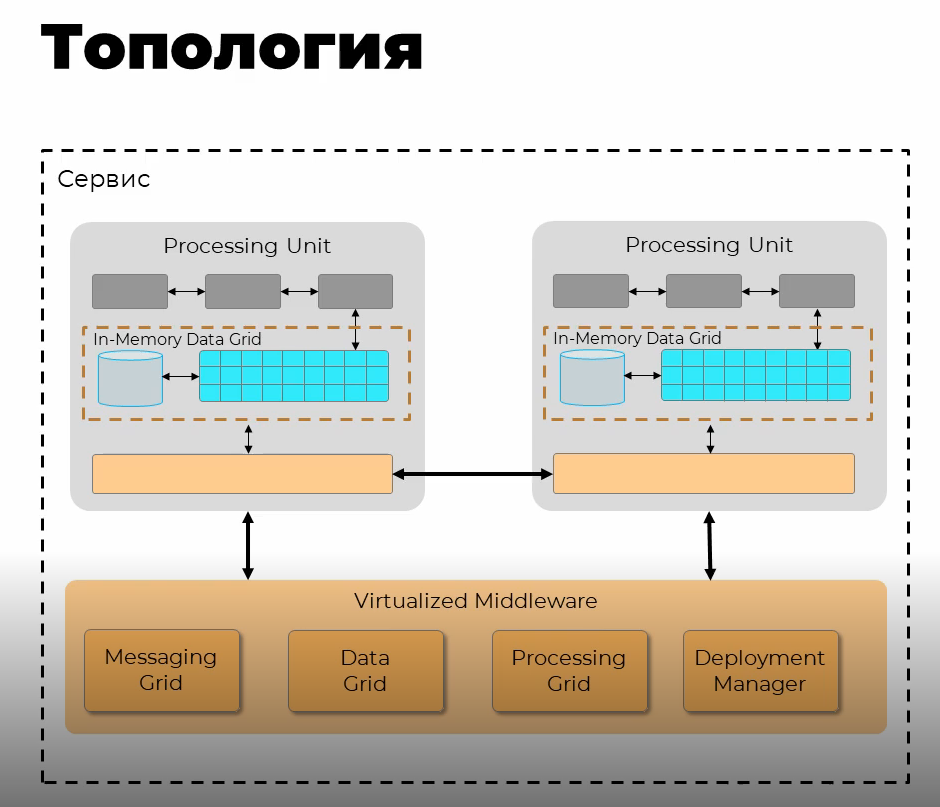

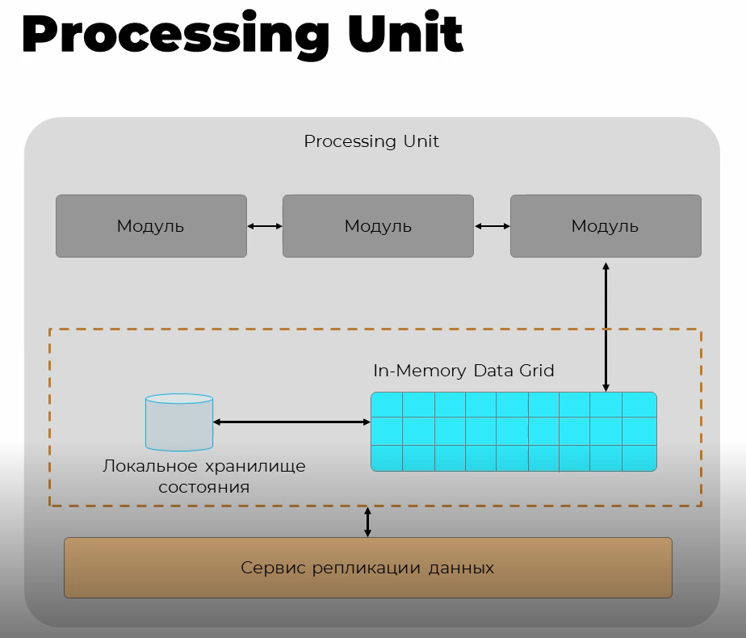

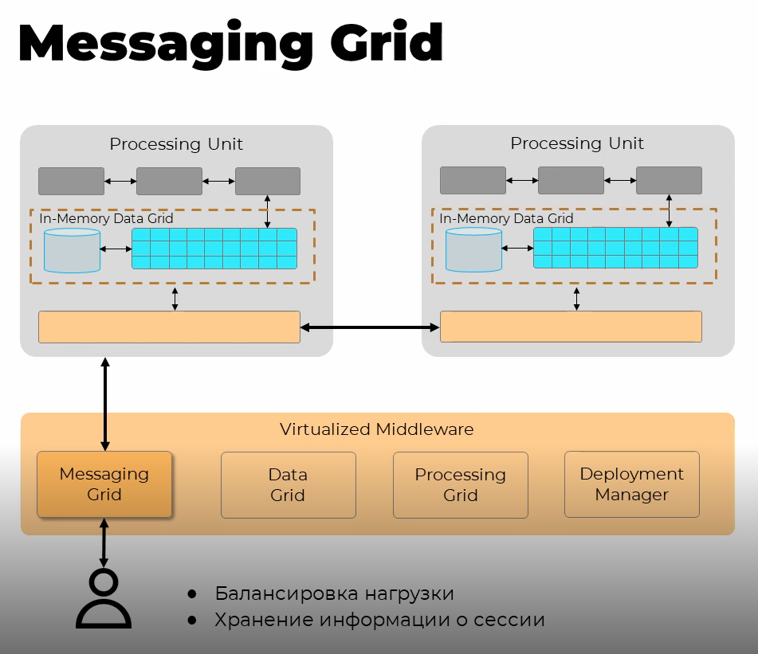

Messaging grid выступает в роли балансировщика, он отдаёт запрос на нужных Processing unit.

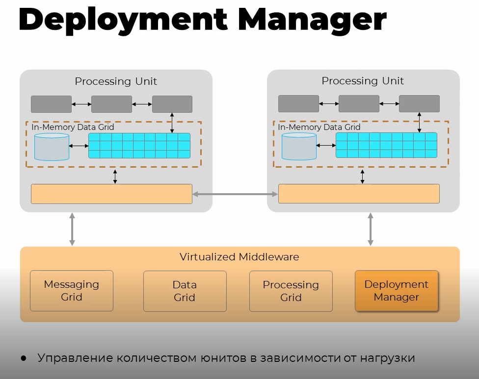

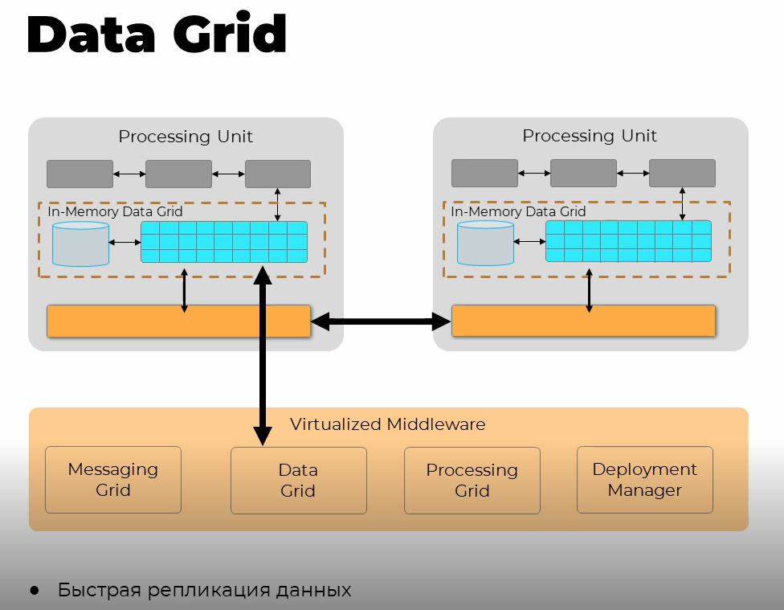

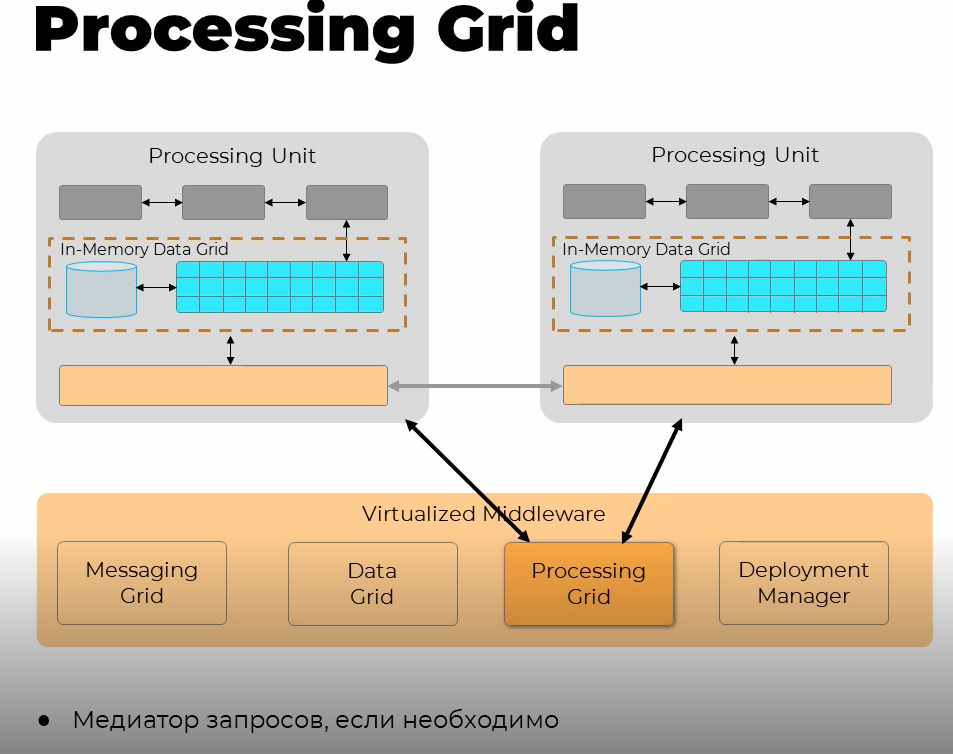

Procssing grid является опциональным, выполняет роль оркестратора

### Колизии

Из-за реплекации данных могут возникать колизии, когда одна репликация отработала меделенее другой и данные записались неверно.

Частота колизий расчитывается по формуле:

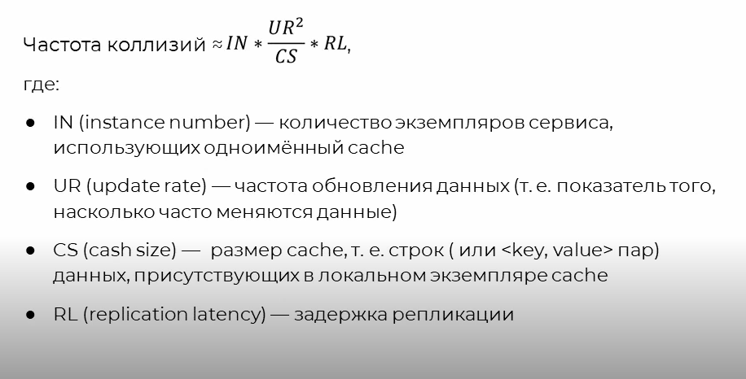

### Распределённый кэш

Если объём данных очень велик следует использовать распределённых кэш, для него обычно используется одтельный сервис.

При использовании распределённого кэша получаются плюсы и минсу использования центрального хранилища.

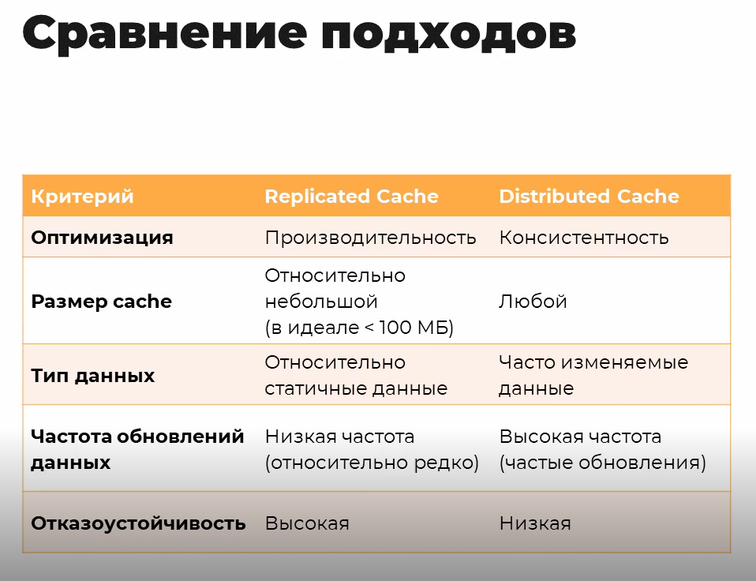

### Near cache

Сбалансированное решение, в нём распределённый кэш выполняет роль бэкапа и содержит все закешированные данные с более долгим сроком жизни, а сервисы имеют локальный кэш с наиболее частными данными.

При использовании этого подхода сихнхронизация между внутренними кэшами больше не производится, что создаёт проблему неравномерности скорости обработки запросов и отзывчивости сервисов, но при условии, что распеределние работы между юнитами случайна. Если происходит кореляция пользователей и юнитов, то можно получить значительный выигрыш в скорости.

### Стратегии управления кэшем

* MRU — (most recently used) последний использованный
* MFU — (most frequently used) часто используемый
* RR — (random replacment) произвольное удаление

### Слой данных

Большинство In-Memory Data Grid решений предоставляет возможность сохранения данных на диске, для востановления состояния кэшей после перезапуска системы.

Если нужно другое решение, то можно сделать по своему, общий принцип работы при этом останется неизменным.

Для обеспечения абстрагирования от хранилища данных можно использовать очереди сообщений. Для каждого сообщения, которое генерирует компонент юнита создаётся сообщение, которое должно обновить внутрненний кэш, одновременно с этим это сообщение можно послать в очередь, которая будет гарантировать доставку сообщения в БД и на диск (для восстановления). Модуль записи будет получать сообщения из очереди и, если необходимо, трансформировать их в нужную структуру и сохранять в базу, таким образом обеспечивается асинхронность.

Не стоит создавать допольнительные экземпляры для обработчика записей, это может привести к блокировкам. Лучше переработать гранулярность сообщений.

Модули чтения должны использоваться только когда:
* отказал сервис и нужно восстановления данных
* идёт обновление сервиса или получения архивных данных, не представленных в реплицированном кэше

### Выводы

Плюсы:
* Высокая автоматичкая степень масштабируемости
* Высокий уровень отказоустойчивости

Минусы:
* Низкая согласованность данных
* Высокая стоимость работ по обеспечению интеграции
* Стоимость специализованного ПО
* Дополнительные трбования к грануляции данных

Данный стиль стоит использовать, когда нужна скорость обработки данных и быстрый ответ на рост нагрузки, а все остальные возможности исчерпаны.

## Event-Driven Architecture

### Тополгии

#### Медиатор

Централизованная схема управления.

* Контроль над процессом обработки сообщений

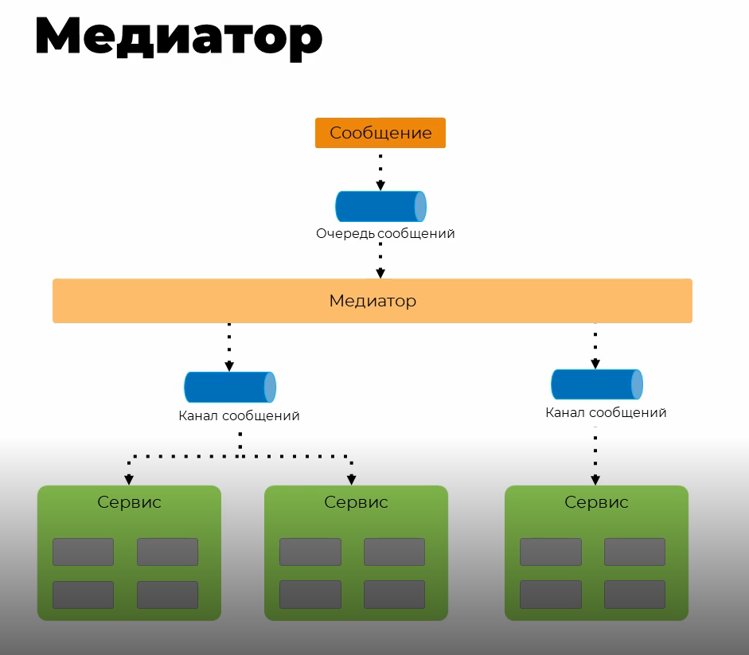

События попадают в общую очередь, за которой следит медиатор, он знает какое сообщение куда послать. Важно сохранять медиатор простым, он должен знать только маршруты сообщений и не содержать бизнес логику.

Очередей сообщений на практике может быть множество, обычно по очереди на определённый тип сообщений.

Всегда есть основное сообщение инициирующее обработку и служебные сообщения, которые представляют из себя выполнение шагов обработки.

#### Брокер

Явная схема контроля отсутвует.

* Обратная связь
* Динамическое управлене обработки сообщений

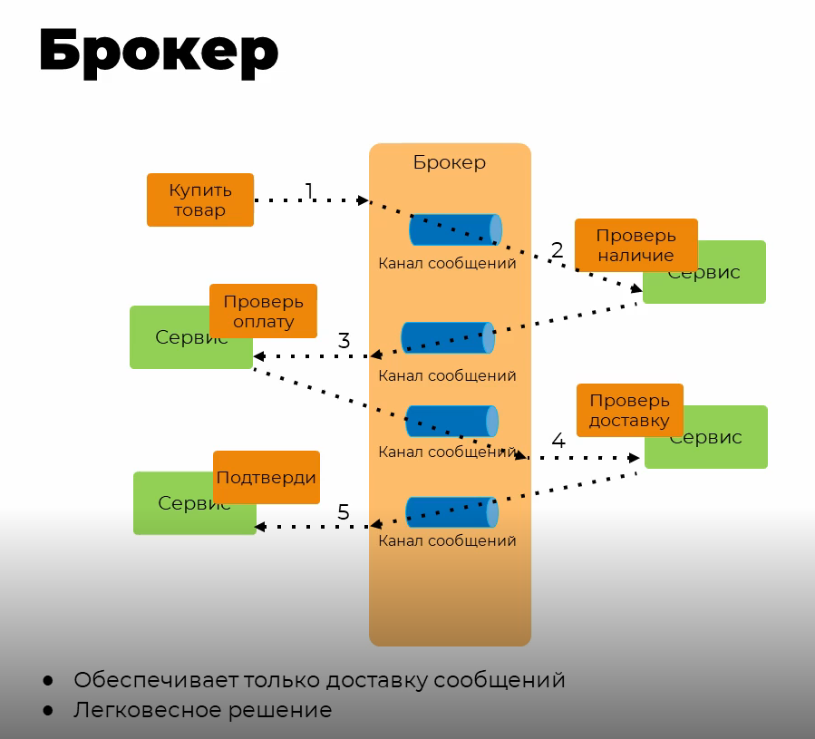

Для этого стиля харакетрно два компонента: брокер и обработчик сообщений. Каналы сообщений, обычно, находятся в брокере, а обработчики сообщают о проделнной работе брокеы и сообщение передаётся следующему обработчику безусловно.

### Выводы

Плюсы:
* независимость разработки сервисов
* точки расширения функционала создаются естественным образом
* лёгкость расширения функционала
* лёгкость наращивания мощностей по обработке сообщений
* лёгкость разворачивания новых версий
* хорошая тестируемость на наличие нежелательных эффектор
* отказоустойчивость

Минусы:
* слабая согласованность данных на верхнем уровне системы
* сложность организации транзакционной записи данных
* управление (создание и поддержка) контрактор сервисов
* высокая когнитивная сложность схем общения
* сложность тестирования и отладки на уровне всей системы

Для реализации этого стиля требуется много сил и времени для большой системы. Но если всё сделано верно, то в такую систему будет легко вносить бизнес изменения.

## Microservices

Микросервисы были сильно вдохновлены подходами DDD и концепцией bounded-context (ограниченного контекста), поставленной во главу угла.

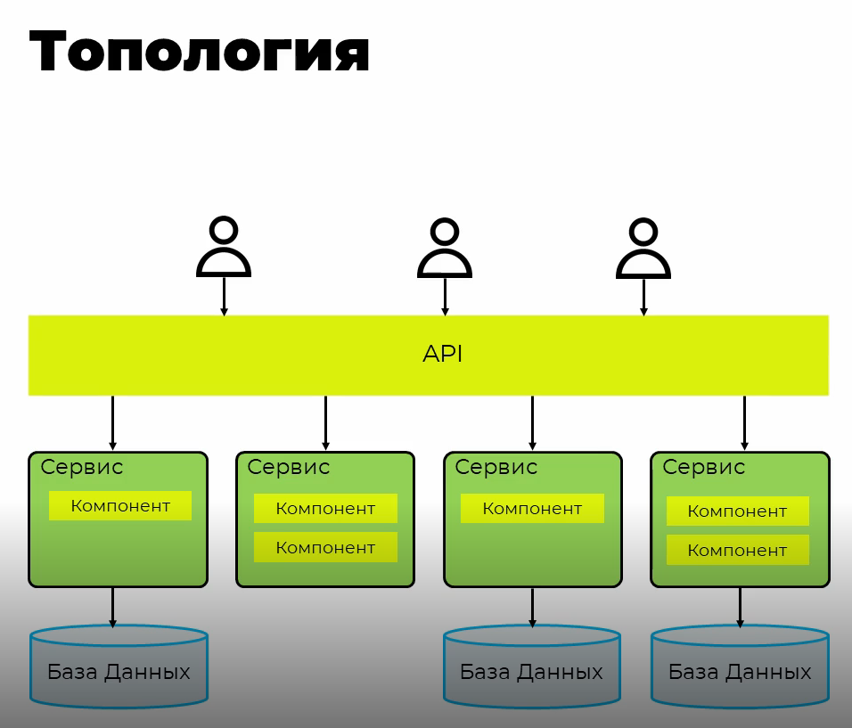

Важный требованием микросервисного подхода является то, что микросервисы должны минимизировать зависмости между собой. Это означает, что при неоходимости бизнес код можно копировать в разных сервисах отходя от общих решений. Однако, это с этим стоит быть осторожным.

Стиль не налогает ограничения на способы обмена, однако стоит придерживаться правила: "умные коннекторы, элементарные каналы", т.е. канал преедачи должен отвечать только за предачу и не содержать никакой логики внутри. Сервисы реализуют умные конекторы, которые знают как десиализировать данные, проверить их и т.д. Это вызвано тем, что сервисы должны быть максимально изолированными и любое внешнее общение должно воспринматься как потенциально опасное.

Связь между сервисами может быть синхронной и асинхронной, это зависит от бизнес требований.

Базы данных независимы для каждого сервиса, при этом каждый сервис может выбирать наиболее подходящие для себя реализацию хранилища. Несколько экземпляров одного сервиса могут работать с одной БД. Распделённые транзакции нужно избегать, если нужна связанность данных то стоит рассмотреть гранулярность сервисов.

### Выводы

Основные принципы:
* Копирование кода лучше, чем создание технологической зависимости
* Умные конекторы, элементарные каналы
* Стандартизация подходов к интеграции, а не создание платформы
* Децентрализованное управление данными

Плюсы:
* высокая масштабируемость
* гибкость изменения функционала
* модульность
* эластичность

Минусы:
* сложность общего решения
* общая стоимость владения
* скорость работы
* сложность создания инфраструктруного ландшафта

Не начинайте с микросервисного подхода. К этому стилю вы придёта эволюционно из монолита.

### Eventul consistensy

При использовании микросервисов, следует учитывать, что в какой-то момент данные будут согласованы, но не оговаривается, в какой момент и на сколько. При этом согласованность данных будет только для части сервисов.

## Как выбрать архитектурный стиль?

### Алгоритм выбора архитектуры

1. Анализ бизнес-цели
2. Понимание организацонных и технологических ограничений
3. Выделение функциональных требований
4. Описание нефункциональных требований и приотеризация атрибутов качества
5. Выделение рисков
6. Синтезирование и анализ решений
7. Выбор решений
8. Ретроспективный анализ решений на предмет удовлетворения целей бизнеса по полноте и стоимости решения

### Цель

Архитектор не должен быть экспретом в доменной области, но должен иметь хорошее общее предоставление о проектируемой системе.

Очень важно понять: чего хочет бизнес?

### Ограничения

Организационные:
* бюджет
* сроки
* команда или команды
* лицензии
Внешние:
* регуляторы
* законы
* внешние интеграции
Системные:
* безопасность
* скорость
* доступность

Закон Конвея:
>Оргенизации, проектирующие системы, ограничены дизайном, который копирует структуру коммуникации в этой организации
т.е. если в организации всё подченено одному отделу/руководтелю, то и система, скорее всего, будет монолитной. Если есть множество команд, работающих самостоятельно, то может быть получена распределённая архитектура или микросевисы.

### Функциональные требования

Описывают, **что** будет делать проектируемая система. Неважно, **как** это будет сделано технически.

### Нефункциональные требования

Описывает **как** это будет сделано технически.

Сценарии атрибутов качества:
* Работка как обычно
* Расширение:
  * Цена владения
  * Добавление модулей
  * Добавление фич
  * Ускорение
* Неожимадности
  * Новые законы
  * Смена лицензий
  * Метеорит упал на ДЦ
Особое внимание стоит удлеить проработке сценариев расшинения и неожиданостей.

### Способы анализа

* Architecture Trade-off Analysis Method: Основной упор на анализе рисков, принятых компромиссах, возможный сложностей. Проводится другой командой архитекторов, чтобы был свежий взгляд.
* Post-Benefit Analysis: Оценивается стоимость принятых архитектурных решений и насколько полно они отвечают бизнес-целям. Необходимо минимизировать стоимость и максимизировать пользу 
* Architecture-Level Modifiability Analysis: В фокусе находятся сценарии возможных изменений в системе. Насколько легко система может быть изменена. Все предложения рассматриваются с особым вниманием
* Simulation Analysis: Строится прототип системы и цениваются атрибуты качества, всё ли удовлетворяет плану
* Mathematical Modeling: Используется математический аппарат для формального анализа системы на непротиворечивость и нежелательные эффекты. Пример такого языка — TLA+

### Документирование

Архитектура должна быть задокументированнна. В документе должны быть отражены:
* бизнес-цели, контекст системы, ограничения
* функциональные и нефункциональные требования
* бизнес и технические риски, предположения
* сценарии использования и атрибуты качества
* стейкхолды
* виды и переспиктивы системы (4+1 Views).
