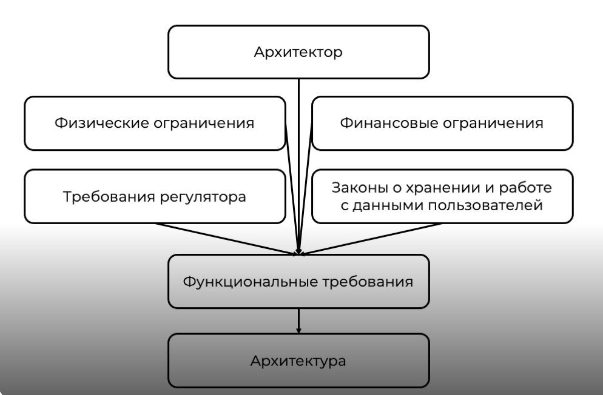
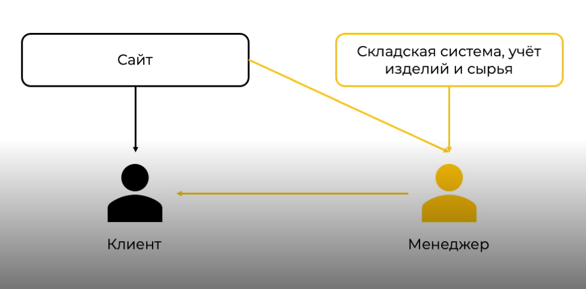

# Функциональные требования 

## Ключевые концепции 

### Работа с требованиями

* AS IS — требования к системе для решения задач здесь и сейчас (операционные задачи) 
* TO BE — требования к системе для решения задач, которые появятся на горизонте полугода и больше (стратегические задачи)

### Атрибуты качества системы или цифрового продукта

**ISO — 25010**

1. Функциональная пригодность
2. Уровень производительности
3. Совместимость
4. Удобство пользователя (юзабилити)
5. Надёжность
6. Защищенность
7. Сопровождаемость
8. Переносимость (мобильность)

#### Функциональная пригодность

* Функциональная полнота — то насколько система отвечает тем функциональным и бизнес требованиям, которые были выявлены на этапе их сбора
* Функциональная корректность — то насколько система корректно отрабатывает собранные требования
* Функциональная целесообразность — те функции, которые реализует система для того чтобы отвечать каким-то требованиям пользователя

#### Уровень производительности

Уровень производительности — это отношение результата при работе системы к ресурсам, которые для этого потрачены. Ресырсы могут выражаться в CPU, RAM, количество бумаги и т.д. но не относящиеся к людским ресурсам, они рассматриваются отдельно.

* Временные характеристики — способность системы ответить пользователю в заданое ей время
* Использование ресурсов — ресурсы которые необходимы для нормально функционирования системы
* Потенциальные возможности — то насколько система может отвечать пиковым нагрузкам, которые были согласованы.

#### Совместимость

Совместимость — возможность системы находится в одной среде исполнения с другими системами, при этом эта среда должна быть настроенна таким образом, чтобы она предоставляла те ресурсы, которые были описаны в требованих к системе.

* Сосуществование 
* Интероперабельность (функциональная совместимость)

#### Удобство пользователя (юзабилити)

* Определимость пригодности ­— возможность понять пользователю насколько ему нужна система, то насколько удобно ей будет пользоваться
* Изучаемость — отвечает за то, что пользователю комфотно изучать систему
* Управляемость — управлением системой прозрачно для поьзователя
* Защищённость от ошибки пользователя — то насколько система отвечает на ошибки пользователя и помогает ему их избежать
* Эстетика пользовательского интерфеса
* Доступность

#### Надёжность

* Готовность
* Отказоустойчивость
* Восстанавлваемость

#### Защищенность

* Конфиденциальность
* Неподдельность
* Достоверность
* Отслеживаемость
* Подлинность

#### Сопровождаемость

* Модульность
* Возможность многократного использования
* Анализируемость
* Модифицируемость
* Тестируемость

#### Переносимость (мобильность)

Система должна легко запускаться в любом предоставленном облачном окружении и переносится между ними.

* Адаптивность
* Устанавливаемость
* Взаимозаменяемость

## Функции системы

### Анализ требований

Требование:
>Нам нужно сделать продающий сайт удобный для пользователя

Бизнес требовани из двух пунктов:
* Сайт должен продавать наш продукт
* Должен быть удобен для пользователя

Дполнительные требования, которые не являются бизнес-требованиями, но могут быть ограничениями:
>Данные будем хранить в ORACLE 
>Купим сервера в AWS

Нужно узнать:
* Почему выбор пал на Oracle?
* Зачем мы себя ограничиваем только AWS?

Возможно, люди захотели использовать понятные для них технологии, в которых они компитентны. А возмжоно это ограничение: например, у копаниии уже куплена лицензия на Oracle и заключен контракт с ASW.

ТРИЗ — теория решения избирательных задач
ИКР — идеальное конечное решение

### Составление ИКР

Для составления ИКР необходимо понимания текущего состояния системы.

#### Текущее состояние

Мы имеем сайт, на котором есть номер телефона, куда пользователь может позвонить и заказать наш продукт.

Во время разговора наш менеджер раскажет о том, какие у нас продукты в наличии и сколько будет стоить модификации.

После этого согласует дату доставки и при изменениях сообщи об этом клиенту.

#### Бизнес-требования

Дано:
* Главный объект — клиент
* Главный процесс — покупка товара
* Не погружаемся в реализацию

Что мы хотим получить:
* клиент **сам** может узнать о наличии у нас продуктов
* **сам** может оформить заказ и добавить модификации
* **сам** может выбрать время для доставки

#### Классы требований

* Бизнес-требования — Верхнеуровневое описание, к каким целям стремится компания. Помимо уникальных продуктов, все бизес-требования, как правило, выделяют:
  * Уменьшение цены владения системой
  * Улучшение самой системы, её возможностей и характеристик
  * Улучшение позиций на рынке
  * Улучшение и удешивление поддержки бизнес-процессов
  * Улучшение восприятие при использовании системы и её узнаваемости
* Требования пользователей — Цели и задачи пользователя
* Функциональные требования — Функции нашей системы, для решения задач пользователя
* Нефункциональные требования — Требования которые применяются к продукту, чтобы его удобно было сопровождать, масштабировать и поддерживать
* Спецификация требований ISO-29148

#### Зависимость от функций других систем

Клиент **сам** может узнать о наличии у нас продуктов.

Из схемы нужно убрать менеджера и связать сайт со складской системой, чтобы пользователь мог узнать о наличии продуктов.

Для реализации понадобятся:
* Контракт для взаимодействия и данные
* Протокол взаимодействия
* Необходимость защиты канала соединения
* Аутентификация и авторизация систем
* Доработки смежных систем
* Сроки разработки

#### Оценка и стоимость

* Аналитик — 0.3 (Front+Back)
* Front-разработчик — x
* Back-разработчик — y
* Тестировщик — 0.3 (Front+Back)
* Сопровождение — 0.1-0.2 (Front+Back) в год
* Дизайнер — z

Стоит ответить на вопрос: а не проще ли купить данное решение?

Для этого надо оценить:

* Своё решение
  * Оценка реализации
  * Стоимость поддержки
  * Стоимость серверов
  * Стоимость кастомизации
  * Время реализации
  * Стоимость отказа от своего решения
* Готовое решение
  * Стоимость лицензии в год
  * Стоимость поддержки
  * Стоимость серверов
  * Стоимость кастомизации
  * Время внедрения
  * Стоимость перехода от своего решения

#### Оценка рисков

После оценки решения, нужно оценить риски. Но даже с учётом рисков может оказаться, что итоговая стоимость продукта будет значительно больше.

##### Виды рисков. Таксономия

* Люди
  * Заказчики
  * Исполнители
  * Персонал
  * Конечные потребители
  * Мотивы людей
  * Квалификация
* Процессы
  * Цели и задачи
  * Принятие решений
  * Характеристики проекта
  * Бюджет
  * Сроки
  * Реализация
  * Тестирование
* Технологии
  * Безопасность
  * Среда разработки и тестирования
  * Внедрение
  * Сопровождение
  * Боевая среда
  * Доступность
* Внешние условия
  * Законодательство
  * Индусриальные стандаты
  * Конкуренция
  * Экономические условия
  * Технологии
  * Квалификаця
## Подходы к декомпозиции

### Где мы находимся сейчас?

* У нас есть сайт, где находится информация о нашей продукции
* Есть возможность оформить заказы через менеджера по телефону
* После оформления менеджер подтвержает и согласовывает дату доставки клиентом
* При изменениях в заказе менеджер связывается с клиентом для согласования

### Цели

* Полная автоматизация процессов
* Возможность пользователя самому управлять своим заказом
* Интеграция со складской системой и системой доставки
* Прозрачность состояния заказа для клиента

### Процесс оформления заказа

1. Пользователь выбрал продукт
2. Пользователь добавил его в корзину
3. Добавил ещё один продукт
4. Перешёл в корзину и нажал "Оформить заказ"
5. Оператор увидел новый заказ
6. Оператор позвонил клиенту и подтвердил заказ
7. Оператор пометил заказ как подтверждённый
8. Заказ попадает на склад для формирования, сборки и послдующей отправки
9. Вынесение каких-то изменений в заказ
10. Доставка

После анализа мы выяснили, что чем дольше пользователь ждёи звонка от менеджера, тем больше вероятность, что он откажется от заказа. Получается нужно сделать систему которая будет резервировать товар и оформлять заказ мнгновено. Поэтому для реализации MVP мы ведлим 7 пунктов и сосредоточимся на них:

### MVP

1. Пользователь выбрал продукт
2. Пользователь добавил его в корзину
3. Добавил ещё один продукт
4. Перешёл в корзину и нажал "Оформить заказ"
5. Оператор увидел новый заказ
6. Оператор позвонил клиенту и подтвердил заказ
7. Оператор пометил заказ как подтверждённый

#### Процедурный подход

Функции которые необходимо реализовать:
1. Проверить наличие товара
2. Добавить товар в корзину
3. Оформить заказ и зарезервировать его на складе
4. Назначить время доставки

Для реализации проверки наличия нужно реализовать интеграцию между складской системой и подпрограммой "проверка наличия товара".

Для корректного резервирования небоходимо реализовать транзакцию, которая проверит наличие товара на складе, зарезервирует его и только после этого поменяет статус в корзине на "зарезервировано".

Для доставки нужна интеграция с системой доставки.

##### Выводы

Минусы:
* При больших проектах становится неподдерживаем
* Сложные зависимости между процедурами чеще всего плохо документируются
* Большее количество взаимосвязей

Плюсы:
* Лёгок в понимании
* Ленко делить на процедуры или подпрограммы

#### Доменые области

Общая система состоит из:
* Сайт, управление корзиной
* Складская система
* Система доставки

Домен сайта состоит из сущностей:
* Клиент
* Заказ (она же корзина, т.к. корзина по сути это заказ на определённом этапе жизненного цикла)
* Продукт

Они взаимдействуют таким образом: Клиент -> Заказ -> Продукт. При этом клиент на связан напрямую с продуктом.

Складская система взаимодействует с продуктами и ничего не знает о клиентах и заказах

Система доставки взаимодействует только с заказами

Эта система построена на принципе Single Responsibility (Единственной ответственности), когда каждый домант отвечает только за свои области.

## Domain Drive Design 

### Ключевые концепции

Стратегическое проектирование:
* Domain — сущности и процессы реального мира, которые нужно автоматизировать
* Ubiquitous language (единый язык домена)
* Bounded context (ограниченный контекст)

Операционное проектирование:
* Шаблоны проектирования
  * Enity
  * Value object
  * Aggregate

Для того, чтобы правильно построить домен и выделить в нём сущности необоходимо:
* Доменные эксперты — специалисты в бизнес области
* Функциональные модели 
* Описание процессов

Subdomain — часть общего домена, логически выделенная из него и отвечающая за конретный функционал
Core domain — смысловое ядро. То, что в первую очередь нужно реализовать, то где должны быть лучшие разработчики и лучшие специалисты.
Support Domain — вспомогательный домен. Помогает существовать основному и служит для обеспечени нормальной работы смыслового ядра.
Generic Domain — общий домен. Общие функции, необходимые любой компани, например рассылки, аутентификация пользователей, сбор метрик, продаж и т.д.

### Единый язык домена

* Небор терминов, применемых в модели домена, описывающий компоненты и процессы
* Термины должны однозначно интерпретироваться всмеми участникамм

Для начала следует понять:
* Что такое продукт?
* Какие есть характеристки у продукта?
* Можем ли мы менять характеристики продукта?
* Как продукты взаимодействуют между собой?
* В каких процессах они учавствуют?
* Может ли клиент выбрать любой продукт?

### Ограниченный контекст

Это явная граница, внутри которой существует модель предметной области, которая отображает единый язык в модель программы.
* Каждом ограниченном контексте свой единый язык
* Язык является единым только в рамках ограниченного контекста
* Ограниченный контекст не должен быть большим

### Связи контекстов

* Партнёрство (Partnership)
* Общее ядро (Shared kernel)
* Разработка заказщик-поставщик (Customer-supplier development)
* Конформист (Conformist)
* Предохрантельный уровень (Anticorruption layer)
* Служба с открытым протоколом (Open host service)
* Общедоступный язык (Published language)
* Отдельное существование (Separate ways)
* Выделение нескладных меделей в отдельный контекст

### Сущность (Entity)

* Определяет сущность в бизнес-логике
* Имеет набор атрибутов
* Может быть изменяема
* Обязательно имеет идентификатор
* При одинаковых ID сущности равны

### Объект-значение (Value object)

* Он измеряет, оценивает или описывает объект предметной области
* Его можно считать неизменным
* При внесении изменений объект-значение заменяется
* При равенстве всех атрибутов объекты считаются равными
* Не имеет ID
* Все атрибуты прошли бизнес-валидацию

### Агрегаты (Aggregate)

* Содержит в себе Entity
* Содержит в себе Value object
* Имеет свой корень Aggregate Root
* Все обращения только через Aggregate Root
* Aggregate Root имеет уникальный глобальный идентификатор
* Внутренние объекты имеют локальные идентификаторы

Агрегаты нужны чтобы следить за всеми логическими взаимсвязами внутр области и соответствие их бизнес-требованиям.
