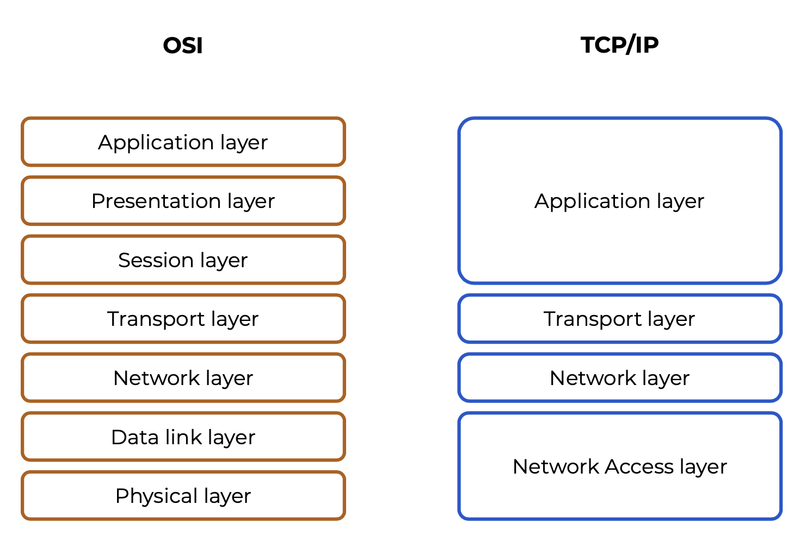
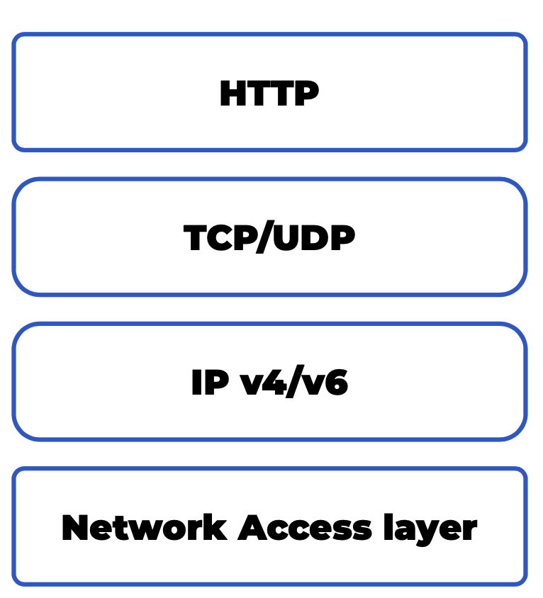
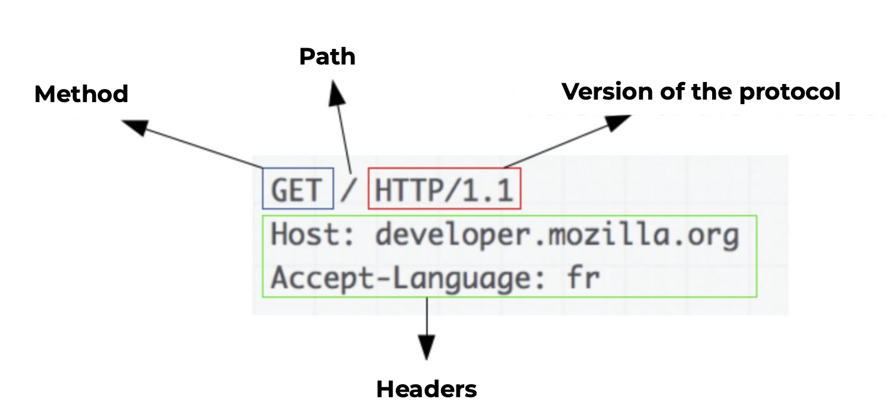
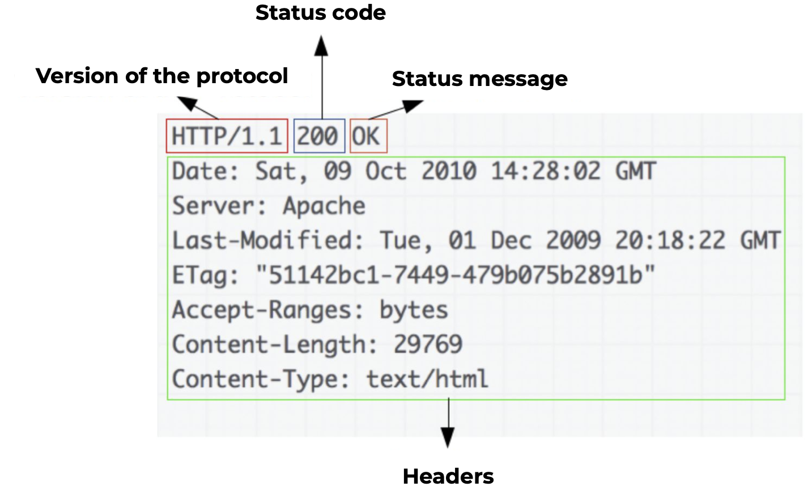

# Проектирование API


## HTTP протокол. Модель OSI и TCP / IP

### Модели OSI и TCP/IP



Модель OSI была построена на базе TCP/IP для того чтобы декомпозировать разработку приложений и уровни описанные в TCP/IP.

#### Слои

##### Physical layer

В TCP/IP — Network Access layer

Отвечает за:

* Передача битов по сети
* Представление сигналов в цифровую информацию

##### Data link layer

В TCP/IP — Network Access layer

Отвечает за:

* Выделение потоков бит
* Обнаружение и коррекция ошибок
* Управление доступом к возможности отправлять сообщения в широковещательных сетях

##### Network layer

В TCP/IP — Network layer

Отвечает за:

* Адресация запросов
* Маршрутизация через транспортные узлы

##### Transport layer

В TCP/IP — Transport layer

Отвечает за:

* Надёжность выше, чем у сети (т.к. реализована проверка хэш-сум пакетов)
* Позволяет абстрагироваться от нижних уровней

##### Session layer

В TCP/IP — Application layer

Отвечает за:

* Для поддержания сессии
* Определение последовательности доступа
* Определение доступа к ресурсам
* Защита от разрывов соединения
* Возобновление работы после разрывов

##### Presentation layer

В TCP/IP — Application layer

Отвечает за:

* Форматы представления символов
* Шифрование и дешифрование

##### Application layer

В TCP/IP — Application layer

Отвечает за:

* Электронная почта
* Видео, аудио
* Доступ к файлам
* WEB и т.д.

### TCP/IP для HTTP



В  **Network access layer** реализована физическая передача сигнала, например через оптоволокно, витую пару и т.п.

С помощью **IP v4/v6** осуществляется адресация конкретных компьютеров для доступов к ним и передачи данных.

Транспортный уровень **TCP/UDP** в HTTP до 3й версии используется TCP, который контролирует чтобы все данные, которые были отправлены, дошли до клиента. Для HTTP 3 используется UPD, он позволяет не обращать внимание, если какие-то данные не дошли, и тем самым, позволяя увеличить пропускную способность. Это сделано потому что при установлении соединения сеть начинает передавать данные постепенно, в случае разрыва соединения это начинается заново, поэтому для TCP/IP, в случае разрыва, необходимо заново отправить эти данные, для UDP потеря эти байтов не страшна, приложение достроит данные без этих байт.

На уровне приложения работает **HTTP** использующий предыдущие уровни для реализации своего протокола.

### HTTP

#### Запрос



#### Ответ



#### Методы

- **GET** — запрашивает представление ресурса. Запросы
   с использованием этого метода могут только извлекать данные
- **HEAD** — запрашивает ресурс так же, как и метод GET, но без тела ответа
- **POST** — используется для отправки сущностей к определённому ресурсу. Часто вызывает изменение состояния или какие-то побочные эффекты на сервере
- **PUT** — заменяет все текущие представления ресурса данными запроса
- **DELETE** — удаляет указанный ресурс
- **CONNECT** — устанавливает «туннель» к серверу, определённому по ресурсу
- **OPTIONS** — используется для описания параметров соединения с ресурсом
- **TRACE** — выполняет вызов возвращаемого тестового сообщения с ресурса
- **PATCH** — используется для частичного изменения ресурса

#### Cookie

Передаются через заголовки **Set-Cookie**:

```http
Set-Cookie:<имя-cookie>=<содержание-cookie>
```

#### Коды ответов

- Информационные (100–199)
- Успешные (200–299)
- Перенаправления (300–399)
- Клиентские ошибки (400–499)
- Серверные ошибки (500–599)

Описаны в [RFC 7231](https://datatracker.ietf.org/doc/html/rfc7231#section-6)

## REST

REST (Representational State Transfer) — архитектурный принцип построения распределённых систем. Описан Ройем Филдингом в 2000м году.

#### RESTful

Для построения RESTful необходимо:

* Client-server — система должна быть разделена на сервер (отдаёт данные) и клиентов (получают данные)
* Stateless — все сервисы должны быть stateless, т.е. они не должны хранить состояние о запросе клиента. Любом запрос сделанный к разным инстансам сервиса должен вернуть схожие результаты
* Cache —запросы к серверу должны быть помечены как кешируемый/некешируемые 
* Uniform Interface — необходимо реализовать единый интерфейс общения между клиентом и сервером 
* Layered System — архитектура может делится на слои
* Code on demand — (опцианально) можно отдавать какие-то скрипты на сторону клиента, для произведения вычисления на клиентской стороне

##### Client-server:

* На клиенту не надо хранить данные с сервера, он может ходить за ними на сервер
* На сервере не должно хранится состояние клиента
* Логика, которая будет в сервисах, не должна быть связана с тем как эти данные будут отображаться у клиента

##### Stateless:

* Stateless сервисы не сохраняют состояние сессии, клиента и состояния запросов
* Необходимы для реализации идемпотентных запросов
* Это позволяет легко масштабировать сервис, добавляя новые инстансы

##### Cache:

* Необходимо помечать те запросы, которые можно кешировать

##### Uniform Interface:

* Основан на ресурсах
* Управление ресурсами через состояния
* Самодокументируемые сообщения
* Взаимодействие с сервером через гипермедиа — доступ к конкретному ресурсу должен сопоставляться с URI к этому ресурсу

##### Layered System:

* Можно реализовать сложную слоистую архитектуры
* Если какой-то сервис 1 взаимодействует с другим сервисом 2 для передачи данных клиенту, то клиент должен знать только про сервис 1, и не может запросить данные напрямую у сервиса 2.

##### Code on demand:

* Опциональная возможность, когда можно отдать часть логики на клиент
* Сейчас на клиенте, в основном используется JavaScript

#### HTTP-методы управления ресурсами

*  **POST** (создать ресурс)
* **GET** (получить ресурс)
* **PUT** (перезаписать ресурс)
* **DELETE** (удалить ресурс)
* **PATCH** (перезаписать поля в ресурсе)

Например:

* Создание
  * **POST** /users ➝ Id “1”
* Чтение
  * **GET** /users
  * **GET** /users/1
* Изменение
  * **PUT** /users/1
  * **PATCH** /users/1
* Удаление
  * **DELETE** /users/1

#### Итоги

REST даёт:

* Передача данных в чистом виде
* Лёгкая масштабируемость
* Включение кеширования
* Простота использования
* Декомпозиция логики

## API Best Practices

### Именование

* Управление через методы HTTP
* Ресурсы во множественном числе, если в системе уже используется единственное число, то следует использовать его, главное чтобы все запросы были единообразны
  * **GET** /users
* ID ресурса — это часть пути
  * **GET** /users/{user_id}
  * **GET** /users/123
* Иерархичность ресурсов
  * **GET** /users/123/orders

### Фильтрация

* Фильтры передаются через query-параметры
  * **GET** /users?birth_date=2000
  * **GET** /users/123/orders?status=”open”
  * **GET** /users/orders?status=”open”

### Ответ на запрос данные

* Формат данных: json

* **GET** /users/123 

  HTTP status 200 **“Ok”** 

  Body

  ```json
  {
     "Id":"123",
     "FirstName":"Max",
     "LastName":"Ivanov",
     "BirthDate":"23.11.2000",
     "Phone":"+7(999)-000-00-00"
  }
  ```

* **GET** /users/13113123 

  HTTP status 404 **“Not Found”** 

  Body

  ```json
  {
     "Message":"Клиент не найден"
  }
  ```

* **GET** /users?birth_date=2000

  HTTP status 200 **“Ok”**

  Body

	```json
	[
     {
        "Id":"123",
        "FirstName":"Max",
        "LastName":"Ivanov",
        "BirthDate":"23.11.2000",
	      "Phone":"+7(999)-000-00-00"
	   },
	   {
	      "Id":"124",
	      "FirstName":"Max",
	      "LastName":"Ivanov",
	      "BirthDate":"12.03.2000",
	      "Phone":"+7(999)-000-00-01"
	   }
	]
	```

* Если по запросу не нашлось ни одной записи

  **GET** /users?birth_date=2000

  HTTP status 200 **“Ok”**

  Body

  ```json
  []
  ```

  ### Пагинация

  Для разделения больших ответов с коллекциями используется пагинация, она позволяет получать данные коллекции по странично.

  Для пагинации используются специальные query-параметры:

  * limit —максимальное числе элементов
  * offset —с какого элемента начинается выдача (сдвиг)
  * sort —сортировка, через двоеточие передаётся порядок сортировки (ASC — по возрастанию, DESC по убыванию)

  ```
  GET users?limit=10&offset=45&sort=birth_date:desc
  ```

  В ответе, кроме элементов коллекции, добавляется поле **pagination** с информацией о пагинации, сами элементы коллекции помещаются в поле **data**:

  ```json
  {
     "pagination":{
        "limit":10,
        "offset":45,
        "sort":"birth_date:desc",
        "totalCount":100
     },
     "data":[
        {
           "Id":"123"
        }
     ]
  }
  ```

  Можно реализовать свою пагинацию не как описано здесь, но главное — это соблюдать принцип единообразия в системе.

### Создание ресурса

* Запрос:

  **POST** /users 

  body

  ```json
  {
     "FirstName":"Max",
     "LastName":"Ivanov",
     "BirthDate":"23.11.2000",
     "Phone":"+7(999)-000-00-00"
  }
  ```

* Ответ

  HTTP status 201 **“Created”**

  body

  ```json
  {
     "Id":"123",
     "FirstName":"Max",
     "LastName":"Ivanov",
     "BirthDate":"23.11.2000",
     "Phone":"+7(999)-000-00-00"
  }
  ```

### Изменения состояния

* Запрос:

  **PUT** /users/123

  body

  ```json
  {
     "FirstName":"Max",
     "LastName":"Zotov",
     "BirthDate":"23.11.2000",
     "Phone":"+7(999)-000-00-00"
  }
  ```

* Ответ

  HTTP status 200 **“Ok”**

  body

  ```json
  {
     "Id":"123",
     "FirstName":"Max",
     "LastName":"Zotov",
     "BirthDate":"23.11.2000",
     "Phone":"+7(999)-000-00-00"
  }
  ```

### Частичное изменения состояния

* Запрос:

  **PATCH** /users/123

  body

  ```json
  {
     "LastName":"Zotov"
  }
  ```

* Ответ

  HTTP status 200 **“Ok”**

  body

  ```json
  {
     "Id":"123",
     "FirstName":"Max",
     "LastName":"Zotov",
     "BirthDate":"23.11.2000",
     "Phone":"+7(999)-000-00-00"
  }
  ```

### Удаление ресурса

* Запрос:

  **DELETE** /users/123

  body

* Ответ

  HTTP status 200 **“Ok”**

  body

### Версионирование

Можно версионировать API разными способами:

* С помощью **URI**:
  * **order_controller/v1/**users/123
* Через параметры запроса:
  * **order_controller/**users/123?version=1
* Через заголовки:
  * **order_controller/**users/123
    * Custom-Header: **api-version=1**
  * **order_controller/**users/123
    * Accept: application/vnd.adventure-works.**v1**+json

### Версионирование уведомление

Если какая-то версия API устарела и будет недоступна начиная с какого-то времени, то об этом можно сообщить клиенту через специальный заголовок:

```http
HTTP status 200 “Ok”
Sunset: Sat, 31 Dec 2018 23:59:59 GMT Body
```

## Open API и документация. Преимущества API-first

### Open API

До 2017го был известен как Swagger Specification, с 2017 стал называться The open API Specification.

Документацию с помощью Open API можно писать двумя способами:

* Документация пишется на основании кода
  * Быстро и просто
  * Менее читаемый код
  * Контроллеры и модели превращаются в некий Swagger code
* Пишется отдельно от кода
  * Необходимо знать синтаксис Open API  спецификации
  * JAML/JSON файл или в редакторе Swagger Editor

Преимущества Open API:

* Упрощённая генерация тестов

* Возможность выполнить запрос без дополнительных

  инструментов

* Встраивание аутентификации и авторизации

* Документация рядом с живыми примерами

### API-first

Существует два подхода:

#### API-first development

Плюсы:

* Разделение ответственности
* Переиспользование кода
* Масштабируемость
* Лёгкое подключение новых клиентов

Минусы:

* Первая версия API может оказаться низкого качества и её придётся переделывать
* При разработке API клиенты ждут

Порядок разработки:

1. Разработка
2. Документирование
3. Тестирование
4. Интеграция

#### API-first design

Плюсы:

- Повышение качества
- Снижение цены ошибки
- Увеличение общей скорости

Минусы:

- Разработка первой интеграции дороже
- Время на согласование

Порядок разработки:

1. Разработка контракта
2. Согласование с клиентами
3. Документирование
4. Разработка
5. Тестирование
6. Интеграция
