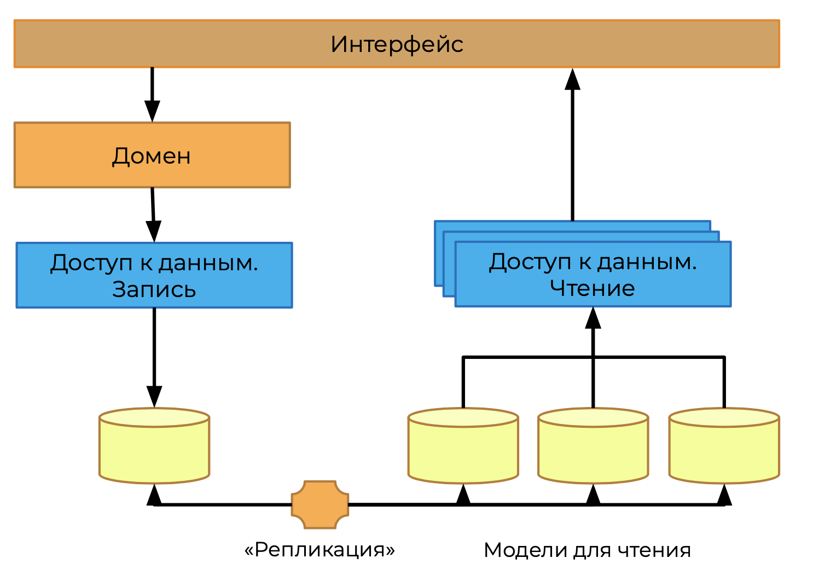
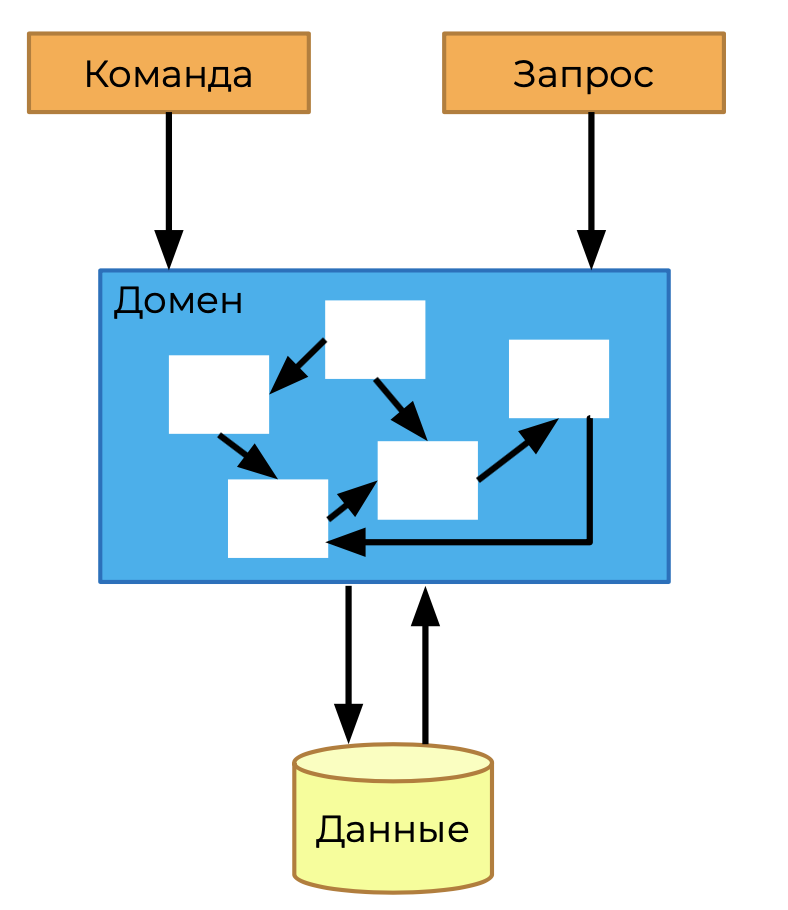
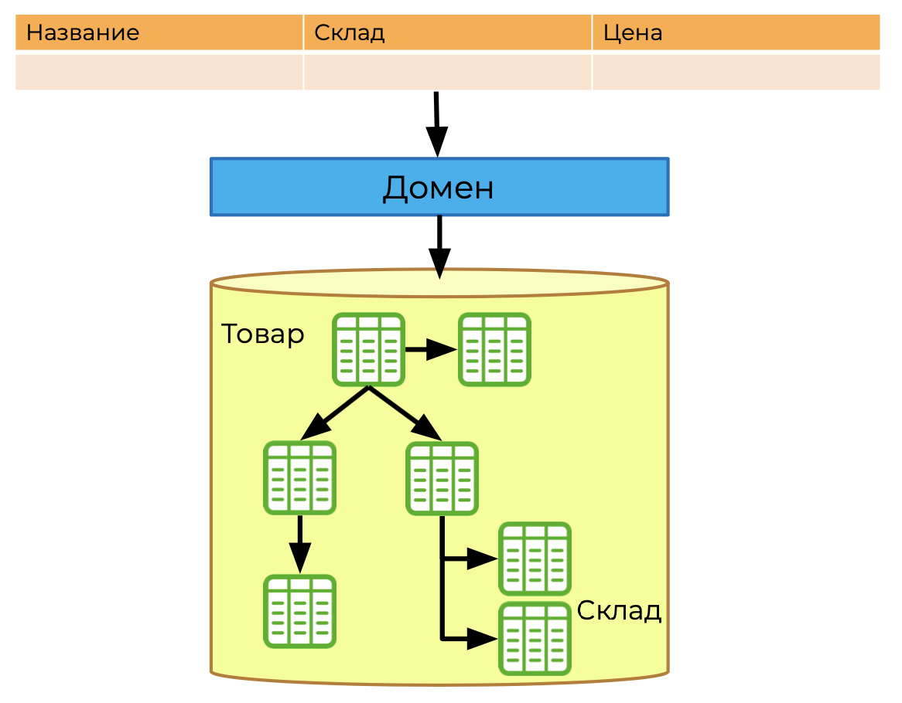
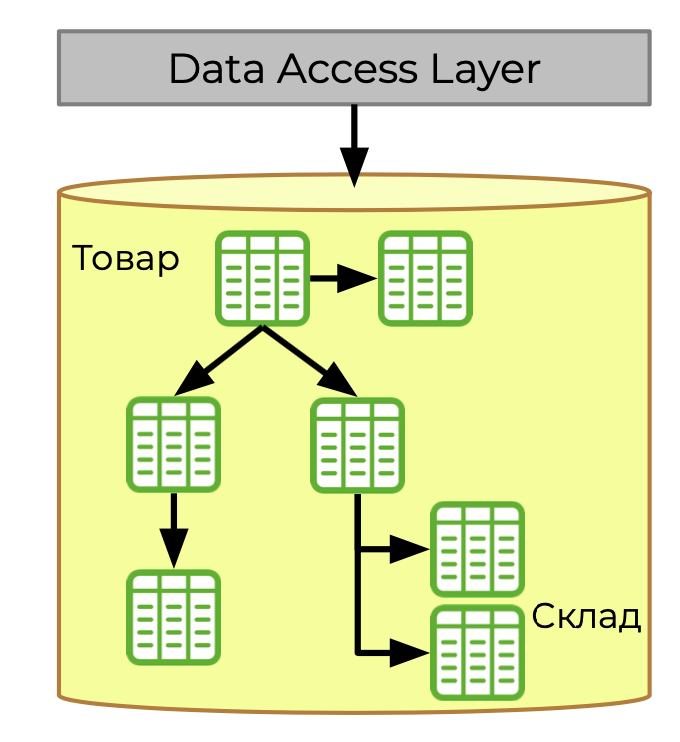
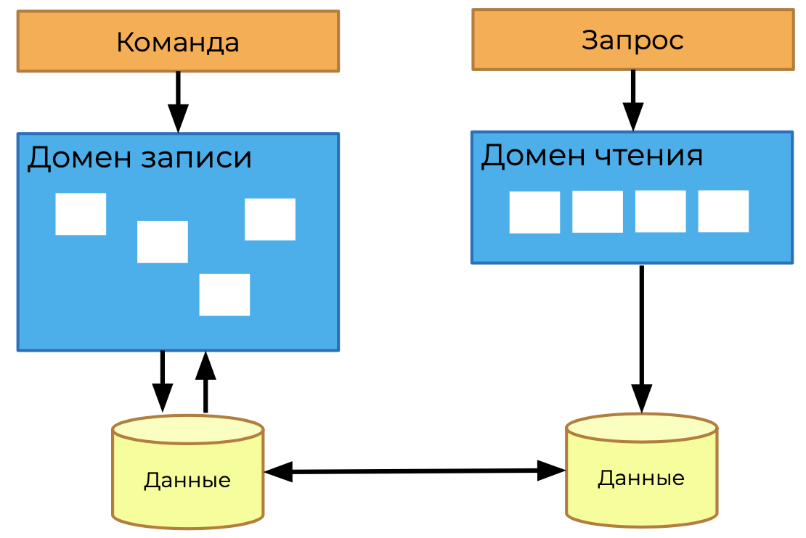
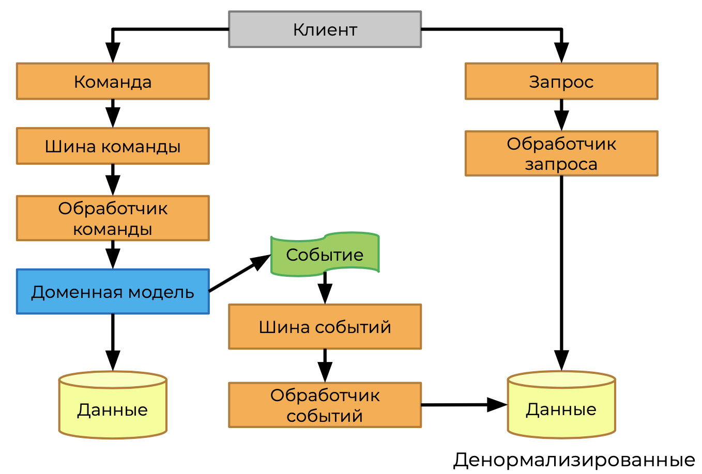
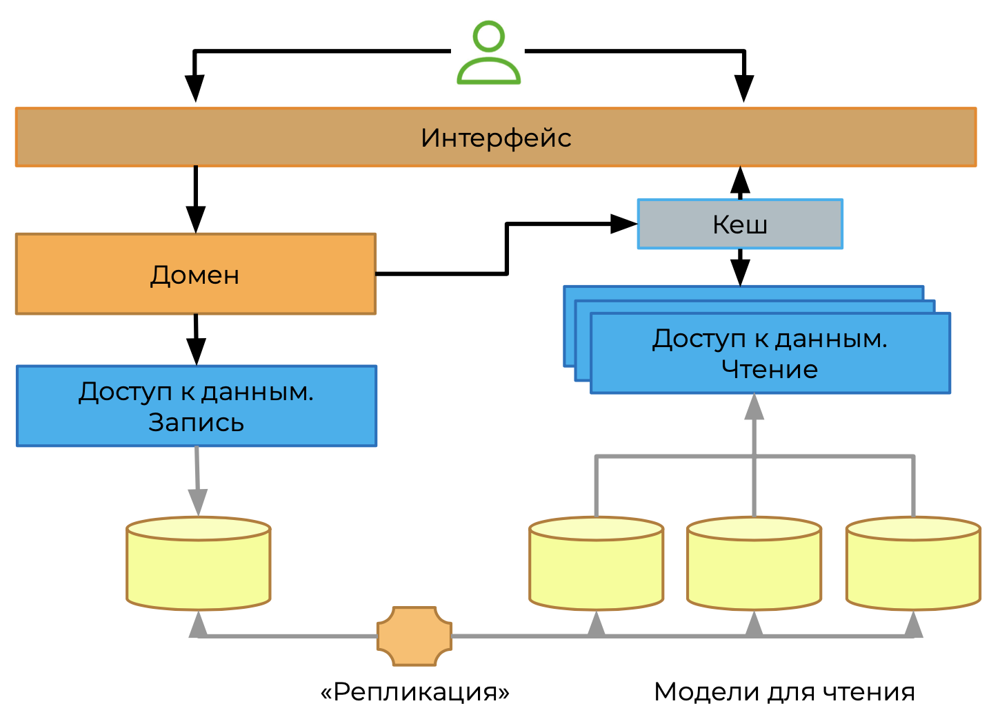
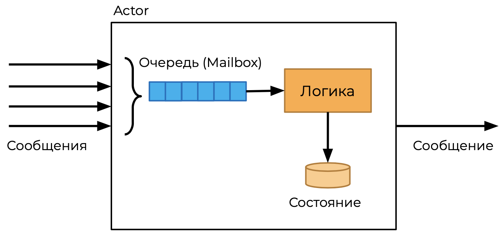
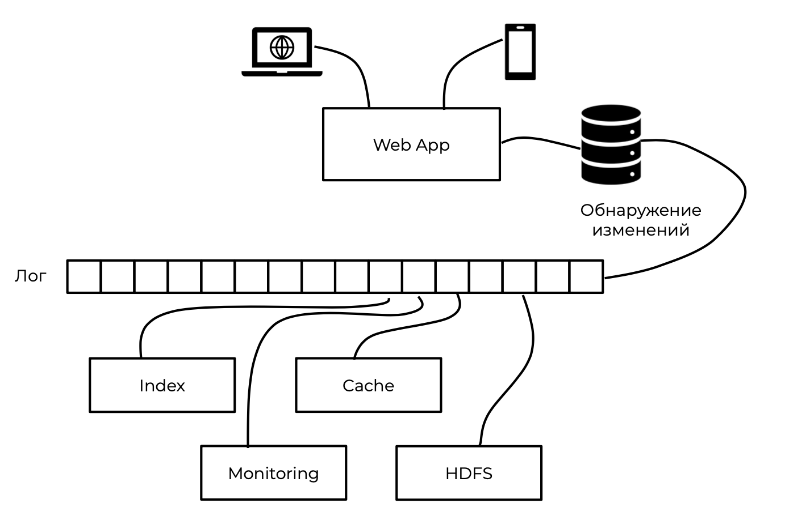

# Работа с событиями

## События

Событие — информация о некотором стимуле, который приводит систему в новое состояние.

Вся активность вокруг бизнес-процессов построена как реакция на некоторые события, которые происходят в произвольные моменты времени.

События однозначно будут в реальной системе, вопросто только в том, как они будут представлены: явно или неявно?

### События и команды

Команда — запрос в «будущее», надежда, что оно наступит. Название всегда в повелительном наклонении.
Событие — сообщение о том, что «будущее» наступило, что-то где-то произошло. Событие не отменить, на него можно только реагировать или не реагировать. Название всегда в прошедшем времени.

### Очереди

С технической точки зрения, скорее всего, сервисы будут связаны с помощью сообщений. Сообщений о том, что что-то произошло, могут быть командами или событиями.

Сервису между собой взаимодействуют асинхронно.

Менеджеры очередей:

* IBM MQ
* RebbitMQ
* zero.mq
* redis
* activemq
* hornetQ

### Логи

Похожая концепция, которая существует для обмена сообщений — это логи.

* Соощения — события о том, что что-то произошло.
* Сервису между собой взаимодействуют асинхронно.

Менеджеры:

* Apache kafka
* Google Cloud Bigtable
* Apache HBASE
* Leveldb
* tarantool
* cassandra

### Сравнение очередей и логов

Очередь:

* доступ к первому элементу в очереди
* сообщения после обработки не сохраняются

Лог:

* произвольный доступ к элементам
* сообщения сохраняются после обработки Практическое правило:

Практическое правило:

* очередь — для команд
* логи — для событий

### Передача состояний

Пример: есть сервис заказа, делающий обращение к складу, склад ему что-то отвечает. Обращение было относительно некого товара. У сервиса заказов есть история заказов.

Перед запросом истории заказа, в сервисе каталога произошло изменение характеристик товара. Как будет теперь показан товар в истории? Как был заказан или будут получены новые данные из каталога?

* Команда и событие должны содержать всю необходимую информацию для обработки.
* Данные вне сервисов — неизменяемые.

Например, в заказе у нас хранится такая информация о товаре:

```json
{
  “товар” : 8f5395b9-d50b-4337-a66c-ab27439df0b0,
  “количество”: 10
}
```

По этой информации мы можем показать пользователю только заказанное количество товара, за остальной информацией нужно идти в сервис каталога. Однако там это товара может не оказаться или он может быть изменён, поэтому правильней будет хранить наиболее критичную информацию в самом заказе.

Самое сложное — решить, какой уровень информации достаточен для повторной обработке.

**Нюансы:**

- размер сообщения
- изменение в субъектах
- изменение формата самого сообщения
- сетевая нагрузка на сервисы

### Выводы

* Реальные бизнес-процессы реагируют на события
* Команды — желание изменить будущее, события — информация о том, что произошло. Они должны быть легко различимы
  для разработчиков
* Сообщения — неизменяемы, но инициаторы и обработчики постоянно меняются
* Надо осознанно выбирать инструменты для обработки команд и событий
* События — это история, она не должна зависеть от текущего состояния субъектов события

## Event Sourcing

### Проблема

При измениях в БД непонятно:

* Что изменилось?
* Почему?
* Кем?

### Хранение состояния

Плюсы:

*  Просто
*  Знакомо

Минусы:

* Причина изменения непонятна
* Жёсткая связь "клиент — хранилище — формат"
* Невоспроизводимость для отладки
* Необходимость "вытягивания" данных

Event Sourcing призван решить эти проблемы

### Event Sourcing

Команда — запрос в «будущее», надежда, что оно наступит. Название всегда в повелительном наклонении.

Событие — сообщение о том, что «будущее» наступило, что-то где-то произошло. Событие не отменить, на него можно только реагировать или не реагировать. Название всегда в прошедшем времени.

**Event Sourcing опирается на события, потому что они представляют факты.**

#### Возможная история

У нас есть запись продукта в БД. Нужно понять что привело его к текущему состоянию.

Цепочка события:

1. ItemCreated
2. PriceApproved
3. InventorySystemMigrated
4. PriceApproved
5. PriceChanged
6. PriceApproved

#### Агрегаты

**Агрегат** — кластер связанных объектов, который мы воспринимаем как один логический объект для согласованного изменения данных. Каждый агрегат имеет корень и границы.

Товар является агрегатом.

Восстановление идёт от самого первого события. Но что если фактов изменений очень много?

#### Snapshots

Snapshot — это слепок состояния объекта, после применения всех фактов.

Слепки данных нужны для ускорения получения финального состояния товара.

#### Модель для чтения



##### Реплекация

Одна из проблемных частей всего подхода.

* Дополнительная логика для копирования данных в формат для чтения
* Сильная избыточность данных
* Время формирования/обновления моделей для чтения
* Дополнительная точка отказа

##### Чтение своих данных

Может возникнуть ситуация, когда данные для записи не успели обновиться в моделях для чтения.

Для решения проблемы нужно делать кратковременный кеш данных для пользователя.

#### Откуда взять события?

Для выявления и моделирования событий используется техника Event Storming. Т.е. собирается группа бизнес экспертов (доменных экспертов, бизнес аналитиков, архитекторов, пользователей) и они начинают думать какие события может генерировать система для определённых сценариев. Затем события группируются по ответственности. После этого происходит детализация ответов сервисов, продумывание связей и их описание.

- Для проведения требуются доменные эксперты
- Определяются ключевые события для основных бизнес-процессов
- Не забыть о различного рода отменах
- Осторожно подходить к границам сервисов. Желательно, чтобы в рамках одного сервиса был только один агрегат
- Основной способ общения сервисов — реакция на факты, а не на прямые запросы что-то сделать

#### Программное обеспеение

Для хранения событий подойдёт любое хранилище, которое не диктует жёсткую схему хранения данных.

Есть специализированная база Event Store. Фреймворки для Event Sourcing не нужны.

События — обычные классы или структуры.

#### Тестирование

Проверяется наличие событий и их состав.

- Легко проверить на отсутствие сайд-эффектов
- Понятный импульс изменений

### Плюсы Event Sourcing

- Хорошо отображает бизнес-процессы
- Явное описание причин изменений
- Возможность воспроизведения событий для отладки
  - Даже если сервис уже работает с новой версией сообщений

- Легче правильно определить границы сервисов с помощью Event Storming
- Система изначально готова к распределённой работе, потому что события неизменяемые и легко сериализируются
- Слабая связанность всей системы
- Готовый источник данных для аналитических систем

#### Минусы Event Sourcing

- Слабая связанность всей системы. Дополнительные усилия для построения зависимостей классов и событий
- Требуется больше места для хранения данных
- Восстановление данных сложнее
- Синхронизация лога событий с моделями для чтения
  - Сам механизм синхронизации
  - Проблема чтения своих данных
  - Поддержка версионирования
- Необходима предварительная работа по моделированию событий. Нужны хорошие бизнес-аналитики

#### Область применения

В основном для средних и крупных систем, где необходимы упор на гибкость решения и аналитические возможности.

### Выводы

- Event Sourcing — мощный инструмент для построения сложных систем с аналитическими возможностями
- Высокая изменяемость решения и слабая связанность компонентов заложены в самой идее решения
- Высокая техническая сложность решения со многими дополнительными техническими компонентами, которые добавляют точки отказа
- Необходим опыт в построении доменных моделей

## Command & Query Responsibility Segregation (CQRS)

**CQS** — команды и запросы обрабатываются одним объектом.

**CQRS** — команды и запросы обрабатываются разными объектами.

### Какую проблему решает?

Получение данных идёт через все сложные правила и связи доменной логики.



Необходимо запросить и реконструировать значительно больший объём данных, чем покажем.



#### Object Relational Mapping

* Огромное количество служебного кода, который перекладывает данные из одного представления в другое
* Ручная оптимизация ORM для получения нужной проекции данных 



#### Разделение команд и запросов

Получение данных идёт через все сложные правила и связи доменной логики.



#### Детальное представление



#### Event Sourcing



#### CQRS + Event Sourcing


##### Нюансы

Для расчётов внутренних данных, необходимых для обработки команды, не стоит использовать новые команды и сообщения. Это только усложнит код.

События должны информировать о значимых для бизнеса вещах и сообщать другим сервисам, что что-то произошло.

#### Применимость

* Сервисы (системы), где происходит работа с массивом данных, а не с единичными записями
* Система не обязана реализовывать DDD или строится на событиях
* Чтение данных преобладает над записью, тогда можно получить серьёзный прирост производительности
* Для средних и крупных систем, где требуется скорость и гибкость
* Каждый сервис может реализовывать свой архитектурный стиль. Применять CQRS для всей системы часто нецелесообразно.

#### Технические сложности

- Синхронизация данных между базой записи и базами чтения. Вы должны понимать и принимать, что согласованность данных определяется как Eventually Consistent
- Требуется больше места для хранения данных
- Проблема «чтения своих данных» сохраняется
- Поддержка версионности сообщений

### Выводы

- CQRS показывает лучшие результаты в связке с Event Sourcing и Domain-Driven Design
- Подходит для средних и крупных приложений со сложной доменной логикой, где требуется скорость работы и где согласованность данных некритична
- Упрощает работу с чтением данных

## Особенности CQRS и ES

### Трейсинг

События может быть сгенерировано разными сервисами, которые по-разному написаны, и каждый из них может быть с ошибками.

Необходимо использовать ID инициатора.

### Корреляция событий

В слабосвязанной системе с преимущественно асинхронным взаимодействием тяжело находить полный путь выполнения запроса без дополнительных усилий.

Необходимо использовать в ответе корреляционный ID, чтобы можно было собрать воедино все связанные события, относящиеся к бизнес-процессу.

### Идентификаторы

В идеале хорошо иметь три идентификатора:

* Уникальный номер сообщения
* Указание на инициатора запроса
* Уникальный номер процесса обработки запроса

При введение этих идентификаторов расследование багов будет не столь мучительным. Часть идентификаторов может быть сгенерирована инфраструктурными элементами, например, OpenTracing.

### Коррекции

Исправление ошибок, т.е. обновление данных в Event-Driven-системах, требует дополнительных усилий — нужны отдельные команды, события и обработчики.

Для каждой операции создания должна быть операция корректировки.

### Фокус на времени

Событийная архитектура заставляет нас явно задуматься о порядке сообщений и их причинной связи.

Причинная связь рассматривается только в узких рамках конкретного бизнес-сценария (Quality Attribute Scenarios)

### Фреймворки

Требования для CQRS + ES фреймворка 

- Functions
- Pattern Matching
- Left fold

Всё это уже есть в языках программирования, особенно функциональных. Поэтому необходимости писать/использовать фреймворки для CQRS/ES — нет.

### File & Forget

Работает так: создаём команду, пускаем куда-то в систему и не ожидаем ответа.

В бизнес-процессах такого не бывает, сервис может ответить "нет":

* Явно
* С помощью исключения

Т.е. необходимо проектировать сервисы с учетом этого. Желательно чтобы сервисы сообщали об ошибках сами.

### 1 команда = 1 событие

На деле это не так:

* Одна команда может породить много событий
* События могут быть разных типов

### Process Manager

При большом количестве типов событий и больших сервисах воссоздать в голове логику работы сложно.

#### Actor model

Базовый элемент для многопоточной (concurrent) обработки информации. При этом сам Actor работает строго в однопоточном режиме для изменения своего состояния.



Плюсы:

* Работает с одним агрегатом
* Легко масштабируется
* Устойчив к сбоям

Минусы:

* Внутренняя очередь может перегрузится
* Возможны deadlock'и

 ### Логи и сервисы

Логи можно использовать для коммуникации между сервисами. Для этого нужно использовать log-base решения, например kafka.



При записи данных из веб-приложения в БД, в ней срабатывают тригеры, они обнаруживают изменения и, на основе этих изменений, формируются сообщения, которые складываются в общий лог. Другие системы читают из него с нужной скорость и реагируют так быстро, как могут. В результате получается система, где все читают из общего лога сообщений.

#### Выводы

- Записывайте причинно-следственную связь событий в самих событиях

- Моделирование событий позволяет глубже погрузиться в доменную область

- Шаблон «Актор» может упростить построение Event-Driven-системы

- Использование быстрого центрального хранилища логов позволит

  снизить когнитивную нагрузку системы

- Использование событийного подхода при требовании к строгой согласованности данных не сработает
